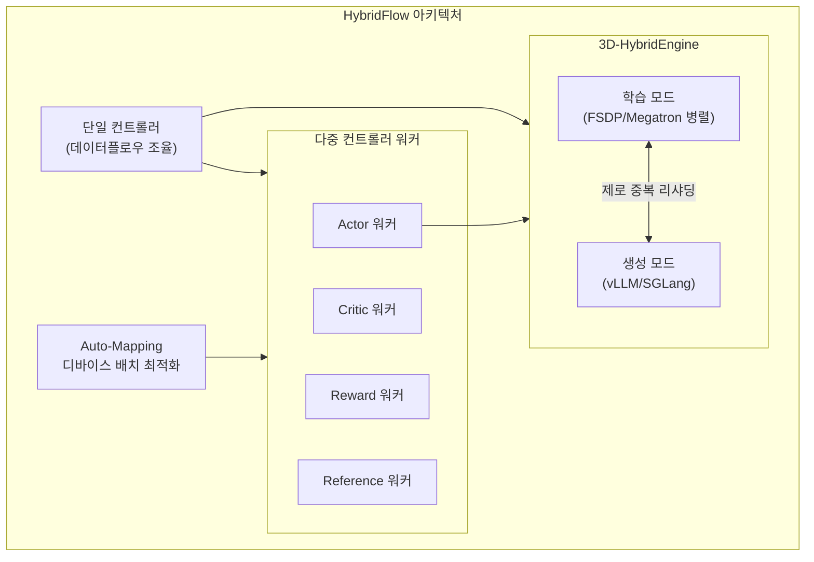

# veRL - ByteDance RL 학습 프레임워크

## 개요

veRL(Volcano Engine Reinforcement Learning for LLMs)은 ByteDance Seed 팀이 개발하고 verl 커뮤니티가 유지보수하는 LLM 후학습용 RL 프레임워크이다. HybridFlow 논문(Sheng et al., 2024)의 오픈소스 구현체로, 단일 컨트롤러와 다중 컨트롤러 패러다임을 혼합한 하이브리드 프로그래밍 모델, 학습-생성 간 리샤딩을 효율적으로 처리하는 3D-HybridEngine, 자동 디바이스 배치를 위한 Auto-Mapping 알고리즘의 세 핵심 컴포넌트로 구성된다. [[dapo]] 알고리즘의 공식 구현이 veRL 위에 구축되었으며, AIME 2024에서 50점을 달성하여 GRPO 기반 DeepSeek-R1-Zero를 넘어선 바 있다.

- GitHub: [volcengine/verl](https://github.com/volcengine/verl)
- 논문: [HybridFlow: A Flexible and Efficient RLHF Framework (Sheng et al., 2024)](https://arxiv.org/abs/2409.19256)

## HybridFlow 아키텍처

veRL의 핵심은 RLHF 데이터플로우의 복잡성을 효율적으로 다루기 위한 HybridFlow 아키텍처이다. 기존 프레임워크가 단일 컨트롤러(유연하지만 비효율) 또는 다중 컨트롤러(효율적이지만 경직)에 치우친 반면, HybridFlow는 두 접근을 혼합한다.

### 하이브리드 프로그래밍 모델

RLHF 데이터플로우는 생성(rollout), 보상 계산, 어드밴티지 추정, 정책 업데이트 등 복잡한 연산과 데이터 의존성을 포함한다. veRL의 하이브리드 모델은:

- **단일 컨트롤러**: 전체 데이터플로우를 Python 코드로 직관적으로 기술. PPO, [[grpo]], [[dapo]] 등 새로운 알고리즘을 수십 줄 코드로 구현 가능
- **다중 컨트롤러 워커**: 개별 모델의 계산은 FSDP, Megatron-LM 등 기존 분산 학습 프레임워크의 최적화를 그대로 활용

이 분리 덕분에 알고리즘 연구자는 데이터플로우만 수정하면 되고, 시스템 최적화는 워커 수준에서 독립적으로 진행할 수 있다.

### 3D-HybridEngine

[[rlhf-pipeline]]에서 Actor 모델은 생성 단계와 학습 단계에서 전혀 다른 병렬화 전략이 최적이다:

| 단계 | 최적 병렬화 | 이유 |
|------|-----------|------|
| 생성 (Rollout) | Tensor Parallelism 위주 | 자동회귀 디코딩은 TP가 효율적 |
| 학습 (Training) | FSDP/Data Parallelism 위주 | 큰 배치에서 DP가 효율적 |

3D-HybridEngine은 두 단계 간의 파라미터 리샤딩(resharding)을 제로 메모리 중복, 최소 통신 오버헤드로 수행한다. 생성 시에는 vLLM 또는 SGLang 엔진을 활용하고, 학습 시에는 FSDP 또는 Megatron-LM 병렬화로 전환한다.

### Auto-Mapping 알고리즘

4개 모델(Actor, Critic, Reward, Reference)을 주어진 GPU 클러스터에 어떻게 배치할지 자동으로 결정한다. 모델 크기, GPU 메모리, 통신 대역폭 등을 고려하여 전체 [[rlhf-pipeline]] 처리량을 최대화하는 배치를 탐색한다.

## 지원 알고리즘

| 알고리즘 | 비고 |
|---------|------|
| PPO | 표준 4-모델 구조 ([[ppo-for-llms]]) |
| GRPO | Critic 없는 경량 RL ([[grpo]]) |
| DAPO | 공식 구현 제공 ([[dapo]]) |
| DrGRPO | GRPO 변형 |
| REINFORCE++ | PRIME 호환 |
| RLOO | Leave-One-Out 베이스라인 |
| ReMax | - |
| PRIME | 프로세스 보상 + RL 통합 |
| GSPO | - |
| KL_Cov / Clip_Cov | entropy-based 변형 |

## Training / Rollout backend 옵션

verl은 backend가 plug-in 가능한 hybrid 아키텍처다.

**Training engines**:
- **FSDP / FSDP2**: CPU offload 지원
- **Megatron-LM**: LoRA + router replay (MoE 학습), 3D parallelism

**Rollout engines**:
- **vLLM** (≥0.8.2 권장)
- **SGLang**: multi-turn + VLM 지원
- **HF Transformers**: 단순 케이스

각 worker는 단일 controller가 dispatch하지만 SPMD로 collective 수행 → 컨트롤 오버헤드 감소. Multi-turn rollout, tool-calling, sequence packing, FlashAttention 2 모두 native 지원.

## rollout vs policy update 정책

- **기본**: 동기 (rollout 끝나면 학습)
- **옵션**: 비동기 partial rollout
- **DAPO 모드**: dynamic sampling — token-level KL/clip 정책 분리

## DAPO: veRL의 대표 성과

DAPO(Decoupled Clip and Dynamic Sampling Policy Optimization)는 ByteDance Seed, 칭화대, 홍콩대 연구팀이 veRL 위에 구현한 대규모 추론 RL 시스템이다.

### DAPO 4가지 핵심 기법

1. **Clip-Higher**: PPO의 상위 클리핑 임계값을 완화하여 정책 다양성 유지, 엔트로피 붕괴 방지
2. **Dynamic Sampling**: 학습 효율과 안정성을 동시에 개선하는 동적 샘플링 전략
3. **Token-Level Policy Gradient Loss**: 긴 Chain-of-Thought 시나리오에서 중요한 토큰 수준 정책 그래디언트
4. **Overlong Reward Shaping**: 과도하게 긴 응답에 대한 보상 잡음 감소

### DAPO-Math-17K

DAPO와 함께 공개된 수학 추론 학습 데이터셋으로, 17,000개의 수학 문제-정답 쌍으로 구성된다. Qwen2.5-32B 기반 모델로 AIME 2024에서 50점을 달성했다.

## OpenRLHF와의 비교

[[openrlhf]]와 veRL은 모두 Ray + vLLM 기반이지만 설계 초점이 다르다.

| 관점 | veRL | OpenRLHF |
|------|------|----------|
| 설계 철학 | 대규모 클러스터 효율 최우선 | 사용 편의성과 프로토타이핑 |
| 엔진 전환 | 3D-HybridEngine (제로 중복 리샤딩) | vLLM AutoTP 기반 |
| 생성 백엔드 | vLLM + SGLang | vLLM |
| 학습 백엔드 | FSDP + Megatron-LM | FSDP + ZeRO-3 |
| 알고리즘 구현 편의 | 수십 줄 코드 | 중간 수준 |
| 벤치마크 | SOTA 대비 1.53x 처리량 | SOTA 대비 1.22-1.68x 처리량 |

## 적용 시나리오와 고려 사항

**적합한 경우:**
- 64+ GPU 규모의 대규모 RL 학습
- 학습/생성 간 병렬화 전략을 독립적으로 최적화해야 하는 경우
- DAPO 등 최신 추론 RL 알고리즘 실험
- Megatron-LM 기반 기존 인프라와의 통합

**고려 사항:**
- HybridFlow 프로그래밍 모델의 학습 곡선이 존재
- 소규모(단일 노드) 실험에서는 오버엔지니어링일 수 있음
- [[model-checkpointing-sharding]] 전략과의 호환성 확인 필요

## 대표 자료

- [HybridFlow: A Flexible and Efficient RLHF Framework (Sheng et al., 2024)](https://arxiv.org/abs/2409.19256)
- [DAPO: An Open-Source LLM Reinforcement Learning System at Scale (2025)](https://arxiv.org/abs/2503.14476)
- [veRL 공식 문서](https://verl.readthedocs.io/)

## 운영 사례 추가

- ByteDance Seed의 사내 RL post-training 인프라 (Doubao 모델 등)
- AMD ROCm 통합으로 ROCm 클러스터에서도 운영 가능 — AMD ROCm Blogs 게시
- Intelligent-Internet/ii_verl, verl_prime 등 다수 fork
- HybridFlow 논문: SOTA baseline 대비 **1.53x ~ 20.57x throughput improvement**
- 671B 모델 + 수백 GPU expert parallel 학습 데모

## 관련 문서

- [[rlhf-pipeline]] -- RLHF 전체 파이프라인
- [[dapo]] -- DAPO 알고리즘 상세
- [[grpo]] -- GRPO 알고리즘
- [[ppo-for-llms]] -- PPO의 LLM 적용
- [[openrlhf]] -- 동일 영역의 OpenRLHF 프레임워크
- [[deepspeed-chat]] -- Hybrid Engine 원조
- [[nemo-aligner]] -- NVIDIA Megatron stack 대안
- [[trl-library]] -- HuggingFace post-training
- [[reward-model-training]] -- 보상 모델 학습
- [[gpu-cluster-scheduling]] -- GPU 클러스터 스케줄링
- [[training-frameworks]] -- 학습 프레임워크 전반
- [[model-checkpointing-sharding]] -- 체크포인팅과 샤딩
- [[rl-harness-frameworks-comparison]] -- RL harness 통합 비교
