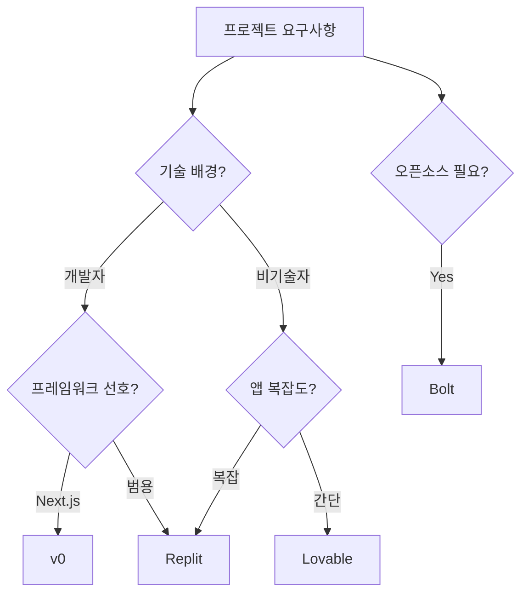

## 개요

바이브 코딩 플랫폼은 자연어 프롬프트로 웹 애플리케이션을 빌드하는 도구들이다. [[vibe-coding]] 개념의 실제 구현체로, 사용자가 원하는 앱을 자연어로 설명하면 AI가 코드 생성, UI 구성, 배포까지 자동으로 처리한다. 대표 플랫폼으로 Replit, Bolt, Lovable, v0(Vercel)가 경쟁하고 있다.

"초기 앱 구축 단계는 도구 간 대체로 상품화되었으며, 가격 모델과 통합 기능이 실제 차별점"을 결정하는 단계에 진입했다. Replit Agent 3는 자율 계획-코딩-배포, v0는 Next.js 특화, Bolt는 오픈소스 접근을 취한다.

## 핵심 특징

### 플랫폼별 비교

| 항목 | Replit | v0 (Vercel) | Lovable | Bolt |
|------|--------|-------------|---------|------|
| **강점** | 가장 정교한 결과물 | 개발자 최적 경험 | 빠른 초기 구축 | 계획 수립 기능 |
| **약점** | 자동 테스트 비용 | 비기술자에겐 복잡 | 최종 품질 부족 | 자체 계획 불이행 |
| **타겟** | 복잡한 앱 비기술자 | 기술 배경 사용자 | 간단한 앱 초급자 | 계획 기반 선호자 |
| **가격 모델** | 프롬프트당 과금 | 크레딧 (저렴) | 크레딧 (복잡) | 토큰 기반 |
| **배포** | 유료 필수, 복잡 | Vercel 자동 연동 | 내장 | 내장 |
| **DB 통합** | 내장 DB | Supabase 연동 | 자동 더미 데이터 | 제한적 |
| **오픈소스** | X | X | X | O |

### Replit

- **Replit Agent 3**: 자율적으로 계획 수립, 코드 작성, 테스트, 배포까지 수행하는 엔드투엔드 에이전트
- 가장 기능이 풍부하고 정교한 결과물 생성 (벤치마크 테스트에서 최고 품질 평가)
- 모듈형 탭 시스템으로 DB 편집, 통합 관리 가능
- 자동 UI 테스트가 기본 활성화되어 불필요한 비용 발생 주의
- 가격: 무료-$40/user/월 (effort 기반 스케일링), 초기 빌드당 약 $6
- Azure 파트너십으로 SOC 2 Type 2 컴플라이언스, SAML SSO, RBAC 지원
- GitHub 익스포트를 통한 코드 소유권 보존

### v0 (Vercel)

- Next.js 생태계에 특화된 컴포넌트 레벨 코드 생성
- Supabase 기본 통합 + Neon, Redis, Vercel Blob 등 멀티 프로바이더 지원
- Vercel 자동 배포로 가장 간편한 디플로이 경험 (로깅, 분석 포함)
- 가격: 무료-$20/월, 무료 크레딧만으로 전체 앱 구축 가능할 정도로 저렴
- 비기술자에게는 진입 장벽이 높을 수 있음

### Lovable

- 빠른 초기 구축과 Figma 임포트/인스턴트 프리뷰가 강점
- 사용자 친화적 인터페이스, 반응형 템플릿 라이브러리
- 가격: 무료-$39/월, 크레딧 시스템이 복잡하여 비용 예측 어려움
- 보안 설정이 미흡하여 프로덕션 배포 시 추가 점검 필요
- 백엔드 기능 제한, 최종 품질이 경쟁 플랫폼 대비 부족

### Bolt

- 계획 수립 기능과 투명한 AI 파이프라인 제공
- **유일한 오픈소스** -- 셀프 호스팅, 로컬 모델 사용, 커스터마이징 가능
- 가격: 무료/오픈소스 (기반 API 비용만 부담)
- 실행 단계에서 자체 계획을 따르지 않는 문제 보고
- 토큰 기반 과금이나 사용량 추적이 불투명

## 기술 상세

### 선택 가이드

### 과금 모델 3유형

| 유형 | 방식 | 해당 플랫폼 |
|------|------|-----------|
| Effort 기반 | 실제 컴퓨팅 소비에 연동 | Replit |
| 사용량 기반 | AI 프롬프트 빈도에 연동 | v0, Lovable |
| 무료/오픈소스 | 라이선스 비용 없음 (API 비용만) | Bolt |

### 공통 제한사항

- **프롬프트 의존성**: 앱 품질이 프롬프트 작성 능력에 크게 좌우됨. 복잡한 요구사항은 단계별 반복 프롬프팅 필요
- **코드 품질 편차**: 출력 신뢰성이 기반 LLM 학습 데이터에 의존, 에지 케이스에서 수동 리뷰 빈번
- **의존성 관리**: 자동 패키지 설치가 버전 충돌과 레포지토리 비대화를 초래할 수 있음
- **프로덕션 갭**: 프로토타이핑에는 적합하나 프로덕션 배포에는 추가 작업 필요
- **컴플라이언스 장벽**: 고규제 산업에서 데이터 레지던시 요구사항과 프라이빗 배포 옵션이 제한적
- **연결 의존**: 대부분 지속적 인터넷 접속 필요, 오프라인 워크플로우 불가

### 용도별 선택 가이드

| 용도 | 추천 플랫폼 | 이유 |
|------|-----------|------|
| 풀스택 복잡한 앱 | Replit | 자율 에이전트 + 엔터프라이즈 거버넌스 |
| Next.js 프로젝트 | v0 | 프레임워크 네이티브 + Vercel 배포 |
| 빠른 시각 프로토타입 | Lovable | Figma 임포트 + 인스턴트 프리뷰 |
| 프라이버시 중시 | Bolt | 오픈소스 + 셀프 호스팅 |
| 엔터프라이즈 팀 | Replit | SOC 2 + SSO + RBAC |

### 포지셔닝

바이브 코딩 플랫폼은 프로토타이핑과 MVP 구축에 최적화되어 있다. "초기 앱 구축 단계는 도구 간 대체로 상품화(commoditized)되었으며, 가격 모델과 통합 기능이 실제 차별점"을 결정하는 단계에 진입했다. 프로덕션 수준의 소프트웨어 개발에는 [[kiro]](스펙 드리븐 접근)나 [[claude-code]], [[codex-cli]] 같은 전문 코딩 에이전트가 더 적합하다. [[google-ai-studio-antigravity]]는 Google 생태계에 특화된 유사 플랫폼이다.

## 관련 문서

- [[vibe-coding]] - 바이브 코딩 개념
- [[google-ai-studio-antigravity]] - Google AI Studio 풀스택 빌더
- [[kiro]] - AWS 스펙 드리븐 IDE (바이브 코딩 대안)
- [[claude-code]] - 전문 터미널 코딩 에이전트
