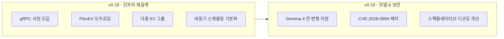
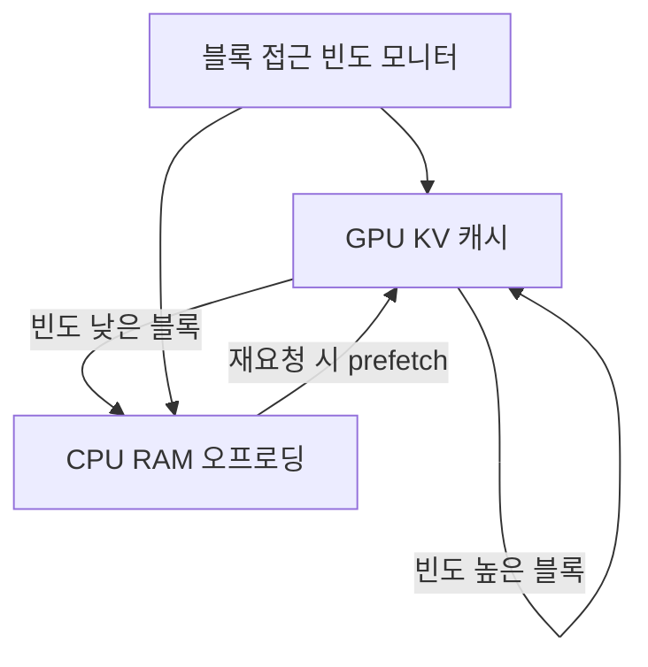

# vLLM v0.18/v0.19 업데이트 - gRPC 서빙 및 FlexKV 오프로딩

vLLM은 2026년 4월 두 개의 메이저 버전(v0.18, v0.19)을 연속 릴리스했다. 두 버전 모두 프로덕션 서빙 환경에서의 안정성과 처리량에 집중하며, gRPC 기반 서빙 계층, FlexKV 선별 오프로딩, Gemma 4 전 변형 지원, 비동기 스케줄링 기본화가 핵심 변경사항이다.

## 두 버전 개요



v0.18이 서빙 아키텍처 계층을 재설계했다면, v0.19는 그 위에서 모델 지원 확대와 보안 패치를 추가한 버전이다.

## v0.18 상세

### gRPC 서빙 도입

기존 vLLM은 HTTP/REST 기반 OpenAI 호환 API를 기본으로 제공했다. v0.18부터 gRPC(gRPC Remote Procedure Call) 서빙 엔진이 추가됐다.

| 항목 | HTTP/REST | gRPC |
|------|-----------|------|
| 프로토콜 | JSON over HTTP/1.1 | Protocol Buffers over HTTP/2 |
| 멀티플렉싱 | 제한적 | 단일 연결 다중 스트림 |
| 스트리밍 응답 | SSE | 양방향 스트림 |
| 레이턴시 | 직렬화 오버헤드 있음 | 낮은 직렬화 비용 |
| 클라이언트 생성 | 수동 | protobuf에서 자동 생성 |

```bash
# gRPC 서버 실행
python -m vllm.entrypoints.grpc.api_server \
    --model meta-llama/Llama-3-8B-Instruct \
    --port 50051

# Python 클라이언트 예시
import grpc
from vllm.entrypoints.grpc import vllm_pb2, vllm_pb2_grpc

channel = grpc.insecure_channel("localhost:50051")
stub = vllm_pb2_grpc.LLMServiceStub(channel)
response = stub.Generate(vllm_pb2.GenerationRequest(
    prompt="안녕하세요",
    sampling_params=vllm_pb2.SamplingParams(max_tokens=100)
))
```

특히 내부 마이크로서비스 간 통신(오케스트레이터 ↔ 추론 서버)에서 gRPC가 HTTP보다 유리하다.

### FlexKV 오프로딩 백엔드

KV 캐시 오프로딩은 긴 컨텍스트 서빙 시 GPU 메모리 부족 문제를 완화하는 기법이다. 기존 방식은 모든 KV 블록을 단순히 CPU로 내리거나 올리는 전략이었지만, FlexKV는 **고빈도 블록만 선별적으로** CPU에 오프로딩한다.



- **선별 오프로딩**: 접근 빈도가 낮은 KV 블록만 CPU로 이동. LRU(Least Recently Used) 정책과 유사하지만 블록 접근 패턴을 미리 분석해 prefetch
- **지연 없는 재로딩**: 자주 쓰이는 블록은 GPU에 유지하므로, 단순 오프로딩 대비 캐시 미스 비율 감소
- **메모리 절감**: 동일 GPU 메모리로 더 많은 동시 요청 처리 가능

```python
from vllm import LLM, SamplingParams

llm = LLM(
    model="meta-llama/Llama-3-70B-Instruct",
    kv_cache_dtype="fp8",
    cpu_offload_gb=20,           # CPU에 20GB 오프로딩
    flex_kv_offload=True,        # FlexKV 선별 오프로딩 활성화
    gpu_memory_utilization=0.90,
)
```

### 다중 KV 그룹 지원

MLA(Multi-head Latent Attention) 구조를 가진 모델(DeepSeek V4 계열 등)은 쿼리/키/값 헤드 그룹 구성이 표준 MHA, GQA와 다르다. v0.18에서 다중 KV 그룹 설정을 지원해 이러한 모델의 KV 캐시 관리가 가능해졌다.

### 비동기 스케줄링 기본화

v0.17까지 실험적(experimental) 옵션이었던 비동기 스케줄링이 v0.18부터 기본으로 활성화됐다.

- 기존 동기 스케줄링: GPU가 실행 중인 동안 CPU가 다음 배치를 기다림 (버블 발생)
- 비동기 스케줄링: GPU 실행과 CPU 스케줄링을 파이프라인 처리, GPU 유휴 시간 최소화

처리량 기준 약 5~12% 향상이 보고됐다 (모델 크기와 배치 크기에 따라 상이).

## v0.19 상세

### Gemma 4 전 변형 완전 지원

| 모델 변형 | 파라미터 | 아키텍처 | v0.19 지원 |
|-----------|----------|----------|-----------|
| Gemma-4-E2B | ~2B | MoE | 완전 지원 |
| Gemma-4-E4B | ~4B | MoE | 완전 지원 |
| Gemma-4-26B | 26B | MoE | 완전 지원 |
| Gemma-4-31B | 31B | Dense | 완전 지원 |

Gemma 4 계열은 Google이 2026년 1분기 공개한 모델로, 멀티모달 처리(텍스트+이미지) 기능을 포함한다. vLLM v0.19에서는 텍스트 전용 추론 경로가 완전 지원된다 (이미지 멀티모달 지원은 별도 검증 필요).

### CVE-2026-0994 보안 패치

v0.19에서 중요 보안 취약점 CVE-2026-0994가 수정됐다. 해당 취약점은 특정 입력 토큰 시퀀스에서 프롬프트 내용이 다른 사용자 응답에 섞일 수 있는 KV 캐시 분리 문제로 보고됐다. 멀티 테넌트(multi-tenant) 환경에서 vLLM을 운영 중이라면 즉시 v0.19로 업그레이드 권장.

### 스펙울레이티브 디코딩 개선

Draft 모델 기반 스펙울레이티브 디코딩(speculative decoding) 파이프라인의 배치 처리 효율이 개선됐다. 특히 DFlash(블록 확산 기반 드래프트 모델)와의 통합이 매끄러워져, EAGLE-3 대비 추가 속도 향상을 기대할 수 있다.

```python
from vllm import LLM

# 드래프트 모델 지정 스펙울레이티브 디코딩
llm = LLM(
    model="meta-llama/Llama-3-70B-Instruct",
    speculative_model="meta-llama/Llama-3-1B-Instruct",
    num_speculative_tokens=5,
    use_v2_block_manager=True,
)
```

## 운영 환경 업그레이드 가이드

```bash
# pip 업그레이드
pip install vllm==0.19.0

# Docker 이미지
docker pull vllm/vllm-openai:v0.19.0

# 비동기 스케줄링 명시적 비활성화 (기존 동작 유지가 필요한 경우)
python -m vllm.entrypoints.openai.api_server \
    --model <model_name> \
    --disable-async-output-proc  # v0.18 기본 활성화된 비동기 처리 비활성화
```

## 실무 활용 포인트

1. **멀티 테넌트 API 서버**: gRPC 서빙 + 비동기 스케줄링 조합으로 처리량 향상
2. **70B+ 모델 서빙**: FlexKV 오프로딩으로 A100 80GB 단일 GPU에서도 70B 모델 서빙 가능 영역 확대
3. **보안 필수 환경**: CVE-2026-0994 패치 포함된 v0.19 이상 사용 의무화

## 관련 문서

- [[vllm]] — vLLM 프레임워크 전반 개요
- [[pytorch-2-7-release]] — PyTorch 2.7의 GQA/PagedAttention API (vLLM과 연계)
- [[flashinfer]] — 커스텀 어텐션 커널, vLLM 내부 사용
- [[speculative-decoding]] — 스펙울레이티브 디코딩 개념 설명
- [[kv-cache]] — KV 캐시 메모리 관리 전략
