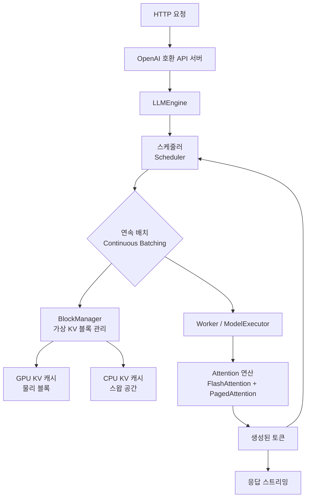
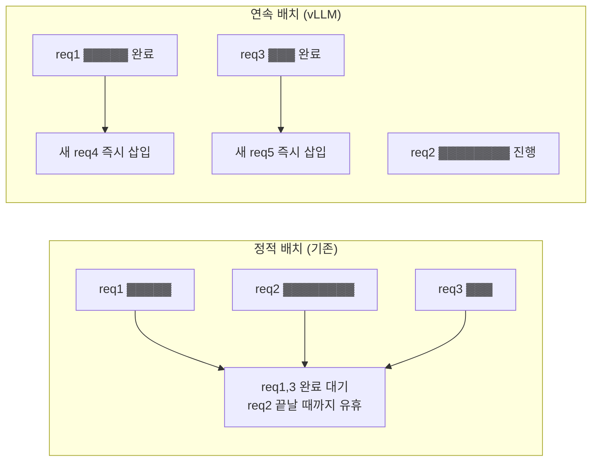

# vLLM

vLLM은 UC Berkeley에서 개발한 오픈소스 LLM 추론 및 서빙 라이브러리다. 2023년 6월 논문 "Efficient Memory Management for Large Language Model Serving with PagedAttention"과 함께 발표되었으며, **PagedAttention** 알고리즘으로 GPU 메모리 효율을 혁신적으로 개선해 LLM 서빙 처리량을 수십 배 향상시켰다.

## 아키텍처 개요



위 다이어그램은 HTTP 요청이 vLLM 엔진에 들어와 스케줄러, BlockManager를 통해 GPU KV 캐시에 매핑된 후 추론이 실행되고 응답이 반환되는 전체 흐름을 보여준다.

## PagedAttention

PagedAttention은 vLLM의 핵심 혁신이다. OS의 가상 메모리/페이징에서 영감을 받아 KV 캐시를 비연속 블록(page)으로 관리한다. [[paged-attention]] 참조.

### 기존 방식의 문제

기존 LLM 서버는 각 요청에 대해 최대 시퀀스 길이만큼 연속 메모리를 사전 할당했다.

```
요청 A (길이 512): [KV_A ... KV_A ... 빈 공간 ... 빈 공간 ]  <- 낭비
요청 B (길이 128): [KV_B ... 빈 공간 ... 빈 공간 ... 빈 공간 ]  <- 낭비
```

**문제점**:
- **내부 단편화**: 예약 공간 vs 실제 사용 공간 차이로 평균 60-80% 낭비
- **외부 단편화**: 연속 할당 필요로 작은 빈 공간 활용 불가
- **미리 예약**: 실제 생성 길이를 모르므로 최대 길이로 예약

### PagedAttention 해결책

KV 캐시를 고정 크기 블록(block size = 16 또는 32 토큰)으로 분할하고, 비연속 블록을 논리적 블록 테이블로 관리한다.

```
블록 테이블:
  요청 A: [블록 3, 블록 7, 블록 1, ...]  <- 비연속 물리 블록
  요청 B: [블록 0, 블록 5, ...]
  
물리 KV 블록 풀:
  블록 0: [KV_B 토큰 0-15]
  블록 1: [KV_A 토큰 32-47]
  블록 3: [KV_A 토큰 0-15]
  블록 5: [KV_B 토큰 16-31]
  블록 7: [KV_A 토큰 16-31]
```

**효과**:
- 메모리 낭비를 블록 내 약 4%까지 감소
- 멀티 쿼리 요청 간 **KV 캐시 공유** (Copy-on-Write로 prefix caching)
- 동적 할당으로 실제 생성 토큰 수만큼만 사용

```python
# vLLM 기본 사용법
from vllm import LLM, SamplingParams

llm = LLM(model="meta-llama/Llama-3-8B-Instruct")

sampling_params = SamplingParams(
    temperature=0.8,
    top_p=0.95,
    max_tokens=512,
)

prompts = [
    "한국의 수도는 어디인가요?",
    "파이썬으로 피보나치 수열을 작성해주세요.",
]
outputs = llm.generate(prompts, sampling_params)

for output in outputs:
    print(output.outputs[0].text)
```

## 연속 배치 (Continuous Batching)

기존 정적 배치와 달리 vLLM은 연속 배치([[continuous-batching-internals]])를 지원한다. 배치 내 한 요청이 완료되면 즉시 새 요청을 삽입한다.



## 주요 기능

### OpenAI 호환 서버

```bash
# 서버 시작
python -m vllm.entrypoints.openai.api_server \
    --model meta-llama/Llama-3-8B-Instruct \
    --host 0.0.0.0 \
    --port 8000 \
    --tensor-parallel-size 2 \
    --gpu-memory-utilization 0.90

# OpenAI SDK로 호출
from openai import OpenAI

client = OpenAI(
    base_url="http://localhost:8000/v1",
    api_key="not-needed",
)

response = client.chat.completions.create(
    model="meta-llama/Llama-3-8B-Instruct",
    messages=[{"role": "user", "content": "안녕하세요!"}],
    stream=True,
)
for chunk in response:
    print(chunk.choices[0].delta.content, end="")
```

### 텐서 병렬화 (Tensor Parallelism)

```python
llm = LLM(
    model="meta-llama/Llama-3-70B-Instruct",
    tensor_parallel_size=4,  # 4 GPU에 모델 분산
    pipeline_parallel_size=1,
    dtype="bfloat16",
)
```

### 분산 추론 파이프라인

```bash
# Ray 기반 멀티 노드 서빙
python -m vllm.entrypoints.openai.api_server \
    --model meta-llama/Llama-3-405B-Instruct \
    --tensor-parallel-size 8 \
    --pipeline-parallel-size 2 \
    --distributed-executor-backend ray
```

### 양자화 지원

```python
# AWQ 양자화 모델 서빙
llm = LLM(
    model="TheBloke/Llama-2-7B-Chat-AWQ",
    quantization="awq",
    dtype="auto",
)

# GPTQ
llm = LLM(
    model="TheBloke/Llama-2-7B-GPTQ",
    quantization="gptq",
)

# 동적 INT8 / FP8
llm = LLM(
    model="meta-llama/Llama-3-8B-Instruct",
    quantization="fp8",  # H100 전용
    dtype="bfloat16",
)
```

### Prefix Caching (프리픽스 캐싱)

같은 시스템 프롬프트를 공유하는 요청들의 KV 캐시를 재사용한다. RAG 파이프라인에서 문서 컨텍스트를 반복 사용하는 경우 특히 효과적이다.

```python
llm = LLM(
    model="meta-llama/Llama-3-8B-Instruct",
    enable_prefix_caching=True,  # KV 캐시 자동 재사용
)

# 동일 시스템 프롬프트를 가진 요청들은 첫 요청 이후 캐시 히트
system_prompt = "당신은 전문 의료 상담사입니다. " * 200  # 긴 시스템 프롬프트

for user_message in user_messages:
    output = llm.generate(
        f"{system_prompt}\n사용자: {user_message}",
        sampling_params,
    )
```

### Structured Output (구조화된 출력)

```python
from pydantic import BaseModel
from vllm import LLM, SamplingParams

class Product(BaseModel):
    name: str
    price: float
    category: str

llm = LLM(model="meta-llama/Llama-3-8B-Instruct")

sampling_params = SamplingParams(
    guided_decoding={
        "json": Product.model_json_schema()  # JSON Schema 강제
    }
)
```

### Speculative Decoding (추측 디코딩)

```python
# Draft 모델로 추측 디코딩 가속
llm = LLM(
    model="meta-llama/Llama-3-70B-Instruct",
    speculative_model="meta-llama/Llama-3-8B-Instruct",
    num_speculative_tokens=5,
    speculative_draft_tensor_parallel_size=1,
)
```

## 경쟁 제품 비교

| 제품 | 핵심 기술 | 강점 | 약점 | 관련 위키 |
|------|-----------|------|------|-----------|
| vLLM | PagedAttention + 연속 배치 | 처리량 최고, OpenAI API 호환 | 설정 복잡, Python 의존 | 이 문서 |
| TGI (HuggingFace) | FlashAttention + 연속 배치 | Hugging Face 통합, 다양한 모델 | vLLM 대비 처리량 낮음 | [[text-generation-inference-tgi]] |
| LMDeploy (InternLM) | TurboMind, 4bit 특화 | 저사양 GPU 효율 | 모델 지원 범위 좁음 | [[lmdeploy-internlm]] |
| Ollama | llama.cpp 기반 | 로컬/Mac 지원, 설치 간편 | 처리량 제한 | [[ollama]] |
| TensorRT-LLM | NVIDIA 최적화 | 최고 GPU 효율 | NVIDIA 전용, 복잡 | - |

## GPU 메모리 요구사항

| 모델 | 파라미터 | BF16 VRAM | INT8 VRAM | INT4 VRAM |
|------|----------|-----------|-----------|-----------|
| Llama-3-8B | 8B | ~16GB | ~9GB | ~5GB |
| Llama-3-70B | 70B | ~140GB | ~75GB | ~40GB |
| Llama-3-405B | 405B | ~810GB | ~430GB | ~230GB |
| Mixtral-8x7B | 47B | ~94GB | ~50GB | ~28GB |

## 성능 최적화 팁

### 1. GPU 메모리 사용률 조정

```python
# 기본값 0.9 -> KV 캐시에 더 많은 공간
llm = LLM(
    model="meta-llama/Llama-3-8B-Instruct",
    gpu_memory_utilization=0.95,  # 여유 있으면 높여서 배치 크기 증가
    max_num_batched_tokens=32768,
    max_num_seqs=256,
)
```

### 2. 최대 시퀀스 길이 설정

```python
llm = LLM(
    model="meta-llama/Llama-3-8B-Instruct",
    max_model_len=8192,   # 모델 최대 컨텍스트보다 작게 설정해 KV 캐시 절약
    block_size=16,         # 블록 크기 (16 또는 32)
)
```

### 3. 척도 결정 예시

```python
import time
from vllm import LLM, SamplingParams

llm = LLM(model="meta-llama/Llama-3-8B-Instruct")
sampling_params = SamplingParams(max_tokens=256)

# 처리량 측정
prompts = ["안녕하세요"] * 100
start = time.time()
outputs = llm.generate(prompts, sampling_params)
elapsed = time.time() - start

total_tokens = sum(len(o.outputs[0].token_ids) for o in outputs)
print(f"처리량: {total_tokens / elapsed:.1f} tokens/sec")
```

## Docker 배포

```dockerfile
# Dockerfile
FROM vllm/vllm-openai:latest

ENV MODEL_ID=meta-llama/Llama-3-8B-Instruct
ENV NUM_GPUS=1

CMD python -m vllm.entrypoints.openai.api_server \
    --model ${MODEL_ID} \
    --tensor-parallel-size ${NUM_GPUS} \
    --host 0.0.0.0 \
    --port 8000
```

```yaml
# docker-compose.yml
version: "3.8"
services:
  vllm:
    image: vllm/vllm-openai:latest
    runtime: nvidia
    environment:
      - NVIDIA_VISIBLE_DEVICES=all
    volumes:
      - ~/.cache/huggingface:/root/.cache/huggingface
    ports:
      - "8000:8000"
    command: >
      python -m vllm.entrypoints.openai.api_server
      --model meta-llama/Llama-3-8B-Instruct
      --gpu-memory-utilization 0.90
```

## vLLM 버전 이정표

| 버전 | 날짜 | 주요 기능 |
|------|------|-----------|
| v0.1 | 2023.06 | PagedAttention 최초 공개 |
| v0.2 | 2023.10 | 연속 배치, 다중 GPU |
| v0.3 | 2024.01 | 멀티모달, FP8, 추측 디코딩 |
| v0.4 | 2024.04 | 파이프라인 병렬화, 프리픽스 캐싱 |
| v0.5 | 2024.07 | V1 엔진 Preview, 구조화 출력 |
| v0.6 | 2024.10 | V1 엔진 GA, 프로덕션 최적화 |
| v0.7 | 2025.01 | 멀티스텝 스케줄링, MTP 지원 |
| v1.0 | 2025.06 | 안정 API, 장기 지원 버전 |

## 관련 문서

- [[paged-attention]] - PagedAttention 알고리즘 상세
- [[continuous-batching-internals]] - 연속 배치 내부 동작
- [[text-generation-inference-tgi]] - HuggingFace TGI 비교
- [[lmdeploy-internlm]] - InternLM LMDeploy
- [[ollama]] - 로컬 LLM 서빙
- [[flashinfer]] - FlashInfer 어텐션 커널
- [[flash-attention-2-internals]] - FlashAttention 내부 구조 (훈련/추론 공통)
- [[quantization-model-compression]] - 양자화 기법 기초
