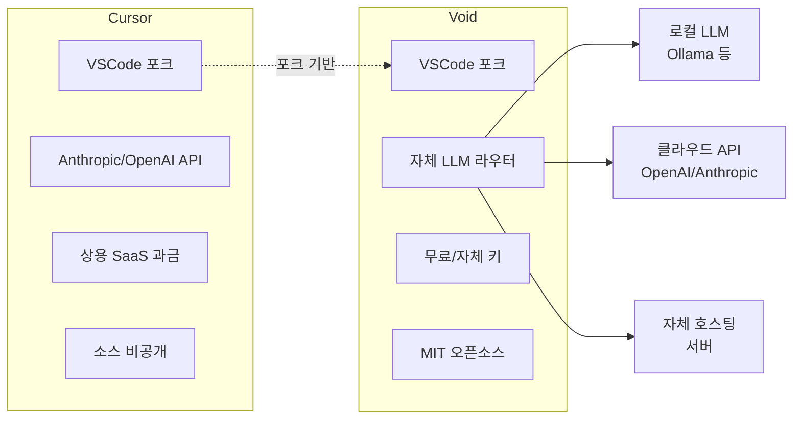
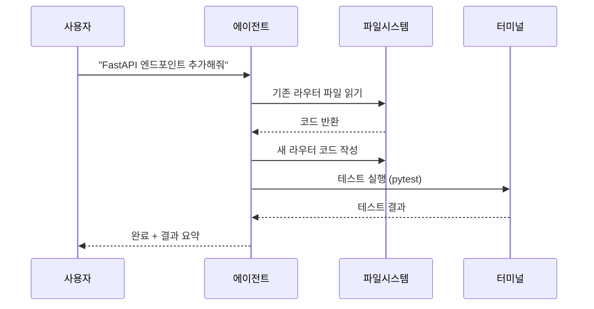
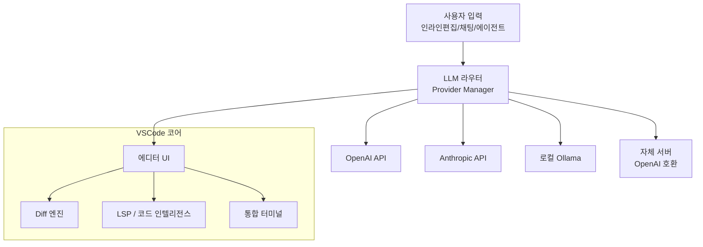
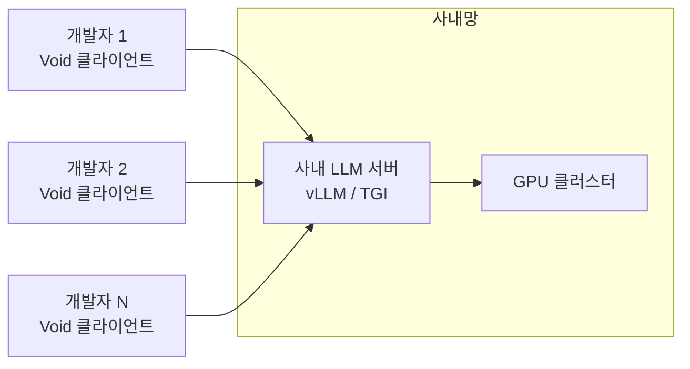

# Void - 오픈소스 AI 코드 에디터

## 정체성

Void는 [[cursor-editor|Cursor]]에 대한 오픈소스 대안으로 등장한 AI 코드 에디터다. VSCode 포크 기반으로, Cursor가 제공하는 인라인 편집(inline edit), 채팅 사이드바, 에이전트 모드 등의 기능을 MIT 라이선스 하에 완전 공개 소스로 재현하는 것을 목표로 한다.

| 속성 | 값 |
|------|-----|
| 라이선스 | MIT (오픈소스) |
| 기반 | VSCode (Microsoft Open VSX) |
| 언어 | TypeScript |
| 출시 시기 | 2024년 하반기 (알파) |
| 가격 | 무료 (자체 API 키 사용) |
| 공식 사이트 | voideditor.com |

### Cursor와의 핵심 차이

Cursor는 VSCode 포크를 기반으로 하지만 상용 SaaS 모델로 운영되며 소스코드가 비공개다. Void는 동일한 UX를 목표로 하되 코드베이스 전체를 공개하여 기업 내부망, 온프레미스(on-premises) AI 서버, 완전한 프라이버시 보장 환경에서 사용할 수 있게 설계되었다.



이 다이어그램은 Cursor와 Void의 아키텍처 철학 차이를 보여준다. Void는 LLM 라우팅 레이어를 직접 제어할 수 있다.

---

## 핵심 기능

### 인라인 편집 (Inline Edit)

`Ctrl+K` (또는 `Cmd+K`)로 현재 선택 영역에 대해 자연어 지시를 내리면 LLM이 해당 코드를 직접 수정한다. Diff 뷰로 변경사항을 확인하고 수락/거절을 선택할 수 있다.

```
[기존 코드 블록 선택] → Ctrl+K → "이 함수를 async/await로 변환해줘"
                      → LLM 응답 → 인라인 diff 표시
                      → Tab(수락) / Esc(거절)
```

### 채팅 사이드바

에디터 우측에 채팅 패널이 붙어 있어 코드 컨텍스트를 유지하면서 질의응답이 가능하다. 현재 열린 파일, 선택 코드, 혹은 전체 워크스페이스를 컨텍스트로 포함할 수 있다.

- `@파일명` 으로 특정 파일 참조
- `@폴더명` 으로 폴더 전체 컨텍스트 주입
- 코드 블록 클릭 시 즉시 적용(Apply) 가능

### 에이전트 모드 (Agent Mode)

멀티 스텝 작업을 자율적으로 수행하는 에이전트 모드. 도구 호출(tool call)을 통해 파일 읽기/쓰기, 터미널 실행, 검색 등을 연쇄적으로 수행한다.



### LLM 라우터 (Bring Your Own Model)

Void의 가장 큰 차별점은 LLM 제공자를 자유롭게 선택할 수 있다는 것이다.

| 제공자 유형 | 예시 | 특징 |
|-------------|------|------|
| 클라우드 API | OpenAI, Anthropic, Gemini | 최신 모델, 인터넷 필요 |
| 로컬 LLM | [[ollama]] (Ollama), LM Studio | 완전 오프라인, 프라이버시 |
| 자체 호스팅 | vLLM, TGI | 사내망, GPU 서버 |
| OpenAI 호환 | 모든 `/v1/chat/completions` | 범용 연동 |

---

## 아키텍처 하이레벨



Void는 VSCode의 Extension API를 활용하는 대신 에디터 코어 자체를 수정하여 AI 기능을 네이티브로 통합한다. 이는 일반 VSCode 확장(extension)으로 구현된 [[continue-vscode-extension|Continue]]와의 근본적인 차이다.

---

## 차별점: 경쟁 도구 비교

| 도구 | 기반 | 오픈소스 | 자체 LLM | 가격 |
|------|------|---------|---------|------|
| Cursor | VSCode 포크 | 아니오 | 제한적 | $20/월+ |
| **Void** | VSCode 포크 | **예 (MIT)** | **완전 지원** | **무료** |
| [[continue-vscode-extension|Continue]] | VSCode 확장 | 예 (Apache 2) | 완전 지원 | 무료 |
| [[cline-claude-coder|Cline]] | VSCode 확장 | 예 (MIT) | 완전 지원 | 무료 |
| GitHub Copilot | VSCode 확장 | 아니오 | 아니오 | $10/월+ |

### Void vs Cursor

- **프라이버시**: Void는 코드가 자체 선택 LLM으로만 전송된다. Cursor는 학습 데이터 사용 정책이 존재한다.
- **커스터마이징**: Void는 소스 수정이 가능하므로 기업 내부 워크플로우에 통합 가능.
- **성능**: Cursor가 더 성숙하고 안정적이나, Void가 빠르게 따라잡고 있다.
- **생태계**: Cursor는 Cursor Rules, AI Indexing 등 독자 기능을 보유. Void는 표준 VSCode 확장과 호환.

### Void vs Continue

Continue는 VSCode 확장(extension)으로 에디터 코어를 건드리지 않아 설치가 간편하다. Void는 에디터 자체를 교체하므로 기존 VSCode 설정 마이그레이션이 필요하다. 대신 인라인 편집의 UX가 더 자연스럽고 Cursor에 더 가깝다.

---

## 실무 사용 가이드

### 설치

```bash
# 공식 사이트에서 다운로드
# https://voideditor.com

# macOS (Homebrew cask - 지원 여부 변동 가능, 공식 사이트 확인 권장)
# brew install --cask void
```

### LLM 설정

설정(Settings) > Void > AI Provider에서 사용할 LLM을 구성한다.

```json
// 설정 예시 (개념적 구조 - 실제 설정키는 버전에 따라 다를 수 있음)
{
  "void.provider": "openai",
  "void.apiKey": "${OPENAI_API_KEY}",
  "void.model": "gpt-4o"
}
```

로컬 LLM([[ollama|Ollama]]) 사용 시:

```json
{
  "void.provider": "ollama",
  "void.baseUrl": "http://localhost:11434",
  "void.model": "codellama:13b"
}
```

### 기업 환경 배포



기업 환경에서는 사내 LLM 서버(vLLM, [[text-generation-inference-tgi|TGI]] 등)를 OpenAI 호환 엔드포인트로 노출하고 Void의 Base URL을 내부 주소로 설정하면 코드가 외부로 전송되지 않는다.

---

## 한계 / 트레이드오프

### 성숙도 부족

2026년 기준 Void는 아직 알파/베타 단계다. Cursor에 비해 다음이 부족하다:
- 코드베이스 인덱싱(전체 저장소 의미론적 검색)
- Cursor Rules와 같은 프로젝트별 AI 지시 파일
- 원격 협업 기능
- 안정성 (알파 단계 버그)

### VSCode 확장 호환성

VSCode 포크이므로 대부분의 VSCode 확장이 작동하지만, 100% 호환은 보장되지 않는다. 특히 에디터 코어와 깊이 연동된 확장은 문제가 생길 수 있다.

### 커뮤니티 규모

Cursor나 GitHub Copilot에 비해 커뮤니티와 문서가 적다. 버그 대응 속도가 느릴 수 있다.

### 유지보수 불확실성

오픈소스 프로젝트 특성상 핵심 기여자 이탈 시 개발이 느려질 수 있다. VSCode 버전 업스트림 추적이 지연될 가능성도 있다.

---

## 왜 중요한가

AI 코드 에디터 시장이 상용 SaaS로 집중되는 상황에서, Void는 다음 수요를 충족한다:

1. **프라이버시 우선 기업**: 의료, 금융, 방산 등 코드 외부 전송이 불가능한 도메인
2. **오픈소스 지향 팀**: 에디터 자체를 내부 워크플로우에 맞게 커스터마이징하려는 팀
3. **비용 절감**: Cursor $20/월 × 팀원 수를 절약하고 싶은 팀
4. **로컬 LLM 연구**: GPU를 보유하고 오프라인 AI 코딩을 실험하는 연구자

---

## 관련 문서

- [[cursor|cursor-editor]] - Void가 대안으로 삼는 상용 AI 코드 에디터
- [[continue-vscode-extension]] - VSCode 확장 형태의 오픈소스 AI 코딩 도구
- [[cline-claude-coder]] - Claude 특화 VSCode AI 코딩 확장
- [[ollama]] - 로컬 LLM 실행 도구 (Void와 연동 가능)
- [[vllm]] - 고성능 LLM 추론 서버 (기업 배포용)
- [[text-generation-inference-tgi]] - HuggingFace TGI 서버
