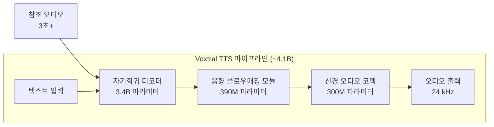

## 개요

Voxtral TTS는 [[mistral-small-4|Mistral AI]]가 2026년 3월 26일 출시한 오픈소스 음성합성(Text-to-Speech) 모델이다. 약 4.1B 파라미터 규모로, 9개 언어를 지원하며 3초의 참조 오디오만으로 제로샷 음성 복제(voice cloning)가 가능하다. ElevenLabs Flash v2.5 대비 68.4%의 인간 평가 승률을 기록하며, 가격은 73% 저렴하다. CC BY-NC 4.0 라이선스로 공개되었다.

## 핵심 특징

- **9개 언어 지원**: 영어(미국/영국/프랑스 방언), 프랑스어, 독일어, 스페인어, 네덜란드어, 포르투갈어, 이탈리아어, 힌디어, 아랍어
- **제로샷 음성 복제**: 3초 이상의 참조 오디오로 화자의 억양, 인토네이션, 자연스러운 발화 패턴 포착
- **교차 언어 음성 생성**: 한 언어의 목소리로 다른 언어 발화 가능
- **감정 표현**: 중립, 기쁨, 냉소 등 다양한 감정 톤 생성
- **20개 프리셋 음성**: 즉시 사용 가능한 사전 정의 음성 제공
- **다양한 출력 포맷**: WAV, PCM, FLAC, MP3, AAC, Opus (24 kHz)

## 아키텍처

Voxtral TTS는 3단 파이프라인으로 구성된다. 텍스트에서 중간 표현을 생성하는 대규모 자기회귀 디코더, 중간 표현을 음향 특성으로 변환하는 플로우매칭 모듈, 최종 파형을 합성하는 신경 오디오 코덱이 순차적으로 동작한다. 참조 오디오(최소 3초)가 자기회귀 디코더에 입력되어 화자의 음성 특성을 캡처한다.

### 3단 구성

| 컴포넌트 | 파라미터 | 역할 |
|---|---|---|
| 자기회귀 디코더 | 3.4B | 텍스트에서 중간 표현 생성 |
| 음향 플로우매칭 모듈 | 390M | 중간 표현을 음향 특성으로 변환 |
| 신경 오디오 코덱 | 300M | 최종 오디오 파형 합성 |

## 기술 상세

### 성능 벤치마크

- ElevenLabs Flash v2.5 대비 **68.4% 승률** (다국어 음성 복제 인간 평가)
- ElevenLabs v3 대비 화자 유사성에서 **동등 이상** 점수
- 힌디어에서 ~80%, 스페인어에서 ~88%의 특히 높은 승률

### 지연시간

- H200에서 **70ms** 첫 바이트 지연시간(TTFB)
- 실시간 팩터(RTF): ~9.7x -- 1초 오디오를 ~0.1초에 생성
- 최대 출력 길이: 생성당 2분
- 스트리밍 출력 지원으로 장문 텍스트의 점진적 오디오 생성 가능

### 가격

1,000자당 **$0.016** -- ElevenLabs Flash v2.5($0.060) 대비 73% 저렴. 대량 음성 생성이 필요한 엔터프라이즈 시나리오에서 비용 우위가 크다.

### 라이선스

CC BY-NC 4.0 (비상업적 사용). 상업적 사용 시 Mistral과 별도 계약이 필요하다. 연구/학술/프로토타이핑 목적으로는 자유롭게 사용 가능하다.

## 접근 방법

- **Hugging Face**: 오픈 웨이트 다운로드
- **Mistral Studio**: 웹 인터페이스
- **Le Chat**: Mistral의 대화형 플랫폼
- 랩톱, 중급 GPU, 모바일 기기(고압축 시)에서도 배포 가능한 경량 설계

## 경쟁 환경 비교

| 항목 | Voxtral TTS | ElevenLabs Flash v2.5 | ElevenLabs v3 | OpenAI TTS |
|---|---|---|---|---|
| 파라미터 | ~4.1B | 비공개 | 비공개 | 비공개 |
| 언어 | 9개 | 32개 | 32개 | 6개 |
| 음성 복제 | 3초 참조 | 1분 권장 | 30초 권장 | X |
| 인간 평가 승률 | 68.4% (vs Flash v2.5) | 기준선 | 동등 | - |
| 가격 (1K자) | $0.016 | $0.060 | $0.120 | $0.030 |
| 라이선스 | CC BY-NC 4.0 | 클로즈드 | 클로즈드 | 클로즈드 |
| 셀프호스팅 | O (오픈 웨이트) | X | X | X |

### 언어별 성능 특성

힌디어에서 ~80%, 스페인어에서 ~88%의 특히 높은 승률을 기록하며, 다국어 음성 복제에서 강점을 보인다. 영어/프랑스어 등 고자원 언어 외에도 저자원 언어에서의 성능이 경쟁 모델 대비 우수하다.

### 활용 시나리오

- **음성 에이전트**: 판매/고객 응대 자동화 -- ElevenLabs, Deepgram, OpenAI와 경쟁
- **콘텐츠 제작**: 팟캐스트, 오디오북, 교육 콘텐츠의 다국어 내레이션
- **접근성**: 시각 장애인용 텍스트 읽기, 다국어 안내 시스템
- **연구/프로토타이핑**: 오픈 웨이트로 학술 연구 및 커스텀 파이프라인 구축 가능

### 제약사항

- CC BY-NC 4.0 라이선스: 상업적 사용 시 별도 계약 필요
- 최대 출력 길이: 생성당 2분
- 24 kHz 출력 -- 48 kHz 대비 음질 제한
- 한국어/중국어/일본어 등 CJK 언어 미지원 (9개 언어 한정)

## 2026 TTS 시장 동향

오픈소스 TTS 모델의 급성장이 상용 독점 서비스의 지배적 지위를 흔들고 있다:

- **[[voxcpm2|VoxCPM2]]** (OpenBMB): 토크나이저 프리 TTS, 다국어 음성 생성
- **Parler-TTS**: 프롬프트 기반 음성 스타일 제어
- **MARS5** (Camb.AI): 5초 참조로 음성 복제
- **Voxtral TTS**: 기업용 음성 에이전트(판매/고객 응대) 시장에서 ElevenLabs/[[deepgram|Deepgram]]/OpenAI와 직접 경쟁

실시간 대화형 음성 에이전트 시장이 확대되면서, 저지연 + 다국어 + 감정 표현이 핵심 경쟁력으로 부상하고 있다. Voxtral은 오픈 웨이트 + 저가격으로 이 시장에서 차별화를 시도하고 있다.

## 관련 문서

- [[mistral-small-4]] - Mistral의 최신 MoE 언어 모델
- [[leanstral]] - Mistral의 형식 검증 AI
- [[qwen-3-5-omni]] - Alibaba의 멀티모달(음성 포함) 모델
- [[voxcpm2]] - OpenBMB의 토크나이저 프리 TTS
