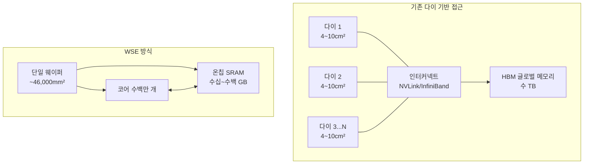
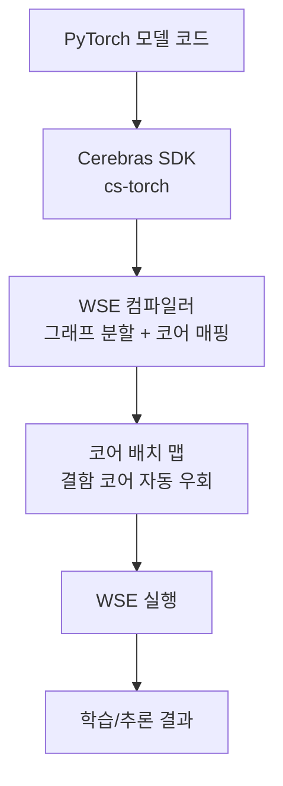

# Wafer-Scale Engine (웨이퍼 스케일 엔진)

웨이퍼 스케일 엔진(Wafer-Scale Engine, WSE)은 여러 개의 다이(die)로 분할하지 않고 실리콘 웨이퍼 전체를 단일 처리 유닛으로 사용하는 AI 가속기 설계 패러다임이다. 현재까지 가장 대표적인 구현체는 Cerebras Systems의 WSE 시리즈다.

## 왜 웨이퍼 스케일인가: 메모리 월 문제

현대 AI 가속기가 직면한 가장 큰 병목은 **메모리 대역폭 벽(memory bandwidth wall)**이다. GPU 클러스터 환경에서는 다음 경로를 통해 데이터가 이동한다:

이 구조에서 행렬 곱 같은 AI 연산은 데이터 이동 비용이 실제 연산 비용보다 크게 된다(로프스트롬의 루프핑(roofline model)에서 메모리 바운드 영역). WSE는 이 문제를 근본적으로 해결하려 한다: 웨이퍼 전체를 칩으로 만들어 수백만 개의 코어가 SRAM에 직접 접근하게 한다.

## 전통적 다이 대비 구조 비교

핵심 차이는 **인터코어 통신이 칩 외부 버스를 거치지 않는다는 점**이다. WSE에서는 인접 코어 간 통신이 온칩 메쉬 네트워크를 통해 이루어지며, 이때 지연이 나노초 단위다.

## Cerebras WSE 세대별 사양

Cerebras는 현재까지 WSE-1(2019), WSE-2(2021), WSE-3(2023~2024)를 출시했다.

| 항목 | WSE-2 | WSE-3 |
|------|-------|-------|
| 트랜지스터 수 | 2.6조 개 | 4조 개 |
| 코어 수 | 850,000개 | 900,000개 |
| 온칩 SRAM | 40GB | 44GB |
| 메모리 대역폭 | ~20PB/s (온칩) | ~120PB/s (온칩) |
| 공정 | TSMC 7nm | TSMC 5nm |
| 칩 면적 | 46,225mm² | 46,225mm² (웨이퍼 전체) |

비교를 위해: NVIDIA H100 SXM5의 다이 면적은 ~814mm², 온칩 메모리는 50MB(L2 캐시 + SMEM) 수준이다.

## 기술적 도전 및 해결책

### 1. 결함 허용(Fault Tolerance)

웨이퍼 전체를 하나의 칩으로 만들면 제조 결함이 반드시 발생한다. 실리콘 웨이퍼 생산 시 평균 결함 밀도(defect density)가 존재하므로, 웨이퍼 스케일에서는 수백~수천 개의 결함 코어가 필연적으로 포함된다.

**해결책**: 결함 있는 코어를 컴파일 타임에 탐지하고, 해당 코어를 우회하는 계산 그래프를 생성한다. 코어 수가 충분히 많으므로 일부 결함이 있어도 전체 성능에 미치는 영향이 미미하다.

### 2. 열 관리(Thermal Management)

46,000mm²의 단일 칩은 기존 냉각 방식으로는 처리할 수 없다. Cerebras는 웨이퍼 상단에 직접 냉각수를 흘리는 **수냉 일체형 구조**를 채택했다.

### 3. 웨이퍼 레벨 패키징(WLP)

다이를 개별 패키징하지 않고 웨이퍼 상태에서 직접 테스트하고 기판에 본딩하는 WLP(Wafer-Level Packaging) 기술이 필요하다. Cerebras는 이를 내부 공정으로 개발했다.

### 4. 소프트웨어 스택

기존 PyTorch/TensorFlow 코드를 WSE에서 실행하려면 컴파일러가 계산 그래프를 수십만 개 코어의 데이터플로우 그래프로 변환해야 한다. Cerebras의 소프트웨어 스택은 이 변환을 자동화한다.

## 프로그래밍 모델

사용자 관점에서는 `cerebras.sdk` 임포트 후 기존 PyTorch 코드를 거의 수정 없이 실행할 수 있도록 설계되어 있다. 실제 코어 배치는 컴파일러가 처리한다.

## AI 학습에서의 장점

WSE가 특히 유리한 워크로드:

1. **대형 모델 학습**: 모델 전체를 온칩 SRAM에 올릴 수 있으면 체크포인트 로딩/저장 없이 연속 학습 가능
2. **희소 계산(Sparse Computation)**: GPU에서 비효율적인 불규칙 희소 행렬 연산이 WSE에서는 코어 단위 라우팅으로 효율적 처리
3. **배치 크기 1 추론**: KV 캐시 없이 단일 요청 추론 시 GPU는 메모리 대역폭이 병목이지만, WSE는 온칩 대역폭으로 처리

## 한계 및 트레이드오프

- **온칩 메모리 용량**: 44GB는 최대 규모 모델(수천억 파라미터)을 단독으로 올리기에 부족. 여러 CS-3를 클러스터링해야 함
- **에코시스템**: NVIDIA CUDA 생태계에 비해 소프트웨어·라이브러리 성숙도가 낮음
- **비용**: 단일 CS-3 시스템의 가격은 고가 GPU 서버보다 높은 수준 [교차검증 필요]
- **범용성**: AI 학습/추론에 특화. 범용 컴퓨팅에는 부적합

## [[ai-accelerators]] 생태계에서의 위치

WSE는 기존 GPU-클러스터 패러다임을 정면으로 대체하기보다 특정 워크로드(고처리량 학습, 초저지연 추론)에서 보완재로 포지셔닝된다. 특히 대형 언어 모델의 학습 비용 절감 맥락에서 주목받는다.

[[cerebras-cloud-inference]]는 WSE 하드웨어를 클라우드 서비스로 제공하는 Cerebras의 제품이다. 사용자는 하드웨어 구매 없이 WSE 추론 성능을 API 형태로 활용할 수 있다.

## 관련 문서

- [[cerebras-cloud-inference]] - WSE 기반 클라우드 추론 서비스
- [[ai-accelerators]] - AI 가속기 전체 생태계 비교
- [[in-memory-computing]] - 메모리 근접 연산의 또 다른 접근법
