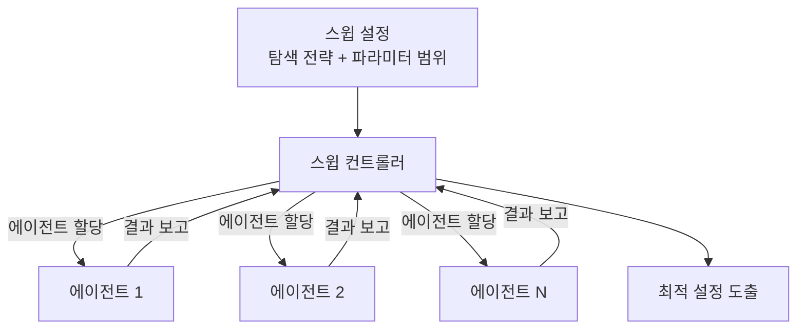

# Weights & Biases (W&B) - ML 실험 관리

## 개요

Weights & Biases(이하 W&B)는 머신러닝 실험 추적, 하이퍼파라미터 최적화, 아티팩트 관리를 통합한 MLOps 플랫폼이다. 2017년 창업해 학술 연구자부터 대기업 ML 팀까지 광범위하게 사용된다. 최근에는 LLM 관측을 위한 W&B Weave 기능을 추가하며 LLMOps 영역으로도 확장하고 있다.

## 핵심 기능

### 1. 실험 추적 (Experiment Tracking)

학습 루프에 몇 줄의 코드만 추가하면 모든 실험 메트릭이 실시간으로 기록된다.

```python
import wandb

wandb.init(project="my-model", config={"lr": 0.001, "epochs": 10})

for epoch in range(10):
    loss = train_one_epoch()
    wandb.log({"loss": loss, "epoch": epoch})

wandb.finish()
```

- **메트릭 로깅**: loss, accuracy 등 수치 지표를 스텝별로 기록, 실시간 그래프 생성
- **시스템 메트릭**: GPU 사용률, 메모리, CPU 자동 수집
- **미디어 로깅**: 이미지, 오디오, 비디오, HTML, Plotly 차트 지원
- **코드 추적**: 실험 실행 당시 코드 스냅샷과 git 커밋 해시 보존

### 2. 하이퍼파라미터 스윕 (Sweeps)



- **탐색 전략**: grid search, random search, Bayesian optimization(기본), Hyperband 조기 종료
- **병렬 실행**: 여러 머신에서 에이전트를 실행해 탐색 공간을 분산 처리
- **조기 종료**: 성과 없는 실험을 자동으로 중단해 컴퓨팅 자원 절약

### 3. 아티팩트 관리 (Artifact Management)

데이터셋, 모델 가중치, 전처리 결과물 등을 버전 관리한다.

- **버전 관리**: 각 아티팩트 버전이 고유 해시로 식별됨
- **계보 추적(Lineage)**: 데이터셋 → 학습 → 모델 → 평가로 이어지는 전체 파이프라인 그래프
- **중복 제거**: 동일 파일은 한 번만 저장(해시 기반 dedup)

### 4. W&B Tables

표 형태 데이터(예측 결과, 오분류 샘플)를 인터랙티브하게 탐색한다.

- 필터, 정렬, 그루핑으로 오류 패턴 시각적 분석
- 이미지·텍스트·오디오 등 멀티미디어 데이터 인라인 렌더링
- 컴퓨터 비전 모델의 예측 vs 정답 시각 비교에 특히 유용

### 5. Reports

마크다운 + 라이브 차트 + 미디어를 결합한 협업 문서.

- 실험 결과를 이해관계자에게 공유하는 "실험 보고서" 용도
- W&B 플롯은 항상 최신 데이터를 반영(snapshot이 아닌 live)
- 팀 멤버와 댓글로 협업 가능

### 6. 모델 레지스트리 (Model Registry)

프로덕션 모델의 생명주기를 관리한다.

- `staging`, `production`, `archived` 등 단계별 상태 관리
- 승격(promote) 시 자동 CI/CD 트리거 연결 가능
- 아티팩트 계보와 연결되어 "이 모델은 어떤 데이터로 학습했나"까지 추적

### 7. W&B Weave (LLMOps)

2024년 추가된 LLM 관측 기능 레이어.

- LLM 호출 추적, 프롬프트 버전 관리
- 평가 파이프라인 구성
- W&B 실험 관리와 통합되어 파인튜닝 전후 비교 가능

## 유사 도구 비교

| 기능 | W&B | MLflow | Neptune | CometML |
|------|-----|--------|---------|---------|
| 실험 추적 | 최상 | 좋음 | 좋음 | 좋음 |
| 하이퍼파라미터 스윕 | 내장(강력) | 플러그인 필요 | 내장 | 내장 |
| 아티팩트 관리 | 강력 | 강력 | 중간 | 중간 |
| 오픈소스 | 아니오 | 오픈소스 | 아니오 | 아니오 |
| 자체 호스팅 | 유료 플랜 | 자유롭게 가능 | 유료 플랜 | 유료 플랜 |
| LLMOps | Weave | 최근 추가 | 일부 | 일부 |

**MLflow**: 오픈소스로 자체 호스팅이 자유롭고 Databricks 통합이 강점. UI는 W&B보다 단순.
**Neptune**: 협업 기능과 UI가 탄탄하지만 스윕 기능은 W&B보다 약함.
**CometML**: LLM 평가 기능 조기 추가, 가격 경쟁력 있음.

## 프레임워크 통합

W&B는 주요 ML 프레임워크와 네이티브 통합을 제공한다.

- **PyTorch**: `wandb.watch(model)`로 그래디언트/파라미터 히스토그램 자동 기록
- **HuggingFace Transformers**: `Trainer`의 `report_to="wandb"` 한 줄로 활성화
- **PyTorch Lightning**: `WandbLogger` 콜백
- **JAX/Flax**: 커뮤니티 통합
- **Keras**: `WandbCallback`
- **scikit-learn**: 수동 로깅 또는 통합 라이브러리

```python
from transformers import Trainer, TrainingArguments

training_args = TrainingArguments(
    output_dir="./results",
    report_to="wandb",
    run_name="bert-finetuning-v1"
)
```

## 프로덕션 패턴

- **분산 학습 추적**: 멀티 GPU/노드 학습에서 모든 워커가 같은 `run`에 로깅
- **학습 재개**: 체크포인트를 아티팩트로 저장해 중단된 실험 정확히 복원
- **CI/CD 통합**: GitHub Actions에서 평가 실행 → W&B 리포트 생성 → PR에 링크
- **비용 추적**: GPU 시간, API 호출 비용을 태그로 분류해 팀별 예산 관리

## 실무 관점

W&B의 핵심 가치는 "실험의 재현성과 비교 가능성"이다. 여러 연구자가 같은 프로젝트에서 작업할 때 어떤 실험이 어떤 조건에서 이루어졌는지 체계적으로 기록되기 때문에 커뮤니케이션 비용이 크게 줄어든다. 스윕 기능은 특히 하이퍼파라미터 탐색 시간을 수동 대비 5-10배 단축시켜 주는 경우가 많다.

## 관련 문서

- [[langsmith|LangSmith - LLM 애플리케이션 관측 플랫폼]]
- [[분산 학습]]
- [[llm-observability-platforms|LLM 관측 플랫폼]]
- [[파인튜닝 기법]]
- [[MLOps 기초]]
