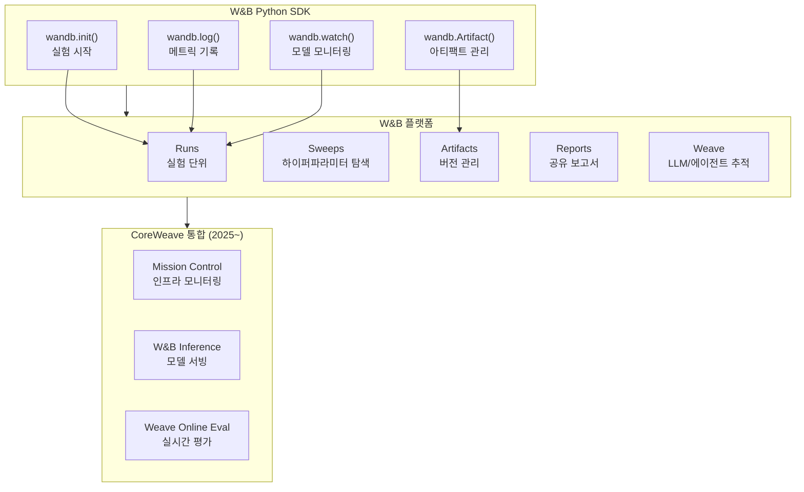

# Weights & Biases (W&B) - 실험 추적 플랫폼

## 개요

Weights & Biases(W&B)는 ML 실험 추적, 하이퍼파라미터 최적화, 모델 관리를 위한 MLOps 플랫폼이다. 2017년 Lukas Biewald가 설립한 이래 100만 명 이상의 개발자가 사용하는 사실상의 LLM 학습 표준 추적 도구로 자리잡았다. 2025년 3월 CoreWeave가 약 17억 달러에 인수를 발표하고 같은 해 5월 인수를 완료하여, GPU 클라우드와 실험 추적이 수직 통합된 새로운 AI 개발 플랫폼으로 진화하고 있다.

OpenAI, Meta, NVIDIA, Snowflake 등이 엔터프라이즈 고객이며, HuggingFace Transformers, DeepSpeed, NeMo 등 주요 학습 프레임워크가 네이티브 통합을 제공한다. [[experiment-tracking]]에서 다루는 실험 추적 도구 중 가장 높은 시장 점유율을 보인다.

- GitHub: [wandb/wandb](https://github.com/wandb/wandb)
- 공식 사이트: [wandb.ai](https://wandb.ai/)

## 핵심 기능

W&B의 기능은 크게 실험 추적(Experiments), 하이퍼파라미터 탐색(Sweeps), 아티팩트 관리(Artifacts), 보고서(Reports), 그리고 2025년 이후 추가된 추론/에이전트 모니터링(Weave, Inference)으로 구분된다.



### Runs (실험 실행)

Run은 W&B의 기본 단위로, 한 번의 학습 스크립트 실행에 해당한다. 해당 실행 동안의 모든 메트릭, 하이퍼파라미터, 시스템 통계, 파일이 Run에 귀속된다.

```python
import wandb

run = wandb.init(project="llm-pretraining", config={
    "learning_rate": 3e-4,
    "batch_size": 512,
    "model": "llama-7b",
})

# 학습 루프에서 메트릭 기록
wandb.log({"loss": 2.34, "perplexity": 10.4, "lr": 3e-4})

# 모델 그래디언트/파라미터 자동 추적
wandb.watch(model, log="all", log_freq=100)
```

### Sweeps (하이퍼파라미터 탐색)

Sweeps는 분산 하이퍼파라미터 탐색을 자동화한다. 탐색 전략(Random, Grid, Bayesian)과 최적화 대상 메트릭을 설정 파일로 정의하면, W&B 서버가 컨트롤러 역할을 하고 로컬/클러스터의 에이전트가 각 조합을 실행한다.

| 전략 | 특징 | 적합 상황 |
|------|------|----------|
| Random | 무작위 샘플링 | 초기 탐색, 탐색 공간이 넓을 때 |
| Grid | 전수 조사 | 탐색 공간이 작고 명확할 때 |
| Bayesian | 이전 결과 기반 적응적 탐색 | 비용이 높은 실험에서 효율적 탐색 |

### Artifacts (아티팩트)

Artifacts는 데이터셋, 모델 체크포인트, 평가 결과 등의 버전 관리 시스템이다. 데이터 리니지(lineage)를 자동 추적하여 특정 모델이 어떤 데이터로 학습되었는지, 어떤 체크포인트에서 파생되었는지를 추적할 수 있다.

### Reports (보고서)

실험 결과를 인터랙티브 보고서로 정리하여 팀과 공유하는 기능이다. 차트, 테이블, 마크다운 텍스트를 조합하여 실험 분석을 문서화한다.

## LLM 학습 모니터링

W&B는 LLM 학습에서 다음 항목들을 실시간으로 추적한다.

| 카테고리 | 추적 항목 | 관련 위키 |
|---------|----------|----------|
| 손실 | training loss, validation loss 곡선 | [[loss-spike-debugging]] |
| 그래디언트 | gradient norm, gradient histogram | [[training-profiling]] |
| 학습률 | 스케줄러 진행 상태 | [[learning-rate-scheduling]] |
| GPU | utilization, 메모리 사용량, 온도 | [[gpu-cluster-scheduling]] |
| 처리량 | tokens/sec, samples/sec, MFU | [[training-profiling]] |
| 체크포인트 | 저장 시점, 크기, 평가 결과 | [[model-checkpointing-sharding]] |

특히 [[loss-spike-debugging]]에서 loss spike가 발생했을 때, W&B의 실시간 대시보드에서 gradient norm 급등, 학습률 변화, 특정 데이터 배치와의 상관관계를 시각적으로 분석할 수 있어 디버깅 시간을 크게 단축한다.

### 프레임워크 통합

| 프레임워크 | 통합 방식 | 자동 로깅 범위 |
|-----------|----------|---------------|
| HuggingFace Transformers | `report_to="wandb"` | loss, eval 메트릭, 하이퍼파라미터, 시스템 통계 |
| PyTorch | `wandb.watch()` | 그래디언트, 파라미터 히스토그램 |
| DeepSpeed | `WandbLogger` | ZeRO 메모리, 처리량 |
| NeMo | 네이티브 통합 | 분산 학습 메트릭 전체 |

분산 학습 환경에서는 rank 0 프로세스만 로깅하는 것이 표준 패턴이다. 이를 통해 중복 로깅을 방지하면서도 전체 클러스터의 학습 상태를 추적할 수 있다.

## CoreWeave 인수 이후 (2025~)

2025년 5월 CoreWeave 인수 완료 이후, 2025년 6월 Fully Connected Conference에서 3개의 신규 제품이 발표되었다.

| 제품 | 역할 | 특징 |
|------|------|------|
| **Mission Control 통합** | CoreWeave 인프라 모니터링 | W&B Run 중 GPU 장애, 열 위반 등 인프라 알림 |
| **W&B Inference** | 모델 서빙 | CoreWeave 인프라 위 오픈소스 모델 서빙, Weave 관측성 내장 |
| **Weave Online Evaluations** | 실시간 프로덕션 평가 | 에이전트 성능 모니터링, 품질 이슈 탐지 |

이 통합은 GPU 인프라(CoreWeave) - 학습 추적(W&B Experiments) - 프로덕션 모니터링(Weave)을 하나의 플랫폼으로 연결하는 것으로, [[gpu-cluster-scheduling]]과 실험 추적의 경계를 허무는 방향이다.

## 대안 비교

[[experiment-tracking]]에서 상세히 다루지만, 핵심 비교는 다음과 같다.

| 항목 | W&B | MLflow | CometML |
|------|-----|--------|---------|
| 호스팅 | SaaS + 온프레미스 | 자체 호스팅 + Databricks | SaaS + 온프레미스 |
| 강점 | UI/UX, 협업, 개발자 경험 | 오픈소스, 모델 레지스트리 | 실시간 비교, 시각화 |
| 가격 | 무료 티어 + 유료 | 무료 (오픈소스) | 무료 티어 + 유료 |
| LLM 학습 특화 | Weave, 대규모 분산 지원 | LLM 평가 메트릭 | 제한적 |
| 2026 포지션 | CoreWeave 수직 통합 | Databricks 생태계 | 독립 플랫폼 |

Neptune은 2025년 OpenAI에 인수된 후 2026년 3월 호스팅 서비스를 종료했다.

## 요금 체계

| 티어 | 가격 | 주요 특징 |
|------|------|----------|
| Free | 무료 | 100GB 스토리지, 개인 프로젝트 |
| Team | 사용자당 유료 | 무제한 스토리지, 팀 협업, 우선 지원 |
| Enterprise | 커스텀 | 온프레미스 배포, SSO, 감사 로그, SLA |

## 대표 자료

- [W&B 공식 문서](https://docs.wandb.ai/)
- [CoreWeave Completes Acquisition of Weights & Biases (2025.05)](https://www.coreweave.com/blog/coreweave-completes-acquisition-of-weights-biases)
- [CoreWeave and W&B Announce New Products (2025.06)](https://wandb.ai/site/articles/press-release/coreweave-and-weights-biases-announce-new-products-and-capabilities-helping-ai-developers-iterate-faster-on-models-and-agents/)

## 관련 문서

- [[experiment-tracking]] -- W&B를 포함한 실험 추적 도구 전반 비교
- [[loss-spike-debugging]] -- W&B 대시보드를 활용한 loss spike 디버깅
- [[training-profiling]] -- GPU utilization, gradient stats 등 학습 프로파일링
- [[gpu-cluster-scheduling]] -- CoreWeave Mission Control과 GPU 스케줄링 통합
- [[learning-rate-scheduling]] -- W&B에서 추적하는 학습률 스케줄
- [[model-checkpointing-sharding]] -- Artifacts를 통한 체크포인트 버전 관리
