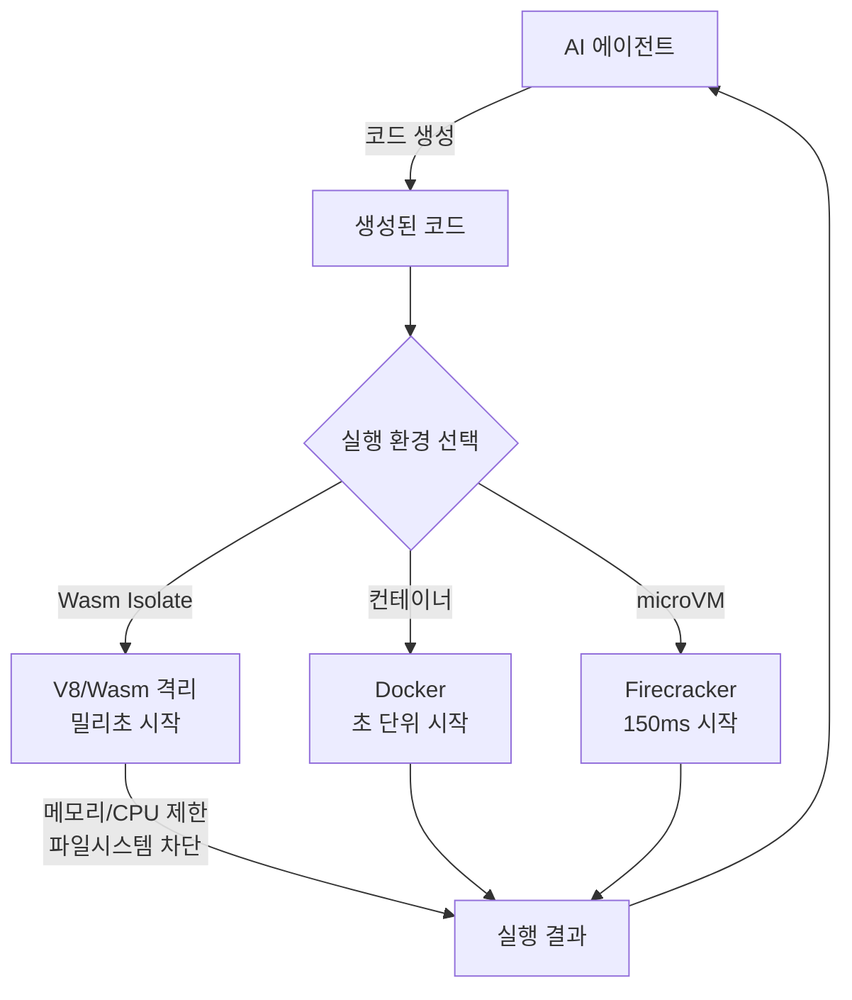
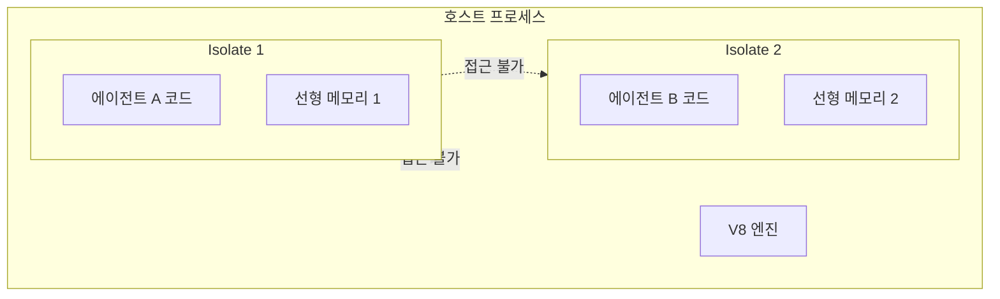

## 개요

WebAssembly(Wasm) 에이전트 샌드박싱은 AI 에이전트가 생성한 코드를 **안전하게 격리 실행**하기 위한 기술이다. LLM이 생성한 코드는 본질적으로 예측 불가능하며, 악의적이지 않더라도 무한 루프, 리소스 고갈, 데이터 접근 등의 위험이 존재한다.

2026년 현재, Wasm/V8 isolate가 기존 컨테이너나 microVM의 대안으로 부상하고 있다. 밀리초 단위 시작 속도와 메가바이트 수준의 메모리 사용량으로, 에이전트의 빈번한 코드 실행 패턴에 최적화되어 있다.

## 왜 중요한가

- LLM 생성 코드는 **정규표현식이나 제한된 라이브러리보다 근본적인 격리**가 필요
- 에이전트가 도구 호출로 코드를 실행하는 빈도가 급증 -- 매 호출마다 컨테이너를 띄우면 지연 불가피
- Wasm isolate는 커널을 공유하지 않으므로 **컨테이너 탈출(container escape) 위험 원천 차단**
- Cloudflare, NVIDIA 등 주요 플랫폼이 Wasm 기반 에이전트 실행을 채택

## 핵심 메커니즘

에이전트 코드 실행 시 격리 환경 선택지와 Wasm isolate의 위치. 밀리초 시작 + 강한 격리를 동시에 달성한다.

### 격리 기술 비교 (2026)

| 기술 | 보안 수준 | 시작 속도 | 메모리 | 주요 단점 |
|------|----------|-----------|--------|-----------|
| Docker 컨테이너 | 중 (커널 공유) | 초 단위 | 수백 MB | 커널 공유에 의한 탈출 위험 |
| gVisor | 중상 | 초 단위 | 10-20% 오버헤드 | 시스콜 호환성 문제 |
| Firecracker microVM | 상 (하드웨어 격리) | 150ms | 수십 MB | 관리 복잡성 |
| Kata Containers | 상 | 초 단위 | microVM급 | UX 복잡 |
| **Wasm/V8 Isolate** | **상 (커널 비공유)** | **밀리초** | **메가바이트** | AI 툴링 미성숙 |

### Wasm Isolate의 격리 원리

각 isolate는 독립적인 선형 메모리를 가지며, 다른 isolate나 호스트 프로세스에 접근할 수 없다.

## 2026년 동향

- **Cloudflare Dynamic Workers**: V8 isolate 기반으로 컨테이너 대비 100배 빠른 시작 시간
- **NVIDIA**: WebAssembly로 에이전틱 AI 워크플로우를 샌드박싱하는 플랫폼 발표
- **"Isolate가 컨테이너를 이기고 있다"**: 에이전트 코드 실행 분야에서 isolate가 주류로 전환 중

## 실무 적용

- 에이전트가 코드를 실행해야 하는 모든 시나리오에서 Wasm isolate 우선 고려
- 기존 Docker 기반 코드 실행 환경에서 Wasm으로 마이그레이션 시 시작 시간 극적 개선
- 파일시스템/네트워크 접근은 WASI(WebAssembly System Interface)를 통해 명시적 허가 방식
- AI 툴링 생태계가 아직 미성숙하므로, 프로덕션 도입 시 지원 언어/라이브러리 호환성 확인 필요
- [[zero-trust-ai-agents]] 패턴과 결합하여 계층적 보안 구축

## 관련 문서

- [[zero-trust-ai-agents]] -- 에이전트 제로 트러스트 아키텍처
- [[owasp-agentic-top-10]] -- 에이전트 보안 위협 Top 10
- [[agent-prompt-injection-defense]] -- 프롬프트 인젝션 방어
- [[how-coding-agents-work]] -- 코딩 에이전트의 코드 실행 메커니즘
