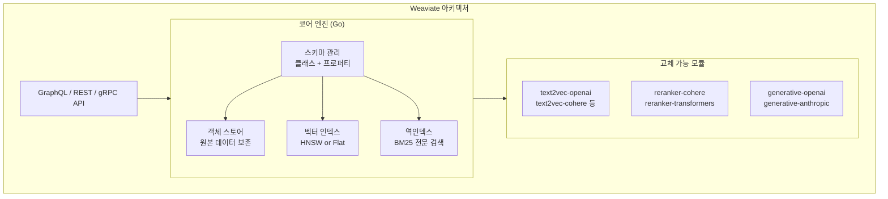

# Weaviate

네덜란드 스타트업 SeMI Technologies(현 Weaviate B.V.)가 개발한 오픈소스 벡터 데이터베이스. 벡터 검색과 그래프형 데이터 모델을 결합한 독자적인 설계를 갖는다. 모듈식 아키텍처로 임베딩, 재순위화(reranking), 생성 모듈을 교체 가능하다.

## 개요

| 항목 | 내용 |
|---|---|
| 이름 | Weaviate |
| 개발사 | Weaviate B.V. (네덜란드) |
| 라이선스 | BSD-3-Clause |
| 저장소 | github.com/weaviate/weaviate |
| 코어 언어 | Go |
| 클라이언트 | Python, JavaScript/TypeScript, Go, Java |
| 배포 형태 | 로컬(Docker), 클라우드(Weaviate Cloud Services) |

## 핵심 설계 철학

Weaviate는 단순한 벡터 인덱스가 아니라 **객체 저장과 벡터 검색을 통합한 데이터베이스**다.



### 객체-벡터 이중 저장

Weaviate의 핵심 특징은 각 객체(Object)가 원본 속성 데이터와 벡터를 함께 저장한다는 것이다. 검색 결과가 벡터 ID가 아니라 완전한 객체를 직접 반환하므로, 별도의 메타데이터 스토어가 필요 없다.

## 데이터 모델

### 클래스와 프로퍼티

Weaviate는 스키마 기반으로 데이터를 관리한다.

```python
import weaviate

client = weaviate.connect_to_local()

# 클래스 정의 (Weaviate v4 Python client)
from weaviate.classes.config import Configure, Property, DataType

client.collections.create(
    "Article",
    vectorizer_config=Configure.Vectorizer.text2vec_openai(),
    generative_config=Configure.Generative.openai(),
    properties=[
        Property(name="title", data_type=DataType.TEXT),
        Property(name="content", data_type=DataType.TEXT),
        Property(name="author", data_type=DataType.TEXT),
    ]
)
```

### 하이브리드 검색

```python
articles = client.collections.get("Article")
response = articles.query.hybrid(
    query="머신러닝 기초",
    alpha=0.75,   # 0: BM25만, 1: 벡터만, 0.75: 벡터 우선 혼합
    limit=5,
)
```

`alpha` 파라미터로 BM25(희소)와 벡터(밀집) 검색 비율을 실시간으로 조정한다.

## Weaviate vs 경쟁 제품

| 특징 | Weaviate | [[faiss|FAISS]] | [[pinecone|Pinecone]] | [[qdrant|Qdrant]] |
|---|---|---|---|---|
| 데이터 모델 | 객체+벡터 통합 | 벡터만 | 벡터+메타데이터 | 벡터+페이로드 |
| 그래프 관계 | 지원 (크로스-참조) | 없음 | 없음 | 없음 |
| 하이브리드 검색 | 내장 | 없음 | 별도 설정 | 내장 |
| 관리형 서비스 | Weaviate Cloud | 없음 | 완전관리형 | Qdrant Cloud |
| 멀티테넌시 | 지원 | 없음 | 네임스페이스 | 지원 |

## 크로스-참조 (Graph 기능)

Weaviate는 클래스 간 참조 관계를 정의할 수 있다. 이를 통해 `Author -> Article -> Category` 같은 그래프 구조를 벡터 DB 내에서 표현한다.

```python
# Author와 Article 클래스를 연결
from weaviate.classes.config import ReferenceProperty

client.collections.get("Article").config.add_reference(
    ReferenceProperty(name="hasAuthor", target_collection="Author")
)
```

GraphQL API로 그래프 탐색 쿼리가 가능하다.

## Generative Search (RAG 통합)

Weaviate는 벡터 검색 결과를 LLM에 직접 전달하는 Generative Search를 내장한다.

```python
response = articles.generate.near_text(
    query="딥러닝 기초",
    single_prompt="다음 기사를 한국어로 3줄 요약하세요: {content}",
    limit=3,
)
for obj in response.objects:
    print(obj.generated)   # LLM이 생성한 요약
```

별도의 [[rag-pipeline|RAG 파이프라인]] 코드 없이 검색과 생성을 단일 쿼리로 처리한다.

## 배포 옵션

- **Embedded**: Python 프로세스 내에서 인메모리로 실행 (프로토타이핑용)
- **Docker Compose**: 로컬/온프레미스 프로덕션 배포
- **Weaviate Cloud Services (WCS)**: 완전 관리형 SaaS, 서버리스 및 전용 클러스터

## 실무 관점

Weaviate는 **객체-벡터 통합 모델과 그래프 참조**가 필요한 복잡한 도메인 데이터에 강점을 갖는다. 하이브리드 검색과 Generative Search가 내장되어 있어 [[haystack|Haystack]]이나 [[llamaindex|LlamaIndex]] 없이도 완결된 RAG 시스템을 구성할 수 있다. 다만 스키마 선언이 필수라 초기 설정이 [[faiss|FAISS]]나 [[chroma-db|ChromaDB]]보다 복잡하다.

## 관련 문서

- [[faiss|FAISS]]
- [[chroma-db|ChromaDB]]
- [[pinecone|Pinecone]]
- [[qdrant|Qdrant]]
- [[rag-pipeline|RAG 파이프라인]]
- [[haystack|Haystack]]
- [[llamaindex|LlamaIndex]]
