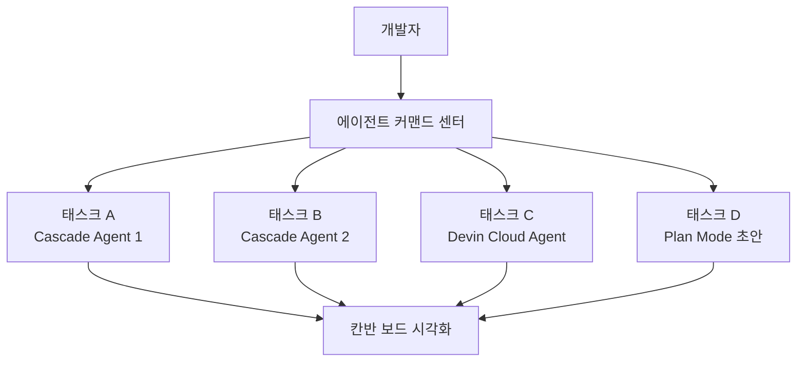
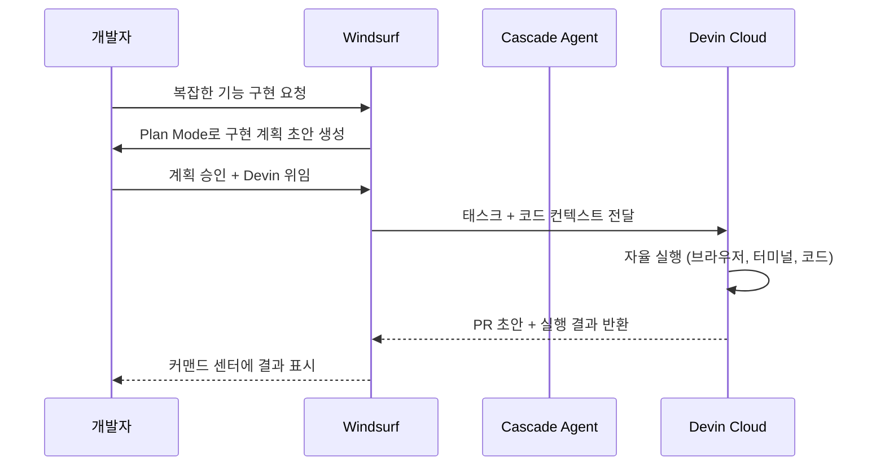

# Windsurf 2.0 - 에이전트 커맨드 센터 & Devin Cloud 통합

## 개요

2026년 4월 15일 출시된 Windsurf 2.0은 AI 코딩 IDE 시장에서 에이전트 관리 인터페이스를 칸반(Kanban) 스타일로 재설계하고, [[devin-2-0-release|Devin Cloud]]를 내장 통합하는 대형 업데이트다. Codeium이 개발하는 Windsurf는 이번 2.0 릴리즈를 통해 개인 개발자 도구에서 팀 단위 AI 에이전트 오케스트레이션 플랫폼으로의 전환을 본격화했다.

[[claude-code]] 등 다른 코딩 에이전트와의 포지셔닝 차별점은 Windsurf 2.0이 **멀티 에이전트 비교 실행**과 **Devin과의 긴밀한 통합**에 있다.

## 주요 신기능

### 에이전트 커맨드 센터 (Agent Command Center)

칸반 스타일 보드에서 복수의 에이전트 태스크를 시각적으로 관리할 수 있다. 각 카드에는 진행 상태(To Do / In Progress / Done), 담당 에이전트, 예상 완료 시간이 표시된다. 태스크 의존성(dependency)을 설정해 에이전트 A가 완료된 후 에이전트 B가 시작되도록 파이프라인을 구성할 수 있다.

**실무 활용 패턴:**
- 기능 브랜치 전체를 에이전트에게 위임하고 커맨드 센터에서 진행률 모니터링
- 병렬로 실행 중인 여러 에이전트의 결과를 하나의 뷰에서 비교
- 에이전트가 막힌(stuck) 태스크를 수동으로 개입해 해소

### Spaces - 태스크 기반 조직화

Spaces는 프로젝트·기능·스프린트 단위로 에이전트 태스크와 코드 컨텍스트를 묶는 논리적 컨테이너다. 하나의 Space 내에서 관련 파일, 에이전트 대화 히스토리, 실행 결과를 함께 관리할 수 있어 컨텍스트 스위칭 비용을 줄인다.

| 기능 | 설명 |
|------|------|
| 컨텍스트 고정 | Space 내 파일/코드 조각을 항상 에이전트 컨텍스트에 포함 |
| 태스크 이력 | 에이전트가 Space 내에서 실행한 모든 작업 기록 보존 |
| 팀 공유 | 팀 플랜에서 Space를 팀원과 공유해 협업 에이전트 작업 가능 |

### Devin Cloud 내장 통합

Windsurf 2.0의 가장 독특한 차별점은 [[devin-2-0-release|Cognition AI의 Devin]]을 에디터 내부에서 직접 호출할 수 있다는 점이다. 기존에는 Devin 웹 인터페이스나 API를 별도로 사용해야 했지만, 이제 Windsurf 에디터 안에서 "이 태스크를 Devin에게 위임"을 클릭하면 Devin Cloud Agent가 실행된다.

통합의 핵심은 **컨텍스트 이어받기**다. Windsurf가 이미 파악한 코드베이스 이해(codebase understanding)와 작업 계획을 Devin에게 그대로 전달해, Devin이 처음부터 코드베이스를 탐색하는 시간을 절약한다.

### Arena Mode - 에이전트 A/B 비교

Arena Mode는 두 Cascade 에이전트를 동일한 태스크에 동시 실행해 결과를 나란히 비교하는 기능이다. 어떤 접근법이 더 나은 코드를 생성하는지, 성능·가독성·테스트 커버리지 측면에서 비교 검토할 수 있다.

**Arena Mode 활용 시나리오:**
- 동일한 알고리즘 문제에 대해 재귀 방식 vs 반복 방식 에이전트 결과 비교
- 두 가지 아키텍처 접근법 중 어느 쪽이 더 나은 코드를 생성하는지 실험
- 프롬프트 엔지니어링(prompt engineering) A/B 테스트

### Plan Mode - 코딩 전 계획 작성

에이전트가 코드를 작성하기 전에 먼저 상세한 구현 계획을 자연어 문서로 작성한다. 개발자는 계획을 검토·수정한 후 "실행"을 승인하는 구조다. 에이전트가 잘못된 방향으로 멀리 진행하는 것을 방지하고, 코드 생성 전에 설계 결정을 확정할 수 있다.

## 기존 버전 대비 변화

| 기능 영역 | Windsurf 1.x | Windsurf 2.0 |
|----------|--------------|--------------|
| 에이전트 관리 | 채팅 패널 단일 뷰 | 칸반 커맨드 센터 |
| 프로젝트 조직 | 파일 탐색기 중심 | Spaces 논리 컨테이너 |
| 외부 에이전트 통합 | 없음 | Devin Cloud 내장 |
| 에이전트 비교 | 없음 | Arena Mode |
| 사전 계획 | 없음 | Plan Mode |

## 경쟁 구도 내 위치

2026년 4월 기준 주요 코딩 에이전트 IDE 비교:

- **Windsurf 2.0**: 에이전트 관리 UI와 Devin 통합에 강점. 팀 협업 에이전트 작업에 적합
- **Cursor 3.2**: 비동기 서브에이전트와 크로스-레포에 강점. [[cursor-3-2-release]] 참조
- **Devin 2.0**: 독립형 자율 에이전트. SWE-Bench 51.5%로 코딩 능력 자체가 강함
- **Google Antigravity**: 멀티모델 지원과 Manager View. [[google-antigravity-ide]] 참조

## 왜 중요한가

Windsurf 2.0의 Devin Cloud 통합은 **AI 코딩 도구 생태계의 수직 통합(vertical integration) 트렌드**를 보여주는 사례다. 단독 IDE에서 에이전트 오케스트레이션 플랫폼으로의 진화가 가속되고 있으며, 이는 개발자가 여러 도구를 조합해 사용하던 기존 워크플로우를 하나의 인터페이스로 통합하는 방향으로 나아가고 있음을 시사한다.

[[ai-labor-market-impact-2026-04]]에서 논의하는 것처럼, 이러한 에이전트 도구의 발전은 주니어 개발자의 진입 장벽과 기존 개발자의 역할 변화에도 직접적인 영향을 미친다.

## 관련 문서

- [[claude-code]] - Anthropic의 코딩 에이전트
- [[devin-2-0-release]] - Windsurf에 통합된 Devin 2.0 상세
- [[cursor-3-2-release]] - 경쟁사 Cursor 3.2
- [[google-antigravity-ide]] - Google Antigravity IDE
- [[ai-labor-market-impact-2026-04]] - AI 코딩 도구가 노동시장에 미치는 영향
