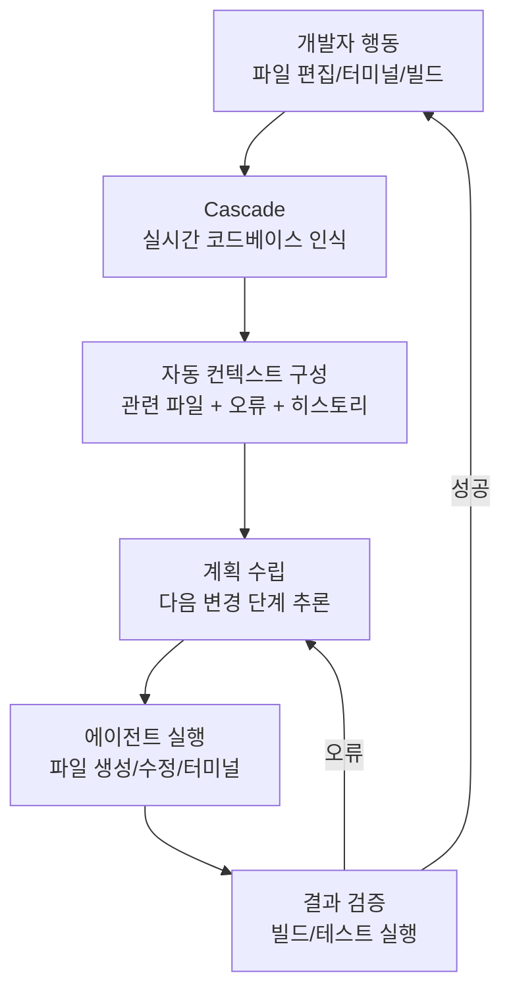
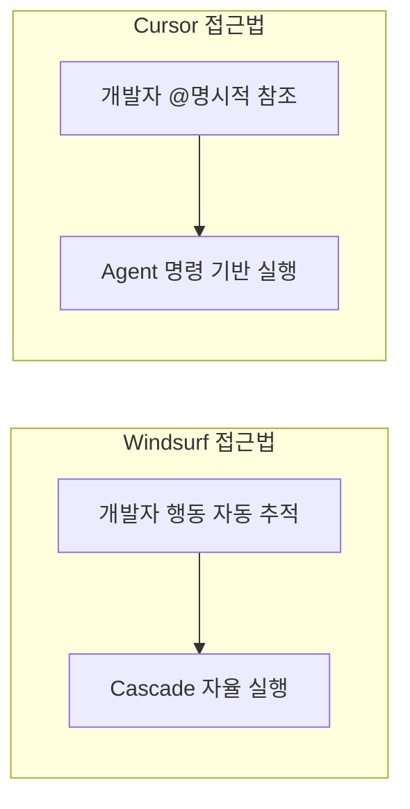

# Windsurf

Codeium이 개발한 에이전트 중심 AI IDE. 핵심 차별점은 **Cascade** 엔진으로, 개발자의 작업 흐름을 실시간으로 추적하고 코드베이스 전체를 인식하면서 여러 파일에 걸친 변경을 에이전트적으로 수행한다. 단순 코드 자동완성을 넘어 "개발자와 AI가 함께 흐르는" Flow 상태를 목표로 한다.

## 개요

| 항목 | 내용 |
|---|---|
| 이름 | Windsurf |
| 개발사 | Codeium |
| 기반 | VS Code 포크 (VS Code 호환 확장 지원) |
| 핵심 엔진 | Cascade (에이전트 시스템) |
| 지원 모델 | Claude (Anthropic), Codeium 자체 모델 등 |
| 가격 | 무료 플랜 + Pro ($15/월) |
| 주요 경쟁 | [[cursor|Cursor]], GitHub Copilot |

## Cascade 엔진

Windsurf의 핵심 기술. 일반적인 채팅형 AI 보조와 달리 Cascade는 개발자의 행동을 지속적으로 추적하여 컨텍스트를 자동으로 유지하고 에이전트 행동을 실행한다.



### Cascade의 두 모드

| 모드 | 동작 | 적합 상황 |
|---|---|---|
| Chat | 질문-응답, 코드 설명, 리팩토링 제안 | 빠른 조회, 짧은 변경 |
| Write | 에이전트 모드, 자율 다중 파일 편집 | 기능 구현, 버그 수정 |

## 핵심 기능

### Flows (작업 흐름)

Cascade는 개발자의 터미널 출력, 린터 오류, 파일 변경을 실시간으로 읽고 **다음 행동을 자율 결정**한다.

```
개발자: "결제 모듈을 Stripe API 기반으로 구현해줘"

Cascade Flow:
1. 코드베이스 분석 → 기존 결제 관련 파일 탐색
2. Stripe SDK 임포트 확인 → package.json 검토
3. src/payment/stripe.service.ts 생성
4. src/payment/payment.controller.ts 수정
5. .env.example에 STRIPE_SECRET_KEY 추가
6. npm run build → 타입 오류 발견 → 자동 수정
7. 변경사항 요약 보고
```

### Deep Codebase Understanding

Windsurf는 전체 리포지토리 인덱싱을 통해 수만 개 파일의 코드베이스에서도 관련 컨텍스트를 찾는다. 검색 결과를 단순 텍스트 매칭이 아닌 시맨틱 이해로 제공한다.

### 터미널 통합

Cascade는 터미널 명령을 직접 실행하고 출력을 컨텍스트로 활용한다.

```
빌드 실패 시:
  Cascade → 오류 메시지 자동 분석
         → 원인 파일/줄 특정
         → 자동 수정 적용
         → 재빌드 실행
```

## Windsurf vs Cursor

두 도구 모두 VS Code 포크 기반의 AI IDE이지만 설계 철학이 다르다.

| 항목 | Windsurf | [[cursor|Cursor]] |
|---|---|---|
| 개발사 | Codeium | Anysphere |
| 에이전트 엔진 | Cascade (자율 추적) | Composer / Agent 모드 |
| 컨텍스트 방식 | 자동 인식 (개발자 행동 추적) | 수동 @참조 + 자동 |
| 병렬 에이전트 | [교차검증 필요] | Cursor 3.0 /worktree |
| 가격 | Pro $15/월 | Pro $20/월 |
| 자체 모델 | Codeium 자체 모델 제공 | 없음 (외부 모델만) |
| 강점 | Flow 상태 자동화 | @컨텍스트 세밀 제어 |



## 자동완성: Supercomplete

Windsurf의 인라인 자동완성은 Codeium의 자체 모델 기반으로, 다음 편집 위치까지 예측하는 멀티라인 완성을 제공한다.

```python
# 개발자가 함수 시그니처만 입력하면
def process_payment(amount: float, currency: str) -> dict:
    # Supercomplete가 전체 구현 제안:
    if amount <= 0:
        raise ValueError("Amount must be positive")
    return {
        "status": "pending",
        "amount": amount,
        "currency": currency.upper(),
    }
```

## 실무 관점

Windsurf는 **Cascade의 자율 컨텍스트 추적**이 가장 큰 차별점이다. 개발자가 파일을 열고, 오류를 보고, 터미널을 실행하는 과정을 AI가 자동으로 인식하므로, 매번 컨텍스트를 명시적으로 지정할 필요가 없다. 이 "Flow" 경험은 [[cursor|Cursor]]의 `@컨텍스트` 시스템보다 인지 부하가 낮다. 반면 컨텍스트를 세밀하게 제어하고 싶은 개발자에게는 Cursor의 명시적 `@`참조 방식이 더 예측 가능하다. 가격 면에서 Windsurf가 더 저렴하며, Codeium 자체 모델을 사용하면 외부 API 비용 없이 자동완성을 사용할 수 있다.

## 관련 문서

- [[cursor|Cursor]] - Anysphere의 Agent 모드 AI IDE
- [[coding-agent|코딩 에이전트]] - AI 보조 개발 패턴과 주요 도구 비교
- [[claude-code|Claude Code]] - Anthropic 공식 터미널 기반 코딩 에이전트
