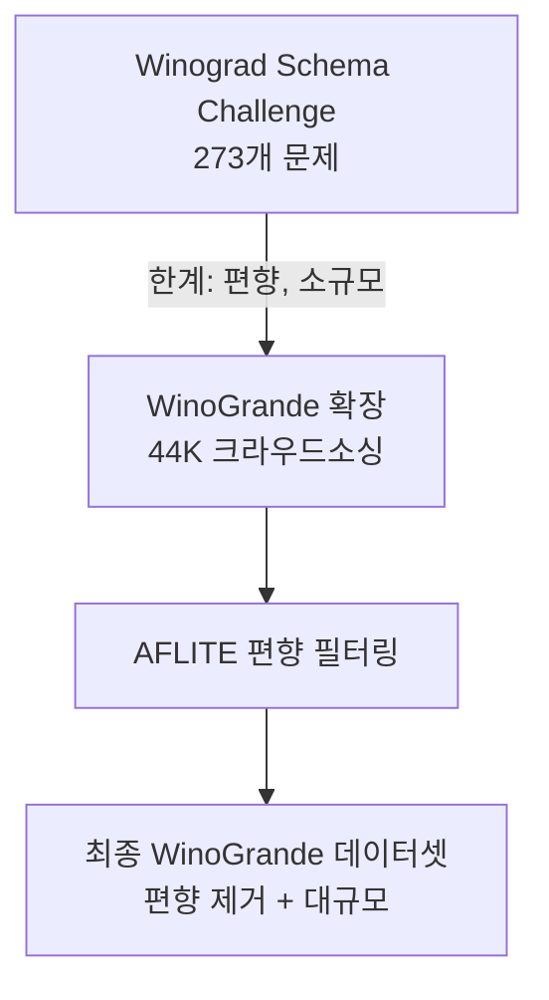
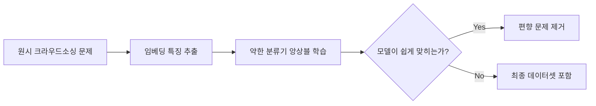

# WinoGrande 벤치마크

WinoGrande는 LLM의 **대명사 해결(pronoun resolution)** 능력을 기반으로 상식 추론을 평가하는 벤치마크다. 2019년 Sakaguchi 외 연구진이 AI2(Allen Institute for AI)에서 발표했으며, 기존 Winograd Schema Challenge(WSC)를 대규모로 확장한 후속 벤치마크다. 약 44,000개의 문제로 구성되어 있으며, 데이터 편향을 제거하기 위해 AFLITE(Adversarial Filtering LIghT Edition) 알고리즘을 도입했다.

## 배경: Winograd Schema Challenge와의 차이

**Winograd Schema Challenge(WSC)**는 2012년에 제안된 초기 대명사 해결 벤치마크다. 문제 수가 273개로 매우 적어 통계적 신뢰성이 낮았고, 모델들이 데이터셋 편향을 학습해 성능을 부풀릴 수 있었다.

WinoGrande는 이를 보완하기 위해 다음을 개선했다.

- 문제 수를 44K로 대폭 확대
- 크라우드소싱으로 인간이 작성한 다양한 문제 수집
- AFLITE 알고리즘으로 편향된 문제 제거



## 문제 구조

각 문제는 문장 속 밑줄 친 위치에 두 개의 선택지 중 하나를 채우는 형식이다.

**예시:**
> "Jake는 운동장에서 Tom을 쓰러뜨렸다. 왜냐하면 ___ 은 격투기를 훈련했기 때문이다."
> 선택지: (A) Jake / (B) Tom

여기서 정답을 맞히려면 "격투기 훈련 -> 상대를 쓰러뜨릴 가능성 증가"라는 상식적 인과관계를 이해해야 한다. 단순한 문법 패턴이나 동시 등장 빈도(co-occurrence)만으로는 풀 수 없다.

## AFLITE 필터링 알고리즘

AFLITE는 앙상블 약한 학습기(ensemble of weak learners)를 이용해 데이터셋 편향을 탐지하고 제거한다.



이 필터링을 통해 모델이 표면적 단서(lexical cues)나 통계적 편향에 의존하지 않고 실제 추론 능력으로 문제를 풀도록 강제한다.

## 평가 방법

HellaSwag와 마찬가지로 두 선택지 각각의 문장 로그 우도를 비교하는 방식으로 평가한다. [[evaluation-harness]]는 WinoGrande를 기본 태스크로 지원한다.

- 지표: 정확도(Accuracy, %)
- 인간 성능: 약 94.0%
- 무작위 베이스라인: 50% (이진 선택)
- GPT-3 (175B): 약 70.2%
- 최신 대형 모델: 80-90% 수준

## 데이터셋 분할

| 분할 | 크기 | 용도 |
|------|------|------|
| Train-XL | 40,398 | 최대 규모 학습 |
| Train-L | 5,120 | 중간 규모 |
| Train-M | 2,558 | 소규모 |
| Train-S | 640 | 퓨샷 세팅 |
| Train-XS | 160 | 극소 규모 |
| Dev | 1,267 | 검증 |
| Test | 1,767 | 평가 (레이블 비공개) |

다양한 학습 크기 분할은 **데이터 효율성** 연구에도 활용된다. 적은 데이터로 얼마나 좋은 성능을 낼 수 있는지 비교 실험이 가능하다.

## 다른 벤치마크와의 비교

| 특성 | WinoGrande | [[mmlu]] | HellaSwag |
|------|-----------|---------|-----------|
| 추론 유형 | 대명사 해결 | 지식 회상 | 활동 문장 완성 |
| 문제 형식 | 이진 선택 | 4지선다 | 4지선다 |
| 편향 제거 | AFLITE | 없음 | 적대적 필터링 |
| 문제 수 | ~44K | ~14K | ~70K |
| 포화 여부 | 진행 중 | 일부 포화 | 일부 포화 |

## 실무 평가 예시

```bash
lm_eval --model hf \
  --model_args pretrained=your-model \
  --tasks winogrande \
  --num_fewshot 5 \
  --output_path results/
```

5-shot 설정이 일반적이며, WinoGrande는 이진 분류이므로 퓨샷 예시가 성능에 미치는 영향이 상대적으로 크다.

## 한계

**문화적 편향**: 크라우드소싱 워커 대부분이 영어권 문화 배경이므로, 문화 특수적 상식이 반영된다.

**이진 선택의 한계**: 실제 언어 이해는 더 복잡한 추론을 요구하지만, WinoGrande는 두 선택지 간 비교로 단순화되어 있다.

**포화 접근**: GPT-4 계열 이후 모델들의 성능이 85% 이상으로 수렴하고 있어 추가 벤치마크로 보완이 필요하다.

## 관련 문서

- [[evaluation-harness]] - WinoGrande를 포함한 통합 평가 프레임워크
- [[mmlu]] - 광범위한 지식 평가 벤치마크
- [[hellaswag-benchmark]] - 활동 기반 문장 완성 평가
- [[bbh-benchmark]] - 어려운 추론 과제 모음
