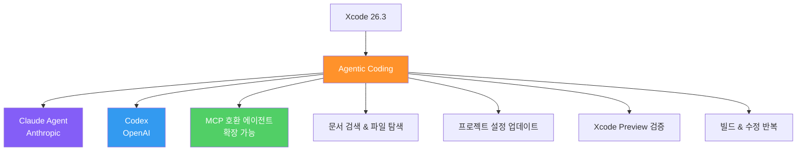
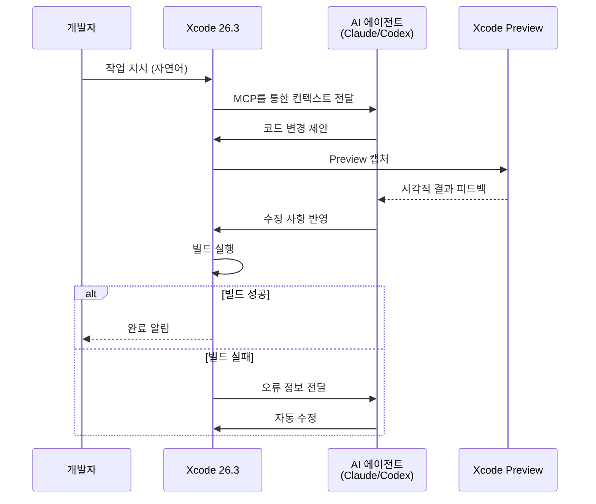
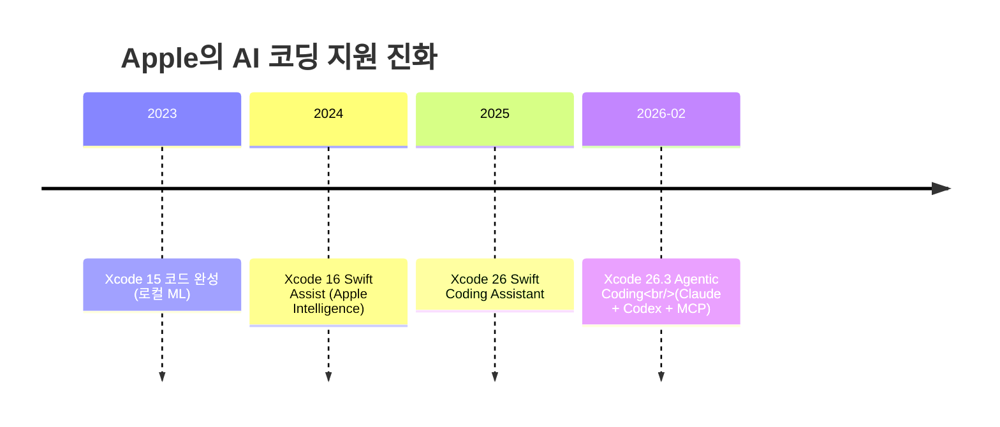

# Xcode 26.3 Agentic Coding

Apple이 2026년 2월 출시한 Xcode 26.3에서 도입한 에이전틱 코딩 기능. Anthropic의 Claude Agent와 OpenAI의 Codex를 Xcode에 네이티브 통합하고, MCP(Model Context Protocol)를 통해 호환되는 모든 에이전트와의 연결을 지원한다.

## 왜 지금 중요한가

Apple이라는 플랫폼 기업이 자사 IDE에 타사 AI 에이전트를 네이티브 통합한 첫 사례다. 특히 MCP 개방형 표준을 채택함으로써, Anthropic/OpenAI 외 다른 호환 에이전트도 Xcode와 통합될 수 있는 확장 가능한 구조를 만들었다. "모든 것을 자체 개발"하던 Apple의 AI 전략 전환을 상징한다.

## 핵심 기능

### 에이전트 자율 작업 범위
에이전트가 수행할 수 있는 작업:
- **문서 검색** -- Apple Developer Documentation, 프로젝트 내 파일 탐색
- **파일 구조 탐색** -- 프로젝트 트리 이해, 관련 코드 위치 파악
- **프로젝트 설정 업데이트** -- Build Settings, Info.plist, 의존성 구성 변경
- **Xcode Preview 검증** -- Preview 캡처를 통한 시각적 작업 확인
- **빌드 및 수정 반복** -- 컴파일 오류 감지 후 자동 수정 루프

### MCP 통합
Xcode 26.3는 MCP(Model Context Protocol) 개방형 표준을 통해 인터페이스를 공개했다. 이로써:
- Claude Agent, Codex 외 MCP 호환 에이전트도 연결 가능
- [[agentic-ai-foundation|AAIF]] 생태계의 도구와 자연스러운 통합
- 서드파티 개발자가 Xcode용 MCP 서버를 구축 가능

## 에이전트 작동 흐름

## 개발자 반응

출시 후 개발자 반응은 매우 긍정적이었다:
- Steve Troughton-Smith는 새 앱 개발과 **Objective-C에서 Swift로의 전체 리라이팅**을 최소한의 수동 입력으로 완료
- 코딩 입문자의 진입장벽을 낮추는 효과
- 숙련 개발자도 반복 작업 자동화로 생산성 향상

## Apple AI 전략의 전환점

### "Not Invented Here"에서 개방으로
Xcode 26.3는 Apple이 AI 영역에서 자체 개발 고집을 내려놓고, 외부 최고 수준의 에이전트를 네이티브 통합한 사례다:
- **Claude Agent** -- Anthropic의 에이전틱 코딩 역량 직접 통합
- **OpenAI Codex** -- OpenAI의 코드 생성/분석 역량 통합
- **MCP 개방** -- 특정 에이전트 종속 없이 생태계 전체에 개방

### 플랫폼 통합의 장점
Apple 생태계 특유의 통합 이점:
- Xcode Preview와의 실시간 시각 피드백 루프
- Apple Developer Documentation과의 직접 연동
- Swift/SwiftUI/UIKit 전문 컨텍스트 제공
- 빌드 시스템과의 네이티브 통합으로 오류 감지-수정 루프 자동화

## 출시 정보

| 항목 | 내용 |
|------|------|
| 릴리스 후보 공개 | 2026년 2월 3일 |
| 정식 출시 | 2026년 2월 26일 |
| 대상 | Apple Developer Program 회원 |
| 통합 에이전트 | Claude Agent (Anthropic), Codex (OpenAI) |
| 프로토콜 | Model Context Protocol (MCP) |

## 실무 관점

Xcode 26.3의 에이전틱 코딩은 IDE 통합 AI의 방향성을 보여준다:
- **에이전트 선택의 자유** -- MCP 덕분에 특정 에이전트에 종속되지 않음
- **시각적 검증 루프** -- Preview 통합으로 UI 작업의 에이전트 자율성 강화
- **빌드 피드백 루프** -- 컴파일 오류 자동 감지/수정으로 "끝까지 완수" 가능

## 관련 페이지

- [[agentic-ai-foundation|Agentic AI Foundation (AAIF)]] -- MCP 거버넌스 재단
- [[goose|Goose (Block)]] -- AAIF 산하 오픈소스 에이전트
- [[claude-opus-4-6|Claude Opus 4.6]] -- Xcode 통합 Claude의 기반 모델
- [[how-coding-agents-work|How Coding Agents Work]] -- 코딩 에이전트 작동 원리
- [[cursor-cloud-agents-and-parallel-worktree-agents|Cursor Cloud Agents]] -- 경쟁 IDE 에이전트

## 대표 레퍼런스

- [Xcode 26.3 unlocks the power of agentic coding -- Apple Newsroom](https://www.apple.com/newsroom/2026/02/xcode-26-point-3-unlocks-the-power-of-agentic-coding/)
- [Apple releases Xcode 26.3 with support for agentic coding -- 9to5Mac](https://9to5mac.com/2026/02/26/apple-releases-xcode-26-3-with-support-for-agentic-coding/)
- [Xcode moves into agentic coding with deeper OpenAI and Anthropic integrations -- TechCrunch](https://techcrunch.com/2026/02/03/xcode-moves-into-agentic-coding-with-deeper-openai-and-anthropic-integrations/)
