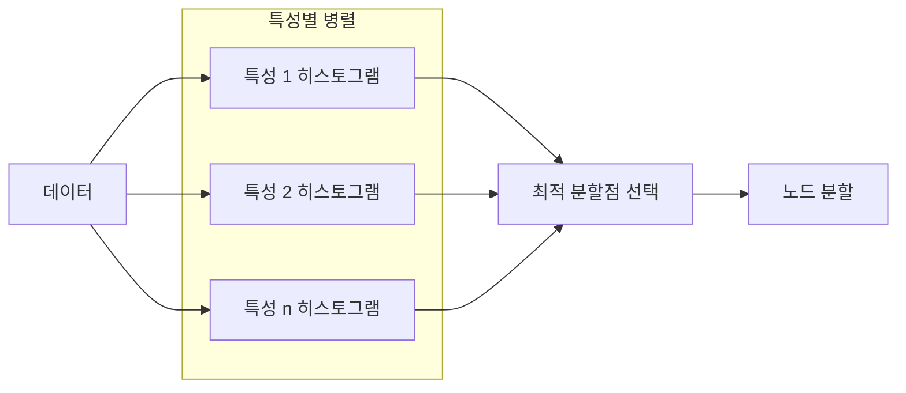

# XGBoost 내부 구조

XGBoost(eXtreme Gradient Boosting)는 Chen & Guestrin(2016)이 제안한 그래디언트 부스팅 구현체로, 경쟁 ML 대회에서 압도적인 지배력을 발휘하며 테이블 데이터의 표준 도구로 자리잡았다. 핵심 경쟁력은 **2차 근사(second-order approximation)** 기반의 목적함수 최적화와 **히스토그램 분할(histogram-based splitting)** 에 있다.

## 핵심 설계 원리

### 2차 테일러 근사 목적함수

XGBoost는 손실 함수를 2차 테일러 전개로 근사하여 각 트리의 구조를 분석적으로 최적화한다.

$$\mathcal{L}^{(t)} \approx \sum_{i=1}^{n} \left[ g_i f_t(x_i) + \frac{1}{2} h_i f_t^2(x_i) \right] + \Omega(f_t)$$

여기서 $g_i = \partial \hat{y}^{(t-1)} l(y_i, \hat{y}^{(t-1)})$는 1차 기울기(gradient), $h_i = \partial^2_{\hat{y}^{(t-1)}} l(y_i, \hat{y}^{(t-1)})$는 2차 기울기(hessian)다.

2차 정보를 활용하면 단순히 잔차(residual)를 맞추는 방식보다 곡률 정보를 반영한 더 정확한 분할 기준을 얻을 수 있다. 이것이 기존 GBDT(Gradient Boosted Decision Trees) 대비 XGBoost의 핵심 이론적 기여다.

### 정규화 항

$$\Omega(f) = \gamma T + \frac{1}{2}\lambda \sum_{j=1}^T w_j^2$$

- $T$: 리프 노드 수, $\gamma$: 리프 수에 대한 패널티
- $w_j$: 각 리프의 예측 점수, $\lambda$: L2 정규화 계수

이를 통해 트리 복잡도를 목적함수 안에서 직접 제어하므로, 별도의 사후 가지치기 없이도 과적합을 억제한다.

## 히스토그램 기반 분할

```mermaid
flowchart TD
    A[연속형 특성값] --> B[히스토그램 구간 생성\n예: 256 bins]
    B --> C[각 bin의 g/h 누적합 계산]
    C --> D[bin 경계를 후보 분할점으로 사용]
    D --> E[최적 분할점 탐색\nO(bins) per feature]
    E --> F[트리 노드 분할]
```

정확한 분위수 탐색(exact greedy)은 모든 값을 정렬해야 하므로 $O(n \log n)$ 비용이 든다. XGBoost는 **Approximate Greedy** 알고리즘을 도입해 데이터를 bin으로 양자화하고, bin 경계만을 후보 분할점으로 사용해 계산량을 $O(bins \times features)$로 줄인다.

Weighted Quantile Sketch를 사용해 hessian $h_i$를 가중치로 반영한 분위수를 구성하는 것이 특징이다. 이는 샘플의 불확실성에 비례한 bin 구성을 보장한다.

## 고급 기법

### Sparsity-aware Split

누락값(missing value)과 희소 특성(sparse feature)을 별도로 처리하는 분기 방향을 학습한다. 누락값이 있는 샘플을 왼쪽/오른쪽 자식 중 어느 쪽에 배치할지를 학습 과정에서 결정하므로, 사전 결측치 처리 없이도 성능을 유지한다.

### Column Subsampling

랜덤 포레스트에서 차용한 기법으로, 각 트리/레벨/노드마다 무작위로 특성 부분집합을 선택한다. 과적합 억제와 병렬 처리 가속 효과를 동시에 얻는다.

### Cache-aware Access

히스토그램 집계 시 메모리 접근 패턴을 최적화한다. 블록 단위로 데이터를 관리해 CPU 캐시 미스를 최소화하며, 이것이 "eXtreme"이라는 이름의 실제 근거다.

## 병렬화 전략



특성별 히스토그램 계산을 병렬화하므로 특성 수 $p$에 대한 확장성이 뛰어나다. 분산 학습은 AllReduce 패턴으로 히스토그램을 집계한다.

## LightGBM/CatBoost 대비 위치

| 특성 | XGBoost | [[xgboost-lightgbm|LightGBM]] |
|------|---------|---------|
| 트리 성장 방식 | Level-wise | Leaf-wise |
| 메모리 효율 | 중간 | 높음 |
| 속도 | 중간 | 빠름 |
| 범주형 처리 | 수동 인코딩 필요 | 기본 지원 |
| 2차 근사 | 기본 | 기본 |

[[decision-trees-random-forests]] 에서 배운 앙상블 개념의 가장 정교한 구현체 중 하나다. [[tabular-ml]] 에서 다루는 현대 테이블 학습 비교에서도 XGBoost는 일관된 강력한 기준선이다.

## 실무 하이퍼파라미터 가이드

- `n_estimators`: 부스팅 라운드 수, 조기 종료(early stopping)와 함께 튜닝
- `max_depth`: 3-8 범위, 깊을수록 과적합 위험
- `learning_rate`: 0.01-0.3, 낮을수록 n_estimators 증가 필요
- `subsample` / `colsample_bytree`: 0.6-0.9, 랜덤성 도입
- `min_child_weight`: hessian 합계 기반 리프 분할 조건 (L2 hessian 최소값)

## 관련 문서

- [[xgboost-lightgbm]] - XGBoost vs LightGBM 비교 분석
- [[decision-trees-random-forests]] - 기반이 되는 결정 트리 및 랜덤 포레스트 개념
- [[tabular-ml]] - 테이블 데이터 ML 전반
- [[catboost-ordered-boosting]] - 범주형 특화 부스팅
- [[shap-feature-importance]] - XGBoost 예측 해석을 위한 SHAP
