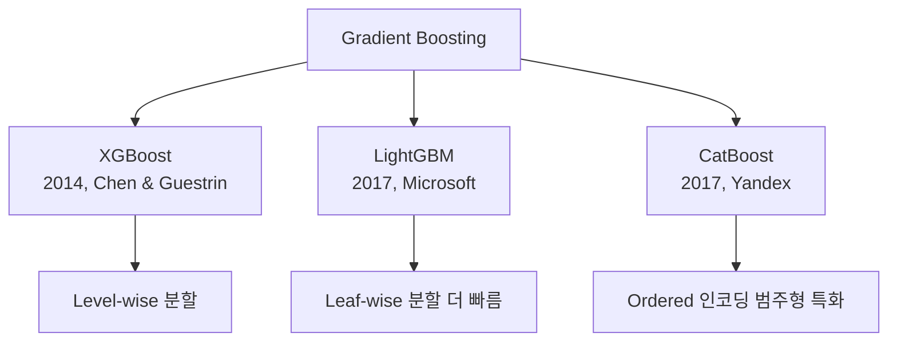

# XGBoost / LightGBM

[[tabular-ml|테이블 데이터 ML]]의 양대 GBDT(Gradient Boosted Decision Trees) 프레임워크. Kaggle 대회의 절대 강자이며, 정형 데이터에서 딥러닝을 지속적으로 능가하고 있다.

## 비교

| 측면 | XGBoost | LightGBM | CatBoost |
|------|---------|----------|----------|
| 트리 성장 | Level-wise | **Leaf-wise** | Ordered |
| 속도 | 기준 | **2-10x 빠름** | 중간 |
| 범주형 처리 | 원핫 인코딩 | 네이티브 | **최고** |
| GPU 지원 | 있음 | 있음 | 있음 |
| 과적합 제어 | 정규화 | 바이닝 | 난수 순열 |

## 왜 아직도 강한가

1. **축 정렬 분할**: 테이블 데이터의 직교적 특성 관계에 최적
2. **특성 중요도**: 해석 가능한 분할 기반 중요도 내장
3. **결측치 처리**: 네이티브 결측치 처리
4. **앙상블 효과**: 수백 개 약한 학습기의 부스팅

## 관련 문서

- [[tabular-ml]] -- 테이블 데이터 ML
- [[decision-trees-random-forests]] -- 결정 트리와 랜덤 포레스트
- [[ensemble-methods]] -- 앙상블 방법론
