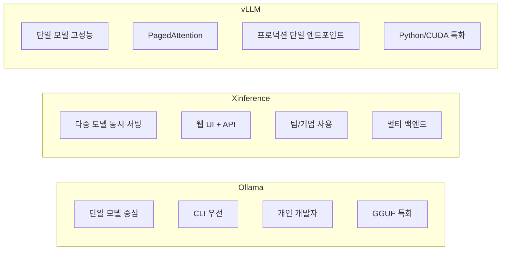
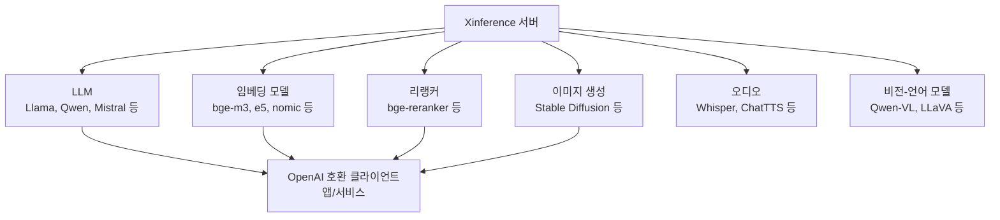
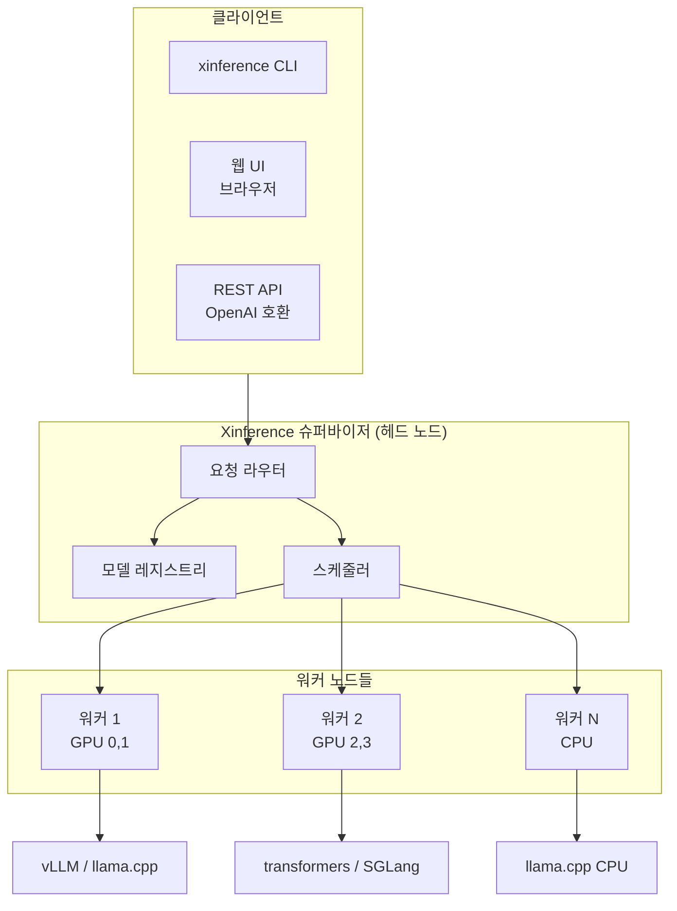

# Xinference - 다중 모델 동시 추론 서버

## 정체성

Xinference(Xorbits Inference)는 xorbitsai가 개발한 오픈소스 분산 추론 프레임워크다. 단일 서버 또는 클러스터에서 LLM(대형 언어 모델), 임베딩 모델, 이미지 생성 모델, 멀티모달 모델을 **동시에** 서빙할 수 있으며 OpenAI API와 호환되는 인터페이스를 제공한다. [[ollama|Ollama]]가 단순성을 지향한다면, Xinference는 다중 모델 동시 운용과 프로덕션 분산 배포를 지향한다.

| 속성 | 값 |
|------|-----|
| 조직 | Xorbits AI (xorbitsai) |
| 라이선스 | Apache-2.0 |
| 언어 | Python |
| 공식 문서 | inference.readthedocs.io |
| PyPI | `xinference` |
| 백엔드 | GGUF(llama.cpp), Transformers, vLLM, MLX, SGLang |

---

## Ollama, vLLM과의 포지셔닝



| 항목 | Ollama | Xinference | vLLM |
|------|--------|------------|------|
| 다중 모델 동시 서빙 | 제한적 | 네이티브 지원 | 어렵다 |
| 웹 UI | 없음 | 있음 | 없음 |
| 임베딩 모델 서빙 | 기본 지원 | 완전 지원 | 별도 설정 |
| 이미지/TTS 서빙 | 없음 | 지원 | 없음 |
| 분산 클러스터 | 없음 | 지원 | 제한적 |
| 설치 난이도 | 매우 쉬움 | 보통 | 보통 |
| GPU 활용 | 중간 | 높음 | 최고 |

---

## 핵심 기능

### 다중 모델 유형 지원

Xinference는 다양한 모델 유형을 단일 인프라에서 관리한다:



이 구조는 [[rag|RAG]] 파이프라인 구축 시 특히 유용하다. LLM, 임베딩, 리랭커를 모두 Xinference 하나로 서빙하면 벡터 DB와의 통합이 단순해진다.

### 멀티 백엔드 지원

모델마다 최적의 추론 백엔드를 선택할 수 있다:

| 백엔드 | 특징 | 적합한 경우 |
|--------|------|------------|
| `llama.cpp` | GGUF 양자화, CPU/GPU 혼합 | 메모리 제한, 양자화 모델 |
| `transformers` | HuggingFace 호환성 최고 | 실험, 커스텀 모델 |
| `vllm` | 고처리량, PagedAttention | 프로덕션 고성능 |
| `mlx` | Apple Silicon 최적화 | macOS M1/M2/M3 |
| `sglang` | 구조적 생성 최적화 | JSON 출력, 배치 추론 |

### OpenAI API 호환

Xinference는 `/v1/chat/completions`, `/v1/embeddings`, `/v1/images/generations` 등 OpenAI API 엔드포인트를 그대로 구현한다. 기존 OpenAI 클라이언트 코드에서 `base_url`만 바꾸면 된다.

```python
from openai import OpenAI

client = OpenAI(
    api_key="not-needed",  # 로컬이면 임의 값
    base_url="http://localhost:9997/v1"
)

# LLM 호출
response = client.chat.completions.create(
    model="qwen2.5-instruct",
    messages=[{"role": "user", "content": "안녕하세요"}]
)

# 임베딩 호출
embeddings = client.embeddings.create(
    model="bge-m3",
    input=["검색할 텍스트"]
)
```

---

## 아키텍처



분산 모드에서 Xinference는 Supervisor-Worker 구조로 동작한다. 슈퍼바이저가 모델 레지스트리를 관리하고 요청을 적절한 워커로 라우팅한다.

---

## 실무 사용 가이드

### 설치

```bash
# 기본 설치
pip install xinference

# GPU 지원 (CUDA)
pip install xinference[all]

# 특정 백엔드만
pip install xinference[transformers]  # HuggingFace
pip install "xinference[vllm]"         # vLLM 백엔드
```

### 서버 시작

```bash
# 로컬 단일 서버
xinference-local --host 0.0.0.0 --port 9997

# 분산 클러스터 - 슈퍼바이저
xinference-supervisor --host 0.0.0.0 --port 9997

# 분산 클러스터 - 워커
xinference-worker --supervisor-address "supervisor-host:9997"
```

### 모델 배포

```bash
# CLI로 LLM 시작
xinference launch --model-name qwen2.5-instruct --model-format pytorch --size-in-billions 7

# CLI로 임베딩 모델 시작
xinference launch --model-name bge-m3 --model-type embedding

# 특정 백엔드 지정
xinference launch \
  --model-name llama-3.2-instruct \
  --model-format ggufv2 \
  --quantization Q4_K_M \
  --n-gpu auto \
  --backend llama-cpp
```

### Python SDK로 관리

```python
from xinference.client import Client

client = Client("http://localhost:9997")

# 모델 목록 조회
models = client.list_models()

# LLM 시작
model_uid = client.launch_model(
    model_name="qwen2.5-instruct",
    model_type="LLM",
    model_format="pytorch",
    size_in_billions=7,
    quantization="4-bit",
    n_gpu=1,
)

# 추론
model = client.get_model(model_uid)
result = model.chat(
    messages=[{"role": "user", "content": "파이썬으로 퀵소트 구현해줘"}]
)

# 모델 종료
client.terminate_model(model_uid)
```

### RAG 파이프라인 통합

```python
from openai import OpenAI

# 단일 Xinference 서버로 LLM + 임베딩 동시 사용
xinf = OpenAI(api_key="dummy", base_url="http://localhost:9997/v1")

# 임베딩 생성
def embed_text(texts: list[str]) -> list[list[float]]:
    resp = xinf.embeddings.create(model="bge-m3", input=texts)
    return [item.embedding for item in resp.data]

# LLM 응답 생성
def generate_answer(context: str, question: str) -> str:
    resp = xinf.chat.completions.create(
        model="qwen2.5-instruct",
        messages=[
            {"role": "system", "content": f"컨텍스트:\n{context}"},
            {"role": "user", "content": question},
        ]
    )
    return resp.choices[0].message.content
```

---

## 웹 UI

Xinference는 기본 포트(9997)에서 웹 UI를 제공한다. 브라우저에서 다음을 할 수 있다:

- 사용 가능한 모델 목록 탐색
- 원클릭으로 모델 배포/종료
- 실시간 모델 상태 모니터링
- 채팅 인터페이스로 즉시 테스트

---

## 한계 / 트레이드오프

### Ollama 대비 복잡성

개인 개발자가 모델 하나를 빠르게 실험하려면 Ollama가 훨씬 간단하다. Xinference는 다중 모델, 팀 공유, 분산 배포가 필요할 때 가치가 생긴다.

### vLLM 대비 처리량

단일 모델의 최대 처리량은 vLLM이 더 높다. Xinference에서 vLLM을 백엔드로 사용할 수 있지만, 최대 성능을 원한다면 vLLM 직접 사용이 유리하다.

### 문서 품질

2026년 기준 영어 문서 품질은 vLLM에 비해 낮다. 특히 분산 클러스터 설정 문서에 빈 곳이 많다.

### 커뮤니티 규모

vLLM, Ollama에 비해 커뮤니티가 작다. 버그 수정 속도가 느릴 수 있다.

---

## 왜 중요한가

Xinference는 다음 시나리오에서 최선의 선택이다:

1. **팀 공유 AI 인프라**: 한 서버에서 여러 팀원이 다양한 모델을 동시에 사용해야 할 때
2. **RAG 파이프라인**: LLM + 임베딩 + 리랭커를 단일 서버에서 관리할 때
3. **모델 실험**: 여러 모델을 동시에 띄우고 비교 테스트할 때
4. **Apple Silicon**: MLX 백엔드로 macOS에서 고성능 추론이 필요할 때
5. **자체 호스팅 표준화**: OpenAI API 호환으로 모든 클라이언트 코드를 재사용할 때

---

## 관련 문서

- [[vllm]] - 단일 모델 고성능 추론 (Xinference의 vLLM 백엔드)
- [[text-generation-inference-tgi]] - HuggingFace의 TGI 서버
- [[ollama]] - 단순성 우선 로컬 LLM 서버
- [[modal-com-runtime]] - 클라우드 GPU 서버리스 대안
