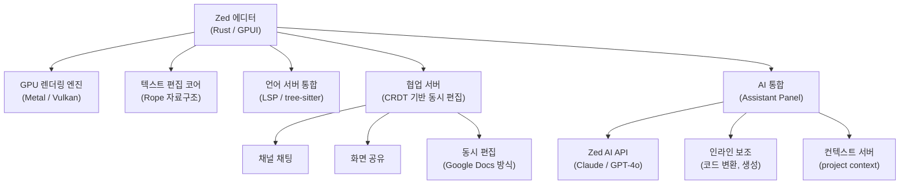
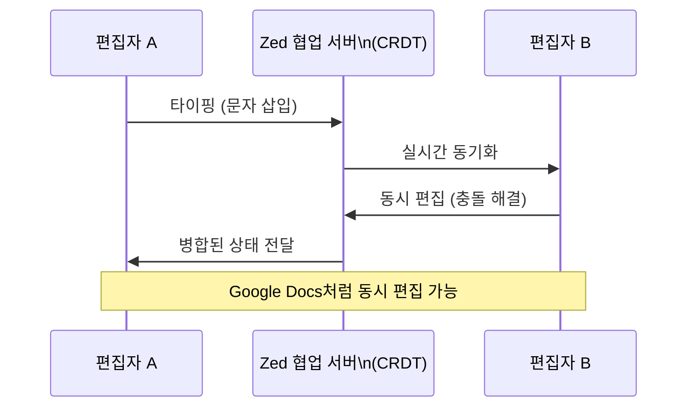
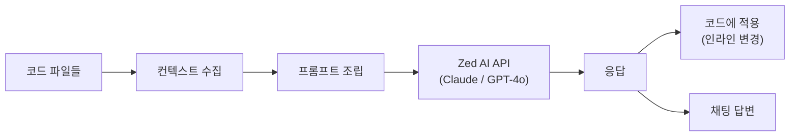
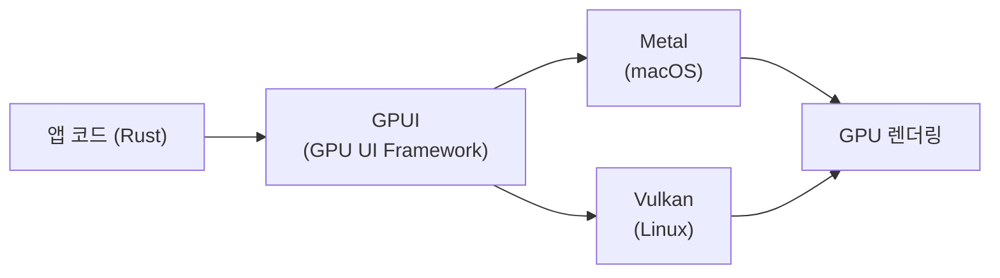

# Zed AI 에디터

## 정체성

| 항목 | 내용 |
|------|------|
| 이름 | Zed |
| 개발사 | Zed Industries |
| 창업자 | Nathan Sobo, Max Brunsfeld, Antonio Scandurra (Atom/GitHub 출신) |
| 라이선스 | GPL-3.0 (에디터), AGPL-3.0 (협업 서버) |
| GitHub | [zed-industries/zed](https://github.com/zed-industries/zed) |
| 웹사이트 | zed.dev |
| 언어/스택 | Rust (GPUI 프레임워크) |
| 플랫폼 | macOS (정식), Linux (베타), Windows (개발 중) |
| 출시 | 2024년 1월 (오픈소스 공개) |
| 가격 | 무료 (AI 기능은 Pro 플랜 $20/월) |

Zed는 **Rust로 작성된 고성능 AI 우선 코드 에디터**다. Atom을 만들었던 GitHub 팀 멤버들이 설립한 Zed Industries가 개발하며, GPU 가속 렌더링과 실시간 다중 사용자 협업을 핵심 차별점으로 삼는다. VS Code 포크 계열(Cursor, Windsurf)과 달리 **처음부터 Rust로 새로 작성**되었기 때문에 응답성과 메모리 효율이 근본적으로 다르다.

---

## 아키텍처 개요



Zed의 핵심은 **GPUI(GPU UI Framework)**라는 자체 UI 렌더링 레이어다. Electron/WebView 기반이 아닌 GPU 직접 렌더링을 통해 대용량 파일과 빠른 타이핑에서도 지연 없는 편집 경험을 제공한다.

---

## 핵심 기능

### 1. GPU 가속 렌더링

Zed의 가장 근본적인 차별점은 렌더링 방식이다:

| 에디터 | 렌더링 방식 | 프레임워크 |
|--------|-------------|----------|
| VS Code / Cursor | Electron (Chromium) | HTML/CSS/JS |
| Neovim | 터미널 TUI | C |
| Zed | GPU 네이티브 (GPUI) | Rust + Metal/Vulkan |

- 키 입력부터 화면 반영까지 **1ms 미만** 지연 목표
- 100만 줄 파일도 스크롤 지연 없음
- 메모리 사용량이 VS Code의 1/3-1/5 수준

### 2. 실시간 협업



- **동시 편집(co-editing)**: 같은 파일을 여러 사람이 동시에 편집
- **팔로우 모드**: 다른 사용자의 커서를 따라가며 페어 프로그래밍
- **채널**: 텍스트 채팅 + 화면 공유를 에디터 안에서 처리
- CRDT(Conflict-free Replicated Data Type)로 충돌 없는 동기화

### 3. AI Assistant Panel

Zed AI는 에디터 우측 패널에서 동작한다:



- **`/` 슬래시 명령**: `/edit`, `/explain`, `/generate` 등 빠른 AI 명령
- **인라인 변환**: 선택 영역을 직접 변환 (`Ctrl+Enter`)
- **컨텍스트 핀**: 특정 파일/함수를 AI 대화에 고정 참조
- **프로젝트 컨텍스트**: 전체 프로젝트 구조를 LLM에 제공하는 컨텍스트 서버

### 4. tree-sitter 기반 구문 분석

- 모든 편집 중 실시간 AST(Abstract Syntax Tree) 파싱
- LSP(Language Server Protocol) 없이도 정확한 구문 하이라이팅
- Sublime Text 영감을 받은 **멀티 커서** 및 구문 인식 선택

### 5. Vim 모드 / 키바인딩

Neovim 사용자를 위한 완전한 Vim 모드를 내장. 별도 플러그인 없이 normal/insert/visual 모드 지원.

---

## Zed vs 경쟁 에디터 비교

| 항목 | Zed | VS Code | [[cursor|Cursor]] | Neovim |
|------|-----|---------|--------|--------|
| 기반 | Rust (GPUI) | Electron | Electron (VS Code 포크) | C |
| 렌더링 | GPU 네이티브 | Chromium | Chromium | TUI |
| 메모리 | 매우 낮음 | 높음 | 높음 | 매우 낮음 |
| 응답성 | 매우 빠름 | 보통 | 보통 | 빠름 |
| AI 통합 | 네이티브 | 확장 (Copilot 등) | 네이티브 (핵심) | 플러그인 |
| 협업 | 네이티브 | LiveShare (확장) | 없음 | 없음 |
| 플러그인 생태계 | 성장 중 | 방대 | VS Code 호환 | 방대 |
| 안정성 | 베타 수준 | 안정 | 안정 | 안정 |

---

## Sublime Text 영향

Zed는 Sublime Text에서 많은 UX 패턴을 가져왔다:

- **커맨드 팔레트**: `Cmd+Shift+P`로 모든 기능 접근
- **멀티 커서**: `Cmd+D`로 동일 단어 다중 선택
- **미니맵**: 파일 전체 조감도
- **분할 편집**: 여러 파일을 나란히 편집
- **퍼지 파일 오프너**: `Cmd+P`로 파일명 퍼지 검색

---

## 실무 사용 가이드

### 설치 (macOS)

```bash
# Homebrew
brew install zed
# 또는 공식 사이트에서 직접 다운로드
```

### 주요 키바인딩

| 단축키 | 기능 |
|--------|------|
| `Cmd+Shift+P` | 커맨드 팔레트 |
| `Cmd+P` | 파일 검색 |
| `Ctrl+Enter` | AI 인라인 변환 |
| `Cmd+Shift+A` | AI Assistant 패널 토글 |
| `Cmd+Shift+J` | 프로젝트 채널 열기 |
| `Ctrl+G` | 줄 번호로 이동 |

### AI 기능 활성화

```json
// ~/.config/zed/settings.json
{
  "assistant": {
    "default_model": {
      "provider": "anthropic",
      "model": "claude-sonnet-4-5"
    },
    "version": "2"
  },
  "features": {
    "inline_completion_provider": "zed-ai"
  }
}
```

### 언어 서버 설정

Zed는 언어별 LSP를 자동으로 설치하지 않는다. 직접 설정 필요:

```json
{
  "languages": {
    "Python": {
      "language_servers": ["pyright", "ruff"],
      "formatter": "language_server"
    },
    "TypeScript": {
      "language_servers": ["typescript-language-server"],
      "formatter": "prettier"
    }
  }
}
```

---

## GPUI 프레임워크

Zed의 독자적 UI 프레임워크 GPUI는 에디터 자체뿐 아니라 다른 앱 개발에도 사용 가능하도록 공개되었다.



- React의 선언적 UI 패러다임을 Rust로 구현
- 상태 관리, 이벤트 처리, 레이아웃 엔진 포함
- 60fps 이상의 애니메이션 보장

---

## 한계 / 트레이드오프

| 항목 | 내용 |
|------|------|
| 플러그인 생태계 | VS Code 대비 확장 수가 매우 적음 (2026년 기준 수백 개 수준) |
| Windows 미지원 | 공식 Windows 빌드 미출시 (2026년 목표) |
| AI 기능 성숙도 | Cursor Agent 모드 대비 자율 에이전트 기능 약함 |
| 문서화 | 커뮤니티와 공식 문서 모두 VS Code 대비 부족 |
| 협업 서버 의존 | Zed 협업 기능은 Zed Industries 서버 필요 (프라이버시 우려) |
| 언어 지원 | 인기 언어는 좋으나 틈새 언어 LSP 설정이 복잡함 |

---

## 로드맵과 전망

Zed Industries는 Zed를 단순 에디터가 아닌 **AI 코딩 플랫폼**으로 발전시키는 것을 목표로 한다:

- **Agentic Editing**: 에이전트가 직접 코드를 수정하는 완전 자율 모드 (개발 중)
- **Context Server Protocol**: 프로젝트 컨텍스트를 외부 AI에 제공하는 표준 프로토콜
- **확장 에코시스템 확대**: WASM 기반 확장으로 다양한 언어로 플러그인 개발 가능

---

## 관련 문서

- [[continue-vscode-extension]] - VS Code/JetBrains용 오픈소스 AI 보조
- [[cursor]] - VS Code 포크 기반 AI 에디터
- [[cline-claude-coder]] - VS Code용 오픈소스 Claude 코딩 에이전트
- [[coding-agents-landscape]] - AI 코딩 도구 전체 지형도
- [[claude-code]] - CLI 기반 코딩 에이전트
