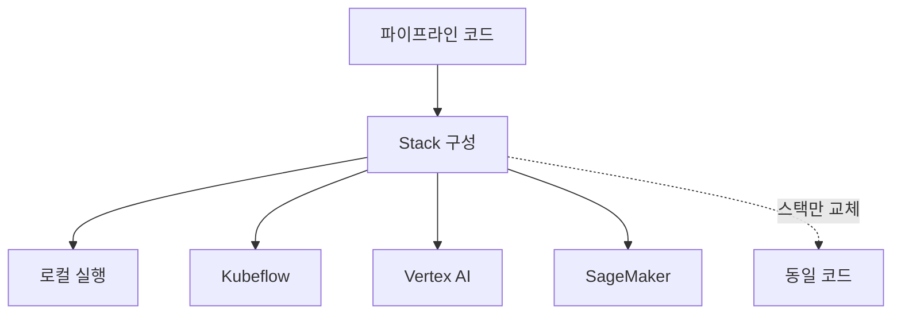

# ZenML

멀티 오케스트레이터 지원 재현 가능 ML 파이프라인 오픈소스 프레임워크. Airflow, Kubeflow, Vertex AI, SageMaker 등 다양한 백엔드에서 동일한 파이프라인 코드를 실행할 수 있다.

## 핵심 설계

**Stack** = 오케스트레이터 + 아티팩트 스토어 + 컨테이너 레지스트리 + 메타데이터 스토어의 조합. 스택만 바꾸면 로컬 개발에서 클라우드 프로덕션으로 무변경 배포 가능.

## [[mlflow|MLflow]]와의 차이

| 측면 | MLflow | ZenML |
|------|--------|-------|
| 초점 | 실험 추적, 모델 레지스트리 | 파이프라인 오케스트레이션 |
| 오케스트레이터 | 자체 (제한적) | 플러그인 (10+ 백엔드) |
| 관계 | ZenML이 MLflow를 통합 사용 | MLflow를 스택 컴포넌트로 포함 가능 |

## 관련 문서
- [[metaflow]] -- Metaflow (Netflix ML 워크플로우)

- [[mlflow]] -- MLflow
- [[kubeflow]] -- Kubeflow
- [[experiment-tracking]] -- 실험 추적
- [[docker-for-ml]] -- Docker for ML
