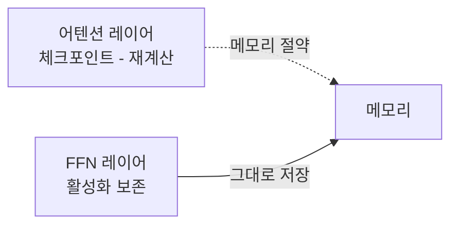
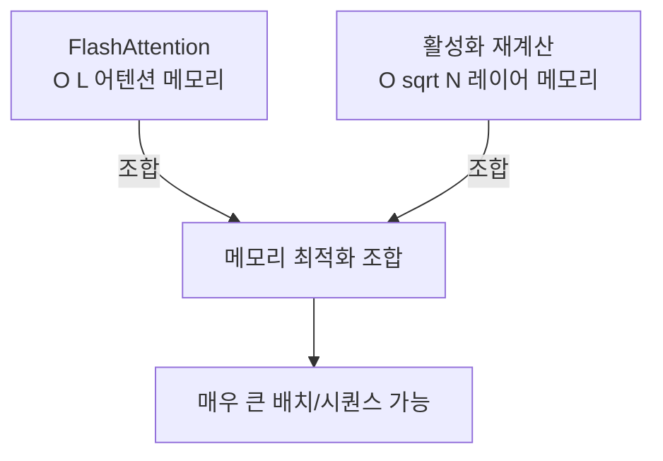

# 활성화 재계산 (Activation Recomputation / Gradient Checkpointing)

## 핵심 개념

**활성화 재계산(Activation Recomputation)**은 순방향(forward) 계산 시 중간 활성화 값을 메모리에 저장하지 않고, 역방향(backward) 계산 시 필요한 시점에 해당 레이어를 다시 실행하여 활성화를 복원하는 기법이다. Chen et al. 2016년 논문 "Training Deep Nets with Sublinear Memory Cost"에서 체계화되었으며, PyTorch에서는 **Gradient Checkpointing**으로 널리 알려져 있다.

대규모 언어 모델 학습에서 메모리 병목은 대부분 활성화 저장에서 발생한다. 가중치 크기보다 배치 × 시퀀스 길이 × 레이어 수에 비례하는 활성화가 더 큰 문제다.

## 왜 활성화가 메모리를 많이 쓰는가

역전파(Backpropagation)는 그래디언트 계산을 위해 순방향의 중간 결과가 필요하다.


$N$개 레이어의 경우 메모리는 $O(N)$으로 선형 증가한다. GPT-3(96레이어) 같은 모델에서 이 비용이 수십 GB에 달한다.

## 활성화 재계산 원리


핵심 트레이드오프:
- **메모리**: $O(N)$ → $O(\sqrt{N})$ (균등 체크포인트 배치 시)
- **계산량**: 순방향 패스를 약 1.33배 더 수행 (전체 학습 시간 약 33% 증가)

## 체크포인팅 전략 비교

| 전략 | 메모리 절감 | 재계산 비용 | 사용 상황 |
|------|------------|------------|----------|
| **균등 체크포인팅** | $O(\sqrt{N})$ | 중간 | 일반적 사용, Chen 2016 기본 |
| **선택적 체크포인팅** | 중간 | 낮음 | 비싼 연산만 선택 |
| **전체 재계산** | $O(1)$ 활성화 | 2× 순방향 | 극단적 메모리 절약 |
| **없음 (표준)** | 없음 | 없음 | 메모리 여유 있을 때 |

### 선택적 체크포인팅: 어텐션 레이어

트랜스포머에서 **어텐션 레이어**는 특히 메모리 소비가 크다. 시퀀스 길이 $L$에 대해 $O(L^2)$ 어텐션 행렬을 저장해야 하기 때문이다. 선택적 체크포인팅은 어텐션 레이어는 재계산하고, 상대적으로 저렴한 FFN 레이어는 활성화를 보존하는 방식이다.



## PyTorch 구현

`torch.utils.checkpoint.checkpoint`가 공식 API다.

```python
import torch
from torch.utils.checkpoint import checkpoint

class TransformerLayer(torch.nn.Module):
    def forward(self, x):
        # 체크포인팅 적용: 이 레이어의 활성화를 저장하지 않음
        x = checkpoint(self.attention, x, use_reentrant=False)
        x = checkpoint(self.ffn, x, use_reentrant=False)
        return x
```

- `use_reentrant=False`: PyTorch 2.0+ 권장 모드. 더 안정적이고 커스텀 autograd와 호환
- `use_reentrant=True`: 구 API, 일부 케이스에서 그래디언트 오류 발생 가능

### 시퀀스 레벨 체크포인팅

긴 시퀀스를 여러 청크로 나눠 각 청크별로 재계산:

```python
# 시퀀스를 n_chunks로 분할하여 각 청크를 독립적으로 처리
from torch.utils.checkpoint import checkpoint_sequential

output = checkpoint_sequential(layers, n_chunks, input)
```

## DeepSpeed와의 통합

DeepSpeed ZeRO 학습에서 활성화 재계산은 `activation_checkpointing` 설정으로 활성화된다.

```json
{
  "activation_checkpointing": {
    "partition_activations": true,
    "cpu_checkpointing": true,
    "contiguous_memory_optimization": false,
    "number_checkpoints": null,
    "synchronize_checkpoint_boundary": false,
    "profile": false
  }
}
```

- `partition_activations`: 활성화를 데이터 병렬 랭크들 사이에 분산
- `cpu_checkpointing`: 체크포인트를 GPU 대신 CPU 메모리에 저장

## FlashAttention과의 관계

**FlashAttention**은 IO-aware 어텐션 알고리즘으로, 어텐션 행렬을 SRAM에서 타일 단위로 처리하여 $O(L^2)$ 메모리를 $O(L)$로 줄인다. 이는 활성화 재계산과 **직교적(orthogonal)**으로 조합 가능하다.



FlashAttention은 재계산 없이도 어텐션 내부 메모리를 줄이지만, 레이어 간 활성화 저장 문제는 별도 처리가 필요하다.

## CPU/NVMe 오프로딩과의 차이

| 기법 | 원리 | 장점 | 단점 |
|------|------|------|------|
| **활성화 재계산** | 저장 안 하고 재계산 | 추가 하드웨어 불필요 | 계산 비용 ~33% 증가 |
| **CPU 오프로딩** | GPU→CPU로 이동 후 필요 시 복귀 | 재계산 없음 | PCIe 대역폭 병목 |
| **NVMe 오프로딩** | SSD에 저장 | 대용량 저장 | 매우 느린 IO |

대부분의 실제 학습에서는 활성화 재계산이 오프로딩보다 선호된다. PCIe 전송 지연이 재계산 비용보다 크기 때문이다.

## 대규모 LLM 학습에서의 활용

Megatron-LM, GPT-NeoX, LLaMA 학습 스크립트는 기본적으로 활성화 재계산을 사용한다.

- **LLaMA 학습**: 기본적으로 full activation checkpointing 활성화
- **Megatron-LM**: `--recompute-activations` 또는 `--recompute-granularity` 옵션
- **배치 크기 확대**: 활성화 재계산 없이 불가능했던 대형 배치 학습 가능

실제로 A100 80GB에서 GPT-3 학습 시, 활성화 재계산 없이는 배치 크기 1도 불가능하고, 재계산 적용 시 수십 개 시퀀스를 처리할 수 있다.

## 관련 문서
- [[gradient-accumulation]] -- 그래디언트 누적 (Gradient Accumulation)
- [[quantization-aware-training]] -- 양자화 인식 학습 (QAT)

- [[gradient-checkpointing]] - PyTorch gradient checkpointing API 상세
- [[flashattention-4-paper|flashattention]] - IO-aware 어텐션으로 어텐션 메모리 감소
- [[deepspeed-zero]] - ZeRO 파티셔닝과 활성화 재계산 통합
- [[mixed-precision-training]] - FP16/BF16 학습과 메모리 최적화 조합
- [[memory-efficient-training]] - 대규모 학습의 전반적 메모리 최적화 기법
