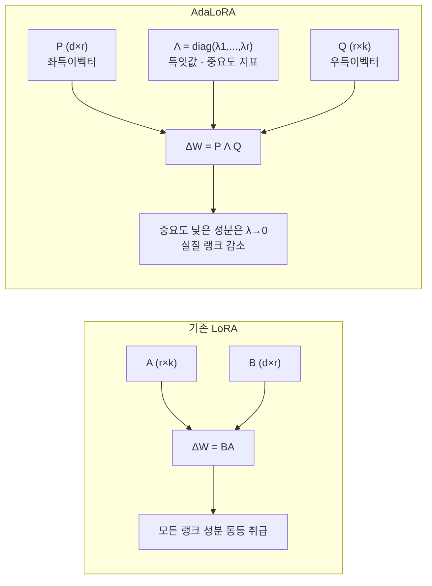
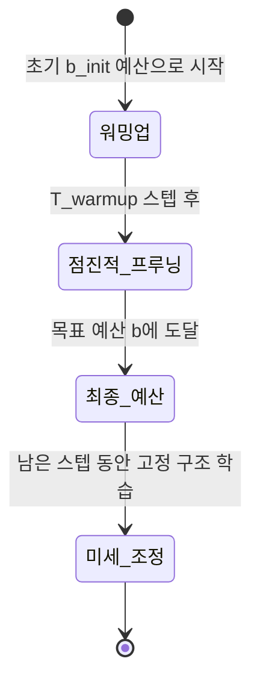

# AdaLoRA - 적응적 랭크 할당 LoRA (Adaptive Low-Rank Adaptation)

## 배경 및 동기

LoRA는 모든 타겟 가중치 행렬에 **동일한 랭크(rank) r**을 할당한다. 그런데 트랜스포머 모델의 각 레이어, 각 가중치 행렬이 파인튜닝에서 동등하게 중요하지는 않다. 일부 레이어는 더 많은 적응이 필요하고, 일부는 거의 변화가 불필요하다.

**AdaLoRA(Zhang et al., 2023)**는 다음 질문에서 출발한다:
> "제한된 파라미터 예산을 어떻게 중요한 가중치 행렬에 집중 투자할 수 있을까?"

핵심 아이디어: SVD(특잇값 분해)를 사용해 각 업데이트 행렬의 **중요도를 특잇값으로 측정**하고, 덜 중요한 성분의 랭크를 동적으로 줄여 파라미터를 재배분한다.

## SVD 기반 저랭크 파라미터화

### 가중치 분해 방식

LoRA: $\Delta W = BA$ ($B \in \mathbb{R}^{d \times r}$, $A \in \mathbb{R}^{r \times k}$)

AdaLoRA: $\Delta W = P \Lambda Q$ 형태로 SVD를 직접 모델링한다.

$$\Delta W_i = P_i \Lambda_i Q_i$$

- $P_i \in \mathbb{R}^{d \times r}$: 좌측 특이벡터 행렬 (직교)
- $\Lambda_i = \text{diag}(\lambda_{i,1}, \ldots, \lambda_{i,r})$: 특잇값 대각 행렬
- $Q_i \in \mathbb{R}^{r \times k}$: 우측 특이벡터 행렬 (직교)

이 파라미터화가 LoRA의 $BA$와 다른 점은 **각 랭크 성분의 중요도를 $\lambda_{i,j}$로 명시적으로 추적**할 수 있다는 것이다.



### 직교성 정규화

$P$, $Q$가 진정한 특이벡터가 되려면 직교성을 유지해야 한다. AdaLoRA는 학습 목표에 정규화 항을 추가한다:

$$\mathcal{L}_{total} = \mathcal{L}_{task} + \gamma \sum_i \left(\|P_i^T P_i - I\|_F^2 + \|Q_i Q_i^T - I\|_F^2\right)$$

$\gamma$는 정규화 강도 하이퍼파라미터다. 직교성이 유지되어야 특잇값 $\lambda_{i,j}$가 실제 성분 중요도를 정확히 반영한다.

## 적응적 랭크 할당 메커니즘

### 중요도 점수 계산

각 특잇값 트리플릿 $(P_{i,\cdot j}, \lambda_{i,j}, Q_{i,j,\cdot})$에 대해 중요도 점수를 계산한다:

$$s_{i,j} = \overline{|\lambda_{i,j}|} = \frac{1}{T} \sum_{t=1}^{T} |\lambda_{i,j}^{(t)}|$$

$T$개 학습 스텝에 걸친 이동 평균(moving average)으로 급격한 변동을 완화한다.

### 프루닝 전략

글로벌 파라미터 예산 $b$를 유지하면서 중요도 낮은 성분을 제거한다:

```
1. 모든 레이어의 특잇값 중요도 점수를 수집
2. 상위 b개 점수에 해당하는 성분만 활성화 유지
3. 나머지 성분은 마스킹 (λ → 0, 업데이트 중단)
4. 학습 진행에 따라 마스킹 비율 점진적 증가 (warm-up → 프루닝)
```

이를 통해 자동으로 레이어별 유효 랭크가 결정된다. 중요한 레이어는 높은 랭크를, 덜 중요한 레이어는 낮은 랭크를 유지한다.

### 학습 스케줄



초기에는 넉넉한 랭크로 시작해 점점 불필요한 성분을 제거한다. 최종 구조가 정해지면 그 구조로 나머지 학습을 진행한다.

## 레이어별 랭크 분포 분석

실험 결과 AdaLoRA가 자동으로 발견하는 랭크 패턴:

| 레이어 종류 | 일반적 할당 랭크 경향 |
|-----------|-------------------|
| 초기 레이어 어텐션 | 낮음 (기본 표현 학습됨) |
| 중간 레이어 어텐션 | 높음 (태스크별 적응 핵심) |
| FFN 레이어 | 중간 (태스크 의존) |
| 출력 투영 | 높음 (출력 공간 적응) |

이 자동 발견 패턴은 수작업 아키텍처 설계보다 일관되게 우수한 결과를 낸다.

## 성능 비교

### GLUE 벤치마크 (DeBERTa-V3-base)

| 방법 | 파라미터 수 | 평균 점수 |
|------|-----------|---------|
| Full FT | 183M | 91.1 |
| LoRA (r=8) | 1.3M | 90.7 |
| LoRA (r=4) | 0.65M | 90.2 |
| **AdaLoRA (예산=1.3M)** | **1.3M** | **91.0** |

같은 파라미터 예산에서 AdaLoRA가 고정 랭크 LoRA를 일관되게 초과한다.

### 자연어 생성 (XSum, CNN/DM)

ROUGE 점수 기준으로 동일 예산 LoRA 대비 0.5-1.5 포인트 향상. 특히 예산이 제한적일 때 개선 폭이 크다.

## 구현 가이드

`peft` 라이브러리에서 AdaLoRA를 직접 사용할 수 있다:

```python
from peft import AdaLoraConfig, get_peft_model, TaskType

config = AdaLoraConfig(
    init_r=12,           # 초기 랭크 (목표 랭크보다 크게)
    target_r=8,          # 목표 최종 랭크
    beta1=0.85,          # 이동 평균 계수 (중요도 계산)
    beta2=0.85,
    tinit=200,           # 워밍업 스텝
    tfinal=1000,         # 프루닝 완료 스텝
    deltaT=10,           # 랭크 업데이트 주기
    lora_alpha=32,
    lora_dropout=0.1,
    target_modules=["query_proj", "value_proj", "key_proj", "out_proj"],
    task_type=TaskType.SEQ_2_SEQ_LM,
)
model = get_peft_model(model, config)
```

**주요 하이퍼파라미터**:
- `init_r > target_r`: 항상 목표보다 높은 초기 랭크로 시작
- `tinit`, `tfinal`: 총 학습 스텝의 10-30%를 워밍업, 50-70%를 프루닝에 할당
- `deltaT`: 너무 작으면 불안정, 너무 크면 적응 느림 (기본 10 스텝)

## 한계

1. **학습 복잡성**: 프루닝 스케줄 하이퍼파라미터 추가 (tinit, tfinal, deltaT)
2. **계산 오버헤드**: 직교성 정규화와 중요도 추적으로 인한 추가 연산
3. **불안정 초기화**: 초기 랭크가 너무 크면 직교성 제약이 학습을 방해할 수 있음
4. **소형 모델**: 파라미터 수가 적은 모델에서 LoRA 대비 이점 감소

## 관련 문서

- [[lora-qlora-finetuning]] - LoRA 기본 개념 및 QLoRA
- [[dora-weight-decomposed-lora]] - 크기-방향 분해로 LoRA 개선
- [[ia3-injection-adapters]] - 활성값 스케일링으로 초경량 PEFT
- [[peft-library]] - Hugging Face PEFT 라이브러리
- [[peft-adapter-survey]] - PEFT 방법론 전체 비교
- [[supervised-fine-tuning]] - 지도 파인튜닝 개요
