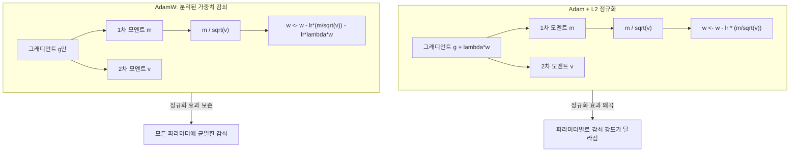
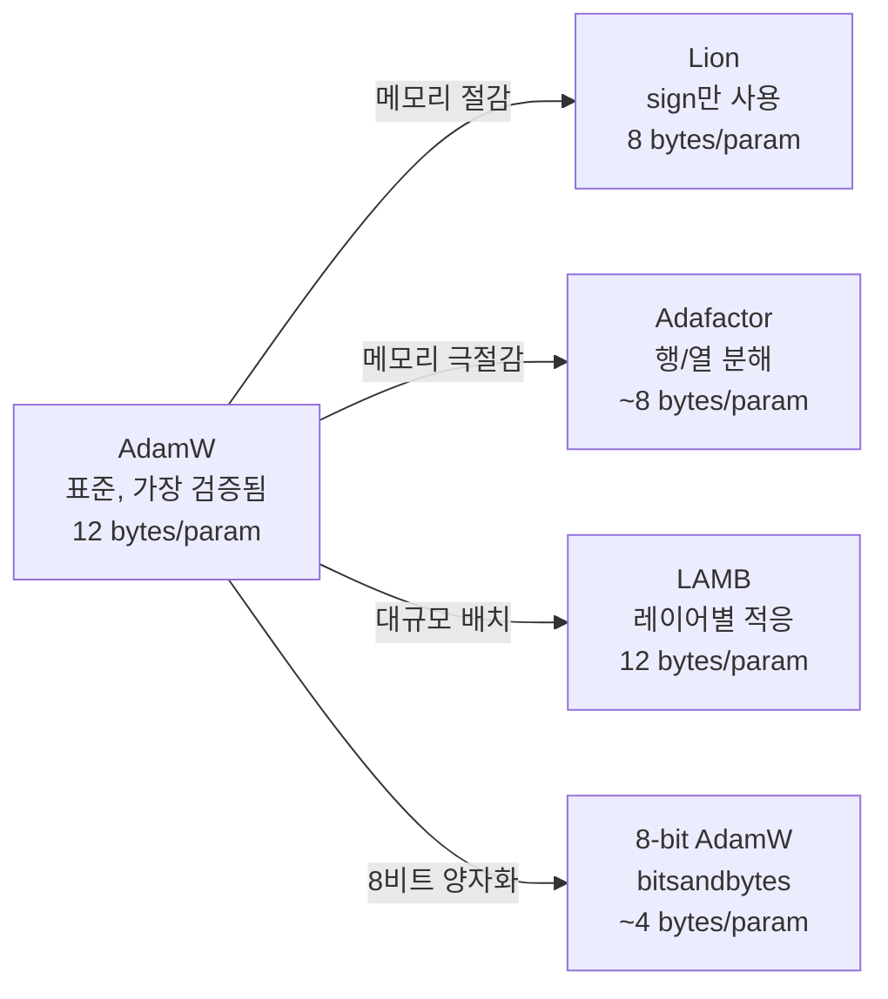

# AdamW 옵티마이저 (AdamW Optimizer)

AdamW는 Loshchilov & Hutter(2019)가 제안한 옵티마이저로, Adam에서 가중치 감쇠(weight decay)를 그래디언트 기반 업데이트와 분리(decouple)한 변형이다. ICLR 2019에 발표된 이후 Transformer 학습의 사실상 표준 옵티마이저가 되었으며, GPT, LLaMA, DeepSeek 등 대부분의 프론티어 LLM 사전학습에 사용된다.

## 핵심 아이디어: L2 정규화 vs 가중치 감쇠

Adam과 AdamW의 차이를 이해하려면 L2 정규화와 가중치 감쇠의 관계를 먼저 짚어야 한다.

**SGD에서는 동치**: 표준 SGD에서 L2 정규화(손실에 lambda * ||w||^2 항 추가)와 가중치 감쇠(업데이트 시 w <- w * (1 - lambda))는 학습률로 재스케일링하면 수학적으로 동일하다.

**Adam에서는 비동치**: Adam은 그래디언트를 2차 모멘트로 나누어 적응형 학습률을 적용한다. 이때 L2 정규화 항의 그래디언트도 함께 적응적으로 스케일링되면서, 가중치 감쇠의 의도된 정규화 효과가 왜곡된다.



AdamW의 핵심은 가중치 감쇠 항을 적응형 학습률 계산 밖으로 빼내는 것이다. 이를 통해 가중치 감쇠의 하이퍼파라미터 선택이 학습률 선택과 독립적이 되며, 두 값을 따로 튜닝할 수 있게 된다.

## 업데이트 규칙

AdamW의 파라미터 업데이트를 단계별로 정리하면:

```
1. 그래디언트 계산:        g_t = nabla L(w_t)
2. 1차 모멘트 갱신:        m_t = beta1 * m_{t-1} + (1 - beta1) * g_t
3. 2차 모멘트 갱신:        v_t = beta2 * v_{t-1} + (1 - beta2) * g_t^2
4. 편향 보정:              m_hat = m_t / (1 - beta1^t)
                           v_hat = v_t / (1 - beta2^t)
5. 파라미터 업데이트:      w_{t+1} = w_t - lr * (m_hat / (sqrt(v_hat) + eps)) - lr * lambda * w_t
```

핵심은 5번에서 가중치 감쇠 항 `lr * lambda * w_t`가 적응형 업데이트와 독립적으로 적용되는 점이다.

## 하이퍼파라미터

| 파라미터 | 기호 | 일반적 범위 | LLM 사전학습 기본값 |
|---------|------|------------|-------------------|
| 학습률 | lr | 1e-5 ~ 3e-4 | 1e-4 ~ 3e-4 |
| 1차 모멘트 감쇠율 | beta1 | 0.9 ~ 0.95 | 0.9 |
| 2차 모멘트 감쇠율 | beta2 | 0.95 ~ 0.999 | 0.95 |
| 수치 안정화 | epsilon | 1e-8 | 1e-8 |
| 가중치 감쇠 | weight_decay | 0.01 ~ 0.1 | 0.1 |

**beta2 선택의 중요성**: LLM 학습에서 beta2를 기본값 0.999 대신 0.95로 낮추는 경우가 많다. 높은 beta2는 2차 모멘트의 과거 기억이 길어져 학습 불안정(loss spike)의 원인이 될 수 있다. GPT-3, LLaMA, DeepSeek-V3 모두 beta2 = 0.95를 사용한다.

**가중치 감쇠 적용 범위**: 일반적으로 bias와 LayerNorm/RMSNorm 파라미터에는 가중치 감쇠를 적용하지 않는다. 이 파라미터들은 스케일이 다르고, 감쇠가 학습을 불안정하게 만들 수 있기 때문이다.

## 메모리 요구량과 최적화

AdamW는 파라미터당 12바이트의 옵티마이저 상태를 유지한다:

- FP32 마스터 가중치: 4 bytes
- 1차 모멘트 (m): 4 bytes
- 2차 모멘트 (v): 4 bytes

7B 모델에서 옵티마이저 상태만 약 84GB다. 이것이 [[deepspeed-zero]] Stage 1이 옵티마이저 상태 분할부터 시작하는 이유이며, [[data-parallelism-fsdp]]의 메모리 분할에서도 가장 큰 비중을 차지한다.

### 8-bit AdamW (bitsandbytes)

Dettmers et al.(2022)이 제안한 블록 단위 동적 양자화(block-wise dynamic quantization) 기법으로, 옵티마이저 상태를 8비트로 압축한다.

- 파라미터당 메모리: 12 bytes -> 약 4 bytes (마스터 가중치 제외 시 2 bytes)
- 성능 손실: FP32 AdamW와 비교하여 통계적으로 유의미한 차이 없음
- 사용법: PyTorch에서 `bnb.optim.AdamW8bit`으로 교체 (drop-in replacement)
- [[lora-qlora-finetuning|QLoRA]]와 결합하여 파인튜닝 메모리를 극적으로 절감

## 대안 옵티마이저

AdamW가 사실상 표준이지만, 특정 조건에서 장점을 보이는 대안이 존재한다.



| 옵티마이저 | 핵심 특징 | 사용 사례 |
|-----------|----------|----------|
| Adafactor | 2차 모멘트를 행/열 통계로 분해하여 메모리 절감 | T5 학습에서 Google이 사용 |
| LAMB | 레이어별 적응형 스케일링으로 대규모 배치 안정화 | BERT의 대규모 배치 사전학습 |
| Lion | 부호(sign)만 사용하여 단순하고 메모리 효율적 | Google Research 실험적 사용 |
| Sophia | 2차(Hessian) 근사로 수렴 가속 | 연구 단계 |

각 대안의 상세 비교는 [[optimizer-selection]]을 참조한다.

## [[learning-rate-scheduling]]과의 결합

AdamW는 적응형 학습률을 사용하지만, 글로벌 학습률 스케줄과의 결합이 여전히 중요하다. LLM 사전학습에서의 일반적인 패턴:

1. **Warmup**: 첫 수백~수천 스텝 동안 학습률을 0에서 목표값까지 선형 증가
2. **Cosine Decay**: warmup 이후 코사인 함수를 따라 학습률을 점진적으로 감소
3. **최소 학습률**: 보통 최대 학습률의 10%까지 감소 (0으로 떨어뜨리지 않음)

[[mixed-precision-training]]에서 BF16/FP16을 사용하더라도 옵티마이저 상태(모멘트)는 FP32로 유지하는 것이 표준이다. 이는 누적되는 작은 업데이트가 낮은 정밀도에서 소실되는 것을 방지한다.

## 관련 문서

- [[optimizer-selection]] -- AdamW, Lion, Sophia 등 옵티마이저 비교
- [[learning-rate-scheduling]] -- warmup, cosine decay 등 학습률 전략
- [[mixed-precision-training]] -- BF16 연산 + FP32 옵티마이저 상태
- [[deepspeed-zero]] -- 옵티마이저 상태 분할 (Stage 1)
- [[data-parallelism-fsdp]] -- 옵티마이저 상태 샤딩
- [[pretraining-pipeline-e2e]] -- 사전학습 파이프라인에서의 옵티마이저 설정
- [[lora-qlora-finetuning]] -- QLoRA + 8-bit AdamW 조합

## 참고 자료

- [Decoupled Weight Decay Regularization (Loshchilov & Hutter, ICLR 2019)](https://arxiv.org/abs/1711.05101)
- [8-bit Optimizers via Block-wise Quantization (Dettmers et al., 2022)](https://arxiv.org/abs/2110.02861)
- [bitsandbytes - GitHub](https://github.com/bitsandbytes-foundation/bitsandbytes)
