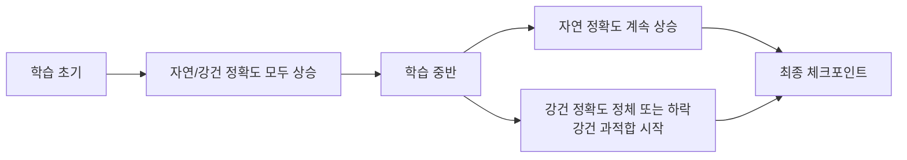

# 적대적 학습 (Adversarial Training)

## 개요

적대적 학습(adversarial training)은 학습 과정에 [[adversarial-attacks|적대적 예시]]를 포함함으로써 모델의 강건성([[robustness]])을 향상시키는 기법이다. 현재까지 알려진 방법 중 가장 효과적인 경험적 방어(empirical defense)로 평가받는다.

핵심 아이디어는 단순하다: 공격받은 예시에도 올바르게 분류하려면, 공격받은 예시로 직접 훈련하면 된다. 이를 통해 모델이 입력의 미세한 변형에 덜 민감해지도록 유도한다.

> "If you want a model to be robust to adversarial examples, train on adversarial examples."

---

## 문제 정의: 민맥스 최적화

적대적 학습은 다음의 민맥스(min-max) 최적화 문제로 정식화된다.

$$\min_\theta \mathbb{E}_{(x,y) \sim \mathcal{D}} \left[ \max_{\delta \in \mathcal{S}} L(f_\theta(x + \delta), y) \right]$$

- **내부 최대화(Inner Maximization)**: 주어진 모델에 대해 가장 효과적인 적대적 퍼터베이션 $\delta$를 찾음
- **외부 최소화(Outer Minimization)**: 적대적 예시에서도 손실을 최소화하는 모델 파라미터 $\theta$를 찾음
- $\mathcal{S}$: 허용 퍼터베이션 집합 (예: $\ell_\infty$ 볼 $\{\delta : \|\delta\|_\infty \le \epsilon\}$)

이 두 목표의 최적 해를 동시에 달성하기는 어려우므로, 다양한 근사 방법이 개발되었다.

---

## 주요 알고리즘

### PGD-AT (PGD Adversarial Training)

Madry et al. (2018)이 제안한 표준 적대적 학습이다. 내부 최대화 단계에서 [[adversarial-attacks#PGD (Projected Gradient Descent)|PGD 공격]]을 사용해 강력한 적대적 예시를 생성한 뒤, 그 예시로 모델을 학습한다.

```mermaid
flowchart TD
    A[미니배치 샘플링\n(x, y)] --> B[PGD 공격으로\n적대적 예시 생성\nx_adv]
    B --> C[적대적 예시로\n손실 계산\nL(f(x_adv), y)]
    C --> D[역전파 및\n파라미터 업데이트]
    D --> E{에포크 완료?}
    E -- No --> A
    E -- Yes --> F[강건 모델 획득]
```

위 다이어그램은 PGD-AT의 학습 루프를 나타낸다. 각 미니배치마다 PGD 공격을 내부적으로 실행하므로 표준 학습 대비 수십 배 계산 비용이 든다.

```python
import torch
import torch.nn as nn

def pgd_at_train_step(model, optimizer, loss_fn, x, y,
                      epsilon=8/255, alpha=2/255, num_steps=10):
    # --- 내부 최대화: PGD 공격 ---
    x_adv = x.clone().detach()
    x_adv += torch.zeros_like(x).uniform_(-epsilon, epsilon)
    x_adv = torch.clamp(x_adv, 0, 1).detach()

    for _ in range(num_steps):
        x_adv.requires_grad_(True)
        loss = loss_fn(model(x_adv), y)
        loss.backward()
        with torch.no_grad():
            x_adv = x_adv + alpha * x_adv.grad.sign()
            delta = torch.clamp(x_adv - x, -epsilon, epsilon)
            x_adv = torch.clamp(x + delta, 0, 1).detach()

    # --- 외부 최소화: 적대적 예시로 학습 ---
    optimizer.zero_grad()
    loss = loss_fn(model(x_adv), y)
    loss.backward()
    optimizer.step()
    return loss.item()
```

**장점:** 단순하고 효과가 검증됨  
**단점:** 학습 시간이 매우 김 (일반 학습의 10-20배), 자연 정확도(clean accuracy) 하락

---

### TRADES (TRadeoff-inspired Adversarial DEfense via Surrogate-loss minimization)

Zhang et al. (2019, NeurIPS)이 제안한 기법이다. 자연 정확도와 강건 정확도 사이의 트레이드오프를 명시적으로 다룬다.

$$\min_\theta \mathbb{E}_{(x,y)} \left[ L(f_\theta(x), y) + \beta \cdot \max_{\delta \in \mathcal{S}} D_{KL}(f_\theta(x) \| f_\theta(x+\delta)) \right]$$

- **첫 번째 항**: 자연 손실 (자연 정확도 보존)
- **두 번째 항**: KL 발산 정규화 (강건성 향상)
- **$\beta$**: 두 목표의 균형 하이퍼파라미터

```python
def trades_loss(model, x, y, epsilon, alpha, num_steps, beta):
    loss_natural = nn.CrossEntropyLoss()(model(x), y)

    # 적대적 예시 생성 (KL 발산 최대화)
    x_adv = x.clone().detach() + 0.001 * torch.randn_like(x)
    for _ in range(num_steps):
        x_adv.requires_grad_(True)
        kl = nn.KLDivLoss(reduction='sum')(
            torch.log_softmax(model(x_adv), dim=1),
            torch.softmax(model(x), dim=1)
        )
        kl.backward()
        with torch.no_grad():
            x_adv = x_adv + alpha * x_adv.grad.sign()
            delta = torch.clamp(x_adv - x, -epsilon, epsilon)
            x_adv = torch.clamp(x + delta, 0, 1).detach()

    loss_robust = nn.KLDivLoss(reduction='batchmean')(
        torch.log_softmax(model(x_adv), dim=1),
        torch.softmax(model(x), dim=1)
    )
    return loss_natural + beta * loss_robust
```

TRADES는 RobustBench 리더보드에서 꾸준히 상위권을 유지하는 강력한 기준선이다.

---

### MART (Misclassification Aware adveRsarial Training)

Wang et al. (2020)이 제안한 기법으로, 자연 예시에서 이미 오분류된 샘플에 더 큰 가중치를 부여한다.

$$\mathbb{E}_{(x,y)} \left[ L(f_\theta(x_{adv}), y) + \lambda \cdot BCE(f_\theta(x_{adv}), y) \cdot (1 - P(y|x)) \right]$$

자연 예시에서 맞히기 어려운 샘플을 적대적 환경에서도 잘 처리하도록 강제한다.

---

### AWP (Adversarial Weight Perturbation)

Wu et al. (2020, NeurIPS)이 제안한 기법이다. 입력뿐 아니라 **모델 가중치**에도 퍼터베이션을 가해 학습한다. 손실 경관(loss landscape)을 평탄화(flatten)해 더 넓은 극솟값(flat minima)을 찾도록 유도한다.

$$\min_\theta \max_{\|\Delta W\| \le \gamma} \mathbb{E}_{(x,y)} \left[ \max_{\delta \in \mathcal{S}} L(f_{\theta + \Delta W}(x + \delta), y) \right]$$

AWP는 기존 PGD-AT와 TRADES에 플러그인 방식으로 추가할 수 있어 범용성이 높다.

---

## 효율적 적대적 학습

표준 PGD-AT의 가장 큰 단점은 계산 비용이다. 이를 줄이기 위한 여러 기법이 개발되었다.

| 기법 | 아이디어 | 속도 향상 |
|------|---------|-----------|
| FGSM-AT | 단일 스텝 공격으로 대체 | ~10배 |
| Free-AT (Shafahi et al., 2019) | 역전파 재사용 | ~8배 |
| YOPO (Zhang et al., 2019) | 퍼터베이션 업데이트를 독립 ODE로 분리 | ~5배 |
| Fast-AT (Wong et al., 2020) | 무작위 초기화 + FGSM 단일 스텝 | ~10배 |

FGSM-AT는 빠르지만 **재앙적 과적합(catastrophic overfitting)** 문제가 발생할 수 있다. Fast-AT는 사이클릭 학습률(cyclic LR)과 무작위 초기화를 조합해 이 문제를 완화한다.

---

## 강건 일반화 (Robust Generalization)

적대적 학습에서도 표준 학습과 마찬가지로 과적합이 발생한다. 그러나 강건 과적합(robust overfitting)은 특이하게도 학습 후반부에 강건 테스트 정확도가 급격히 떨어지는 현상을 보인다.



### 강건 과적합 완화 방법

- **조기 중단(Early Stopping)**: 강건 검증 정확도 기준으로 학습 중단
- **데이터 증강**: Cutout, Mixup, AutoAugment를 함께 적용
- **추가 데이터**: 80M-TI (Tiny-Images) 같은 외부 데이터 사용 시 강건 일반화 크게 향상
- **자기지식 증류(Self-KD)**: 학습 중 스냅샷 앙상블을 교사로 활용
- **가중치 평균(SWA)**: 학습 후반 체크포인트를 평균

---

## 자연 정확도 vs. 강건 정확도 트레이드오프

적대적 학습의 핵심 딜레마는 자연 정확도와 강건 정확도가 서로 상충(trade-off)한다는 점이다.

| 방법 | 자연 정확도 | 강건 정확도 ($\ell_\infty$, $\epsilon=8/255$) |
|------|------------|----------------------------------------------|
| 표준 학습 | ~95% | ~0% |
| PGD-AT | ~84% | ~45% |
| TRADES ($\beta=6$) | ~84% | ~56% |
| AWP + TRADES | ~85% | ~59% |

이 트레이드오프는 이론적으로도 증명되어 있다 (Zhang et al., 2019). 자연 분포와 적대적 분포가 다르기 때문에 하나에 최적화된 모델은 다른 쪽에서 손해를 보게 된다. [[robustness]] 페이지에서 이 트레이드오프를 더 넓은 맥락에서 다룬다.

---

## NLP 도메인의 적대적 학습

비전에서의 성공과 달리, NLP 적대적 학습은 이산 입력 공간 때문에 직접 적용이 어렵다. 다음 접근법들이 사용된다.

- **임베딩 공간 퍼터베이션**: 입력 토큰이 아니라 임베딩 벡터에 연속 퍼터베이션을 가함 (FGM, PGD on embeddings)
- **FreeLB**: 임베딩 공간에서 PGD-AT를 BERT 파인튜닝에 적용, GLUE 벤치마크 성능 향상
- **SMART**: 대칭 KL 발산 정규화 + Bregman 근사를 활용한 강건 파인튜닝
- **InfoBERT**: 상호정보 기반 정규화로 강건성 향상

```python
# FGM (Fast Gradient Method) - 임베딩 공간 적대적 학습
class FGM:
    def __init__(self, model):
        self.model = model
        self.backup = {}

    def attack(self, epsilon=1.0, emb_name='embedding'):
        for name, param in self.model.named_parameters():
            if param.requires_grad and emb_name in name:
                self.backup[name] = param.data.clone()
                norm = torch.norm(param.grad)
                if norm != 0:
                    r_at = epsilon * param.grad / norm
                    param.data.add_(r_at)

    def restore(self, emb_name='embedding'):
        for name, param in self.model.named_parameters():
            if param.requires_grad and emb_name in name:
                param.data = self.backup[name]
        self.backup = {}
```

---

## LLM 시대의 적대적 학습

대규모 언어 모델(LLM) 정렬(alignment) 맥락에서도 적대적 학습이 활용된다.

- **RLHF와의 결합**: 악의적 프롬프트(레드팀 공격)로 생성된 응답을 RLHF 보상 모델로 평가해 파인튜닝
- **Constitutional AI**: 자기비판(critique) 루프로 안전하지 않은 응답을 수정
- **Red Teaming + AT**: 자동 레드팀 도구로 취약 입력을 찾아 안전 파인튜닝에 활용
- [[jailbreak-attacks]] 방어와의 연계: [[jailbreak-attacks|탈옥 공격]] 예시를 학습에 포함해 거부(refusal) 능력 향상

---

## 벤치마크와 평가

- **RobustBench**: CIFAR-10/100, ImageNet에서 다양한 위협 모델($\ell_\infty$, $\ell_2$, 부패)에 대한 표준 리더보드
- **AutoAttack**: 튜닝 없는 신뢰성 있는 공격 앙상블. 방어 과적합(defense overfitting) 검출에 효과적
- **MNIST/CIFAR-10 $\ell_\infty$ ($\epsilon=8/255$)**: 가장 흔한 비전 강건성 평가 설정

---

## 실무 관점

**왜 중요한가?**
- 보안이 중요한 시스템(의료 영상, 자율주행, 금융 사기 탐지)에서 모델 강건성 확보
- 모델 일반화 능력 향상: 적대적 학습이 분포 외(OOD) 예시 처리에도 도움이 되는 경우 있음
- 규제 요구사항: AI Act, NIST 가이드라인 등이 모델 보안 테스트를 요구하기 시작

**실무 권장:**
1. 강건성이 필요한 도메인인지 먼저 확인. 높은 계산 비용 정당화 필요
2. 표준 PGD-AT로 시작해 Fast-AT로 비용 절감 탐색
3. TRADES $\beta$를 조정해 자연/강건 정확도 트레이드오프 최적화
4. RobustBench AutoAttack으로 최종 강건 정확도 측정
5. 추가 데이터 사용 가능하면 반드시 포함 (강건 일반화 극대화)

---

## 관련 문서

- [[adversarial-attacks]] - 적대적 공격 기법 전반 (FGSM, PGD, C&W, TextAttack)
- [[robustness]] - ML 강건성 전반 (분포 시프트, 불확실성, 보정)
- [[jailbreak-attacks]] - LLM 탈옥 공격 (적대적 학습의 LLM 적용 대상)
- [[uncertainty-estimation]] - 불확실성 추정 (강건성과 밀접한 연관)
