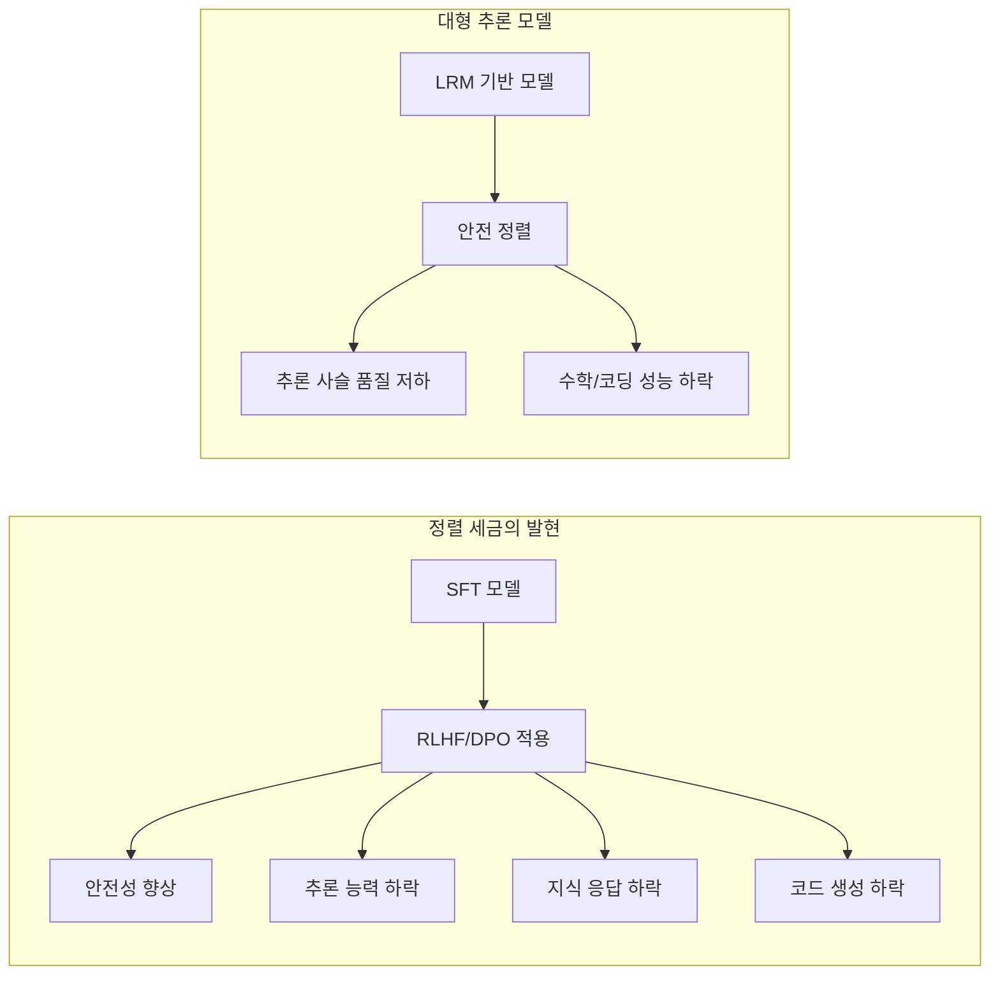
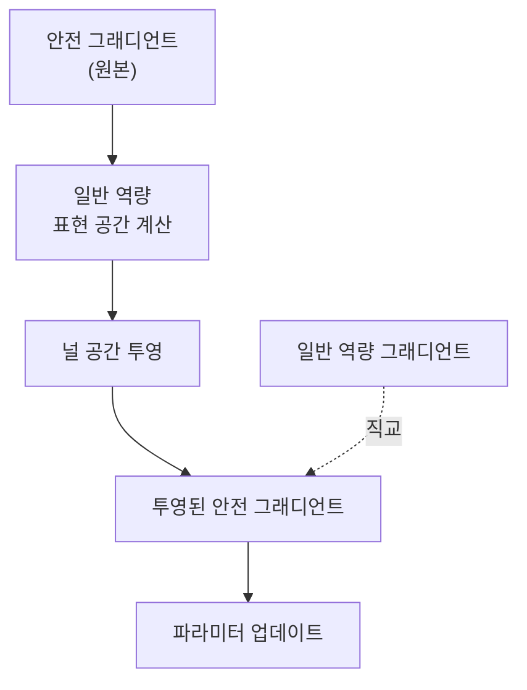

# 정렬 세금 - 안전 학습의 성능 비용 (Alignment Tax)

## 개요

정렬 세금(Alignment Tax)은 안전 정렬(safety alignment) 기법 -- RLHF, DPO, 거부 학습 등 -- 을 적용한 후 모델의 핵심 역량(추론, 지식, 코드 생성 등)이 저하되는 현상을 정량화하는 지표이다. 모델을 안전하게 만드는 것이 "공짜가 아니다"라는 점을 강조하며, 이 비용을 어떻게 최소화하면서 안전성을 확보할 것인지가 현대 후학습 파이프라인의 핵심 과제이다.

Lin et al.(2024, EMNLP)의 "Mitigating the Alignment Tax of RLHF"에서 체계적으로 분석되었으며, 2025년의 "Safety Tax: Safety Alignment Makes Your Large Reasoning Models Less Reasonable"는 대형 추론 모델(LRM)에서도 동일한 트레이드오프가 존재함을 입증했다.

## 메커니즘

### 왜 성능이 하락하는가

안전 정렬 과정에서 모델의 파라미터가 업데이트될 때, 사전 학습과 SFT에서 획득한 일반적 역량을 인코딩하는 가중치도 함께 변경된다. 이것이 안전성과 역량 사이의 파레토 트레이드오프(Pareto trade-off)를 발생시킨다.

핵심 원인은 다음과 같다.

- **파국적 망각(Catastrophic Forgetting)**: [[rlhf-pipeline]]에서 보상을 최대화하는 방향으로 학습하면서, 이전에 학습한 지식이 덮어쓰여짐
- **분포 이동(Distribution Shift)**: 안전 학습 데이터의 분포가 사전 학습 데이터와 다르므로, 모델의 내부 표현이 안전 관련 방향으로 편향
- **보상 모델 편향**: 보상 모델이 "안전한 응답"에 높은 점수를 부여하도록 학습되면, 모델이 구체적이고 유용한 답변보다 일반적이고 회피적인 답변을 선호하게 됨

### 실증적 증거

Lin et al.의 연구에서 OpenLLaMA-3B에 RLHF를 적용한 결과를 보면 트레이드오프가 명확하다.

| 지표 | RLHF 전 | RLHF 후 | 변화 |
|---|---|---|---|
| RSF 보상 점수 | 0.16 | 0.35 | +0.19 |
| SQuAD F1 | 기준 | -16pt | 하락 |
| DROP F1 | 기준 | -17pt | 하락 |
| WMT BLEU | 기준 | -5.7pt | 하락 |

보상 점수(선호도/안전성)가 향상되는 만큼, 지식 질의응답(SQuAD), 추론(DROP), 번역(WMT)의 성능이 하락한다. 이 관계는 파레토 곡선으로 시각화되며, 두 목표를 동시에 최적화하는 것이 근본적으로 어려움을 보여준다.



## 대형 추론 모델(LRM)에서의 안전 세금

2025년 연구는 순차적 후학습 파이프라인(SFT -> 추론 강화 -> 안전 정렬)에서, 안전 정렬 단계가 이전 추론 강화 단계의 성과를 상당 부분 퇴화시킨다는 것을 보였다. 추론 사슬(chain-of-thought)의 깊이와 정확도가 감소하고, 수학적 문제 해결 능력이 하락하는 패턴이 관찰되었다. 이는 안전 학습과 추론 능력 사이에 파라미터 수준의 간섭(interference)이 존재함을 시사한다.

## 최소화 기법

### 모델 병합 (Model Averaging/Merging)

안전 학습 전후 모델의 가중치를 보간(interpolation)하여 안전성과 역량의 균형점을 찾는 방법이다.

```
merged_model = alpha * safety_model + (1 - alpha) * sft_model
```

alpha 값을 조절하여 파레토 프론티어(Pareto frontier) 위의 원하는 지점을 선택할 수 있다. 추가 학습 없이 적용 가능하여 비용이 낮지만, 최적의 alpha를 찾기 위한 평가 비용이 발생한다.

### 온라인 병합 옵티마이저 (Online Merging Optimizer)

학습 과정 자체에서 참조 모델 가중치와의 이동을 지속적으로 제한하는 방식이다. 매 학습 스텝에서 가중치 업데이트를 적용한 후, 참조 모델 방향으로 일정 비율 끌어당기는(pull-back) 메커니즘을 추가한다. [[kl-divergence-penalty]]가 출력 분포 수준에서 이탈을 제한하는 반면, 온라인 병합은 가중치 공간에서 직접 이탈을 제한한다.

### 널 공간 제약 정책 최적화 (NSPO)

Null-Space constrained Policy Optimization(NSPO)은 안전 정책 그래디언트를 일반 역량의 표현 공간에 직교(orthogonal)하는 널 공간(null space)에 투영(projection)하는 방법이다. 안전 학습 업데이트가 일반 역량 부분 공간(subspace)과 간섭하지 않도록 기하학적으로 제약하는 것이 핵심이다.



### 대조적 편향 제거 (Contrastive Debiasing)

안전 학습으로 인한 편향을 대조 학습(contrastive learning)으로 보정하는 기법이다. 안전한 응답과 유용한 응답의 대조 쌍을 구성하여, 모델이 안전성을 유지하면서도 구체적이고 유용한 응답을 선호하도록 유도한다.

### 게으른 안전 정렬 (Lazy Safety Alignment)

Lisa(NeurIPS 2024)는 안전 학습 시 모델 파라미터의 일부만 선택적으로 업데이트하는 전략이다. 안전 관련 행동에 가장 영향력 있는 레이어만 업데이트하고 나머지는 고정(freeze)하여, 일반 역량의 파라미터를 보존한다.

## 기법 비교

| 기법 | 추가 학습 | 구현 난이도 | 역량 보존 | 안전성 확보 |
|---|---|---|---|---|
| 모델 병합 | 불필요 | 낮음 | 중간 | alpha 의존 |
| 온라인 병합 | RLHF 중 | 중간 | 높음 | 높음 |
| NSPO | 별도 RL | 높음 | 매우 높음 | 높음 |
| 대조적 편향 제거 | 별도 학습 | 중간 | 높음 | 중간 |
| Lisa | 안전 학습 중 | 낮음 | 높음 | 높음 |

## 파이프라인 설계에의 시사점

정렬 세금은 [[post-training-pipeline-e2e]] 설계에서 안전 학습 단계의 위치와 방법을 결정하는 핵심 요인이다. 실무적 시사점은 다음과 같다.

- **안전 학습 강도 보정**: 과도한 안전 학습은 역량을 크게 훼손한다. 목표 안전 수준에 맞는 학습 강도를 평가 기반으로 보정해야 함
- **다단계 평가**: 안전 학습 전후로 역량 벤치마크(MMLU, HumanEval, GSM8K 등)와 안전 벤치마크를 동시에 추적
- **반복적 정제**: 한 번의 안전 학습보다, 약한 안전 학습을 여러 라운드에 걸쳐 반복하며 역량 하락을 모니터링하는 것이 효과적
- **[[rlaif-scalable-oversight]] 활용**: AI 피드백으로 안전 학습 데이터를 확장하되, 역량 보존 기준을 명시적으로 포함

## 관련 페이지

- [[rlhf-pipeline]] - RLHF 파이프라인과 안전 정렬
- [[direct-preference-optimization]] - DPO의 안전성-역량 균형
- [[kl-divergence-penalty]] - KL 발산 페널티로 이탈 제한
- [[supervised-fine-tuning]] - SFT 단계의 역량 기반
- [[extended-constitutional-ai]] - Constitutional AI를 통한 안전 학습
- [[rlaif-scalable-oversight]] - AI 피드백 기반 확장 가능한 감독
- [[post-training-pipeline-e2e]] - 후학습 파이프라인 전체 흐름
