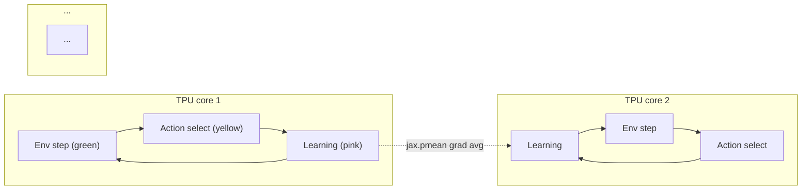

# Anakin - DeepMind Podracer (fully on-device RL)

## 개요

Anakin은 DeepMind가 [[sebulba-podracer]]와 함께 발표한 자매 Podracer 아키텍처로, **환경(env), action selection, learning을 모두 TPU 가속기 위에서 실행**하는 fully on-device RL 패턴이다. 환경 자체를 JAX pure function으로 구현해 XLA로 컴파일하면 actor/learner 분리가 필요 없어지고, Python overhead가 사실상 제거된다.

- 논문: [Podracer architectures for scalable Reinforcement Learning (2104.06272)](https://arxiv.org/abs/2104.06272)
- Sebulba와 동일 논문에 함께 소개
- 시스템: TPU pod, JAX/XLA 기반

## 핵심 아이디어

각 core가 자기 batch의 env를 step + 학습까지 자체 완료하고, gradient는 `jax.pmean`으로 averaged된다.

- 환경(green) + action(yellow) + learning(pink)이 모두 가속기에서 실행
- 모든 TPU core에 동일한 computation을 replicate (`jax.pmap`)
- pod 단위로 replica를 늘려 throughput을 선형 확장

## 통신 패턴

- core 간 통신은 `jax.pmean`으로 gradient averaging
- host CPU의 개입 거의 없음 — Python overhead 제거
- Multi-host TPU pod에서도 XLA가 collective ops를 자동 처리

## 실측 처리량

| 셋업 | 처리량 |
|------|--------|
| 작은 NN + grid-world | **5,000,000 steps/second** |
| 복잡한 환경 + 16-core TPU | **3,000,000+ steps/second** |

Anakin 실험은 self-contained + deterministic → reproducibility가 우수하다.

## 제약

- 환경이 **JAX pure function으로 구현 가능해야 함** — Atari, MuJoCo 등은 wrapper 필요
- 환경 randomness도 PRNG 명시적 split로 처리해야 함
- gymnax, brax, jumanji 같은 JAX-native env 라이브러리와 결합

## 핵심 인용

> "In Anakin, the environment (in green), action selection (in yellow) and learning (in pink) are all executed on the accelerators, and the computation is replicated across all available cores." — paper §4

> "There is no need for the actor/learner separation that is so popular in large scale deep RL platforms." — paper §4

> "Anakin experiments are self contained and deterministic." — paper §4

## 후속 영향

- InstaDeep의 **Mava** (multi-agent RL) 및 **Stoix** (single-agent RL) 둘 다 Anakin 패턴 채택
- gymnax, gymnax-blines, brax (Google Brain) 등이 JAX-native env로 Anakin compatible
- [[sebulba-podracer]]와 함께 JAX 분산 RL 표준 패턴 정립

## Sebulba와의 비교

| 측면 | Anakin | Sebulba |
|------|--------|---------|
| Actor/learner | 통합 (모든 core 동일 작업) | 분리 (disjoint 그룹) |
| 환경 위치 | TPU 위 (JAX pure function) | host CPU (Python thread) |
| Python overhead | 거의 없음 | 일부 존재 |
| 처리량 (steps/sec) | 매우 높음 (5M+) | 높음 |
| 적합 환경 | gymnax/brax/jumanji | Atari/DMLab 등 일반 |
| 결정론 | deterministic + reproducible | 비동기 큐로 일부 비결정 |

## 관련 문서

- [[sebulba-podracer]] - actor-learner 분리 변종
- [[impala-vtrace]] - 원조 분산 actor-learner
- [[rl-harness-frameworks-comparison]] - RL harness 통합 비교
