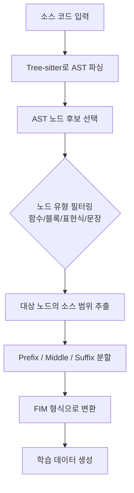

# AST 기반 구조 인식 코드 FIM 학습

## 개요

AST-FIM(Abstract Syntax Tree Fill-in-the-Middle)은 코드의 추상 구문 트리(AST)를 활용하여 구조적으로 완결된 코드 블록을 마스킹하고 채우는 방식의 사전학습 전략이다. 기존 FIM(Fill-in-the-Middle) 학습이 코드를 일반 텍스트처럼 취급하여 임의의 문자 위치에서 분할하는 반면, AST-FIM은 함수, 표현식, 블록 등 구문적으로 의미 있는 단위를 마스킹 대상으로 선택한다. arXiv:2506.00204에서 제안되었으며, 1B/8B 파라미터 모델에서 표준 FIM 대비 최대 5점 향상을 달성했다. Tree-sitter 기반 언어 무관(language-agnostic) 구현으로 100+ 프로그래밍 언어에 적용 가능하다.

## 배경: Fill-in-the-Middle (FIM)

### 기존 FIM의 작동 방식

FIM은 [[causal-language-modeling|인과 언어 모델링]]의 변형으로, 코드 시퀀스를 prefix-middle-suffix의 세 부분으로 분할한 뒤 모델이 prefix와 suffix를 조건으로 middle을 생성하도록 학습시킨다. 기존 코드 LLM인 StarCoder, CodeLlama 등이 FIM 학습을 적용하여 코드 완성(code completion) 능력을 획득했다.

**표준 FIM 변환**:
```
원본:  [A B C D E F]
변환:  <PRE> [A B] <SUF> [E F] <MID> [C D]
```

### 표준 FIM의 한계

표준 FIM은 분할 지점을 무작위 문자 위치로 선택한다. 이로 인해 다음 문제가 발생한다:

- **구문 파괴**: if 문의 조건부만 잘리거나, 함수 시그니처와 본문이 분리
- **실전 괴리**: 실제 개발자의 코드 편집은 "함수 전체 추가", "조건문 블록 수정" 등 구문 단위로 이루어짐
- **불완전한 타깃**: 모델이 구문적으로 불완전한 코드 조각을 생성하도록 학습

## AST-FIM의 핵심 메커니즘

### AST 기반 마스킹 알고리즘

AST-FIM의 핵심은 코드를 먼저 AST로 파싱한 뒤, 구문적으로 완결된 서브트리(subtree)를 마스킹 대상으로 선택하는 것이다.



### 마스킹 대상 노드 유형

AST-FIM에서 마스킹 대상이 되는 주요 AST 노드 유형은 다음과 같다:

| 노드 유형 | 예시 (Python) | 학습 효과 |
|----------|-------------|----------|
| **함수 정의** | `def process_data(...)` 전체 | 함수 수준 코드 생성 |
| **블록문** | if/for/while의 본문 블록 | 제어 흐름 완성 |
| **표현식** | 복합 연산, 리스트 컴프리헨션 | 표현식 수준 인필링 |
| **클래스 메서드** | 클래스 내부 메서드 전체 | 객체지향 코드 생성 |
| **데코레이터 + 함수** | `@decorator` 포함 함수 정의 | 실용적 코드 패턴 |

### 언어 무관 구현: Tree-sitter

AST-FIM은 Tree-sitter 파서를 활용한다. Tree-sitter는 점진적(incremental) 파싱을 지원하는 범용 파서 생성기로, 100개 이상의 프로그래밍 언어에 대한 문법(grammar)이 제공된다. 이를 통해 언어별 별도 엔지니어링 없이 Python, JavaScript, Java, Go, Rust, C++ 등에 동일한 마스킹 알고리즘을 적용할 수 있다.

**언어 무관 마스킹의 핵심**: Tree-sitter AST의 노드 유형이 언어마다 다르지만(예: Python의 `function_definition` vs Java의 `method_declaration`), 추상적 역할(함수, 블록, 표현식)은 공유된다. AST-FIM은 이 추상적 역할 수준에서 마스킹 규칙을 정의함으로써 언어 독립성을 달성한다.

## 기존 FIM과의 성능 비교

### 벤치마크 결과

1B 및 8B 파라미터 모델에서의 실험 결과:

| 벤치마크 | 표준 FIM | AST-FIM | 향상 |
|---------|---------|---------|------|
| 표준 FIM 벤치마크 | 기준선 | +3~5pt | 구문 정합성 향상 |
| Real-FIM-Eval | 기준선 | 유의미한 개선 | 실전 편집 패턴 |

AST-FIM은 특히 실전 코드 편집(real-world code editing) 시나리오에서 표준 FIM 대비 개선 폭이 크다. 이는 실제 개발자의 편집 패턴이 구문 단위와 높은 상관성을 갖기 때문이다.

### Real-FIM-Eval 벤치마크

연구진은 AST-FIM의 실전 효과를 평가하기 위해 Real-FIM-Eval이라는 새로운 벤치마크를 도입했다. 30,000개 이상의 최근 GitHub 커밋에서 추출한 12개 프로그래밍 언어의 실제 코드 변경을 기반으로, 모델이 git 커밋에서 삽입/수정된 코드 세그먼트를 주변 컨텍스트로부터 완성하는 과제이다.

## 관련 연구와의 연결

### AST-T5와의 차이

AST-T5(2024)는 인코더-디코더 구조에서 AST 정보를 활용한 사전학습을 제안했으나, 디코더 전용(decoder-only) 모델의 FIM 학습에는 직접 적용되지 않았다. AST-FIM은 디코더 전용 아키텍처에서 최초로 효과적인 AST 인식 FIM을 구현한 연구이다.

### 코드 모델 학습 생태계

AST-FIM은 기존 코드 모델 학습 파이프라인에 자연스럽게 통합된다:


[[tokenizer-training|토크나이저 학습]] 단계에서 코드 특화 토크나이저가 사용되며, 사전학습 시 표준 인과 언어 모델링(CLM) 목적함수와 AST-FIM 목적함수를 혼합하여 적용한다. 일반적으로 전체 학습 데이터의 50% 정도에 FIM 변환을 적용하는 것이 권장된다.

### DeepSeek-Coder, SynthCoder 등 최신 모델

DeepSeek-Coder, Stable Code, aiXcoder-7B, SynthCoder 등 최신 코드 모델들은 이중 컨텍스트 FIM(dual-context FIM), 구조 인식 마스킹, 대규모 다목적 학습(multi-objective training)을 결합하여 3B-7B 규모에서도 경쟁력 있는 성능을 달성하고 있다.

## 실무 적용 가이드

### 구현 시 고려사항

- **파싱 실패 처리**: Tree-sitter 파싱이 실패하는 경우(문법 오류가 있는 코드), 표준 FIM으로 폴백
- **노드 크기 제어**: 너무 작은 노드(변수명)나 너무 큰 노드(전체 파일)는 마스킹에서 제외
- **마스킹 비율**: 전체 토큰의 15-50% 범위에서 마스킹, 구문 경계에서의 분할이 핵심
- **혼합 학습**: CLM과 AST-FIM을 혼합하되, AST-FIM 비율을 점진적으로 조정

### [[masked-language-modeling|마스크 언어 모델링]]과의 비교

BERT 스타일의 MLM이 임의 토큰을 마스킹하는 것과 유사하게, 표준 FIM도 임의 문자 위치를 마스킹한다. AST-FIM은 MLM에서의 whole-word masking이나 span masking의 발전과 유사한 궤적을 따르며, "의미 있는 단위"를 마스킹함으로써 학습 신호의 품질을 높인다.

## 한계와 향후 연구

- **파싱 오버헤드**: AST 파싱이 데이터 전처리 시간을 증가시키나, 오프라인 전처리로 해결 가능
- **교차 파일 컨텍스트**: 현재 AST-FIM은 단일 파일 내 구조에 집중하며, 레포지토리 수준 의존성은 미반영
- **생성 시 AST 제약**: 학습은 AST 인식이나, 추론(inference) 시 생성된 코드의 구문 정합성을 보장하는 메커니즘은 별도 필요 (AST 기반 트렁케이션 등)

## 참고 문헌

- "Structure-Aware Fill-in-the-Middle Pretraining for Code" (arXiv:2506.00204, 2025)
- Bavarian et al., "Efficient Training of Language Models to Fill in the Middle" (2022)
- Gong et al., "AST-T5: Structure-Aware Pretraining for Code Generation and Understanding" (2024)
