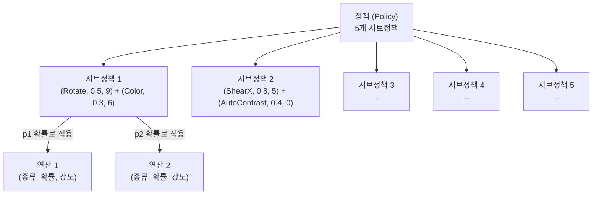
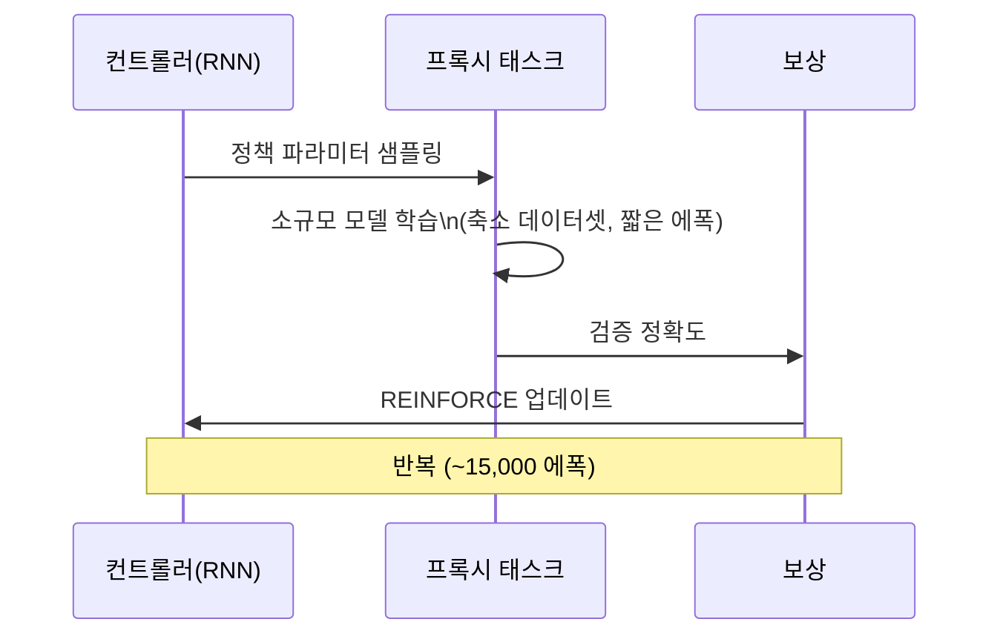
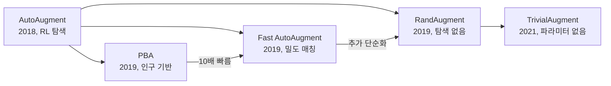

# AutoAugment 정책 탐색

AutoAugment는 Cubuk et al. (2018, CVPR 2019)이 제안한 자동 데이터 증강 정책 탐색 방법으로, 강화학습(RL)을 사용하여 주어진 데이터셋에 최적화된 증강 정책을 자동으로 발견한다. 이후 모든 자동 증강 연구([[randaugment-policy]], TrivialAugment 등)의 시초가 되었다.

## 배경 - 수작업 증강의 한계

전통적인 데이터 증강은 도메인 전문가가 "어떤 변환을 어떤 강도로 얼마나 자주 적용할지" 수동으로 설계한다. 이 과정은:

- 데이터셋과 모델마다 최적 정책이 다름
- 전문가 경험과 직관에 의존
- 수천 번의 실험이 필요할 수 있음

AutoAugment는 이 탐색 과정 자체를 자동화한다.

## 핵심 개념 - 정책 공간

### 정책 구조

하나의 정책은 **5개의 서브정책(sub-policy)**으로 구성되며, 각 서브정책은 **2개의 연산(operation)** 쌍으로 이루어진다.



각 연산은 세 가지 파라미터를 가진다:
- **종류**: 16개 이미지 변환 중 하나 (Rotate, Flip, Equalize 등)
- **확률**: 0.0, 0.1, ..., 1.0 (11개 이산값)
- **강도**: 0, 1, ..., 10 (11개 이산값)

탐색 공간 크기: $(16 \times 11 \times 11)^{10} \approx 10^{32}$ (서브정책당 2개 연산 x 5 서브정책)

### 학습 시 적용 방식

```
각 미니배치마다:
1. 5개 서브정책 중 균등 무작위로 1개 선택
2. 선택된 서브정책의 연산 1을 확률 p_1으로 적용
3. 이어서 연산 2를 확률 p_2로 적용
```

## 탐색 알고리즘

### 컨트롤러 (Controller)

탐색에는 **순환 신경망(RNN) 컨트롤러**를 사용한다. 컨트롤러는 정책 파라미터를 자기회귀적으로 출력한다.



### REINFORCE 업데이트

컨트롤러는 정책 그래디언트(REINFORCE)로 학습된다:

$$\nabla_\theta J(\theta) = \sum_{t=1}^{T} \nabla_\theta \log P(a_t | a_{t-1:1}; \theta) \cdot (R - b)$$

여기서:
- $\theta$: 컨트롤러 RNN 파라미터
- $R$: 검증 정확도 (보상)
- $b$: 이동 평균 기반 베이스라인
- $a_t$: 타임스텝 t의 정책 결정 (연산 종류/확률/강도)

### 탐색 비용 절감 - 프록시 태스크

전체 ImageNet으로 매번 학습하면 비용이 너무 크므로, **축소된 프록시 태스크**를 사용한다:

```
CIFAR-10 실험:
  - 데이터: 전체 50K의 1/5 (10K 랜덤 서브셋)
  - 모델: Wide ResNet-40-2 (축소형)
  - 학습: 120 에폭
  - 탐색: ~15,000개 정책 샘플링

ImageNet 실험:
  - 데이터: 120개 클래스, 클래스당 6,000장
  - 모델: ResNet-50 (2 에폭만 학습)
  - 총 비용: ~5,000 GPU-시간
```

## 발견된 정책 예시

CIFAR-10에서 AutoAugment가 발견한 대표 서브정책들:

| 서브정책 | 연산 1 | 연산 2 |
|---------|--------|--------|
| 1 | Equalize (p=0.9, m=9) | Invert (p=0.4, m=2) |
| 2 | Rotate (p=0.5, m=9) | Equalize (p=0.7, m=2) |
| 3 | Equalize (p=0.4, m=0) | Rotate (p=0.6, m=8) |
| 4 | Equalize (p=1.0, m=9) | ShearY (p=0.6, m=4) |
| 5 | Color (p=0.3, m=3) | Invert (p=0.5, m=0) |

ImageNet 발견 정책은 CIFAR-10 정책보다 더 강한 기하학적 변환(Shear, Translate 등)을 선호한다.

## 코드 - 사전 탐색된 정책 사용

실제 사용 시에는 논문에서 공개한 탐색 결과 정책을 그대로 적용한다:

```python
from torchvision.transforms import AutoAugment, AutoAugmentPolicy

# CIFAR-10 탐색 결과 정책 적용
transform_cifar = T.Compose([
    T.RandomCrop(32, padding=4),
    T.RandomHorizontalFlip(),
    T.AutoAugment(policy=AutoAugmentPolicy.CIFAR10),
    T.ToTensor(),
    T.Normalize(mean=[0.4914, 0.4822, 0.4465],
                std=[0.2470, 0.2435, 0.2616]),
])

# ImageNet 탐색 결과 정책 적용
transform_imagenet = T.Compose([
    T.RandomResizedCrop(224),
    T.RandomHorizontalFlip(),
    T.AutoAugment(policy=AutoAugmentPolicy.IMAGENET),
    T.ToTensor(),
    T.Normalize(mean=[0.485, 0.456, 0.406],
                std=[0.229, 0.224, 0.225]),
])

# SVHN 정책
transform_svhn = T.Compose([
    T.AutoAugment(policy=AutoAugmentPolicy.SVHN),
    T.ToTensor(),
])
```

## 성능 결과

| 데이터셋/모델 | 기준 | +AutoAugment | 향상 |
|--------------|------|-------------|------|
| CIFAR-10 / PyramidNet | 96.6% | 97.4% | +0.8%p |
| CIFAR-100 / PyramidNet | 82.1% | 83.3% | +1.2%p |
| ImageNet / ResNet-50 | 76.3% | 77.6% | +1.3%p |
| ImageNet / AmoebaNet-B | 82.2% | 83.5% | +1.3%p |
| SVHN / Wide ResNet | 97.6% | 98.3% | +0.7%p |

AutoAugment는 당시 CIFAR-10(97.4%), CIFAR-100(83.3%), ImageNet(83.5%) 모두에서 SOTA를 달성했다.

## 후속 발전



### Population Based Augmentation (PBA)

- RL 대신 **인구 기반 학습(Population Based Training)** 사용
- AutoAugment 대비 1,000배 빠른 탐색 (~5 GPU-시간)
- 탐색된 정책을 "스케줄"로 표현 (학습 진행에 따라 변화)

### Fast AutoAugment

- 배치 정규화 통계 매칭 방식으로 탐색
- GPU 3.5시간 (AutoAugment의 1/1400)
- 동등한 성능

### [[randaugment-policy]] (탐색 불필요)

- 탐색 자체를 제거, N개 무작위 연산 + 단일 강도 M
- AutoAugment와 동등하거나 더 우수한 성능
- 실용적으로 가장 많이 사용됨

## AutoAugment vs RandAugment 선택 가이드

| 상황 | 권장 방법 |
|------|----------|
| 표준 비전 작업 (분류) | [[randaugment-policy]] (간단, 성능 동등) |
| 탐색 비용 감당 가능 + 특수 도메인 | AutoAugment (맞춤 정책) |
| 프로덕션 학습 파이프라인 | RandAugment 또는 TrivialAugment |
| 논문 재현 (AutoAugment 기반 모델) | AutoAugment 사전 탐색 정책 사용 |

## 관련 문서

- [[randaugment-policy]] - 탐색 없는 단순 자동 증강
- [[cutmix-augmentation]] - 패치 교체 혼합 증강
- [[mixup-data-augmentation]] - 선형 보간 혼합 증강
- [[ppo-rlhf-implementation]] - PPO 알고리즘 구현 (RL 탐색과 관련)
- [[overfitting-regularization]] - 정규화 기법 개요
