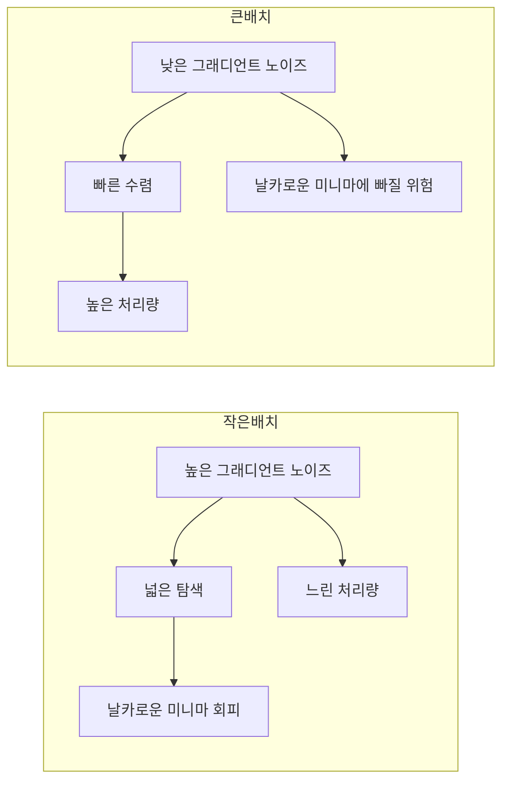
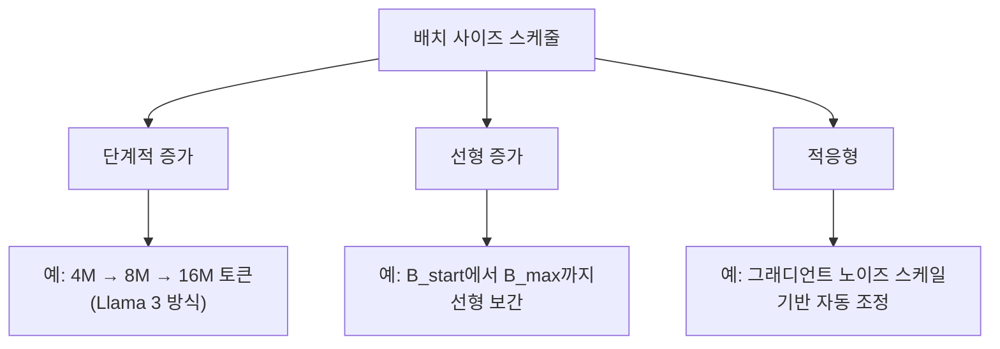

# 배치 사이즈 스케줄링 (Batch Size Scheduling)

## 개요

배치 사이즈 스케줄링(Batch Size Scheduling, BSS)은 학습 과정에서 배치 사이즈를 고정하지 않고 동적으로 변경하는 전략이다. 초기에 작은 배치로 시작하여 점진적으로 증가시키는 방식이 대규모 LLM 사전학습에서 사실상 표준이 되었다. 작은 배치는 그래디언트 노이즈가 높아 탐색(exploration) 효과를, 큰 배치는 노이즈가 낮아 수렴(exploitation) 효과를 제공하므로, 학습 단계에 따라 적절한 배치 사이즈를 선택하는 것이 수렴 품질과 학습 처리량 모두에 영향을 미친다.

## 이론적 배경

### 그래디언트 노이즈 스케일

배치 사이즈와 학습 효율의 관계를 이해하는 핵심 개념은 그래디언트 노이즈 스케일(gradient noise scale)이다. McCandlish et al.(2018)은 "임계 배치 사이즈(critical batch size)" B_crit을 정의했다.

- B < B_crit: 배치 사이즈를 늘려도 학습 시간이 거의 비례적으로 단축 (노이즈 감소 효과)
- B > B_crit: 배치 사이즈를 늘려도 학습 시간 단축 효과가 급격히 감소 (연산 낭비)
- B = B_crit: 시간 효율과 연산 효율의 최적 균형점

B_crit는 학습이 진행될수록 증가하는 경향이 있다. 이는 학습 초기에는 작은 배치가 효율적이고, 후기에는 큰 배치가 효율적임을 시사한다.

### 작은 배치 vs 큰 배치의 트레이드오프

| 특성 | 작은 배치 | 큰 배치 |
|------|----------|---------|
| 그래디언트 노이즈 | 높음 | 낮음 |
| 일반화 | 유리 (암묵적 정규화) | 불리 (명시적 정규화 필요) |
| GPU 활용률 | 낮음 | 높음 |
| 통신 빈도 | 높음 | 낮음 (그래디언트 축적 가능) |
| 수렴 속도 (스텝당) | 빠름 | 느림 |
| 수렴 속도 (시간당) | 느림 | 빠름 |

## 점진적 증가 전략 (Batch Size Warmup)

가장 널리 사용되는 BSS 패턴은 학습 초기에 작은 배치에서 시작하여 점진적으로 목표 배치 사이즈까지 증가시키는 것이다.

### 이점

1. **초기 안정성**: 무작위에 가까운 초기 파라미터 상태에서 큰 배치의 낮은 노이즈 그래디언트는 과도하게 좁은 영역으로 수렴을 유도할 수 있음. 작은 배치의 높은 노이즈가 이를 방지
2. **학습률 warmup과 시너지**: [[learning-rate-scheduling]]의 warmup 구간과 배치 사이즈 warmup을 병행하면 초기 학습의 안정성이 극대화
3. **후기 처리량 극대화**: 학습 후기에 큰 배치를 사용하면 GPU 활용률과 데이터 처리량이 증가하여 전체 학습 시간 단축

### 구현 패턴

## 프론티어 모델 사례

### Llama 3 (Meta, 2024)

Llama 3 405B의 배치 사이즈 스케줄은 가장 잘 문서화된 사례 중 하나다.

| 학습 구간 | 배치 사이즈 | 시퀀스 길이 | 누적 토큰 |
|----------|-----------|-----------|----------|
| 초기 | 4M 토큰 | 4,096 | 0 ~ 252M |
| 중기 | 8M 토큰 | 8,192 | 252M ~ 2.87T |
| 후기 | 16M 토큰 | 8,192 | 2.87T ~ 15.6T |

배치 사이즈와 시퀀스 길이를 동시에 증가시키는 전략을 사용했다. 초기 252M 토큰 동안 배치 사이즈를 4M에서 8M으로, 시퀀스 길이를 4,096에서 8,192로 점진적으로 늘렸다. 이후 2.87T 토큰 시점에서 배치 사이즈를 16M으로 한 번 더 증가시켰다.

### DeepSeek-V3 (DeepSeek, 2024)

DeepSeek-V3 671B(MoE)는 더 공격적인 배치 사이즈 warmup을 적용했다.

| 학습 구간 | 배치 사이즈 | 시퀀스 길이 |
|----------|-----------|-----------|
| 초기 (0 ~ 469B 토큰) | 3,072 -> 15,360 | 4,096 |
| 이후 (469B ~ 14.8T 토큰) | 15,360 (고정) | 4,096 |

초기 469B 토큰 동안 배치 사이즈를 3,072에서 15,360까지 5배 증가시킨 후, 나머지 학습 기간에는 고정했다. 학습률은 WSD 변형 스케줄(최초 2K 스텝 warmup -> 10T 토큰까지 상수 -> 4.3T 토큰 cosine decay)을 사용했다.

### 비교 분석

| 항목 | Llama 3 405B | DeepSeek-V3 671B |
|------|-------------|-----------------|
| 증가 패턴 | 단계적 (3단계) | 연속적 -> 고정 |
| 배치 사이즈 범위 | 4M ~ 16M 토큰 | 3,072 ~ 15,360 시퀀스 |
| Warmup 구간 | ~2.87T 토큰 (전체의 ~18%) | ~469B 토큰 (전체의 ~3.2%) |
| 시퀀스 길이 동시 증가 | 예 (4K -> 8K) | 아니오 (4K 고정) |

## 최근 연구: 과제 난이도와 최적 스케줄

2025년 연구(Fast Catch-Up, Late Switching)에서는 과제 난이도에 따라 최적 배치 사이즈 스케줄이 달라진다는 흥미로운 발견이 보고되었다.

- **쉬운 과제**: 배치 사이즈를 학습 내내 계속 증가시키는 것이 최적
- **어려운 과제**: 대부분의 학습 기간 동안 작은 배치를 유지하고, 학습 후반에만 큰 배치로 전환하는 "late switching"이 최적

이 차이를 설명하는 "빠른 추격 효과(fast catch-up effect)"에 따르면, 작은 배치에서 큰 배치로 전환한 후 손실이 빠르게 큰-배치 경로에 수렴한다. 축적된 그래디언트 노이즈가 빠르게 잊혀지기 때문이다. 이 효과는 큰 배치 사용을 학습 후반으로 안전하게 지연시킬 수 있음을 시사한다.

## 배치 사이즈와 학습률의 관계

배치 사이즈를 변경할 때 학습률을 함께 조정하는 것이 일반적이다.

- **선형 스케일링 규칙**: 배치 사이즈를 k배 늘리면 학습률도 k배 증가 (Goyal et al., 2017)
- **제곱근 스케일링**: 배치 사이즈를 k배 늘리면 학습률을 sqrt(k)배 증가
- **실무 경험**: LLM 사전학습에서는 배치 사이즈 증가 시 학습률을 고정하거나 미세 조정하는 경우가 많음. [[learning-rate-scheduling]]에서 WSD 스케줄과의 조합을 다룸

## 분산 학습과의 연계

배치 사이즈 증가는 [[data-parallelism-fsdp]]의 병렬 워커 수 증가와 직결된다. 배치 사이즈를 점진적으로 늘리면 학습 초기에는 적은 수의 GPU를 사용하고 후기에 전체 클러스터를 활용하는 전략도 가능하다. [[gradient-accumulation-checkpointing]]을 활용하면 물리적 GPU 수를 변경하지 않고도 효과적 배치 사이즈를 조절할 수 있다.

## 관련 페이지

- [[learning-rate-scheduling]] -- 학습률 스케줄과 배치 사이즈의 공동 최적화
- [[neural-scaling-laws]] -- 임계 배치 사이즈와 스케일링 관계
- [[data-parallelism-fsdp]] -- 분산 학습에서의 배치 분할
- [[gradient-accumulation-checkpointing]] -- 그래디언트 축적으로 효과적 배치 사이즈 확대
- [[optimizer-selection]] -- 배치 사이즈에 따른 옵티마이저 동작 차이
- [[sequence-length-curriculum]] -- 시퀀스 길이 커리큘럼과의 병행
- [[pretraining-pipeline-e2e]] -- 사전학습 파이프라인에서의 위치
