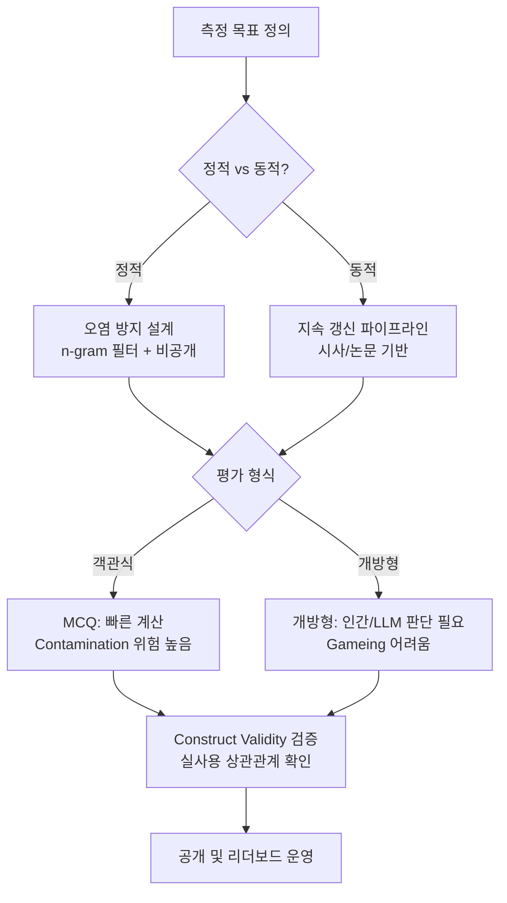

# LLM 벤치마크 설계 원칙 (Benchmark Design)

## 개념 요약

LLM 벤치마크는 모델의 능력을 정량적으로 측정하는 도구다. 잘 설계된 벤치마크는 실제 능력을 정확히 반영하지만, 나쁘게 설계된 벤치마크는 과적합(benchmark overfitting)과 게임화(gaming)를 초래한다.

## Construct Validity: "무엇을 측정하는가"

벤치마크가 측정하고자 하는 능력을 실제로 측정하는지가 핵심이다.

- **표면 타당도(Face Validity)**: 문제가 겉보기에 해당 능력과 관련 있어 보이는가
- **내용 타당도(Content Validity)**: 측정 대상 능력의 전체 범위를 균형있게 포괄하는가
- **기준 타당도(Criterion Validity)**: 실제 사용 성능과 상관관계가 있는가

> 예시: MMLU가 "일반 지식"을 측정한다고 하지만, 실제로는 암기 능력에 편중될 수 있다.

## 테스트셋 오염 방지

**데이터 오염(data contamination)**: 모델이 학습 시 평가 문제 또는 답을 포함한 데이터를 보았을 경우 발생.

오염 방지 전략:
- **N-gram 중복 검사**: 학습 데이터와 평가셋 간 n-gram overlap 탐지
- **Decontamination 필터**: 학습 전 평가셋과 유사한 데이터 제거
- **홀드아웃 비공개**: 평가셋을 공개하지 않고 서버에서만 평가 (단, 재현성 저하)
- **템플릿 변형**: 문제 표현 방식을 변형해 암기 탐지

## 동적 벤치마크: LiveBench

정적 벤치마크는 공개 즉시 학습 데이터로 흡수될 위험이 있다. **LiveBench** 등 동적 벤치마크는:

- 매달 새로운 문제를 현재 시사, 뉴스, 최신 논문에서 생성
- 모델이 특정 문제에 과적합할 수 없도록 지속 갱신
- 오염 위험이 원천 차단되는 구조

## Goodhart 법칙과 리더보드 게임화

**Goodhart's Law**: "지표가 목표 자체가 되면, 그 지표는 좋은 지표이기를 멈춘다."

리더보드 게임화 현상:
- 특정 벤치마크 형식에 맞게 파인튜닝 (benchmark-specific fine-tuning)
- few-shot 예제 형식 암기
- 체리피킹된 평가 방법론 선택

이를 탐지하는 방법:
- 동일 능력을 측정하는 여러 벤치마크 간 성능 상관관계 확인
- 표현 방식만 바꾼 동등 문제에서 성능 급락 여부 확인

## Chatbot Arena (ELO 방식)

Chatbot Arena는 사용자가 두 모델의 응답을 직접 비교해 선호 모델을 선택하는 **투표 기반 ELO 랭킹** 시스템이다.

- **장점**: 실제 사용자 선호 반영, 오염 위험 낮음, 오픈엔드 평가
- **단점**: 느린 수렴(많은 투표 필요), 편향(길이/형식 선호), 작업 분포가 사용자에 의존

$$
\text{ELO 업데이트}: R_A' = R_A + K(S_A - E_A), \quad E_A = \frac{1}{1 + 10^{(R_B - R_A)/400}}
$$

## 벤치마크 설계 의사결정 흐름

위 흐름은 벤치마크 설계 시 핵심 의사결정 포인트를 보여준다.

## 정적 vs 동적 트레이드오프

| 속성 | 정적 벤치마크 | 동적 벤치마크 |
|------|-------------|-------------|
| 재현성 | 높음 | 낮음 (문제 갱신) |
| 오염 위험 | 높음 | 낮음 |
| 커뮤니티 비교 | 용이 | 어려움 |
| 유지 비용 | 낮음 | 높음 |
| 게임화 저항성 | 낮음 | 높음 |

## 관련 문서
- [[ml-experiment-design]] -- ML 실험 설계

- [[perplexity-metric]] - 언어 모델 자동 평가 지표
- [[bleu-rouge-metrics]] - 다른 자동 평가 지표
- [[data-contamination-detection]] - 오염 탐지 기법
- [[evaluation-during-training]] - 학습 중 평가 전략
