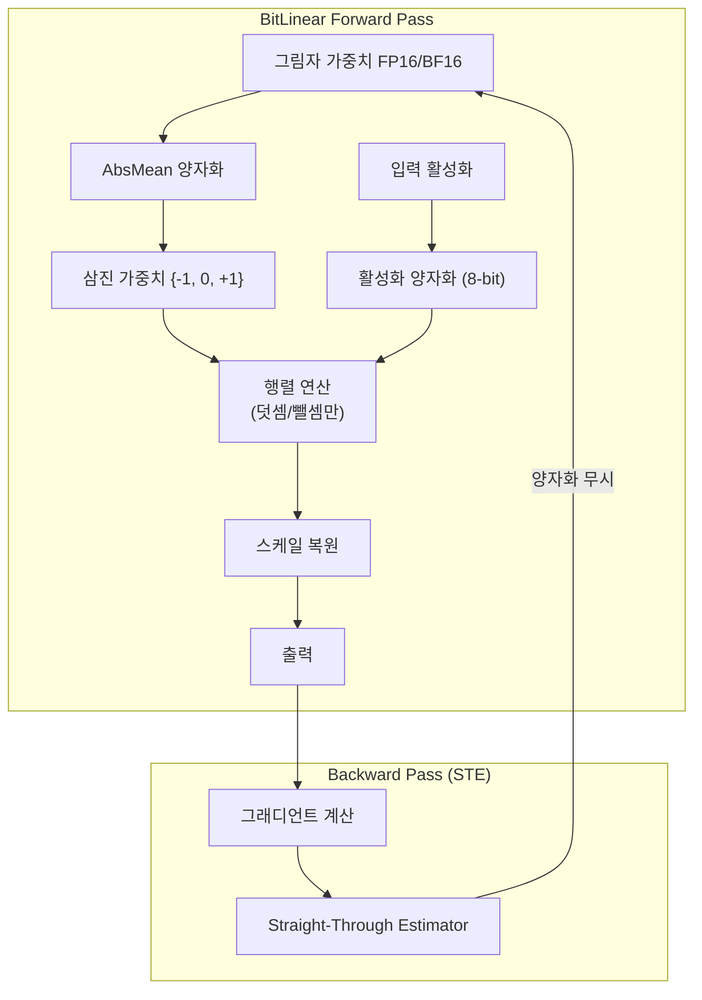

# BitNet 1비트 학습

## 개요

BitNet b1.58은 Microsoft Research가 제안한 네이티브 1비트 LLM 학습 방법론이다. 모든 가중치를 삼진(ternary) 값 {-1, 0, +1}로 제한하여 학습하며, 이 세 가지 값을 표현하는 데 필요한 정보량이 log2(3) = 1.58비트이므로 "1.58-bit"라는 이름이 붙었다. 기존의 학습 후 양자화(Post-Training Quantization)와 달리, 처음부터 저정밀도로 학습하는 양자화 인식 학습(Quantization-Aware Training, QAT) 접근법이다. 2025년 4월 공개된 BitNet b1.58 2B-4T 모델은 4조(4T) 토큰으로 학습되어 동급 전정밀도 모델과 비교 가능한 성능을 달성했다.

## 핵심 개념

### 네이티브 학습 vs. 학습 후 양자화

| 구분 | 학습 후 양자화 (PTQ) | 네이티브 저정밀도 학습 |
|------|---------------------|---------------------|
| 학습 정밀도 | FP16/BF16 | 삼진 {-1, 0, +1} |
| 양자화 시점 | 학습 완료 후 | 학습 중 (매 forward pass) |
| 정보 손실 | 양자화 시 발생 | 학습 과정에서 적응 |
| 품질 보존 | 캘리브레이션 필요 | 학습 목표에 내재 |

핵심 차이는 학습 과정 자체가 저정밀도 표현에 최적화된 파라미터를 찾도록 설계되었다는 점이다. 모델이 처음부터 삼진 가중치의 제약 내에서 최적의 표현을 학습하므로, PTQ에서 발생하는 양자화 갭(quantization gap)이 근본적으로 줄어든다.

### 1.58비트의 의미

전통적인 1비트 양자화는 {-1, +1}만 사용하지만, BitNet b1.58은 0을 추가한 삼진 체계를 사용한다. 0의 존재는 결정적이다:

- **희소성(Sparsity) 제공**: 가중치가 0인 연결은 사실상 비활성화되어 구조적 희소성을 자연스럽게 생성한다
- **특징 필터링**: 모델이 특정 입력 차원을 선택적으로 무시할 수 있어 표현력이 크게 향상된다
- **곱셈 제거**: 가중치가 {-1, 0, +1}이면 행렬 곱셈이 덧셈과 뺄셈만으로 대체되어 곱셈기(multiplier) 없이 연산 가능하다

## BitLinear 레이어

BitNet의 핵심 구성 요소는 표준 트랜스포머의 `nn.Linear`를 대체하는 BitLinear 모듈이다.

### AbsMean 양자화

가중치 양자화의 핵심 알고리즘은 AbsMean(절대 평균) 방식이다:

1. 레이어의 가중치 행렬 W에서 절대값 평균 alpha = mean(|W|)을 계산한다
2. 각 가중치를 alpha로 나눈 뒤 가장 가까운 삼진 값으로 반올림한다: W_q = round(W / alpha)를 {-1, 0, +1}로 클램핑
3. 추론 시 스케일 텐서(alpha)를 곱하여 전체 크기를 복원한다

AbsMean 스케일의 핵심 장점은 분포의 중심을 동적으로 파악하여 반올림 경계를 각 레이어의 실제 가중치 분포에 맞춘다는 점이다. AbsMedian(절대 중앙값)도 대안으로 제안되었으며, 두 방식 모두 하이퍼파라미터로 선택 가능하다.

### Straight-Through Estimator (STE)

양자화 연산(반올림)은 미분 불가능하므로 표준 역전파가 불가능하다. STE는 이 문제를 우회한다:

- **Forward pass**: 양자화된 삼진 가중치를 사용하여 연산 수행
- **Backward pass**: 양자화 함수를 항등함수(identity)로 간주하여 그래디언트를 그림자 가중치(shadow weights)로 직접 전달
- **업데이트**: FP16/BF16 정밀도의 그림자 가중치가 업데이트되고, 다음 forward pass에서 다시 양자화

이 이중 구조 덕분에 모델은 양자화 효과를 학습 중에 경험하면서도 정밀한 그래디언트 업데이트를 유지한다.

## 학습 절차

### 학습 인프라

BitNet b1.58 2B-4T 모델의 학습 세부사항:

| 항목 | 값 |
|------|------|
| 파라미터 수 | 2B (20억) |
| 학습 토큰 | 4T (4조) |
| 가중치 정밀도 | 1.58-bit (삼진) |
| 활성화 정밀도 | 8-bit |
| 그림자 가중치 | FP16/BF16 |
| 아키텍처 | Llama 계열 변형 |

### 학습 동역학

삼진 양자화는 강력한 암시적 정규화(implicit regularization) 효과를 가진다. 가중치 공간이 {-1, 0, +1}^d로 제한되므로:

- 과적합 경향이 감소하고 [[neural-scaling-laws]]에 따른 데이터 효율이 변화한다
- 학습 초기에는 많은 가중치가 0 근처에서 진동하며, 학습이 진행됨에 따라 안정적인 삼진 패턴이 형성된다
- 손실 곡선은 전정밀도 학습과 유사한 형태를 보이며, 다운스트림 작업 정확도도 근접한다

## 추론 효율성

BitNet의 실질적 가치는 추론 단계에서 극대화된다. bitnet.cpp 프레임워크가 공개되어 CPU에서 효율적인 추론이 가능하다:

| 플랫폼 | 속도 향상 | 에너지 절감 |
|--------|----------|------------|
| ARM CPU | 1.37x - 5.07x | 55.4% - 70.0% |
| x86 CPU | 2.37x - 6.17x | 71.9% - 82.2% |

모델 규모가 커질수록 성능 이점이 증가하는 경향이 있다. 곱셈 연산의 제거와 극도로 낮은 메모리 사용량이 핵심 요인이다.

## 한계와 전망

### 현재 한계

- **학습 비용**: 그림자 가중치를 FP16/BF16으로 유지해야 하므로, 학습 시 메모리 절감 효과는 추론만큼 극적이지 않다
- **하드웨어 최적화 부재**: 현재 GPU Tensor Core는 삼진 연산에 최적화되어 있지 않아 학습 속도 이점이 제한적이다
- **규모 확장 검증**: 2B 규모에서의 검증이 주로 이루어졌으며, 수십~수백B 규모에서의 특성은 추가 검증이 필요하다

### 발전 방향

- [[mixed-precision-training]]과의 결합: FP8 활성화 + 삼진 가중치 등 하이브리드 접근
- N:M 구조적 희소성과의 결합 (Sparse BitNet): 삼진 가중치에 추가적인 희소 패턴 적용
- 전용 하드웨어(ASIC) 설계: 삼진 연산에 특화된 칩이 등장하면 학습과 추론 모두에서 혁신적 효율 달성 가능

## 관련 문서

- [[mixed-precision-training]] -- 수치 정밀도 전략의 전체 스펙트럼
- [[neural-scaling-laws]] -- 저정밀도 학습이 스케일링 법칙에 미치는 영향
- [[optimizer-selection]] -- STE 기반 학습에 적합한 옵티마이저
- [[knowledge-distillation]] -- 전정밀도 교사 모델에서 BitNet 학생으로의 증류
- [[evaluation-during-training]] -- 양자화 학습의 성능 모니터링
