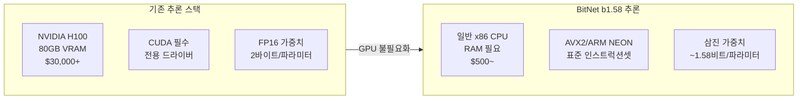
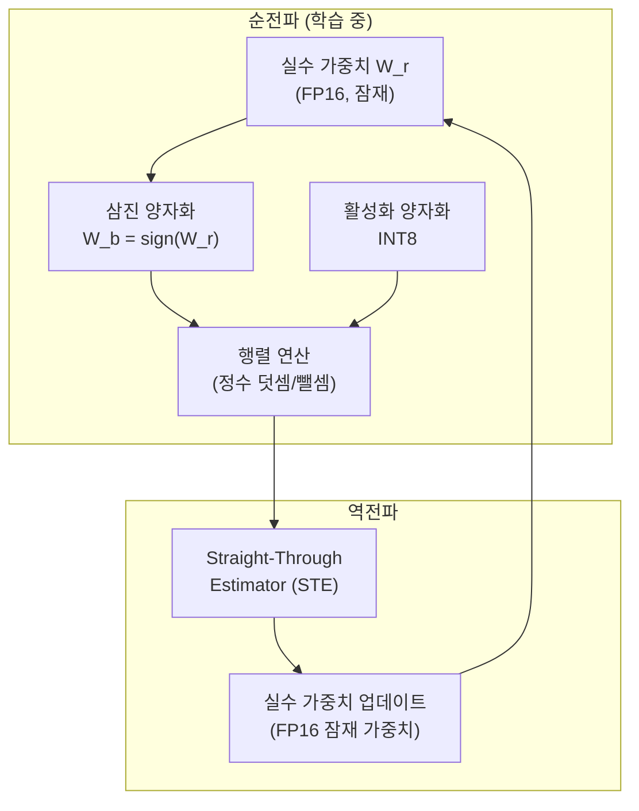
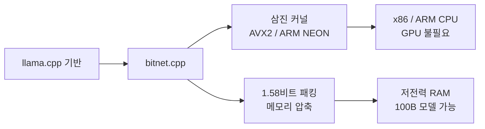
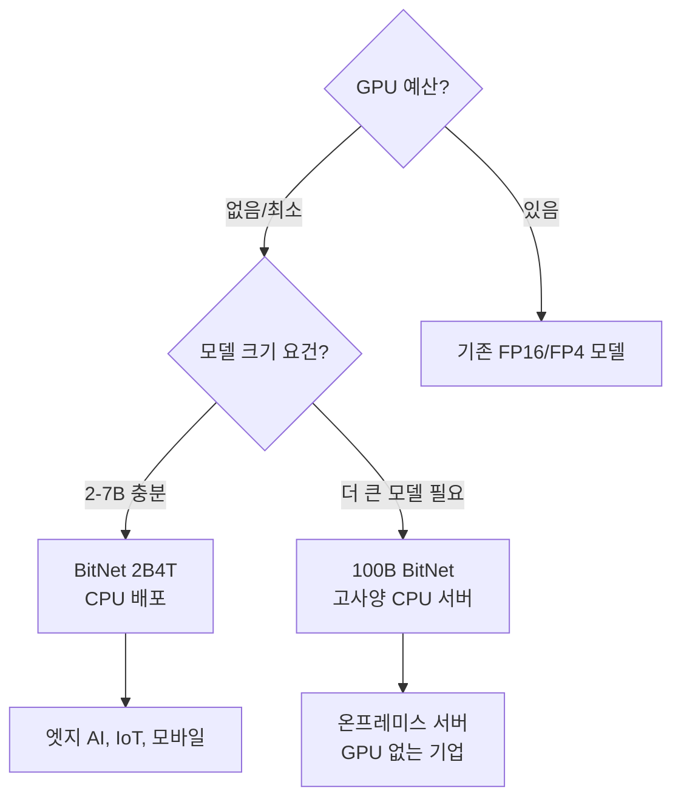

# BitNet b1.58 2B4T

Microsoft Research가 2025년 4월 공개한 최초의 네이티브 1비트(엄밀히는 1.58비트 = 삼진 {-1, 0, +1}) 대규모 언어 모델이다. 2B 파라미터, 4조(4T) 토큰으로 학습됐으며, bitnet.cpp 추론 프레임워크를 통해 **단일 CPU에서 100B BitNet 모델을 초당 5-7 토큰**(인간 독서 속도)으로 실행한다. x86 CPU 기준 2.37-6.17배 속도 향상, 71.9-82.2% 에너지 절감을 달성한다.

논문: arXiv:2504.12285

## 왜 중요한가

BitNet b1.58 2B4T는 LLM 추론의 패러다임 전환을 보여준다.

이 모델이 주장하는 것은 단순한 성능 개선이 아니다. **AI 추론에서 GPU라는 전제 자체를 제거**할 수 있다는 가능성이다. 물론 2B 파라미터 모델이 70B FP16 모델 성능에는 미치지 못하지만, 접근성과 에너지 효율성의 관점에서 근본적인 변화다.

## 핵심 개념: 1.58비트란 무엇인가

### 삼진 가중치 {-1, 0, +1}

일반 LLM의 가중치는 FP16(16비트) 또는 BF16(16비트) 부동소수점으로 표현된다. BitNet b1.58은 모든 가중치를 세 가지 값 {-1, 0, +1} 중 하나로 제한한다.

세 가지 값을 구분하는 데 필요한 정보량:
$$\log_2(3) \approx 1.58 \text{ bits}$$

이래서 "b1.58"(1.58-bit)이라는 이름이 붙었다.

### 기존 양자화와의 차이

| 방식 | 비트폭 | 시점 | 특징 |
|------|--------|------|------|
| FP16 기반 모델 | 16비트 | - | 원본 |
| GPTQ (PTQ) | 4비트 | 학습 후 | 양자화 갭 존재 |
| AWQ (PTQ) | 4비트 | 학습 후 | 활성화 인식 |
| QAT (일반) | 4-8비트 | 학습 중 | 갭 감소 |
| BitNet b1.58 | 1.58비트 | 학습 중 | 완전 삼진, 갭 최소 |

[[bitnet-1bit-training|기존 BitNet 연구]]가 학습 방법론에 집중했다면, BitNet b1.58 2B4T는 4조 토큰 규모 학습으로 **실용적인 성능 수준에 도달한 첫 번째 대규모 모델**이다.

## 기술적 상세

### 학습 방법론

핵심 기법은 **STE(Straight-Through Estimator)**다. 양자화 함수(sign 함수)는 미분 불가능하지만, 역전파 시 그래디언트를 그대로 통과시켜 실수 잠재 가중치(latent weights)를 업데이트한다.

추론 시에는 잠재 가중치는 저장하지 않고 삼진 가중치만 보존한다.

### RMSNorm과 서브레이어 양자화

BitNet b1.58은 [[quantization|양자화]] 전략에서 세밀한 설계를 사용한다.

- **가중치**: 모든 Linear 레이어 가중치를 삼진화
- **활성화**: INT8로 양자화 (가중치보다 높은 정밀도 유지)
- **정규화**: RMSNorm (활성화 양자화와 호환성 좋음)
- **임베딩**: FP16 유지 (학습 안정성을 위해 양자화 제외)

### 4조 토큰 학습

기존 BitNet 논문들은 수억~수십억 토큰으로 실험했으나, 2B4T는 **4조 토큰**으로 학습함으로써 실용적 성능 수준에 도달했다. 4조 토큰은 Llama 3.2 3B의 학습 토큰 수(9조)의 절반 수준이다.

학습 데이터 구성은 [교차검증 필요] - arXiv:2504.12285 논문에서 구체적 커리큘럼 확인 권장.

## bitnet.cpp 추론 프레임워크

### 아키텍처

bitnet.cpp는 llama.cpp를 기반으로 BitNet 특화 최적화를 추가한 C++ 추론 프레임워크다.

### 핵심 최적화

**삼진 GEMM (General Matrix Multiplication)**

삼진 가중치 행렬 곱셈은 곱셈 없이 덧셈·뺄셈만으로 계산된다.

$$y = W_b x = \sum_i w_i^b \cdot x_i, \quad w_i^b \in \{-1, 0, +1\}$$

$w_i = 1$이면 $x_i$를 더하고, $w_i = -1$이면 $x_i$를 빼고, $w_i = 0$이면 건너뛴다. SIMD 인스트럭션으로 병렬화하면 FP16 행렬 곱에 비해 훨씬 빠르다.

**비트 패킹**

삼진 값 {-1, 0, +1}을 2비트(00, 01, 10)로 인코딩해 패킹하면, FP16 대비 약 8배 적은 메모리가 필요하다. 100B 파라미터 모델이 FP16으로는 200GB이지만 BitNet 삼진으로는 약 25GB로 줄어든다.

### 지원 하드웨어별 성능

| 하드웨어 | 속도 향상 | 에너지 절감 |
|---------|---------|----------|
| x86 CPU (AVX2) | 2.37-6.17x | 71.9-82.2% |
| ARM CPU (NEON) | 유사 수준 | 유사 수준 |
| Apple Silicon (M 시리즈) | [교차검증 필요] | [교차검증 필요] |
| GPU (CUDA) | 비지원 / 최적화 안됨 | - |

GPU는 FP16/BF16 행렬 연산에 특화되어 있으므로 삼진 연산의 이점이 없다. BitNet b1.58의 핵심 가치는 CPU에서 발생한다.

## 벤치마크 결과

### 전정밀도 모델과의 비교

BitNet b1.58 2B는 동일 파라미터 규모의 FP16/BF16 전정밀도 모델과 유사한 성능을 보인다고 보고된다.

| 벤치마크 | BitNet b1.58 2B | Llama 3.2 3B (FP16) | 비고 |
|---------|----------------|---------------------|------|
| MMLU | 경쟁적 | - | [교차검증 필요] |
| ARC-C | 경쟁적 | - | [교차검증 필요] |
| HellaSwag | 경쟁적 | - | [교차검증 필요] |

*arXiv:2504.12285 논문의 구체적 수치는 직접 확인 권장.*

주요 클레임: "2B 파라미터 BitNet b1.58이 같은 크기 전정밀도 모델과 비견되는 성능을 발휘한다."

### CPU 추론 실제 속도

| 모델 크기 | CPU 환경 | 토큰/초 | 인간 가독성 |
|---------|---------|---------|-----------|
| 100B BitNet | 고사양 x86 서버 CPU | 5-7 tok/s | 가능 (독서 속도) |
| 7B BitNet | 일반 노트북 CPU | 50-100 tok/s | 빠름 |
| 3B BitNet | 스마트폰 수준 | 20-40 tok/s | 빠름 |

이는 GPU 없이도 실용적인 LLM 추론이 CPU에서 가능함을 의미한다.

## 한계와 과제

### 성능 갭

2B4T가 전정밀도 2B 모델과 경쟁한다는 클레임은 사실이지만, 전정밀도 대형 모델(70B, 405B)과의 성능 차이는 여전히 크다. "같은 크기 대비"가 아닌 "같은 성능을 더 작은 삼진 모델로" 달성하려면 더 많은 연구가 필요하다.

### 학습 인프라

학습 자체는 여전히 대규모 GPU 클러스터를 필요로 한다. BitNet의 이점은 **추론** 단계에서 발생하며, 학습 단계에서는 기존 대비 GPU 요구량이 줄어들지 않는다.

### 에코시스템 성숙도

bitnet.cpp는 초기 단계이며, vLLM, TensorRT-LLM 같은 성숙한 서빙 프레임워크의 BitNet 지원은 [교차검증 필요].

## 실무 활용 시나리오

### 적합한 시나리오

1. **GPU 없는 온프레미스 배포**: IT 정책상 GPU 서버 도입이 어려운 기업
2. **엣지/IoT 디바이스**: ARM CPU 기반 임베디드 시스템
3. **에너지 제약 환경**: 전력 예산이 중요한 공장, 원격 시설
4. **비용 최소화 스타트업**: GPU 비용 없이 AI 추론 서비스 구축

### 부적합한 시나리오

1. **최고 성능 필요**: 70B+ FP16 모델 대비 성능이 낮음
2. **실시간 고처리량 서빙**: GPU 클러스터가 처리량에서 여전히 우위
3. **대형 컨텍스트**: 긴 컨텍스트는 CPU 메모리 대역폭에 병목이 생길 수 있음

## GitHub 및 리소스

- 논문: https://arxiv.org/html/2504.12285v1
- GitHub: https://github.com/microsoft/BitNet
- Hugging Face: microsoft/BitNet-b1.58-2B-4T (모델 ID [교차검증 필요])

## 관련 문서

- [[bitnet-1bit-training]] - BitNet 1비트 학습 방법론 (개념적 배경)
- [[quantization]] - 추론 양자화 전반 비교 (PTQ, QAT, BitNet)
- [[on-device-inference-stack]] - 온디바이스 추론 기술 스택
- [[phi-4-multimodal]] - Microsoft Research의 또 다른 2026년 모델
- [[onnx-runtime]] - CPU 추론 최적화 런타임
