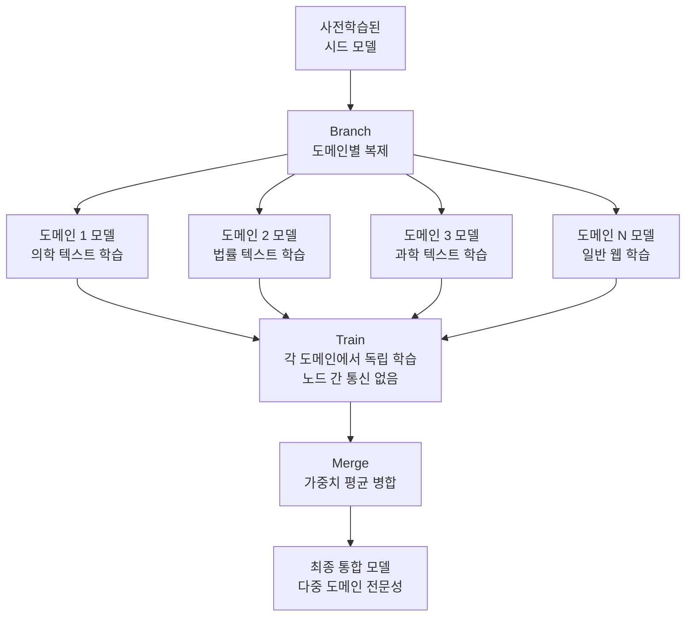
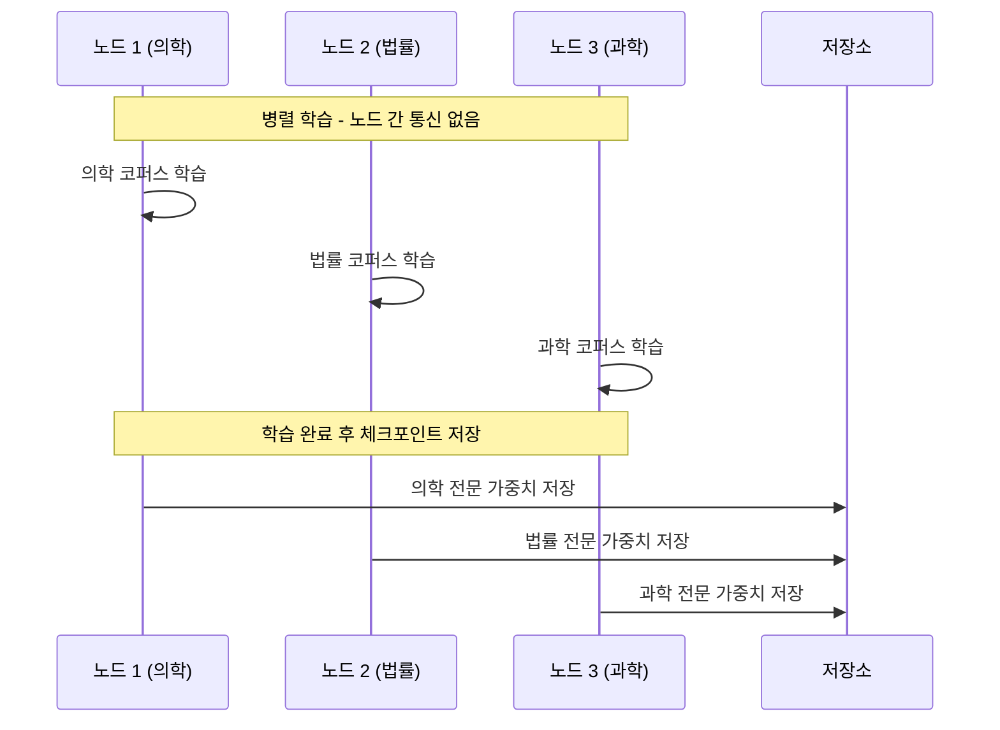
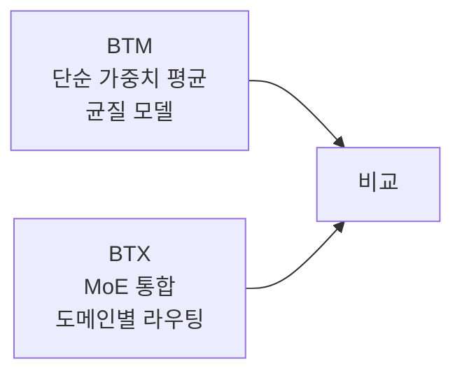

# Branch-Train-Merge (BTM) - 통신 없는 분산 사전학습

Branch-Train-Merge(BTM)는 Li et al.(2022)이 제안한 분산 사전학습 방법론이다. 단일 대형 모델을 공동으로 학습하는 대신, 도메인별로 모델을 **독립적으로(통신 없이) 학습**한 후 가중치를 **평균내어 병합**한다. 통신 비용이 없어 분산 학습의 병목을 우회하는 것이 핵심이다.

## 세 단계 파이프라인



## Branch 단계: 씨앗 모델에서 분기

사전학습된 기반 모델(또는 처음부터 초기화된 모델)을 K개 도메인별로 복제한다.

```python
import copy

base_model = load_pretrained_model("gpt2-large")

# 각 도메인을 위한 복제
domain_models = {
    "medical": copy.deepcopy(base_model),
    "legal": copy.deepcopy(base_model),
    "scientific": copy.deepcopy(base_model),
    "general": copy.deepcopy(base_model),
}
```

## Train 단계: 통신 없는 병렬 학습

각 도메인 모델을 **완전히 독립적인 노드**에서 학습한다. 핵심 특징은 노드 간 그래디언트 동기화가 전혀 없다는 것이다.



### 기존 분산 학습(데이터 병렬)과의 비교

| 특성 | 데이터 병렬 (AllReduce) | Branch-Train-Merge |
|------|----------------------|-------------------|
| 노드 간 통신 | 매 배치 동기화 | 없음 |
| 통신 비용 | 높음 (네트워크 병목) | 0 |
| 노드 장애 영향 | 전체 학습 중단 | 해당 도메인만 영향 |
| 스케일 확장성 | 통신 증가로 한계 | 선형 확장 가능 |
| 도메인 전문화 | 불가능 | 자연스러운 특화 |

## Merge 단계: 가중치 평균 병합

모든 도메인 학습이 완료되면 가중치를 단순 평균하여 병합한다.

$$\theta_{merged} = \frac{1}{K} \sum_{k=1}^{K} \theta_k$$

```python
def branch_train_merge(domain_models: dict) -> dict:
    """균등 가중치 평균으로 모델 병합"""
    merged_params = {}
    num_models = len(domain_models)

    # 모든 파라미터에 대해 평균
    for param_name in list(domain_models.values())[0].state_dict():
        param_sum = sum(
            model.state_dict()[param_name].float()
            for model in domain_models.values()
        )
        merged_params[param_name] = param_sum / num_models

    return merged_params
```

### 가중치 평균이 왜 작동하는가

모델들이 **같은 초기점(시드 모델)에서 출발**하여 각자의 방향으로 학습했기 때문에, 가중치 공간에서 이들의 평균은 "공통 핵심 + 각 도메인 특성"을 합산하는 효과가 있다.

이는 [[model-merging]] 분야의 "손실 경관 평탄화" 이론과 연결된다: 동일 초기점에서 출발한 모델들의 가중치 평균은 학습 손실을 크게 저하시키지 않는 경우가 많다.

### 가중치 평균 변형

균등 평균 외에도 다양한 변형이 가능하다:

```python
# 도메인 데이터 크기 비례 가중치
domain_sizes = {"medical": 10_000_000, "legal": 5_000_000, "scientific": 8_000_000}
total = sum(domain_sizes.values())

weighted_params = {}
for param_name in model_params:
    weighted_sum = sum(
        (domain_sizes[d] / total) * model.state_dict()[param_name]
        for d, model in domain_models.items()
    )
    weighted_params[param_name] = weighted_sum
```

## 왜 중요한가

### 통신 비용 제거

대규모 LLM 사전학습에서 AllReduce 통신이 전체 학습 시간의 40-60%를 차지하는 경우도 있다. BTM은 이 비용을 완전히 제거한다.

### 장애 격리

특정 노드가 장애를 일으켜도 다른 도메인 학습에 영향을 주지 않는다. 장애 도메인만 재시작하면 된다.

### 비동기 학습 가능

도메인마다 학습 속도가 다를 수 있다. 일부 도메인이 먼저 완료되어도 기다릴 필요 없이 나중에 합산할 수 있다.

## 한계와 주의사항

### 도메인 불균형 문제
도메인 간 데이터 분포 차이가 크면 단순 평균이 최선이 아닐 수 있다. 가중치 평균 시 각 도메인의 기여도를 조절해야 한다.

### 도메인 분할의 어려움
"의학", "법률" 등 명확한 도메인이 아닌 경우 어떻게 분할할지 결정이 어렵다. 경계가 불분명한 도메인은 중복 학습이 발생한다.

### 단일 모델 대비 품질 손실
완전히 공동으로 학습된 단일 모델(AllReduce 방식)에 비해 성능이 다소 낮을 수 있다. 특히 도메인 간 상호작용이 중요한 태스크에서.

## Branch-Train-Mix(BTX)와의 차이

BTM이 단순 가중치 평균으로 병합한다면, [[branch-train-mix-btx]]는 병합 시 **MoE(Mixture of Experts)** 구조를 사용한다. BTX는 각 도메인 전문가를 MoE의 개별 전문가로 통합하여 더 유연한 도메인별 전문화를 가능하게 한다.



## 실무 적용 가이드

### 도메인 분할 전략
1. 텍스트 도메인 클러스터링으로 자연 분할 파악
2. 토픽 모델링(LDA 등)으로 데이터 분포 분석
3. 중복이 적은 도메인 경계 설정

### 학습 데이터 권장 비율
- 각 도메인 모델: 해당 도메인 100% + 일반 데이터 10-20% 혼합
- 순수 도메인 데이터만 학습하면 일반 능력 저하 위험

## 관련 문서

- [[branch-train-mix-btx]] - BTM을 MoE로 확장한 BTX
- [[supervised-fine-tuning]] - 병합 후 추가 파인튜닝 방법
- [[instruction-tuning]] - 병합 모델에 지시 학습 적용
