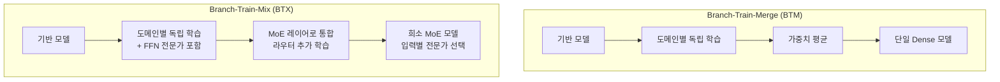
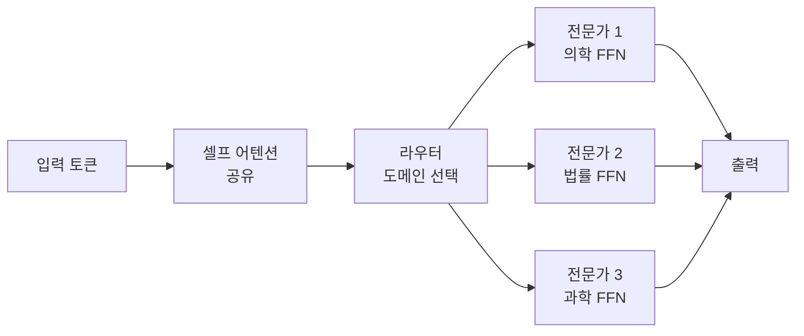
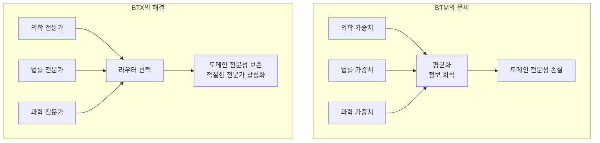

# Branch-Train-Mix (BTX) - MoE 통합 분산 사전학습

Branch-Train-Mix(BTX)는 Meta AI(2023)가 제안한 방법론으로, [[branch-train-merge]]의 후속이다. 도메인별 전문가 모델을 독립 학습한 뒤 단순 가중치 평균으로 병합하는 BTM과 달리, BTX는 학습된 도메인 전문가들을 **Mixture of Experts(MoE)** 구조로 통합하여 도메인별 전문성을 보존한다.

## BTM에서 BTX로: 핵심 차이



핵심: BTX에서 각 도메인 전문가가 MoE의 개별 "전문가(expert)"가 된다. 추론 시 라우터가 입력 내용에 따라 적절한 전문가를 선택한다.

## BTX 파이프라인 상세

### 1단계: Branch - 전문가 학습 준비

시드 모델에서 K개 도메인별 모델을 복제한다. BTX에서는 **FFN(Feed-Forward Network) 레이어를 전문가로 사용**할 것을 염두에 두고 구조를 설계한다.

트랜스포머 블록에서 MoE화할 레이어:
- Attention 레이어: 도메인 간 공유 유지
- FFN 레이어: 각 도메인 전문가로 분리



### 2단계: Train - 독립 도메인 학습

각 도메인 전문가(FFN 포함 전체 모델)를 해당 도메인 데이터로 독립 학습한다.

```python
# 각 도메인별 독립 학습 (통신 없음)
domain_configs = {
    "medical": {
        "data_path": "data/medical_corpus/",
        "num_tokens": 50_000_000_000,  # 50B 토큰
        "learning_rate": 3e-4,
    },
    "legal": {
        "data_path": "data/legal_corpus/",
        "num_tokens": 20_000_000_000,
        "learning_rate": 3e-4,
    },
    "code": {
        "data_path": "data/code_corpus/",
        "num_tokens": 30_000_000_000,
        "learning_rate": 3e-4,
    },
}

# 각 노드에서 독립 실행
for domain, config in domain_configs.items():
    train_domain_expert(domain_model[domain], config)
```

### 3단계: Mix - MoE로 통합

학습된 도메인 전문가의 FFN 가중치를 MoE 레이어로 조립하고, **라우터 네트워크를 새로 초기화하여 추가 학습**한다.

```python
import torch
import torch.nn as nn

class BTXMoELayer(nn.Module):
    """BTX MoE 레이어: 도메인 전문가 + 학습 가능한 라우터"""

    def __init__(self, domain_experts: dict, hidden_dim: int, top_k: int = 2):
        super().__init__()
        self.top_k = top_k
        num_experts = len(domain_experts)

        # 학습된 도메인 FFN들을 전문가로 등록
        self.experts = nn.ModuleList([
            domain_experts[d] for d in sorted(domain_experts)
        ])

        # 라우터: 새로 초기화 후 학습
        self.router = nn.Linear(hidden_dim, num_experts, bias=False)

    def forward(self, x: torch.Tensor) -> torch.Tensor:
        # 라우터로 전문가 선택
        router_logits = self.router(x)
        router_probs = torch.softmax(router_logits, dim=-1)

        # top-k 전문가 선택
        top_k_probs, top_k_indices = torch.topk(router_probs, self.top_k, dim=-1)
        top_k_probs = top_k_probs / top_k_probs.sum(dim=-1, keepdim=True)

        # 선택된 전문가 출력 가중 합산
        output = torch.zeros_like(x)
        for i in range(self.top_k):
            expert_idx = top_k_indices[:, :, i]
            expert_weight = top_k_probs[:, :, i].unsqueeze(-1)

            for j, expert in enumerate(self.experts):
                mask = (expert_idx == j).unsqueeze(-1).float()
                output += mask * expert_weight * expert(x)

        return output

def assemble_btx_model(base_model, domain_experts, training_data):
    """BTX 모델 조립 및 라우터 학습"""
    # MoE 레이어로 교체
    for layer_idx in range(base_model.num_layers):
        domain_ffns = {
            d: expert.layers[layer_idx].ffn
            for d, expert in domain_experts.items()
        }
        base_model.layers[layer_idx].ffn = BTXMoELayer(
            domain_ffns,
            hidden_dim=base_model.hidden_dim,
            top_k=2
        )

    # 라우터만 학습 (전문가 FFN은 동결 또는 미세 조정)
    trainable_params = [p for n, p in base_model.named_parameters() if "router" in n]
    optimizer = torch.optim.AdamW(trainable_params, lr=1e-4)

    # 혼합 데이터로 라우터 학습
    base_model.train_with_data(training_data, optimizer, epochs=1)
    return base_model
```

## BTX가 BTM보다 우수한 이유

### 도메인 전문성 보존

BTM은 가중치 평균으로 도메인 특화 정보가 희석된다. BTX는 MoE 구조로 각 전문가의 지식을 독립적으로 보존한다.



### MoE 사전학습 가속

처음부터 MoE 모델을 학습하는 것은 어렵고 불안정하다(라우터 붕괴, 전문가 불균형 등). BTX는 이미 특화된 전문가들로 MoE를 초기화하므로:

- 라우터가 처음부터 유의미한 신호를 학습할 수 있음
- 전문가 붕괴(expert collapse) 위험 감소
- 전체 MoE 학습 대비 compute 절감

## MoE 구조의 장점 상속

BTX는 MoE의 일반적 장점을 그대로 상속한다.

| 장점 | 내용 |
|------|------|
| 희소 활성화 | 추론 시 전체 파라미터의 일부만 사용 |
| 파라미터 효율 | 같은 계산량으로 더 많은 파라미터 수용 가능 |
| 전문화 | 입력 유형에 따라 적절한 전문가 자동 선택 |
| 확장성 | 전문가 수를 늘려 용량 확장 |

## 라우터 학습 전략

BTX에서 가장 중요한 단계 중 하나는 라우터 학습이다.

### 보조 손실 (Auxiliary Loss)

전문가 간 부하 균형을 위해 보조 손실을 추가한다.

$$L_{aux} = \alpha \cdot K \sum_{i=1}^{K} f_i \cdot P_i$$

여기서 $f_i$는 전문가 $i$에게 라우팅된 토큰 비율, $P_i$는 라우터 확률. 이 항이 전문가 간 균등 분배를 장려한다.

### 전문가 드롭아웃

학습 시 전문가를 랜덤으로 드롭아웃하여 라우터가 단일 전문가에 과의존하지 않도록 한다.

## 실험 결과 (BTX 논문 기준)

Meta AI 실험에서 BTX는 다음 결과를 보였다:

- **BTM 대비**: 도메인 특화 벤치마크에서 일관적으로 우수
- **From-scratch MoE 대비**: 동일 계산 예산에서 더 빠른 수렴
- **Dense 동등 모델 대비**: 추론 비용을 유지하면서 성능 향상

## 적합한 사용 사례

### BTX가 적합한 경우
- 명확히 분리된 도메인이 있는 경우 (의학, 법률, 코딩 등)
- 도메인별 최고 성능이 중요한 경우
- MoE 인프라를 지원하는 환경

### BTM이 더 나은 경우
- 단순한 인프라가 필요한 경우 (Dense 모델 유지)
- 도메인 경계가 불분명한 경우
- 빠른 프로토타이핑이 목표인 경우

## 관련 문서

- [[branch-train-merge]] - BTX의 기반이 된 BTM 방법론
- [[supervised-fine-tuning]] - BTX 모델 후속 파인튜닝
- [[instruction-tuning]] - BTX 모델에 지시 학습 적용 패턴
