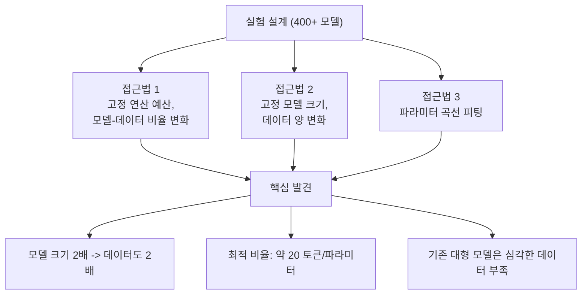
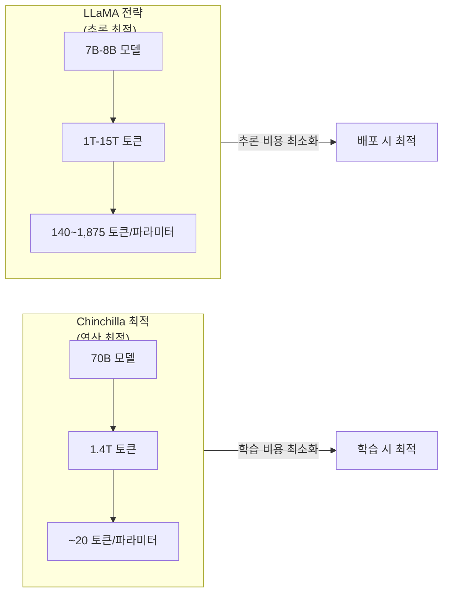

# 친칠라 스케일링 법칙 (Chinchilla Scaling Laws)

Hoffmann et al.(2022)이 "Training Compute-Optimal Large Language Models" 논문에서 발표한 스케일링 법칙이다. 핵심 발견은 **모델 크기와 학습 데이터 양을 동일한 비율로 스케일해야 연산 예산 대비 최적 성능을 달성한다**는 것이다. 이 결과는 "모델을 크게 만들수록 좋다"는 기존 관행을 수정하고, 데이터 양의 중요성을 부각시킨 전환점이었다.

## 배경: Kaplan 스케일링 법칙의 한계

Kaplan et al.(2020)의 [[neural-scaling-laws|신경망 스케일링 법칙]]은 모델 크기(N), 데이터 크기(D), 연산량(C)과 손실 사이의 멱법칙(power-law) 관계를 확인했다. 그러나 Kaplan의 처방은 "큰 모델을 적은 데이터로 학습하고, 수렴 전에 멈추는 것"이 연산 효율적이라는 결론이었다.

이 처방에 따라 업계는 모델 크기를 급격히 늘리는 방향으로 진행했다:

| 모델 | 파라미터 | 학습 토큰 | 토큰/파라미터 비율 |
|------|---------|----------|-----------------|
| GPT-3 (2020) | 175B | 300B | ~1.7 |
| Gopher (2021) | 280B | 300B | ~1.1 |
| Jurassic-1 (2021) | 178B | 300B | ~1.7 |
| MT-NLG (2022) | 530B | 270B | ~0.5 |

토큰/파라미터 비율이 2 미만으로, Chinchilla 기준에서 보면 이 모델들은 심각하게 데이터 부족(undertrained) 상태였다.

## Chinchilla의 실험과 핵심 발견

Hoffmann et al.은 세 가지 접근법으로 400개 이상의 모델(70M ~ 16B 파라미터, 5B ~ 500B 토큰)을 학습시켰다.



### 핵심 방정식

연산 예산 C가 주어졌을 때, 최적 모델 크기 N*과 데이터 크기 D*는:

```
N* ~ C^a        (a ~ 0.50)
D* ~ C^b        (b ~ 0.50)
```

즉, 연산 예산이 증가하면 모델과 데이터에 거의 균등하게 투자해야 한다. 이는 Kaplan의 결론(모델 크기에 더 많은 예산을 투자)과 직접적으로 대치된다.

### Kaplan vs Chinchilla 비교

| 항목 | Kaplan (2020) | Chinchilla (2022) |
|------|--------------|-------------------|
| 모델-데이터 배분 | 모델 크기 우선 | 균등 스케일링 |
| 최적 토큰/파라미터 비율 | 명시적 처방 없음 | ~20:1 |
| 데이터의 중요성 | 상대적으로 과소평가 | 모델 크기와 동등 |
| 학습 완료 | 수렴 전 조기 종료 | 충분한 학습 권장 |
| 스케일링 지수 | N에 더 큰 지수 | N과 D에 유사한 지수 |

### Chinchilla 모델의 실증

70B 파라미터의 Chinchilla 모델이 280B 파라미터의 Gopher와 동일한 연산 예산을 사용하면서도 일관되게 우수한 성능을 보였다.

- MMLU: 67.5% (Gopher 대비 +7%p)
- GPT-3(175B), Jurassic-1(178B), MT-NLG(530B)를 광범위한 벤치마크에서 능가
- 4배 적은 추론 비용 (70B vs 280B)

## 업계에 미친 영향

Chinchilla의 결과는 즉각적이고 광범위한 영향을 미쳤다.

**데이터 병목 인식**: 모델 크기만 키우는 전략의 한계가 드러나면서, [[pretraining-data-curation|학습 데이터 큐레이션]]과 [[fineweb-dataset|고품질 데이터셋]] 구축이 핵심 경쟁력으로 부상했다.

**추론 효율**: 동일 성능에서 더 작은 모델을 사용할 수 있으므로, 배포 비용이 크게 절감된다. 이는 파인튜닝([[lora-qlora-finetuning]])과 양자화에서도 이점을 제공한다.

**최적 모델 크기 재산정**: 기존에 수백B 규모로 계획되던 학습이 수십B + 대규모 데이터로 재조정되었다.

## Chinchilla 이후: Over-Training 전략

Chinchilla가 "연산 최적(compute-optimal)" 비율을 제시했지만, 실전에서는 다른 차원의 최적화가 등장했다. "추론 최적(inference-optimal)"이라는 관점이다.



| 모델 | 파라미터 | 학습 토큰 | 토큰/파라미터 | Chinchilla 대비 |
|------|---------|----------|-------------|---------------|
| Chinchilla (2022) | 70B | 1.4T | ~20 | 1x (기준) |
| LLaMA-1-7B (2023) | 7B | 1T | ~143 | ~7x over |
| LLaMA-2-7B (2023) | 7B | 2T | ~286 | ~14x over |
| LLaMA-3-8B (2024) | 8B | 15T | ~1,875 | ~94x over |

핵심 논리: 학습은 한 번이지만 추론은 수십억 번 발생한다. 작은 모델을 과도하게 학습(over-train)시키면 학습 비용은 증가하지만, 배포 후 추론 비용이 크게 절감된다. 충분한 추론 수요(약 10억 요청 이상)가 예상되면 over-training이 총비용 기준으로 유리하다.

연구에 따르면 토큰/파라미터 비율을 10,000까지 극단적으로 높여도 모델 품질이 계속 향상되며, 기존에 우려했던 성능 포화가 나타나지 않는다는 결과도 보고되었다.

## 재현성 논의

Besiroglu et al.(2024)의 재현 시도("Chinchilla Scaling: A replication attempt")에서 원 논문의 세 가지 접근법 간 최적 비율 추정치에 상당한 차이가 있음이 발견되었다. 특히 접근법 3의 추정치가 접근법 1, 2와 차이를 보여, 정확한 최적 비율(20:1)의 보편성에 대한 논의가 계속되고 있다. 그러나 "모델과 데이터를 균등하게 스케일해야 한다"는 정성적 결론 자체는 광범위하게 지지된다.

## 관련 문서

- [[neural-scaling-laws]] -- Kaplan(2020)부터 Chinchilla(2022)까지의 스케일링 법칙 전체 흐름
- [[pretraining-pipeline-e2e]] -- 사전학습 파이프라인에서의 연산 예산 배분
- [[pretraining-data-curation]] -- Chinchilla가 부각시킨 데이터 품질과 양의 중요성
- [[optimizer-selection]] -- 연산 예산 내에서 [[adamw-optimizer|AdamW]] 등 옵티마이저 효율 선택
- [[learning-rate-scheduling]] -- 학습 토큰 수에 따른 스케줄 조정
- [[llama-3-training]] -- Chinchilla 비율을 94배 초과하는 over-training 사례

## 참고 자료

- [Training Compute-Optimal Large Language Models (Hoffmann et al., 2022)](https://arxiv.org/abs/2203.15556)
- [Scaling Laws for Neural Language Models (Kaplan et al., 2020)](https://arxiv.org/abs/2001.08361)
- [Chinchilla Scaling: A replication attempt (Besiroglu et al., 2024)](https://arxiv.org/abs/2404.10102)
- [Beyond Chinchilla-Optimal: Accounting for Inference in Language Model Scaling Laws (2024)](https://arxiv.org/abs/2401.00448)
- [LLaMA: Open and Efficient Foundation Language Models (Touvron et al., 2023)](https://arxiv.org/abs/2302.13971)
