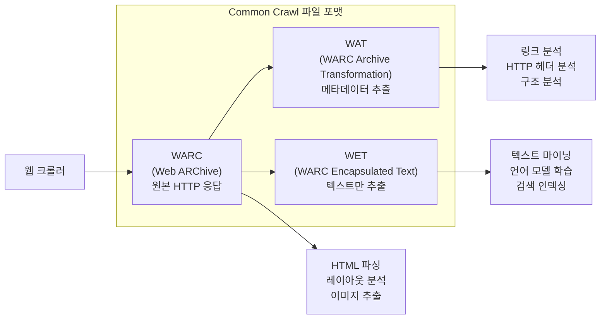
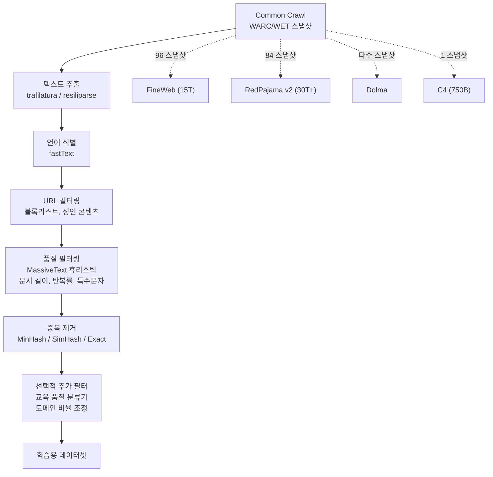

# Common Crawl - 웹 아카이브 데이터셋

## 개요

Common Crawl은 캘리포니아 등록 501(c)(3) 비영리 재단인 Common Crawl Foundation이 운영하는 오픈 웹 아카이브 프로젝트다. Gil Elbaz가 설립하여 2011년부터 월간 웹 크롤링을 수행하고 있으며, 2026년 4월 기준 누적 3,000억 페이지 이상의 웹 데이터를 수집했다. 전체 데이터는 AWS Open Data Registry에 무료로 공개되어 있다.

거의 모든 대규모 LLM 사전학습 데이터셋이 Common Crawl을 원천으로 사용한다. [[fineweb-dataset]]은 96개 스냅샷에서 15T 토큰을, [[redpajama-v2]]는 84개 스냅샷에서 30T+ 토큰을, [[dolma-dataset]]은 다수 스냅샷을 처리하여 구축되었다. C4, The Pile, RefinedWeb, SlimPajama 등도 모두 Common Crawl 기반이며, 현대 LLM 학습 데이터의 사실상 유일한 대규모 원천이다.

- 공식 사이트: [commoncrawl.org](https://commoncrawl.org/)
- 데이터: [AWS Open Data Registry](https://registry.opendata.aws/commoncrawl/)
- 크롤 통계: [cc-crawl-statistics](https://commoncrawl.github.io/cc-crawl-statistics/)

## 데이터 규모

### 월간 스냅샷 (2026년 기준)

| 지표 | 수치 |
|------|------|
| 월간 크롤링 페이지 | 약 20-25억 페이지 |
| 월간 비압축 데이터 | 약 350-400 TiB |
| 누적 페이지 수 | 3,000억+ 페이지 |
| 총 데이터 규모 | 페타바이트 단위 |

2026년 3월 스냅샷은 19.7억 페이지(344.64 TiB 비압축), 2026년 1월 스냅샷은 23억 페이지(398 TiB 비압축)를 포함한다.

### 웹 그래프

2026년 1-3월 기준 웹 그래프 통계:
- 호스트 수준: 2억 7,020만 노드, 90억 에지
- 도메인 수준: 1억 2,000만 노드, 44억 에지

## 데이터 포맷

Common Crawl은 3가지 파일 포맷으로 데이터를 제공한다.

### WARC (Web ARChive)

크롤링의 원본 데이터로, HTTP 요청(request), 응답(response), 크롤 메타데이터(metadata) 세 종류의 레코드를 포함한다. HTML 원본, 이미지, CSS 등 전체 HTTP 응답이 보존되어 가장 풍부한 정보를 담고 있다. [[fineweb-dataset]]은 WET 대신 WARC에서 trafilatura로 직접 텍스트를 추출하여 더 높은 품질을 달성했다.

### WAT (WARC Archive Transformation)

WARC 레코드에서 계산된 메타데이터를 담고 있다. HTML 문서의 경우 HTTP 헤더, 링크 목록(유형 포함), 구조 정보 등이 포함된다. 웹 그래프 분석이나 도메인별 통계 산출에 사용된다.

### WET (WARC Encapsulated Text)

HTML에서 추출된 순수 텍스트만 포함하는 포맷이다. 텍스트 처리 작업에 편리하지만, 불필요한 메뉴, 헤더, 광고 텍스트가 섞이는 경우가 많아 LLM 학습에서는 WARC에서 직접 추출하는 방식이 더 선호되고 있다.

## LLM 학습 데이터로의 변환

Common Crawl 원본 데이터는 그대로 LLM 학습에 사용할 수 없다. [[pretraining-data-curation]]에서 다루는 다단계 정제 파이프라인이 필수적이다.

### 주요 파생 데이터셋

| 데이터셋 | 토큰 수 | 스냅샷 수 | 특징 | 관련 위키 |
|---------|---------|----------|------|----------|
| FineWeb | ~15T | 96 | trafilatura 추출, 선별적 휴리스틱 | [[fineweb-dataset]] |
| FineWeb-Edu | ~1.3T | - | FineWeb의 교육 품질 서브셋 | [[fineweb-dataset]] |
| RedPajama v2 | ~30T | 84 | 품질 시그널 공개, raw + 필터 | [[redpajama-v2]] |
| Dolma | ~3T | 다수 | AI2 OLMo용, 투명한 큐레이션 | [[dolma-dataset]] |
| C4 | ~750B | 1 | Google T5 학습용, 규칙 기반 필터 | - |
| The Pile | ~825B | - | 22개 큐레이션 소스 (CC 포함) | - |
| RefinedWeb | ~5T | - | Falcon용, 엄격한 중복 제거 | - |
| SlimPajama | ~627B | - | RedPajama v1 정제판 | - |

## 품질 문제와 과제

Common Crawl은 웹 전체를 무차별적으로 수집하므로 본질적인 품질 문제가 존재한다.

### 중복

동일 콘텐츠가 여러 URL로 존재하거나, 스냅샷 간 동일 페이지가 반복 수집된다. MinHash, SimHash, 정확 일치(Exact Dedup) 등 다양한 중복 제거 기법이 적용되지만, 의미적 중복(semantic dedup)까지 완벽히 제거하기는 어렵다. [[fineweb-dataset]]의 실험에서는 스냅샷별 개별 중복 제거가 전체 일괄 처리보다 오히려 더 나은 학습 성능을 보이는 흥미로운 결과도 보고되었다.

### 유해 콘텐츠

성인 콘텐츠, 혐오 표현, 스팸, 피싱 페이지 등이 포함된다. URL 블록리스트, 텍스트 분류기, 특정 키워드 필터 등의 다단계 방어가 필요하다.

### 라이선스와 저작권

웹 페이지의 저작권은 원저작자에게 있으므로, Common Crawl 데이터를 LLM 학습에 사용하는 것의 합법성은 지역별 법률에 따라 논쟁 중이다. 특히 EU AI Act는 학습 데이터의 출처 공개를 요구하고 있어 데이터 리니지 추적이 중요해지고 있다.

### 편향

영어 중심 편향(전체 데이터의 상당 부분이 영어), 선진국 웹사이트 편향, 상업적 콘텐츠 과대 대표 등의 문제가 존재한다. 다국어 LLM 학습 시 언어별 균형 맞추기가 핵심 과제다.

## 크롤링 인프라

Common Crawl은 매월 약 1회 크롤링을 수행하며, AWS 인프라에서 운영된다. 크롤 결과는 S3에 저장되어 누구나 무료로 접근할 수 있다. 전체 인덱스는 Columnar Index(Parquet 기반)로 제공되어 특정 도메인이나 MIME 타입별로 효율적인 필터링이 가능하다.

| 항목 | 내용 |
|------|------|
| 크롤링 주기 | 월 1회 |
| 저장소 | AWS S3 (Open Data) |
| 인덱스 | Columnar Index (Parquet) |
| 접근 비용 | 무료 (S3 전송 비용만 발생) |
| 데이터 시작 | 2011년 |

## 대표 자료

- [Common Crawl 공식 사이트](https://commoncrawl.org/)
- [Common Crawl Blog - Navigating the WARC Format](https://commoncrawl.org/blog/navigating-the-warc-file-format)
- [Common Crawl Crawl Statistics](https://commoncrawl.github.io/cc-crawl-statistics/)

## 관련 문서

- [[fineweb-dataset]] -- Common Crawl 96개 스냅샷에서 구축된 15T 토큰 데이터셋
- [[redpajama-v2]] -- Common Crawl 84개 스냅샷 기반 30T+ 토큰 데이터셋
- [[dolma-dataset]] -- AI2의 Common Crawl 기반 공개 데이터셋
- [[pretraining-data-curation]] -- Common Crawl 원본에서 학습 데이터로의 큐레이션 기법
- [[data-decontamination]] -- 벤치마크 오염 방지를 위한 데이터 정제
- [[data-mixing-curriculum-learning]] -- Common Crawl 기반 데이터셋의 도메인 배합 전략
