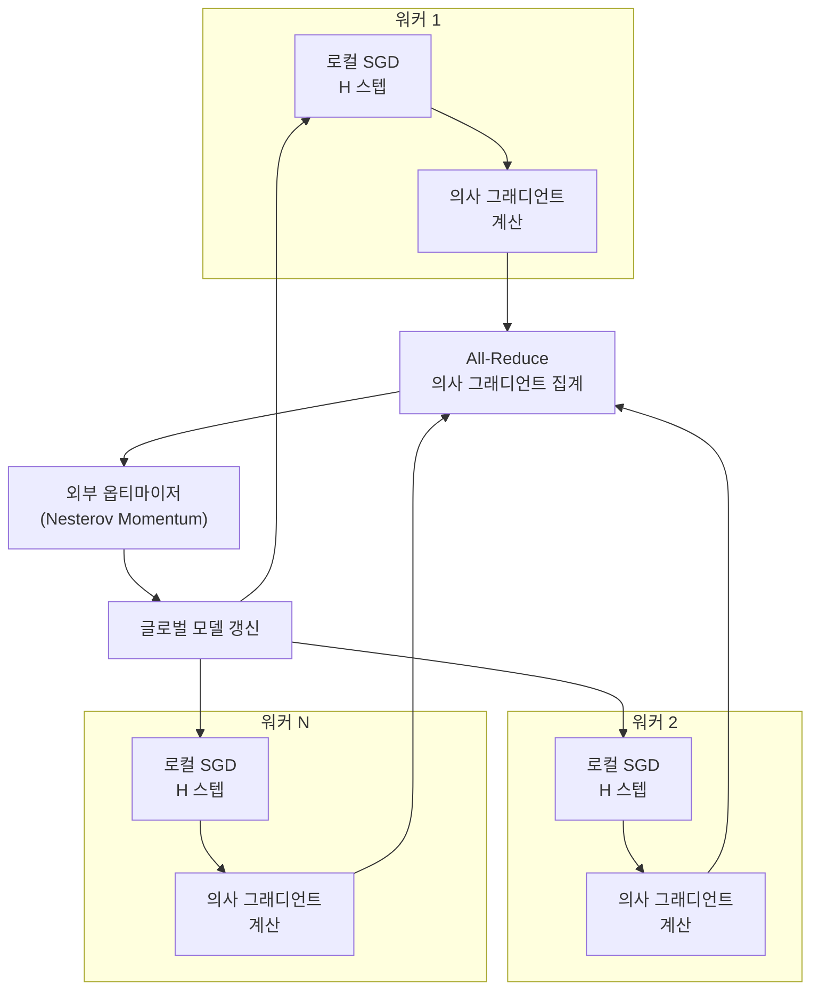
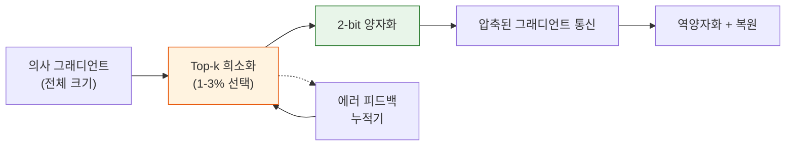

# 통신 효율 분산 학습 (Communication-Efficient Training)

## 개요

통신 효율 분산 학습은 GPU/TPU 클러스터 간의 통신 오버헤드를 극적으로 줄이면서도 학습 품질을 유지하는 분산 학습 기법이다. LLM 학습이 수천 개의 가속기를 활용하는 현재, [[distributed-communication|분산 통신 백엔드(NCCL, Gloo)]]의 대역폭이 학습 처리량의 병목이 되고 있다. 특히 데이터센터 간(cross-datacenter) 학습에서는 통신 지연이 수십 ms에 달해, 매 스텝 동기화하는 기존 [[data-parallelism-fsdp|데이터 병렬화(FSDP)]] 방식이 비현실적이다. DiLoCo(2023), SparseLoCo(2025), EDGC(2025) 등이 Local SGD, 그래디언트 압축, 동적 압축률 조정 등을 통해 이 문제를 해결한다.

## 핵심 문제: 통신 병목

### 동기식 분산 학습의 통신 비용

표준 데이터 병렬 학습에서는 매 학습 스텝마다 all-reduce 연산으로 전체 그래디언트를 동기화한다. 모델 크기가 M 파라미터이고 N개의 워커를 사용할 때:

| 모델 규모 | 그래디언트 크기 (FP32) | 매 스텝 통신량 |
|----------|---------------------|-------------|
| 7B | 28 GB | ~56 GB (all-reduce) |
| 70B | 280 GB | ~560 GB |
| 405B | 1.6 TB | ~3.2 TB |

데이터센터 내부의 NVLink/InfiniBand(수백 GB/s)에서는 이 통신이 상대적으로 빠르지만, 데이터센터 간 링크(수 GB/s)에서는 학습 시간의 대부분이 통신 대기로 소비된다.

### 통신 효율이 필요한 시나리오

- **교차 데이터센터 학습**: 지리적으로 분산된 GPU를 활용하는 경우
- **인터넷 기반 분산 학습**: 네트워크 대역폭이 제한적인 환경
- **비용 최적화**: 인터커넥트 대역폭이 낮은 저비용 클러스터 활용
- **확장성**: 클러스터 규모가 커질수록 통신 오버헤드 비율 증가

## DiLoCo: Local SGD 기반 접근

### 기본 원리

DiLoCo(Distributed Low-Communication, Douillard et al. 2023)는 연합 학습(Federated Averaging)의 변형으로, 각 워커가 H번의 로컬 학습 스텝을 수행한 뒤 의사 그래디언트(pseudo-gradient)를 동기화하는 방식이다.

### 이중 옵티마이저 구조

DiLoCo는 내부(inner)와 외부(outer) 두 개의 옵티마이저를 사용한다:

| 옵티마이저 | 역할 | 알고리즘 | 실행 빈도 |
|-----------|------|---------|----------|
| **내부(Inner)** | 각 워커의 로컬 학습 | AdamW | 매 스텝 |
| **외부(Outer)** | 글로벌 모델 동기화 | Nesterov Momentum | H 스텝마다 |

의사 그래디언트는 `(현재 로컬 모델 - 마지막 동기화 시점 모델)` / 학습률로 계산된다. 외부 옵티마이저가 이 의사 그래디언트들의 평균으로 글로벌 모델을 갱신한다.

### DiLoCo의 통신 절감 효과

C4 데이터셋에서 8개 워커로 실험한 결과, DiLoCo는 완전 동기식 학습과 동등한 성능을 달성하면서 통신량을 **500배** 절감했다. H=500으로 설정하면 500 스텝에 1번만 동기화하므로, 교차 데이터센터 링크에서도 실용적인 학습이 가능하다.

## SparseLoCo: 극단적 압축

### DiLoCo의 잔존 병목

DiLoCo가 동기화 빈도를 줄이지만, 동기화 시에는 여전히 전체 모델 크기의 그래디언트를 통신한다. 대형 모델에서는 이 한 번의 동기화도 수 TB에 달할 수 있다.

### SparseLoCo의 해법

SparseLoCo(Sarfi et al., 2025, NeurIPS 2025)는 DiLoCo에 Top-k 희소화(sparsification)와 2-bit 양자화(quantization)를 결합하여, 의사 그래디언트의 **1-3%만 통신**하면서도 전정밀도 DiLoCo를 능가하는 성능을 달성한다.

### 핵심 관찰

SparseLoCo의 두 가지 핵심 통찰:

1. **에러 피드백으로 외부 모멘텀 근사**: 외부 옵티마이저의 Nesterov 모멘텀을 에러 피드백 누적기(error feedback accumulator)로 로컬에서 근사할 수 있다. Top-k에서 탈락한 그래디언트 성분을 누적하여 다음 동기화에 반영함으로써, 장기적으로 정보 손실을 방지한다.

2. **희소 집계의 역설적 이점**: 직관과 달리, 희소 그래디언트의 집계가 전정밀도 집계보다 모델 성능을 개선할 수 있다. 큰 크기의 그래디언트 성분만 선택적으로 동기화하면 노이즈가 줄어들어, 외부 옵티마이저의 갱신 품질이 향상된다.

### 압축률과 성능

| 설정 | 통신량 (DiLoCo 대비) | 성능 |
|------|---------------------|------|
| DiLoCo (기준선) | 100% | 기준 |
| SparseLoCo (Top-3%, FP32) | 3% | 기준 동등 |
| SparseLoCo (Top-1%, 2-bit) | ~0.06% | 기준 초과 |

통신량을 DiLoCo 대비 1,600배 이상 추가 절감하면서도 성능이 유지되거나 오히려 개선된다.

## EDGC: 엔트로피 기반 동적 압축

### 고정 압축률의 한계

SparseLoCo를 포함한 기존 방법들은 학습 전체에 걸쳐 고정된 압축률을 사용한다. 그러나 학습 초기(그래디언트 분산이 큰 시점)와 후기(수렴 근처)에서 최적 압축률은 다르다.

### EDGC의 접근법

EDGC(Entropy-Driven Dynamic Gradient Compression, 2025)는 그래디언트의 엔트로피를 실시간으로 모니터링하여 압축률을 동적으로 조정한다:

- **그래디언트 엔트로피 높음** (정보가 분산) -> 낮은 압축률 (더 많은 성분 전송)
- **그래디언트 엔트로피 낮음** (소수 성분에 집중) -> 높은 압축률 (핵심 성분만 전송)

### 성능 결과

EDGC는 통신 지연시간을 최대 **46.45%**, 전체 학습 시간을 최대 **16.13%** 절감하면서 LLM 정확도를 유지한다. 고정 압축률 대비 학습 단계에 따른 적응적 자원 배분이 효율적이기 때문이다.

## 통신 효율 기법 비교

| 기법 | 접근 방식 | 통신 절감 | 추가 연산 | 적용 규모 |
|------|----------|----------|----------|----------|
| 그래디언트 양자화 | FP32를 FP16/INT8로 압축 | 2-4배 | 최소 | 범용 |
| Local SGD / DiLoCo | 동기화 빈도 축소 | 500배 | 로컬 옵티마이저 | 8-64 워커 |
| SparseLoCo | 희소화 + 양자화 | 800,000배+ | 에러 피드백 | 대규모 |
| EDGC | 동적 압축률 | 변동적 (~2배) | 엔트로피 계산 | 범용 |

## 실무 적용 가이드

### 시나리오별 권장 전략

- **단일 데이터센터, 고속 인터커넥트**: 표준 [[data-parallelism-fsdp|FSDP]]/[[deepspeed-zero|ZeRO]] + [[mixed-precision-training|혼합 정밀도]]로 충분
- **교차 데이터센터, 중간 대역폭**: DiLoCo (H=100~500)
- **인터넷 기반, 저대역폭**: SparseLoCo (Top-1~3%, 2-bit)
- **가변 네트워크 조건**: EDGC (동적 적응)

### [[tensor-pipeline-parallelism|파이프라인 병렬화]]와의 결합

통신 효율 기법은 주로 데이터 병렬화 차원의 통신을 줄이는 데 초점을 맞춘다. 파이프라인 병렬화나 텐서 병렬화는 노드 내부에서 고속 인터커넥트로 수행하고, 데이터 병렬화 차원만 통신 효율 기법을 적용하는 하이브리드 구성이 실무에서 사용된다.

## 향후 연구 방향

- **비동기 Local SGD**: 동기화 시점도 워커별로 독립적으로 결정하여 stragglers 문제 해결
- **적응적 H 스케줄링**: 학습 단계에 따라 로컬 스텝 수를 조정
- **대규모 검증**: 현재까지 대부분 수십B 규모 검증, 수백B 이상에서의 체계적 평가 필요
- **이기종 클러스터**: 서로 다른 GPU 유형/속도를 가진 워커 간의 효율적 동기화

## 참고 문헌

- Douillard et al., "DiLoCo: Distributed Low-Communication Training of Language Models" (arXiv:2311.08105, 2023)
- Sarfi et al., "Communication Efficient LLM Pre-training with SparseLoCo" (arXiv:2508.15706, NeurIPS 2025)
- "EDGC: Entropy-driven Dynamic Gradient Compression for Efficient LLM Training" (arXiv:2511.10333, 2025)
