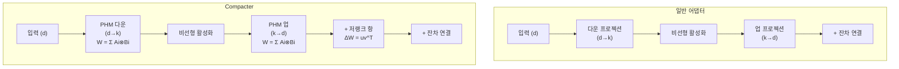
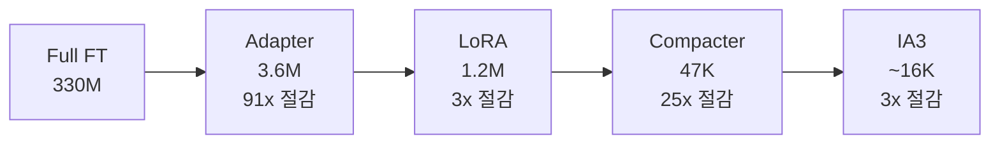

# Compacter - 초복소수 기반 초경량 어댑터

## 배경

Adapter Layers(Houlsby et al., 2019)는 트랜스포머 내부에 소형 병목 모듈을 삽입하는 PEFT 방법이다. 표현력은 좋지만 파라미터 수가 LoRA보다 많아 경량화 필요성이 대두됐다.

**Compacter(Karimi Mahabadi et al., 2021, Imperial College London)**는 두 가지 수학적 기법을 결합해 어댑터 파라미터를 **100배 이상 줄이면서도 성능을 유지**한다:

1. **크로네커 곱(Kronecker product)**: 행렬을 소형 행렬의 텐서 곱으로 분해
2. **저랭크 분해(Low-rank decomposition)**: 각 구성 행렬을 추가로 저랭크화

이름 "Compacter"는 "Compact Adapter"에서 유래했다. PHM(Parameterized Hypercomplex Multiplication) 레이어를 어댑터에 적용한 것이 핵심이다.

## 수학적 기반: PHM 레이어

### 하이퍼복소수(Hypercomplex) 곱셈

PHM은 $n$차원 하이퍼복소수 대수(hypercomplex algebra)에서 영감을 받았다. 일반 행렬 곱 $Wx$($W \in \mathbb{R}^{d \times d}$) 대신 다음 구조를 사용한다:

$$W = \sum_{i=1}^{n} A_i \otimes B_i$$

- $A_i \in \mathbb{R}^{n \times n}$: 공유 행렬 (모든 레이어에 동일, 학습됨)
- $B_i \in \mathbb{R}^{\frac{d}{n} \times \frac{d}{n}}$: 레이어별 개별 행렬 (학습됨)
- $\otimes$: 크로네커 곱

크로네커 곱의 성질:

$$A \otimes B = \begin{pmatrix} a_{11}B & a_{12}B & \cdots \\ a_{21}B & a_{22}B & \cdots \\ \vdots & \ddots \end{pmatrix}$$

$A \in \mathbb{R}^{m \times n}$, $B \in \mathbb{R}^{p \times q}$이면 $A \otimes B \in \mathbb{R}^{mp \times nq}$

### 파라미터 수 비교

일반 어댑터 (입력/출력 차원 $d$, 병목 차원 $k$):

$$\text{파라미터} = 2dk + 2d \approx 2dk$$

Compacter (동일 $d$, $k$, 분할 $n$):

$$\text{파라미터} = n \cdot n^2 + n \cdot \left(\frac{k}{n}\right)^2 = n^3 + \frac{k^2}{n}$$

$n=4$, $d=768$, $k=64$를 예로 들면:
- 일반 어댑터: $2 \times 768 \times 64 = 98,304$
- Compacter: $4^3 + 64^2/4 = 64 + 1,024 = 1,088$

약 **90배** 파라미터 절감이다.

## 전체 아키텍처



Compacter는 PHM 레이어에 추가로 **저랭크 항**을 더한다:

$$W_{total} = W_{PHM} + uv^T$$

$u \in \mathbb{R}^d$, $v \in \mathbb{R}^d$: 각 레이어 별 저랭크 성분 (추가 파라미터 $2d$)

저랭크 항은 PHM이 표현하기 어려운 랭크-1 방향을 보완한다.

## 구현

```python
import torch
import torch.nn as nn

class PHMLinear(nn.Module):
    """PHM (Parameterized Hypercomplex Multiplication) 레이어"""

    def __init__(self, in_features: int, out_features: int, phm_dim: int = 4):
        super().__init__()
        self.in_features = in_features
        self.out_features = out_features
        self.phm_dim = phm_dim

        # 공유 행렬 A_i: n × n, 모든 PHM 레이어 공유
        # (실제 구현에서는 모델 전체에서 이 행렬을 공유)
        self.A = nn.Parameter(
            torch.randn(phm_dim, phm_dim, phm_dim)
        )

        # 레이어별 행렬 B_i: n × (d/n) × (k/n)
        self.B = nn.Parameter(
            torch.randn(phm_dim, out_features // phm_dim, in_features // phm_dim)
        )

        # 저랭크 보완 항
        self.u = nn.Parameter(torch.zeros(out_features))
        self.v = nn.Parameter(torch.zeros(in_features))

    def forward(self, x: torch.Tensor) -> torch.Tensor:
        # PHM 가중치 재구성: Σ A_i ⊗ B_i
        W = sum(
            torch.kron(self.A[i], self.B[i])
            for i in range(self.phm_dim)
        )
        # 저랭크 항 추가
        W = W + torch.outer(self.u, self.v)
        return x @ W.T
```

## 성능 결과

### GLUE 벤치마크 (BERT-Large)

| 방법 | 추가 파라미터 | 평균 점수 |
|------|------------|---------|
| Full FT | 330M | 85.9 |
| Adapter (k=64) | 3.6M | 85.1 |
| LoRA (r=8) | 1.2M | 84.8 |
| **Compacter** | **0.047M** | **84.6** |
| Prompt Tuning | 0.06M | 82.1 |

Adapter 대비 76배 적은 파라미터로 거의 동일한 성능을 달성했다.

### 파라미터 효율성 비교



Compacter는 LoRA와 IA3 사이의 파라미터 효율 영역을 차지한다. Adapter 대비 큰 절감이지만 IA3보다는 파라미터가 많다.

## 공유 행렬의 역할

PHM에서 $A_i$ 행렬을 모든 레이어 간에 공유하는 것이 중요한 설계 선택이다:

- **공유 시**: 전체 파라미터 수 대폭 감소, 정규화 효과로 과적합 저항
- **미공유 시**: 각 레이어 독립적 학습, 표현력 증가하나 파라미터 증가

실험 결과 공유 $A_i$가 더 우수하거나 동등한 성능을 보인다. 이는 하이퍼복소수 대수 구조가 태스크에 무관한 공통 패턴을 학습하기 때문으로 해석된다.

## 한계 및 현황

1. **구현 복잡성**: 크로네커 곱 계산, 행렬 재구성 등 구현이 복잡
2. **범용 라이브러리 지원 부족**: peft 라이브러리에 LoRA/Adapter처럼 공식 통합되지 않음
3. **GPU 메모리 레이아웃**: 크로네커 곱의 메모리 접근 패턴이 최적화 어려움
4. **채택률 낮음**: LoRA의 압도적 채택으로 실무 사용 드묾

이론적으로 우아하고 파라미터 효율이 높지만, 구현 복잡성과 생태계 지원 부족으로 실무에서는 LoRA/IA3에 자리를 내준 상태다.

## 하이퍼복소수 어댑터의 이론적 의의

Compacter의 중요성은 **파라미터 공유의 수학적 구조를 명시화**한 것에 있다:

- 크로네커 구조: 블록-분리 가능한(block-separable) 태스크 패턴 포착
- 공유 행렬: 태스크 간 공통 변환 구조 재사용
- 저랭크 항: 레이어별 독특한 방향 학습

이 구조 분석은 이후 다양한 경량 어댑터 설계에 영향을 주었다. UniPELT 등 여러 PEFT 방법론이 Compacter의 분석 프레임워크를 참조한다.

## 관련 문서

- [[lora-qlora-finetuning]] - 크로네커 구조 없는 저랭크 분해 방식
- [[ia3-injection-adapters]] - 활성값 스케일링으로 더 단순한 초경량화
- [[adalora-adaptive-rank]] - SVD 기반 적응적 랭크 할당
- [[dora-weight-decomposed-lora]] - 가중치 분해 방식의 다른 접근
- [[peft-adapter-survey]] - PEFT 방법론 전체 비교
- [[fine-tuning-overview]] - 파인튜닝 전략 개요
