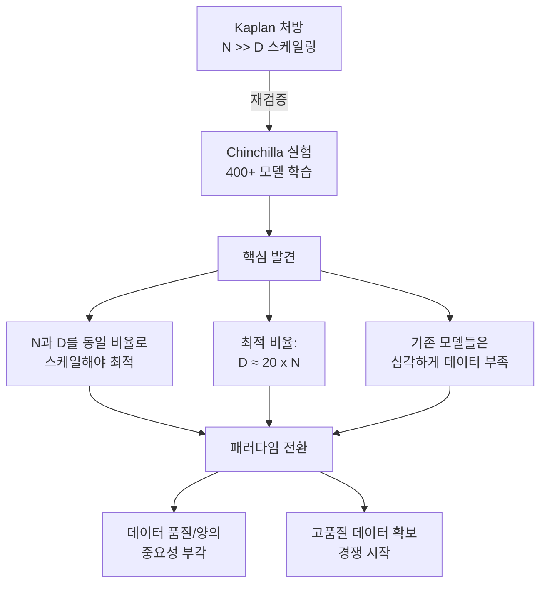

# 연산 최적 학습 (Compute-Optimal Training)

## 정의

연산 최적 학습(Compute-Optimal Training)은 **주어진 연산 예산(compute budget)에서 모델 크기와 학습 데이터 양의 최적 비율을 찾아 학습하는 전략**이다. Hoffmann et al.(2022)의 [[chinchilla-scaling-laws|친칠라 스케일링 법칙]]이 그 이론적 기초이며, 핵심 발견은 모델 파라미터 수(N)와 학습 토큰 수(D)를 **동일한 비율로 스케일해야** 연산 효율이 최대화된다는 것이다.

이 결과는 "모델을 크게 만들수록 좋다"는 이전의 관행을 근본적으로 뒤집었고, 이후 LLM 학습 전략의 패러다임을 바꾸었다.

## Kaplan에서 Chinchilla로: 패러다임 전환

### Kaplan et al.(2020)의 처방

[[neural-scaling-laws|Kaplan의 스케일링 법칙]]은 모델 크기, 데이터 크기, 연산량과 손실 사이의 멱법칙(power-law) 관계를 확인했다. 그러나 Kaplan의 결론은 다음과 같았다:

- 연산 예산이 10배 증가하면 모델 크기를 **5.5배** 키우고 데이터는 **1.8배**만 늘려라
- 즉, **모델 크기 스케일링이 데이터 스케일링보다 훨씬 효율적**

이 처방에 따라 업계는 모델을 급격히 키우는 방향으로 진행했다. GPT-3(175B), Gopher(280B), MT-NLG(530B) 모두 토큰/파라미터 비율이 2 미만이었다.

### Chinchilla의 수정(Hoffmann et al., 2022)

Hoffmann et al.은 400개 이상의 모델(70M ~ 16B 파라미터)을 다양한 설정으로 학습시켜 Kaplan의 결론을 재검증했다.

Kaplan의 "모델 크기 우선" 처방에서 Chinchilla의 "균형 스케일링"으로의 패러다임 전환을 보여준다.

핵심 발견:

- **최적 비율**: 토큰 수(D) ≈ 20 x 파라미터 수(N)
- **Chinchilla(70B, 1.4T 토큰)**가 Gopher(280B, 300B 토큰)를 능가
- 4배 작은 모델이 4배 많은 데이터로 학습하면, 추론 비용도 4배 절감

### Kaplan과 Chinchilla의 차이 원인

두 연구의 결론이 달라진 주된 원인:

1. **학습률 스케줄링**: Kaplan은 코사인 스케줄을 사용하지 않았으나, Chinchilla는 각 모델에 최적화된 스케줄을 적용
2. **조기 종료 vs 완전 학습**: Kaplan은 수렴 전에 학습을 멈추는 것을 전제했으나, Chinchilla는 완전 수렴까지 학습
3. **실험 규모**: Chinchilla가 훨씬 넓은 범위의 모델/데이터 조합을 탐색

## 실무적 의미

### 기존 모델의 비효율성

Chinchilla 기준으로 보면 대부분의 초기 대형 모델은 심각하게 **과소 학습(undertrained)**이었다:

| 모델 | 파라미터(N) | 학습 토큰(D) | D/N 비율 | Chinchilla 최적 D |
|------|-----------|------------|---------|-----------------|
| GPT-3 | 175B | 300B | 1.7 | 3.5T |
| Gopher | 280B | 300B | 1.1 | 5.6T |
| Chinchilla | 70B | 1.4T | 20.0 | 1.4T (최적) |
| PaLM | 540B | 780B | 1.4 | 10.8T |

### Llama 시리즈: Chinchilla를 넘어서

Meta의 Llama 시리즈는 의도적으로 Chinchilla 최적점을 크게 초과하는 데이터로 학습했다.

| 모델 | 파라미터 | 학습 토큰 | D/N 비율 |
|------|---------|----------|---------|
| Llama 1 (7B) | 7B | 1T | 143 |
| Llama 2 (7B) | 7B | 2T | 286 |
| Llama 3 (8B) | 8B | 15T | 1,875 |

Chinchilla 최적의 20:1 비율을 크게 초과한 이유:

- **추론 비용 최적화**: 작은 모델을 오래 학습시키면 추론 시 비용이 절감
- **학습은 한 번, 추론은 수백만 번**: 학습 비용은 고정, 추론 비용은 배포 규모에 비례
- **성능 포화 지점이 Chinchilla 예측보다 늦게 옴**: 더 많은 데이터로 학습해도 성능이 계속 향상

## 추론 인식 스케일링 (Inference-Aware Scaling)

Sardana & Frankle(2024)는 Chinchilla의 "학습 연산만 고려한" 최적화를 비판하고, **추론 비용까지 포함한 총 비용 최적화**를 제안했다.

### 핵심 논점

Chinchilla의 처방은 "주어진 학습 연산 예산에서 최적"이지 "총 비용에서 최적"이 아니다.

- 학습 비용: $C_{\text{train}} \propto N \times D$ (1회)
- 추론 비용: $C_{\text{infer}} \propto N \times Q$ (Q = 총 추론 쿼리 수, 반복)
- 총 비용: $C_{\text{total}} = C_{\text{train}} + C_{\text{infer}}$

추론 쿼리 수(Q)가 충분히 크면, **작은 모델을 더 오래 학습시키는 것(over-training)**이 총 비용에서 최적이 된다. 이것이 Llama 시리즈의 전략적 근거다.

### 실무 지침

| 배포 시나리오 | 전략 | 근거 |
|-------------|------|------|
| 연구/실험 | Chinchilla 최적 비율 | 학습 비용 최소화가 목표 |
| 소규모 서비스 | Chinchilla 근처 | 추론 쿼리가 적으므로 학습 비용 비중이 큼 |
| 대규모 프로덕션 | 과잉 학습(over-training) | 추론 비용 절감이 학습 추가 비용을 상쇄 |
| 엣지 배포 | 극단적 과잉 학습 | 모델 크기 제약이 강하므로 최대한 작은 모델에 데이터 투입 |

## [[scaling-laws|스케일링 법칙]]과의 위치

연산 최적 학습은 스케일링 법칙 연구의 **실무적 처방** 부분에 해당한다:

1. **스케일링 법칙(Scaling Laws)**: 크기-성능의 멱법칙 관계를 기술 (기술적 사실)
2. **연산 최적 학습**: 주어진 예산에서 이 법칙을 어떻게 활용할 것인가 (최적화 전략)
3. **추론 인식 스케일링**: 배포까지 고려한 총 비용 최적화 (실무 의사결정)

스케일링 법칙이 "지형도"라면, 연산 최적 학습은 "최적 경로"이고, 추론 인식 스케일링은 "목적지까지의 총 비용"을 고려하는 관계다.

## 한계와 열린 질문

- **데이터 품질의 영향**: Chinchilla는 토큰 수만 고려했지, 데이터 품질 차이를 반영하지 않음
- **도메인 의존성**: 코드, 수학, 자연어 각각에서 최적 비율이 다를 수 있음
- **다단계 학습**: 사전학습 + 파인튜닝 + RLHF의 전체 파이프라인에서의 연산 최적화는 아직 미해결
- **합성 데이터**: [[pretraining-data-curation|자연 데이터]]와 합성 데이터의 비율에 대한 최적점은 빠르게 변화 중

## 관련 문서

- [[chinchilla-scaling-laws]] -- Hoffmann et al.의 친칠라 실험 상세
- [[scaling-laws]] -- 신경망 스케일링 법칙 전반 개요
- [[neural-scaling-laws]] -- Kaplan et al.의 원조 스케일링 법칙
- [[pretraining-data-curation]] -- 사전학습 데이터 품질과 큐레이션
- [[distributed-training-overview]] -- 대규모 학습을 위한 분산 학습 기법
