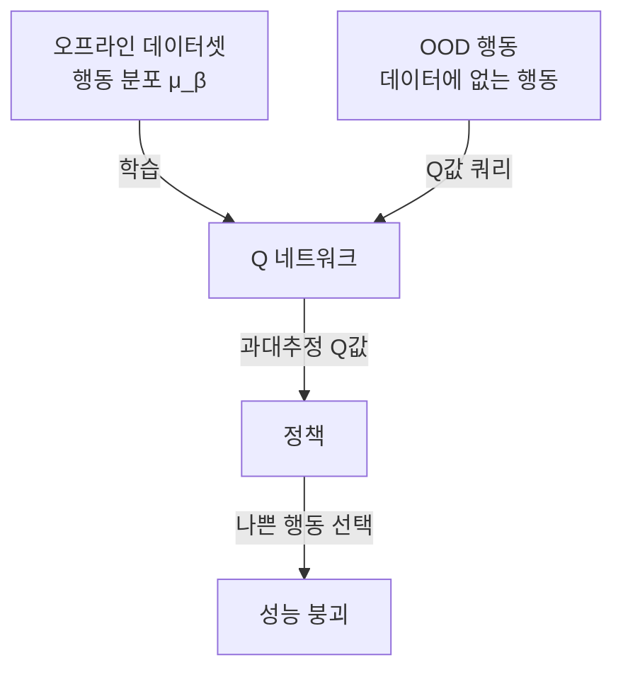
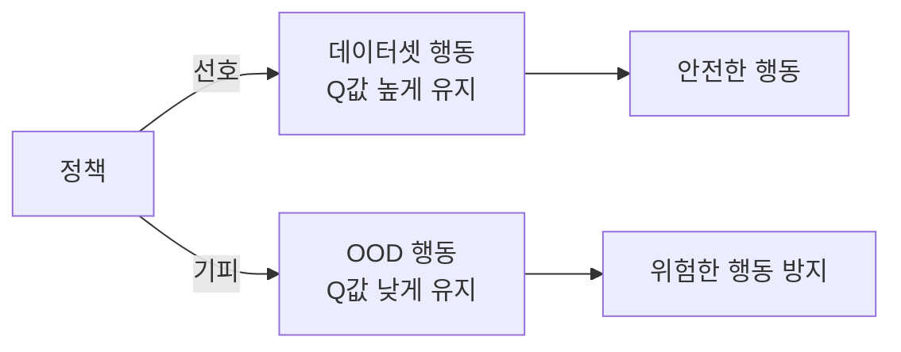

# CQL (Conservative Q-Learning)

CQL(Conservative Q-Learning)은 Aviral Kumar, Aurick Zhou, George Tucker, Sergey Levine이 2020년 발표한 [[offline-reinforcement-learning]] 알고리즘이다. 핵심 아이디어는 행동 외 분포(OOD, Out-of-Distribution) 상태-행동 쌍에 대한 Q값을 **의도적으로 낮게(conservative하게)** 유지하여, 오프라인 데이터로만 학습한 정책이 실제 환경에서 치명적인 실수를 저지르는 것을 방지한다.

## 오프라인 RL의 근본 문제: OOD 과대추정

온라인 RL에서는 에이전트가 환경과 직접 상호작용하며 경험하지 못한 상태-행동 쌍을 탐색하고 보정할 수 있다. 그러나 오프라인 RL에서는 고정된 데이터셋만 사용하므로:

1. 학습 데이터에 없는 상태-행동 쌍의 Q값이 부트스트랩(bootstrapping)으로 부정확하게 추정
2. 특히 OOD 행동의 Q값이 **과대추정(overestimation)**되는 경향
3. 정책이 과대추정된 Q값을 따라 실제로는 나쁜 행동을 선택

이 현상을 "분포 이탈 문제(distributional shift)"라 하며, [[q-learning-dqn]]을 오프라인 환경에 그대로 적용하면 심각한 성능 저하가 발생한다.

위 다이어그램은 표준 [[q-learning-dqn]]을 오프라인에 적용할 때 발생하는 과대추정 문제의 흐름이다.

## CQL의 해결 방법: 보수적 페널티

CQL은 Q 함수 학습 목표에 **보수적 페널티(conservative penalty)**를 추가한다:

$$\min_Q \alpha \cdot \mathbb{E}_{s \sim \mathcal{D}} \left[ \log \sum_a e^{Q(s,a)} - \mathbb{E}_{a \sim \hat{\pi}_\beta} [Q(s,a)] \right] + \frac{1}{2} \mathbb{E}_{(s,a,s') \sim \mathcal{D}} \left[ \left(Q(s,a) - \hat{\mathcal{B}}^\pi Q(s,a) \right)^2 \right]$$

직관적으로 해석하면:

- **첫 번째 항**: 모든 행동에 대한 소프트맥스 Q값을 최소화 (OOD 포함 전반적 하향)
- **두 번째 항**: 데이터셋 내 행동의 Q값은 최대화 (실제 경험한 행동은 보존)
- 결과: 데이터셋 행동 Q값 > OOD 행동 Q값 — 정책이 안전한 행동을 선호

## $\alpha$ 하이퍼파라미터의 역할

$\alpha$는 보수성 강도를 조절하는 핵심 파라미터다:

| $\alpha$ 값 | 효과 |
|------------|------|
| $\alpha \to 0$ | 표준 Q-learning과 동일 (보수성 없음) |
| $\alpha$ 중간 | 적절한 OOD 억제 + 데이터 내 최적화 균형 |
| $\alpha \to \infty$ | 지나치게 보수적 — 데이터셋 행동만 완전 모방 (BC와 유사) |

실제로는 $\alpha$를 자동으로 조정하는 **CQL($\mathcal{H}$)** 변형이 더 실용적이다. 이 변형은 특정 하한(lower bound)을 유지하도록 $\alpha$를 동적으로 조정한다.

## 이론적 보장

CQL은 단순 휴리스틱이 아닌 이론적 보장을 제공한다. 구체적으로:

> CQL로 학습한 Q 함수는 임의의 정책 $\pi$에 대해 실제 Q값의 **하한(lower bound)**임이 증명된다.

$$\hat{Q}^\pi(s, a) \leq Q^\pi(s, a), \quad \forall (s, a)$$

이 보장 덕분에 정책이 Q값이 높은 행동을 선택할 때, 그 행동이 실제로도 좋을 가능성이 높다.

## 실험 결과와 D4RL 벤치마크

CQL은 [[offline-reinforcement-learning]] 연구의 표준 벤치마크인 D4RL에서 강력한 성능을 보인다:

- **로코모션(locomotion)**: HalfCheetah, Hopper, Walker2D 환경에서 기존 오프라인 RL 대비 큰 폭의 성능 향상
- **Antmaze**: 복잡한 네비게이션 태스크에서도 우수한 성능
- **키친(Kitchen)**: 로봇 조작 태스크에서도 효과적

특히 "medium-expert" 데이터셋(중간 품질 + 전문가 데이터 혼합)에서 강점을 보인다.

## 관련 알고리즘과 비교

| 알고리즘 | 핵심 아이디어 | CQL과의 차이 |
|----------|------------|-------------|
| BCQ | 행동 클로닝 + Q 필터링 | Q 기반이 아닌 행동 공간 제약 |
| TD3+BC | BC 손실 추가 | 더 단순한 정규화 |
| IQL | 암묵적 Q학습 | OOD 행동을 쿼리하지 않는 방식 |
| CQL | Q값 하한 보장 | 이론적 보장이 명시적 |

## 한계

- **$\alpha$ 튜닝**: 데이터셋과 환경마다 최적 $\alpha$가 다름
- **계산 비용**: 소프트맥스 합산을 위한 샘플링이 필요하여 일반 Q-learning보다 느림
- **지나친 보수성**: $\alpha$가 너무 크면 데이터셋 행동만 모방하는 동작 복제(BC)로 퇴화
- **연속 행동 공간**: 이산 행동 공간보다 소프트맥스 계산이 복잡

## 관련 문서

- [[offline-reinforcement-learning]] - CQL이 해결하는 오프라인 RL 일반 개념
- [[q-learning-dqn]] - CQL의 기반이 되는 Q-learning 알고리즘
- [[dreamer-world-model]] - 모델 기반 RL 접근과의 대비
- [[hierarchical-rl]] - 오프라인 데이터로 계층적 정책을 학습하는 연구 맥락
