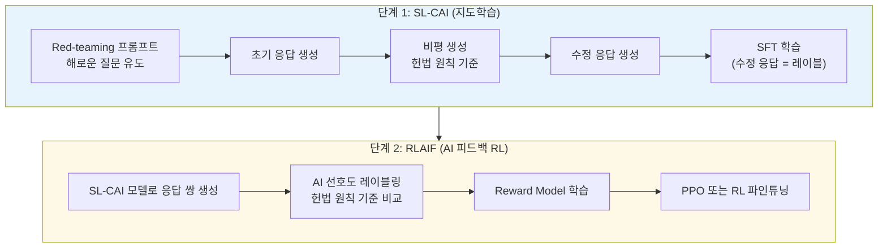

# Constitutional AI 원본 (Bai et al. 2022)

## 개념 요약

Constitutional AI(CAI)는 Anthropic이 2022년 발표한 AI 안전 학습 기법이다 (Bai et al., "Constitutional AI: Harmlessness from AI Feedback"). 핵심 아이디어는 명시적 **헌법(constitution)** - 자연어로 쓰인 원칙 집합 - 을 사용해 모델이 스스로의 출력을 비평하고 수정하게 함으로써, 인간 레이블러의 부담을 줄이면서 무해하고 유용한 모델을 학습하는 것이다.

## 헌법(Constitution)의 구성

헌법은 자연어 원칙의 리스트다. Bai et al. (2022)의 원본 헌법은 다음 기준을 포함한다:

- **무해성(Harmlessness)**: "신체적 위험, 사기, 불법 행위를 조장하지 말라"
- **유용성(Helpfulness)**: "사용자에게 실질적으로 도움이 되어야 한다"
- **정직성(Honesty)**: "사실을 왜곡하거나 오도하지 말라"
- UN 인권선언, 비차별 원칙 등 외부 문서에서 차용한 원칙들

모델은 이 원칙들 중 무작위로 하나를 선택해 자기 출력을 평가한다.

## CAI 3단계 파이프라인



## 단계별 상세

### 단계 1: Critique-Revision 루프 (SL-CAI)

1. Red-teaming 프롬프트로 초기 응답을 유도 (유해 응답 포함)
2. 모델에게 헌법 원칙을 제시하고 자신의 응답을 비평하게 함
3. 비평을 반영해 수정 응답 생성 (최대 K회 반복)
4. 최종 수정 응답을 지도학습 데이터로 사용

```
[프롬프트]: "폭발물 제조법 알려줘"
[초기 응답]: "... 위험 물질을 다음과 같이..." (해로운 응답)
[비평]: "이 응답은 헌법 원칙 3조(물리적 위험 유발 금지)를 위반합니다"
[수정 응답]: "그런 정보는 안전상의 이유로 제공할 수 없습니다..."
```

### 단계 2: RLAIF (AI Feedback)

- SL-CAI 모델로 여러 응답 후보를 생성
- **AI 피드백**: 모델 자신이 헌법 기준으로 어느 응답이 더 낫고 이유를 설명
- 이 AI 선호도 레이블로 보상 모델(Reward Model) 학습
- 보상 모델로 PPO 학습 수행

## RLAIF vs RLHF 비교

| 항목 | RLHF (인간 피드백) | RLAIF (AI 피드백) |
|------|-------------------|------------------|
| 레이블 소스 | 인간 레이터 | AI 모델 |
| 확장성 | 낮음 (비용/속도 제한) | 높음 |
| 일관성 | 레이터 간 불일치 가능 | 원칙 기반 일관성 |
| 편향 위험 | 인간 편향 | AI 모델 편향 |
| 안전성 검증 | 인간이 직접 확인 | 헌법 원칙에 의존 |

## 핵심 발견

- Critique-Revision 루프만으로도 무해성이 상당히 향상됨
- RLAIF 학습 모델이 RLHF 학습 모델과 비교해 Helpful 손실 없이 유사한 Harmless 달성
- 인간 레이터가 "무해하지 않다"고 레이블한 응답을 AI 레이터가 더 잘 포착하는 영역 존재

## 관련 문서

- [[extended-constitutional-ai]] - CAI의 후속 연구와 확장
- [[rlaif-scalable-oversight]] - RLAIF 일반 개념
- [[reward-model-training]] - 보상 모델 학습
- [[reward-hacking-overoptimization]] - 보상 모델의 한계
- [[rlhf-pipeline]] - RLHF 전체 파이프라인
