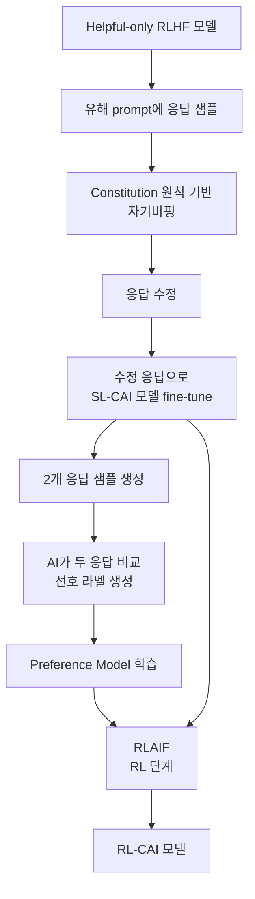

# Constitutional AI (CAI)

Anthropic의 Bai et al.(2022, arXiv:2212.08073)이 제안한 **AI 피드백 기반 정렬 기법**. 사람이 직접 유해한 출력을 라벨링하는 대신, 모델 스스로 자기비평(self-critique)·수정(revision)을 거치고 그 결과를 **AI가 비교 평가**한 데이터로 강화학습한다. RLHF의 H(uman)을 AI로 대체했다는 의미에서 **RLAIF**(Reinforcement Learning from AI Feedback)라고도 부른다. Anthropic Claude 모델군의 핵심 안전 기법이다.

## 1. 동기 — 왜 사람 라벨을 줄여야 하는가

기존 [[rlhf|RLHF]]는 라벨러가 유해 응답을 직접 보고 비교해야 했다. 이는:

- **라벨러 정신 건강** 부담 (toxic content 노출)
- **확장성 한계** — 모델 능력이 커질수록 라벨링 난도 상승
- **암묵적 가치 혼재** — 라벨러 개인 가치가 잡음으로 들어감

CAI는 "자연어로 적힌 원칙(constitution) 목록"만으로 AI가 자기 출력을 비평·수정·평가하게 한다.

> "Rather than relying on human labels for harmful outputs, the method requires only a list of rules or principles to guide AI behavior — hence the name Constitutional AI."
> — Bai et al. 2022 요약

## 2. 두 단계 파이프라인

### Stage 1 — Supervised Learning (SL-CAI)

1. helpful-only RLHF 모델로 출발 (도움은 되지만 위험 응답 가능)
2. 적대적 prompt에 모델이 응답 샘플
3. **자기비평**: "constitution 원칙 X 위반 여부를 지적하라" 프롬프트로 비판
4. **수정**: 비평을 반영해 응답 재작성
5. 수정된 응답들로 base model을 SFT — 결과: SL-CAI

### Stage 2 — Reinforcement Learning (RL-CAI / RLAIF)

1. SL-CAI 모델이 prompt 하나에 두 응답을 샘플
2. 별도 feedback model(역시 LLM)이 constitution 원칙 기준으로 둘을 비교
3. AI 선호 라벨로 preference model 학습
4. preference model의 보상 신호로 RL fine-tune ([[ppo|PPO]] 또는 유사 알고리즘)

> "A preference model is trained on AI-generated comparisons, then used as a reward signal for RL training via RLAIF."
> — Bai et al. 2022

## 3. Constitution이란

자연어로 적힌 원칙 모음. Anthropic의 공개 constitution은 다음을 포함한다(요약):

- **UN Declaration of Human Rights** 기반 원칙
- Apple Terms of Service에서 따온 운영 원칙
- DeepMind Sparrow rules 일부
- 비서구·다양한 관점 강조 원칙
- Anthropic 자체 안전 원칙

각 원칙은 한 문장 정도의 간결한 자연어 가이드라인 — 예: "응답이 인종·성별·종교에 차별적이지 않은지 확인하라". 비평·수정·비교 단계마다 무작위로 원칙 하나를 샘플해 사용한다.

## 4. 목표 — Harmless but Non-evasive

CAI의 핵심 목표는 단순한 거부(refusal)가 아니다. 모델이 **유해 요청에 답변을 거부하면서도 그 이유를 설명**하도록 한다.

> "The system aims to create a harmless but non-evasive AI assistant that engages with harmful queries by explaining its objections to them."
> — Bai et al. 2022

이는 "I cannot help with that" 같은 회피 응답이 아닌, "이 요청은 X 위험이 있어 도울 수 없습니다, 대신 Y는 어떻습니까" 형태의 응답을 유도한다.

## 5. 후속 연구·확장

- **Collective Constitutional AI (2023)**: Anthropic이 1,000+ 미국인을 대상으로 공개 의견 수렴해 constitution 작성 [교차검증 필요]
- **[[constitutional-classifiers]]**: 분류기 기반 입출력 필터를 추가해 jailbreak 방지
- **[[extended-constitutional-ai]]**: 다국어·도메인 특화로 확장
- **[[constitutional-ai-pipeline]]**: 파이프라인 변형
- **Sparse Autoencoder 해석**: 모델 내부에서 constitution 원칙이 어떤 feature로 표현되는지 분석 [교차검증 필요]
- **다른 주요 lab의 RLAIF**: Google·Meta·OpenAI가 유사한 self-feedback·AI judge 기법을 공식·비공식으로 채택

## 6. 왜 중요한가 — 실무 관점

- **Claude의 정체성**: Claude 3·4·5 시리즈의 "도움이 되면서도 정직·무해" 행동은 CAI 학습에 뿌리를 둠
- **확장성**: 모델 능력이 커질수록 사람보다 모델이 더 미세한 안전 차이를 평가 가능
- **투명성**: constitution을 공개해 "이 모델이 무엇을 가치 있게 여기도록 학습됐는가"를 외부 검증 가능
- **재현성**: 조직 가치가 명시적이라, 같은 base 모델에 다른 constitution을 적용하면 행동이 달라짐 — 정렬 가설 검증 도구로 활용

## 7. 한계와 비판

- **Constitution 작성자의 가치**: 누가 원칙을 정하는가? Anthropic 직원 중심 작성에 대한 비판 → Collective CAI로 대응 시도
- **자기참조 문제**: AI가 AI를 평가 → bias 누적 가능성. 일정 비율 사람 라벨 혼합으로 완화
- **원칙 상충**: 유용성 vs 무해성 충돌 시 우선순위 — 명시적 룰이 부족하면 모델이 자체 해석
- **Adversarial robustness**: constitution을 우회하는 jailbreak가 여전히 가능 → [[constitutional-classifiers]]·[[red-teaming]]·[[ai-red-teaming]] 보완 필요

## 관련 문서

- [[rlhf]] — CAI가 H를 AI로 대체한 원본 패러다임
- [[constitutional-ai-original]] — 원 논문 깊이 분석
- [[constitutional-ai-paper]] — 논문 요약
- [[constitutional-ai-pipeline]] — 파이프라인 변형
- [[constitutional-classifiers]] — CAI 후속 분류기 안전망
- [[extended-constitutional-ai]] — 다국어·도메인 확장
- [[claude-code]] — CAI로 정렬된 Claude를 활용하는 코드 도구
- [[anthropic-multi-agent-research-system]] — Anthropic 연구 시스템 맥락
- [[red-teaming]] — CAI를 검증하는 적대적 평가
- [[ai-red-teaming]] — AI red teaming 방법론
- [[dpo]] — RLAIF와 결합 가능한 선호 최적화
