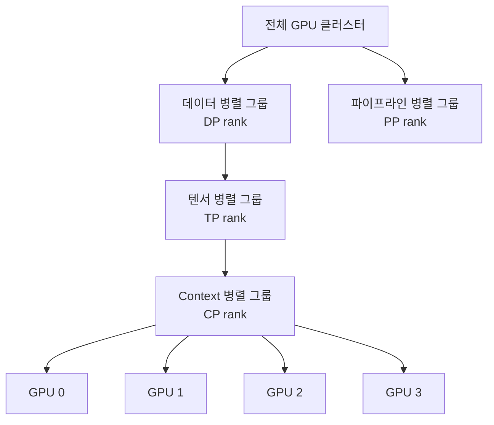

# Context 병렬화 (Context Parallelism)

## 개요

Context 병렬화(Context Parallelism, CP)는 시퀀스 차원(sequence dimension)을 여러 GPU에 분산해 초장문 시퀀스를 처리할 수 있도록 하는 분산 학습 기법이다. 배치 병렬화, 텐서 병렬화([[distributed-training-overview]] 참고)가 각각 데이터와 모델 파라미터를 나누는 것과 달리, CP는 입력 토큰 시퀀스 자체를 청크로 쪼개어 각 GPU에 배분한다.

128K, 1M 토큰 수준의 컨텍스트 윈도우를 훈련할 때 단일 GPU의 VRAM으로는 KV 캐시와 활성화 메모리를 감당할 수 없다. CP는 이 문제를 해결하는 핵심 수단이다.

## 왜 시퀀스 차원인가

Transformer의 self-attention은 시퀀스 길이 $L$에 대해 $O(L^2)$의 메모리를 요구한다. 배치 크기나 모델 너비를 줄이면 스루풋이 급감하므로, 시퀀스 자체를 여러 장치에 나누는 것이 가장 직접적인 해법이다.

FSDP([[data-parallelism-fsdp]] 참고)로 파라미터를 샤딩해도 활성화 메모리(activation memory)는 여전히 시퀀스 길이에 비례하므로, CP와 FSDP를 조합해 사용하는 것이 일반적이다.

## Context 병렬화의 두 가지 구현 방식

### 1. 나이브 시퀀스 분할 (Naive Sequence Splitting)

각 GPU가 시퀀스의 연속된 청크를 담당한다. Attention 계산 시 GPU 간 전체 KV를 브로드캐스트해야 하므로 통신 비용이 크다.

### 2. Ring Attention

[[ring-attention]] 참고. KV 청크를 링 토폴로지로 순환시켜 통신과 연산을 파이프라인 방식으로 오버랩한다. 현재 CP의 주류 구현 방식이다.

## 병렬화 차원 조합

실제 대규모 훈련에서는 여러 병렬화 차원을 동시에 사용한다.

각 병렬화 차원은 독립적인 프로세스 그룹을 구성하며, 하나의 GPU는 동시에 여러 그룹에 속한다. CP 그룹 내부에서는 시퀀스 청크 단위로 KV를 교환하고, TP 그룹 내부에서는 어텐션 헤드를 나누는 방식이다.

## Causal Attention과 Load Balancing

인과적(causal) 언어 모델링에서는 각 토큰이 자신 이전 토큰만 참조한다. 시퀀스를 단순히 앞뒤로 나누면 뒷부분 GPU가 더 긴 KV를 처리해야 하는 부하 불균형이 생긴다.

이를 해결하기 위해 **지그재그(zig-zag) 분할** 전략이 사용된다: 짝수 인덱스 청크는 순방향, 홀수 인덱스 청크는 역방향으로 배분해 각 GPU의 유효 어텐션 길이를 균등하게 맞춘다.

## Attention Mask 처리

CP 환경에서 패딩이나 문서 경계 마스크를 올바르게 처리하려면 각 GPU가 자신이 담당하지 않는 시퀀스 위치의 마스크 정보도 알아야 한다. 이를 위해 마스크 메타데이터를 작은 텐서로 사전 브로드캐스트하는 방식이 흔히 쓰인다.

## 구현 현황

| 프레임워크 | CP 지원 방식 |
|-----------|-------------|
| Megatron-LM | Context Parallelism (CP) 옵션 내장 |
| PyTorch FSDP + xformers | Ring Attention 별도 구현 필요 |
| JAX/Pax | 시퀀스 샤딩 네이티브 지원 |
| NeMo | Megatron 기반 CP 지원 |

## 통신 비용 분석

CP 그룹 크기 $c$일 때, 각 어텐션 레이어에서 ring 통신으로 KV 텐서를 $c-1$회 전달한다. 통신량은 $O(L \cdot d_{head} / c)$로, 시퀀스가 길수록 CP의 메모리 절감 효과가 통신 오버헤드를 압도한다.

## 관련 문서

- [[distributed-training-overview]] - 데이터/텐서/파이프라인 병렬화 개요
- [[data-parallelism-fsdp]] - FSDP를 통한 파라미터 샤딩
- [[ring-attention]] - Ring Attention 상세 메커니즘
- [[long-context-training]] - 초장문 컨텍스트 훈련 전략 전반
- [[flash-attention]] - 메모리 효율적 어텐션 커널
