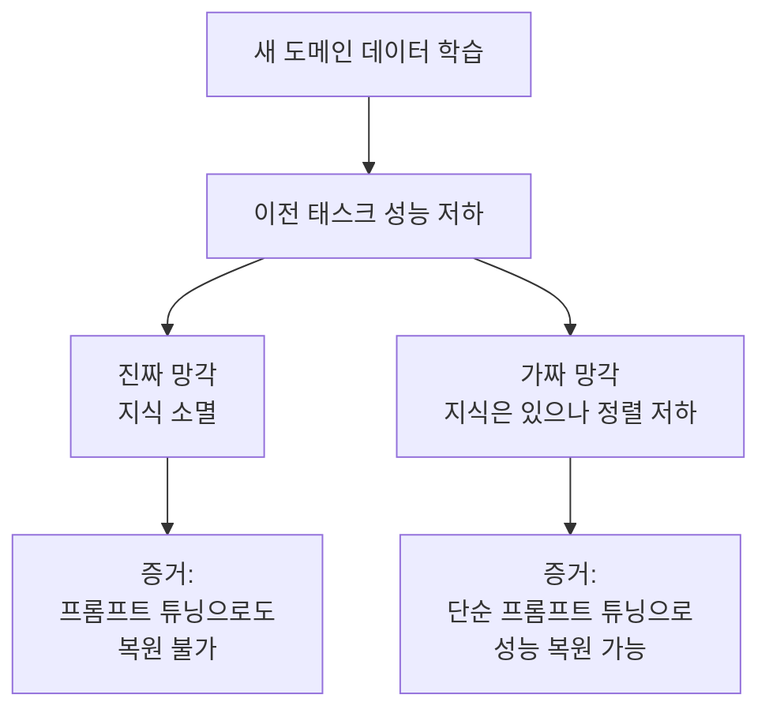
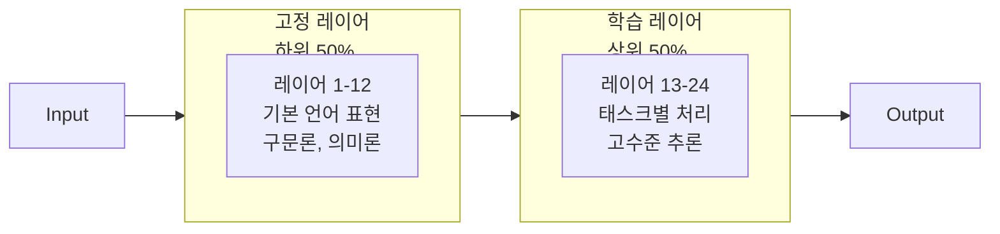
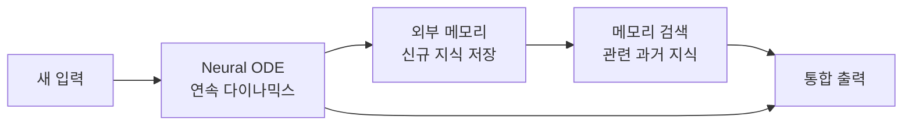

# 지속 학습의 LLM 적용 (Continual Learning for LLMs)

## 개요

지속 학습(Continual Learning, CL)은 모델이 새로운 지식을 습득하면서 기존 지식을 잃지 않도록 하는 연구 분야다. LLM(Large Language Model) 맥락에서는 **지속적 사전학습(Continual Pre-training)**이 오프라인 재학습에 집중했다면, 여기서는 **추론 시 적응(Online Adaptation)** 관점에 집중한다.

## 기존 관점 vs 새로운 관점

| 관점 | 초점 | 주요 문제 |
|------|------|----------|
| 지속적 사전학습 (기존) | 오프라인 새 데이터로 재학습 | 재앙적 망각(catastrophic forgetting) |
| 추론 시 적응 (새 관점) | 배포 후 실시간 적응 | 가짜 망각, 온라인-오프라인 갭 |

## 가짜 망각 (Spurious Forgetting)

최근 연구에서 발견된 중요한 현상이다. 새로운 도메인 데이터로 계속 학습할 때 관찰되는 성능 저하의 상당 부분이 **실제 지식 소멸이 아닌 태스크 정렬(task alignment) 저하**에서 기인한다.

**실험적 근거**: 파인튜닝 후 성능이 저하된 태스크에서 소량의 프롬프트 예시(few-shot)를 추가하면 성능이 상당 부분 회복된다. 이는 지식이 실제로 소멸한 게 아니라 접근 방식(정렬)이 바뀐 것임을 시사한다.

## 하위 레이어 고정 전략

트랜스포머의 하위 레이어(lower layers)는 언어의 기본 표현을 담당하고, 상위 레이어(upper layers)는 태스크별 처리를 담당한다는 가설에 기반한다.

**결과**: 하위 레이어를 고정하면 새로운 도메인을 학습할 때 기반 언어 능력의 망각을 크게 줄일 수 있다.

## On-policy RL의 망각 완화 효과

강화학습(RL)으로 특정 태스크를 학습할 때, **on-policy(현재 정책으로 생성한 데이터로 학습)** 방식이 off-policy 대비 망각을 줄인다는 연구 결과가 있다.

- On-policy RL은 현재 모델의 분포를 유지하면서 점진적으로 개선
- Off-policy RL은 과거 데이터로 학습 시 모델 분포 이탈 위험

RLVR(Reinforcement Learning from Verifiable Rewards)을 지속 학습에 적용하면 망각과 새 지식 습득을 균형 있게 유지하는 데 도움이 된다.

## Neural ODE + 메모리 증강

Neural Ordinary Differential Equation(Neural ODE)과 외부 메모리를 결합한 아키텍처 접근법:

- **Neural ODE**: 이산 레이어 스택 대신 연속 다이나믹스로 학습 경로를 부드럽게
- **메모리 증강**: 새로운 지식을 별도 메모리 버퍼에 저장, 필요 시 검색
- **망각 감소**: 논문 기준 24% 망각 감소 보고

## 온라인 적응 vs 오프라인 재학습

| 항목 | 온라인 적응 | 오프라인 재학습 |
|------|-----------|--------------|
| 데이터 수집 | 실시간 스트림 | 배치 수집 후 |
| 업데이트 빈도 | 지속적 | 주기적 |
| 컴퓨트 비용 | 낮음 (경량 업데이트) | 높음 (전체 재학습) |
| 안정성 | 낮음 (드리프트 위험) | 높음 |
| 적합 사용 사례 | 뉴스, 시장 데이터 | 대규모 도메인 전환 |

## 실무 권장사항

1. **성능 저하 발생 시 먼저 가짜 망각 여부 확인**: few-shot 예시로 성능이 회복되면 재학습이 아닌 프롬프트 개선으로 해결 가능.
2. **LoRA / Adapter 레이어 활용**: 기존 파라미터 동결, 소수 파라미터만 업데이트로 망각 최소화.
3. **리플레이 버퍼(replay buffer)**: 이전 태스크 데이터 일부를 새 학습 배치에 혼합해 망각 완화.
4. **계층별 학습률 차등 적용**: 하위 레이어는 낮은 학습률, 상위 레이어는 높은 학습률.

## 관련 문서

- [[continual-pretraining]] - 오프라인 재학습 중심의 CL
- [[catastrophic-forgetting]] - 망각 문제의 고전적 정의
- [[rlvr]] - On-policy RL의 망각 완화와 연결
- [[reinforcement-pre-training]] - 사전학습과 RL 통합 관점
