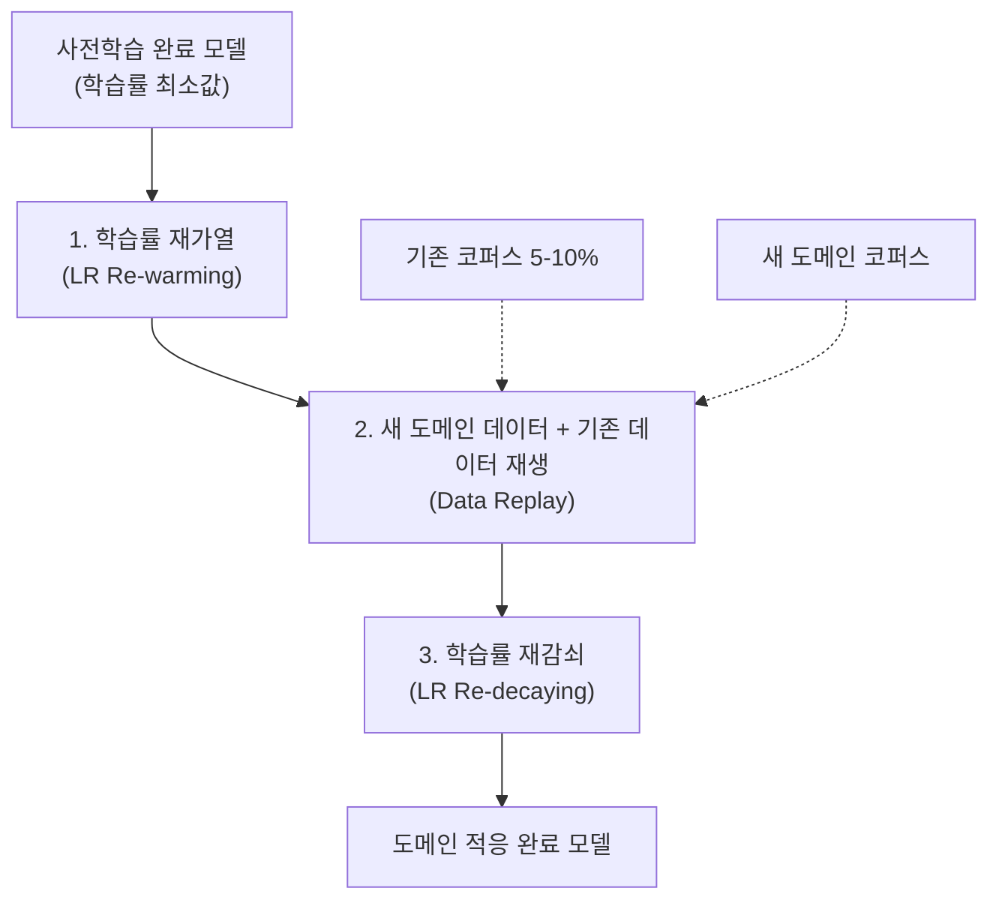

# 지속적 사전학습 (Continual Pretraining)

## 개요

지속적 사전학습(Continual Pretraining, CPT)은 이미 대규모 코퍼스로 사전 학습된 LLM을 새로운 도메인 데이터나 시간적으로 갱신된 데이터에 추가 학습시키는 기법이다. 처음부터 재학습(training from scratch)하지 않고도 도메인 특화 지식을 습득할 수 있어, 수백만 달러의 연산 비용을 절감한다. [[continual-learning|지속적 학습(Continual Learning)]]의 일반적 개념과 겹치지만, CPT는 LLM 사전학습 단계에 특화된 실용적 전략 -- 학습률 재가열(LR re-warming), 데이터 재생(replay), 스케줄 재설정 -- 에 초점을 맞춘다. Gupta et al.(2023)과 Ibrahim et al.(2024, TMLR)의 연구가 이 분야의 기초를 확립했다.

## 핵심 과제: 파국적 망각과 적응의 균형

### 문제 정의

사전 학습된 모델에 새 도메인 데이터를 단순히 이어서 학습시키면 두 가지 문제가 발생한다:

1. **파국적 망각(Catastrophic Forgetting)**: 새 도메인 학습 과정에서 기존 일반 지식이 손실
2. **적응 부족(Insufficient Adaptation)**: 반대로 기존 지식 보존에 치중하면 새 도메인 성능이 부족

이 딜레마는 [[continual-learning|지속적 학습]]의 안정성-가소성 딜레마(stability-plasticity dilemma)와 동일한 구조이나, LLM 사전학습이라는 맥락에서 구체적 해법이 달라진다.

### 분포 이동의 유형

CPT에서 다루는 분포 이동(distribution shift)은 강도에 따라 구분된다:

| 이동 강도 | 예시 | 난이도 |
|----------|------|-------|
| 약한 이동 | 영어 웹 텍스트 간 시간적 변화 | 낮음 |
| 중간 이동 | 일반 텍스트에서 의료/법률 도메인 | 중간 |
| 강한 이동 | 영어에서 독일어/코드 도메인 | 높음 |

## 3대 핵심 전략

Ibrahim et al.(2024)의 연구는 세 가지 전략의 조합만으로도 처음부터 재학습한 모델과 동등한 성능에 도달할 수 있음을 405M 파라미터 규모에서 실증했다.

### 1. 학습률 재가열 (LR Re-warming)

대부분의 LLM은 선형 워밍업 후 코사인 감쇠(cosine decay)를 적용하여, 학습 종료 시점에 학습률이 매우 낮은 값에 도달한다. 이 상태에서 새 데이터를 학습하면 적응 속도가 극도로 느리다.

재가열은 학습률을 원래 사전학습의 피크 학습률 근처까지 다시 올리는 것이다. Gupta et al.(2023)은 코사인 스케줄을 다시 시작하는 방식을, Ibrahim et al.(2024)은 유사한 최대 학습률로의 재가열을 제안했다.

**재가열의 단기-장기 효과**:
- **단기**: 업스트림/다운스트림 모두에서 손실이 일시적으로 증가 (기존 파라미터 구조의 교란)
- **장기**: 재감쇠 과정에서 새 도메인에 적응하면서도 기존 지식을 통합한 더 나은 솔루션으로 수렴

이 현상은 [[learning-rate-scheduling|학습률 스케줄링]]의 warm restart(SGDR)와 유사한 원리로, 학습률 증가가 손실 랜드스케이프의 날카로운 최소값에서 탈출하여 더 평탄하고 일반화가 좋은 영역을 탐색하게 한다.

### 2. 데이터 재생 (Data Replay)

새 도메인 데이터를 학습할 때, 기존 사전학습 데이터의 일부를 혼합하여 함께 학습시키는 전략이다. 재생 비율은 일반적으로 전체 학습 데이터의 5-10% 수준이다.

**재생의 효과**:
- 기존 Common Crawl 데이터에 대한 회귀(regret)를 최대 60% 감소
- 옵티마이저 상태 조정이나 손실 함수 변경 대비 가장 효과적

**주의점**: 재생이 항상 이로운 것은 아니다. 빠르게 변화하는 도메인(예: StackOverflow, PyTorch 문서)에서는 오래된 데이터 재생이 오히려 해로울 수 있다. 도메인의 시간적 안정성에 따라 재생 전략을 차별화해야 한다.

### 3. 학습률 재감쇠 (LR Re-decaying)

재가열 후 코사인 감쇠를 새로 적용하여, 새 도메인에 대한 학습이 안정적으로 수렴하도록 한다. 이 3단계(재가열-학습-재감쇠)가 하나의 CPT 사이클을 구성하며, 필요에 따라 여러 사이클을 반복할 수 있다.

## 실전 적용 사례

### Llama 시리즈의 도메인 적응

Meta의 Llama 모델 학습 보고서에 따르면, 사전학습 후 추가 코퍼스를 도입할 때 유사한 재가열+재감쇠 전략이 활용된다. 15.6T 토큰으로 사전학습한 후, 고품질 데이터 혼합으로 추가 학습 사이클을 진행하는 방식이다.

### 코드 도메인 적응

일반 언어 모델을 코드 특화 모델로 전환할 때 CPT가 활용된다. Code Llama는 Llama 2 위에 500B 코드 토큰을 지속적 사전학습한 대표적 사례이며, 학습률 재가열과 긴 컨텍스트 데이터 혼합을 결합했다.

### 다국어 확장

영어 중심 모델을 다국어로 확장할 때도 CPT가 적용된다. Ibrahim et al.(2024)은 영어에서 독일어로의 강한 분포 이동에서도 재가열+재생 전략이 유효함을 검증했다.

## 지시 따르기 능력 보존 문제

### Alignment Tax

CPT의 주요 실무 과제 중 하나는, [[supervised-fine-tuning|SFT]]와 정렬(alignment)이 완료된 모델에 CPT를 적용하면 지시 따르기 능력이 손실되는 현상이다. 추가 사전학습의 비정형 텍스트가 대화 형식의 정렬을 덮어쓰기 때문이다.

**완화 전략**:
- CPT 데이터에 소량의 지시-응답 데이터를 혼합 (IKnow 접근법)
- CPT 후 경량 SFT를 다시 수행
- [[lora-qlora-finetuning|LoRA]]를 활용하여 도메인 지식과 정렬을 분리 저장

## 처음부터 재학습 vs CPT 비교

| 항목 | 처음부터 재학습 | 지속적 사전학습 |
|------|---------------|---------------|
| **연산 비용** | 전체 비용 (수백만 달러) | 원래의 5-20% |
| **데이터 요구량** | 전체 코퍼스 필요 | 새 도메인 + 소량 재생 |
| **기존 지식** | 자연 보존 | 재생 전략 필요 |
| **성능 상한** | 최적 배합 가능 | 재학습 대비 동등 (검증됨) |
| **구현 복잡도** | 단순 (표준 파이프라인) | 재가열/재생 설계 필요 |
| **적용 시나리오** | 충분한 자원, 최적 성능 필요 시 | 빠른 도메인 적응, 자원 제약 시 |

## 최신 연구 방향

### TiC-LM 벤치마크

시간 연속적(time-continual) LLM 사전학습을 위한 벤치마크가 등장하여, 시간에 따라 변화하는 웹 데이터에 대한 CPT 전략의 체계적 평가가 가능해지고 있다.

### 그래디언트 정렬 기반 접근

Revisiting Replay and Gradient Alignment(2025)은 단순 재생을 넘어, 기존 태스크와 새 태스크의 그래디언트 방향을 정렬하는 방법을 탐구한다. 이는 [[mixed-precision-training|혼합 정밀도 학습]] 환경에서도 안정적인 CPT를 가능하게 하는 방향이다.

### 확장성 검증

현재까지의 검증은 주로 405M-7B 규모에서 이루어졌으며, 70B 이상 모델에서의 체계적 검증은 진행 중이다. 모델 규모가 커질수록 기존 지식의 견고성이 높아져 CPT가 더 효과적일 수 있다는 가설이 제시되고 있다.

## 참고 문헌

- Gupta et al., "Continual Pre-Training of Large Language Models: How to (re)warm your model?" (arXiv:2308.04014, ICML 2023 Workshop)
- Ibrahim et al., "Simple and Scalable Strategies to Continually Pre-train Large Language Models" (arXiv:2403.08763, TMLR 2024)
- Wang et al., "Continual Learning of Large Language Models: A Comprehensive Survey" (CSUR 2025)
