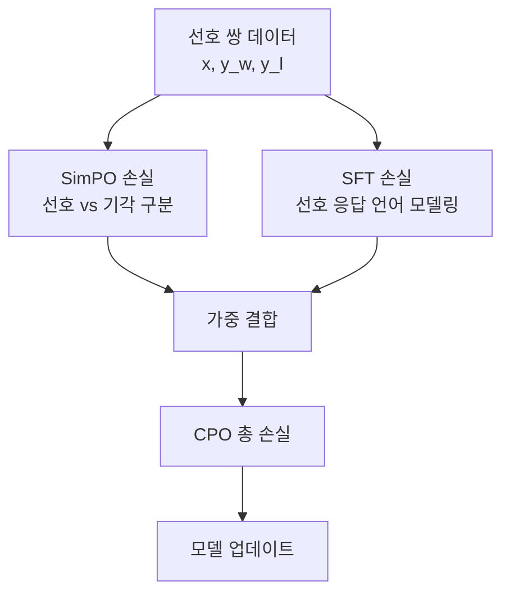

# CPO - 대조적 선호 최적화

## 배경과 문제 의식

선호 최적화 방법론들은 두 가지 문제에 직면해 있다:

1. **지시 따르기(instruction following) 약화**: [[direct-preference-optimization|DPO]] 같은 순수 선호 최적화는 모델이 선호/기각 쌍을 구분하는 데 집중하면서, 지시문을 정확히 따르는 능력이 저하될 수 있다.
2. **SFT와 POFT의 분리**: 일반적으로 지도 파인튜닝(SFT, Supervised Fine-Tuning)을 먼저 수행하고 이후 선호 최적화를 별도로 적용하는 2단계 파이프라인이 필요하다.

CPO(Contrastive Preference Optimization)는 [[simpo-simple-preference|SimPO]]의 길이 정규화 보상 아이디어를 유지하면서 **SFT 손실을 선호 최적화 손실과 결합**하는 접근이다. 선호 정렬과 지시 따르기를 단일 학습 단계에서 동시에 최적화한다.

## 핵심 구조

### SimPO 기반 보상

CPO는 SimPO와 동일한 평균 로그 확률 보상을 사용한다:

$$r(x, y) = \frac{1}{|y|} \sum_{i=1}^{|y|} \log \pi_\theta(y_i \mid x, y_{<i})$$

참조 모델(reference model)이 없으며, 길이 정규화로 긴 응답 편향을 방지한다.

### 결합 손실 함수

CPO의 최종 손실은 두 항의 선형 결합이다:

$$\mathcal{L}_{\text{CPO}} = \mathcal{L}_{\text{SimPO}} + \lambda \cdot \mathcal{L}_{\text{SFT}}$$

**SimPO 항**: 선호/기각 응답 간 보상 차이를 최대화

$$\mathcal{L}_{\text{SimPO}} = -\mathbb{E} \left[ \log \sigma \left( \beta \left( \frac{\log \pi_\theta(y_w \mid x)}{|y_w|} - \frac{\log \pi_\theta(y_l \mid x)}{|y_l|} \right) - \gamma \right) \right]$$

**SFT 항**: 선호 응답의 음수 로그 우도(NLL) 최소화

$$\mathcal{L}_{\text{SFT}} = -\frac{1}{|y_w|} \sum_{i=1}^{|y_w|} \log \pi_\theta(y_{w,i} \mid x, y_{w,<i})$$

- $\lambda$: SFT 손실 가중치 (보통 1.0)
- $\gamma$: SimPO의 목표 보상 마진

SFT 항이 추가됨으로써 모델은 선호 응답을 잘 따르는 기능을 유지하면서 기각 응답과의 차별화도 동시에 학습한다.

## SFT 항의 역할

### 지시 따르기 보존

순수 선호 최적화만 적용하면 모델이 선호/기각 구분에 집중하다가 지시의 특정 세부사항을 무시하는 현상이 발생할 수 있다. SFT 항은 선호 응답의 모든 토큰에 대해 언어 모델링 목표를 유지함으로써 이를 방지한다.

### 분포 안정성

SFT 항이 선호 응답에 대한 높은 로그 확률을 직접 장려하므로, 모델이 선호/기각 차이만 벌리려 하는 보상 해킹 현상이 줄어든다.

### 참조 모델 대체

전통적 DPO 파이프라인에서 SFT 체크포인트가 참조 모델 역할을 했다면, CPO에서는 SFT 손실 자체가 이 역할을 한다. SFT 단계를 별도로 수행할 필요 없이 선호 데이터만으로 훈련 가능하다.

## CPO vs 관련 방법 비교

| 방법 | 참조 모델 | SFT 항 | 길이 정규화 | 파이프라인 |
|------|----------|--------|-----------|----------|
| DPO | 필수 | 없음 | 없음 | SFT -> DPO |
| SimPO | 불필요 | 없음 | 있음 | SFT -> SimPO |
| CPO | 불필요 | 있음 | 있음 | CPO만으로 가능 |
| ORPO | 불필요 | 있음 | 없음 | ORPO만으로 가능 |

CPO는 SimPO의 길이 정규화와 ORPO의 SFT 통합을 동시에 달성한 방법이라고도 볼 수 있다.

## 적용 도메인

CPO는 특히 **번역(translation)** 과 **요약(summarization)** 태스크에서 두드러진 성능을 보인다:

### 번역

- 번역 선호 데이터: (원문, 좋은 번역, 나쁜 번역) 쌍
- SFT 항이 좋은 번역의 유창성을 유지
- SimPO 항이 나쁜 번역과 명확히 구분
- WMT 벤치마크에서 DPO 대비 BLEU/COMET 점수 개선

### 요약

- 요약 선호 데이터: (문서, 좋은 요약, 나쁜 요약) 쌍
- SFT 항이 길이와 포함 정보를 적절히 유지
- 길이 정규화로 지나치게 짧은/긴 요약 생성 억제

## 하이퍼파라미터 가이드

| 파라미터 | 권장값 | 설명 |
|---------|--------|------|
| $\beta$ | 2.0 - 2.5 | 온도 스케일 |
| $\gamma$ | 0.5 - 1.5 | 마진 크기 |
| $\lambda$ | 0.5 - 1.5 | SFT 손실 가중치 |
| 학습률 | 5e-7 - 2e-6 | 너무 크면 SFT 항이 지배 |

$\lambda$가 너무 크면 모델이 SFT에만 집중해 선호 학습이 약해지고, 너무 작으면 CPO가 SimPO와 거의 같아진다.

## 실무 적용 관점

CPO는 다음 상황에서 특히 유용하다:

- **단일 단계 정렬**: SFT와 선호 최적화를 분리하기 어려운 환경.
- **지시 따르기 중요 태스크**: 번역, 요약, 코드 생성처럼 정확한 형식 준수가 중요할 때.
- **데이터 효율**: 선호 데이터만으로 SFT 효과까지 얻고 싶을 때.
- **메모리 제약**: 참조 모델 없이 학습해야 할 때.

## 한계

- 선호 응답의 품질에 강하게 의존: SFT 항이 선호 응답을 학습하므로, 선호 응답 자체가 낮은 품질이면 역효과.
- $\lambda$ 튜닝 추가: 기존 SimPO 대비 하이퍼파라미터가 하나 더 필요.
- 매우 대규모 데이터에서는 SFT 항의 기여가 상대적으로 작아질 수 있음.

## 관련 문서

- [[simpo-simple-preference]] - CPO의 기반이 되는 SimPO
- [[direct-preference-optimization]] - DPO 기본 메커니즘
- [[ipo-identity-preference]] - 과적합 해결 중심 DPO 변형
- [[orpo]] - SFT와 선호를 결합하는 다른 접근
- [[kto]] - 쌍 없는 선호 최적화
- [[supervised-fine-tuning]] - SFT 기본 개념
- [[rlhf-and-alignment]] - 선호 학습 전반 맥락
- [[preference-data-collection]] - 선호 데이터 구축 방법
