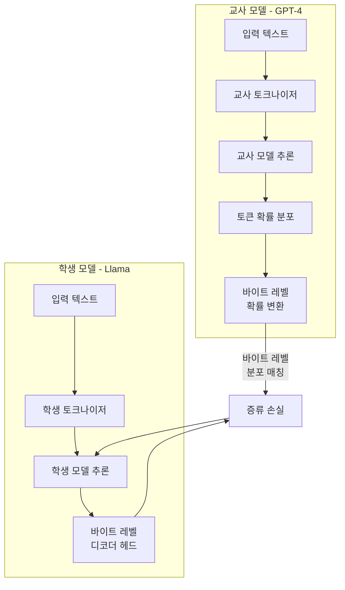
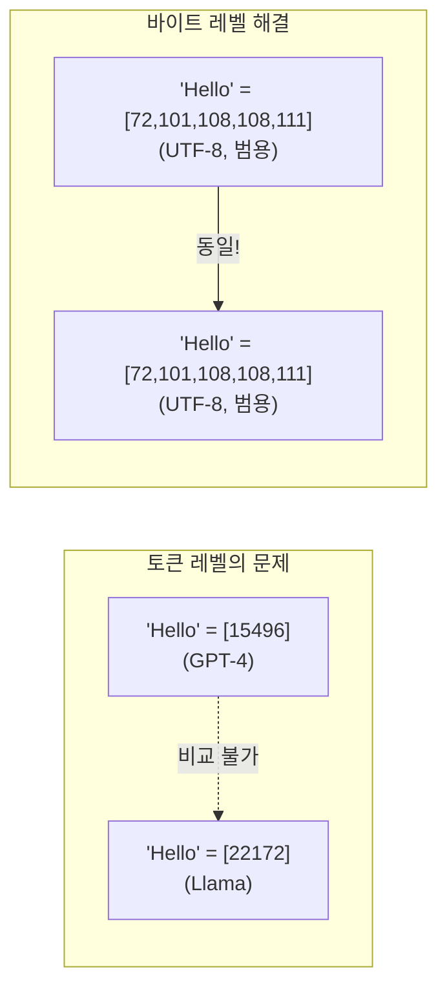

## 개요

교차 토크나이저 증류(Cross-Tokenizer Distillation)는 서로 다른 토크나이저를 사용하는 교사-학생 모델 간 지식 증류를 가능하게 하는 기법이다. 핵심 아이디어는 **바이트 레벨(byte-level)을 공통 인터페이스로 사용**하여 토크나이저 차이를 극복하는 것이다.

기존 지식 증류(knowledge distillation)는 교사와 학생이 동일한 토크나이저를 사용한다는 암묵적 가정 위에 성립한다. 그러나 현실에서는 교사(예: GPT-4)와 학생(예: Llama) 모델이 다른 토크나이저를 사용하므로, 토큰 레벨 확률 분포를 직접 비교할 수 없다.

## 왜 중요한가

- **이기종 모델 간 증류 경로 개방**: GPT-4 -> Llama, Claude -> Mistral 등 서로 다른 계열 간 지식 전이 가능
- **다국어 모델**: 언어별 토크나이저 효율성 편차를 극복. 한국어/일본어/아랍어 등에서 특히 유용
- **토크나이저 없는 아키텍처로의 전환 촉진**: 바이트 레벨 인터페이스가 궁극적으로 토크나이저 제거를 가속
- 실무에서 "최고 성능 모델로부터 소형 모델을 학습"하는 수요가 폭발적이나, 토크나이저 불일치가 병목

## 핵심 메커니즘

BLD(Byte-Level Distillation) 파이프라인: 교사와 학생 모두 바이트 레벨로 확률을 변환한 후, 이 공통 공간에서 분포를 매칭한다.

### BLD 4단계 프로세스

| 단계 | 설명 |
|------|------|
| 1. 교사 출력 변환 | 교사의 토큰 레벨 확률 분포를 바이트 레벨 확률로 분해 |
| 2. 학생 헤드 추가 | 학생 모델에 경량 바이트 레벨 디코더 헤드 부착 |
| 3. 분포 매칭 | 바이트 레벨에서 교사-학생 분포의 KL 발산 최소화 |
| 4. 밀집 피드백 | 토크나이저에 무관하게 모든 바이트 위치에서 그래디언트 전달 |

### 왜 바이트 레벨인가

UTF-8 바이트는 모든 토크나이저의 공통 기반이므로, 토크나이저에 무관한 비교가 가능하다.

## 관련 발전

- **Byte Latent Transformer (BLT)**: 토크나이저 자체를 제거하고 바이트에서 직접 학습하는 아키텍처
- **BoundlessBPE**: 단어 경계 제약을 해제하여 bytes/token 효율 15% 개선
- **Universal Tokenizer**: 사전학습 후 새 언어 확장을 위한 범용 토크나이저 프레임워크

## 실무 적용

- 대형 모델(교사)에서 소형 모델(학생)로의 증류 시, 토크나이저 일치를 강제하지 않아도 됨
- 다국어 서비스에서 언어별 최적 토크나이저를 가진 모델 간 지식 공유 가능
- 바이트 레벨 디코더 헤드는 경량이므로 학생 모델의 추론 비용 증가는 미미
- 증류 후 바이트 레벨 헤드를 제거하면 원래 학생 모델 구조로 복원 가능

## 관련 문서

- [[catastrophic-forgetting]] -- 지식 전이 시 망각 문제
- [[ai-reasoning-models]] -- 추론 모델 비교 (증류 대상)
