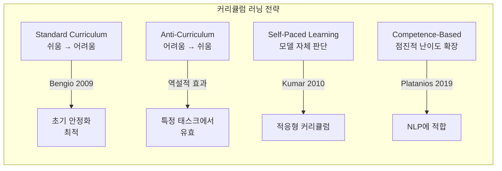

# 커리큘럼 러닝 (Curriculum Learning)

## 정의

커리큘럼 러닝(curriculum learning)은 학습 데이터를 **쉬운 것부터 어려운 것 순서**로 제시해 모델이 더 효과적으로 학습하도록 돕는 기법이다. Bengio et al. (2009)이 인간 교육의 커리큘럼 설계에서 영감을 받아 머신러닝에 도입했다.

무작위 셔플링 대비 이점:
- 초기 학습 단계에서 안정적인 그래디언트 신호 확보
- 어려운 패턴 학습 전에 기본 구조 선습득
- 수렴 속도 향상 및 최종 성능 개선

## 커리큘럼 전략 비교

### Standard Curriculum (표준 커리큘럼)
학습 초기에 쉬운 예제로 안정적인 표현을 구축한 후 점진적으로 어려운 예제를 추가한다.

### Anti-Curriculum (역 커리큘럼)
어려운 예제를 먼저 학습하면 **희귀하고 복잡한 패턴을 강하게 인코딩**하는 효과가 있다. 이후 쉬운 예제로 마무리하면 일반화 성능이 향상되는 경우가 보고된다. 특히 클래스 불균형 데이터에서 유효하다.

### Self-Paced Learning (자기주도 학습)
모델이 현재 시점의 손실(loss)을 기준으로 쉽고 어려운 예제를 스스로 판단한다. 손실이 낮은 예제(이미 잘 학습된 것)에 낮은 가중치를, 손실이 높지만 너무 높지는 않은 예제에 높은 가중치를 부여한다.

## 난이도 측정 방법

| 방법 | 원리 | 장단점 |
|------|------|--------|
| 손실 기반 | 사전학습 모델의 퍼플렉서티(perplexity) 사용 | 단순·효과적, 참조 모델 필요 |
| 시퀀스 길이 | 짧은 텍스트 = 쉬움 | 구현 용이, 내용 난이도와 불일치 가능 |
| 데이터 품질 점수 | 필터링 모델이 출력하는 품질 점수 | 도메인별 조정 필요 |
| Teacher 모델 | 강한 모델의 예측 확신도로 난이도 역산 | 정교하나 비용 높음 |
| 어휘 빈도 | 희귀 단어 비율로 측정 | 어휘 수준 난이도에 한정 |

## LLM 사전학습에서의 적용

### 시퀀스 길이 커리큘럼 (Sequence Length Curriculum)

GPT-4, LLaMA 등 다수의 대형 언어 모델이 사전학습에 활용한 기법이다. 짧은 시퀀스로 시작해 점진적으로 컨텍스트 길이를 확장한다.

- **초기 단계**: 512~2048 토큰 — 단기 의존성 학습
- **중간 단계**: 4096~8192 토큰 — 문단 수준 일관성
- **후기 단계**: 최대 길이 — 장거리 의존성 학습

어텐션 비용이 $O(n^2)$이므로 초기에 짧은 시퀀스를 사용하면 학습 비용도 절감된다.

### 데이터 품질 커리큘럼 (Data Quality Curriculum)

학습 초기에는 고품질 데이터(Wikipedia, 교과서 등)를 높은 비율로 학습하고, 후기로 갈수록 웹 크롤링 데이터 비중을 높인다. Phi 계열 모델이 "textbook-quality" 데이터 우선 학습으로 효율성을 입증했다.

### 도메인 커리큘럼 (Domain Curriculum)

기본 도메인(일반 텍스트) → 전문 도메인(수학, 코드, 과학) 순서로 학습. 전문 도메인 데이터를 초기부터 과도하게 혼합하면 일반 언어 능력 저하가 발생할 수 있다.

## Anti-Curriculum이 유효한 이유

역설적으로 어려운 예제를 먼저 학습하는 것이 일부 상황에서 유리한 이유는:

1. **어려운 패턴의 강한 인코딩**: 어려운 예제는 더 강한 그래디언트 신호를 생성
2. **쉬운 예제로의 일반화**: 어려운 구조를 익힌 후 단순 패턴은 자동 포함
3. **망각 완화**: 쉬운 예제를 마지막에 학습하면 최근 학습 효과로 성능 안정화

다만 Anti-Curriculum은 초기 학습 불안정과 그래디언트 폭주(gradient explosion) 위험이 있어 learning rate 조정이 중요하다.

## 파인튜닝에서의 커리큘럼

SFT(Supervised Fine-Tuning) 단계에서도 커리큘럼 설계가 효과적이다:

- **응답 길이 기준**: 짧고 명확한 지시 → 긴 복잡한 지시 순서
- **태스크 복잡도**: 단순 분류 → 복잡한 추론/생성 순서
- **도메인 순서**: 일반 질의응답 → 전문 도메인 지식

## 관련 문서

- [[sequence-length-curriculum]] - 시퀀스 길이 커리큘럼 상세
- [[data-mixing-laws]] - 데이터 혼합 비율과 학습 효율
- [[pretraining-data-curation]] - 사전학습 데이터 선별 전략
- [[batch-size-scheduling]] - 배치 크기 스케줄링과 커리큘럼의 조합
