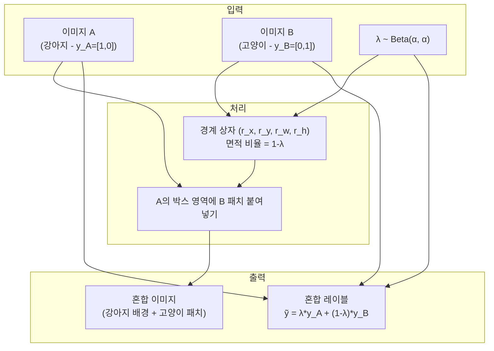
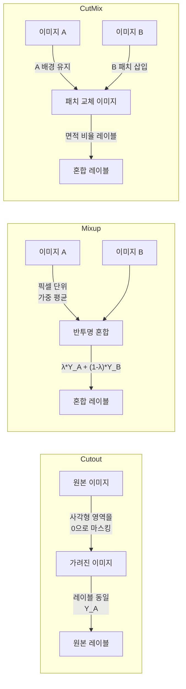

# CutMix 패치 교체 증강

CutMix는 Yun et al. (2019, ICCV)이 제안한 데이터 증강 기법으로, 이미지의 직사각형 패치를 다른 이미지의 패치로 교체하고 레이블을 해당 면적 비율로 혼합한다. Cutout(특정 영역 제거)과 [[mixup-data-augmentation]](선형 보간)의 장점을 결합한 형태다.

## 배경 - Cutout과 Mixup의 한계

| 기법 | 방식 | 한계 |
|------|------|------|
| Cutout | 영역을 0(검정)으로 가림 | 빈 영역에서 학습 신호 없음 |
| Mixup | 두 이미지 픽셀 단위 혼합 | 비현실적인 혼합 이미지(반투명) |
| CutMix | 패치 교체 + 레이블 혼합 | 두 기법 단점 보완 |

CutMix는 잘린 영역에 다른 이미지의 내용을 채워 **정보 밀도를 유지**하면서 모델이 이미지 일부로도 분류를 수행하도록 강제한다.

## 핵심 메커니즘



### 수식

$$\tilde{x} = \mathbf{M} \odot x_A + (\mathbf{1} - \mathbf{M}) \odot x_B$$
$$\tilde{y} = \lambda y_A + (1 - \lambda) y_B$$

여기서:
- $\mathbf{M} \in \{0, 1\}^{W \times H}$: 이진 마스크 (1=이미지 A 유지, 0=이미지 B로 교체)
- $\lambda$: A 영역 비율 (= $1 - r_w r_h / WH$), Beta 분포에서 샘플링
- $r_x, r_y$: 패치 중심 좌표 (균등 분포), $r_w = W\sqrt{1-\lambda}$, $r_h = H\sqrt{1-\lambda}$

### 경계 상자 생성

```python
import numpy as np

def rand_bbox(size, lam):
    """CutMix 경계 상자 생성"""
    W, H = size[2], size[3]
    cut_ratio = np.sqrt(1.0 - lam)
    cut_w = int(W * cut_ratio)
    cut_h = int(H * cut_ratio)

    # 중심 좌표 무작위 선택
    cx = np.random.randint(W)
    cy = np.random.randint(H)

    # 경계 클리핑
    x1 = np.clip(cx - cut_w // 2, 0, W)
    y1 = np.clip(cy - cut_h // 2, 0, H)
    x2 = np.clip(cx + cut_w // 2, 0, W)
    y2 = np.clip(cy + cut_h // 2, 0, H)

    return x1, y1, x2, y2
```

## 전체 구현

```python
import torch
import numpy as np

def cutmix(x: torch.Tensor, y: torch.Tensor, alpha: float = 1.0):
    """
    CutMix 증강 적용.
    Args:
        x: 배치 이미지 (B, C, H, W)
        y: 레이블 원-핫 또는 인덱스
        alpha: Beta 분포 파라미터
    Returns:
        mixed_x, y_a, y_b, lam (실제 패치 비율)
    """
    lam = np.random.beta(alpha, alpha)

    batch_size = x.size(0)
    index = torch.randperm(batch_size, device=x.device)

    y_a = y
    y_b = y[index]

    x1, y1, x2, y2 = rand_bbox(x.size(), lam)
    x[:, :, y1:y2, x1:x2] = x[index, :, y1:y2, x1:x2]

    # 실제 잘린 비율로 lambda 재계산 (경계 클리핑 후 달라질 수 있음)
    lam = 1 - (x2 - x1) * (y2 - y1) / (x.size(-1) * x.size(-2))

    return x, y_a, y_b, lam


def cutmix_criterion(criterion, pred, y_a, y_b, lam):
    return lam * criterion(pred, y_a) + (1 - lam) * criterion(pred, y_b)


# 학습 루프
cutmix_prob = 0.5   # 적용 확률 (전 배치에 적용 vs 확률적 적용)

for x_batch, y_batch in dataloader:
    x_batch = x_batch.cuda()
    y_batch = y_batch.cuda()

    r = np.random.rand()
    if r < cutmix_prob:
        x_batch, y_a, y_b, lam = cutmix(x_batch, y_batch, alpha=1.0)
        outputs = model(x_batch)
        loss = cutmix_criterion(criterion, outputs, y_a, y_b, lam)
    else:
        outputs = model(x_batch)
        loss = criterion(outputs, y_batch)

    optimizer.zero_grad()
    loss.backward()
    optimizer.step()
```

## Cutout, Mixup과의 비교



| 특성 | Cutout | Mixup | CutMix |
|------|--------|-------|--------|
| 이미지 현실감 | 높음 (부분 가림) | 낮음 (반투명) | 높음 (자연스러운 패치) |
| 정보 보존 | 손실 있음 | 완전 보존 | 완전 보존 |
| 레이블 혼합 | 없음 | 선형 | 면적 비율 |
| 국부 특징 학습 | 강제 (차별화) | 약함 | 강제 |

## 성능 및 벤치마크

| 모델/데이터셋 | 기준 | +CutMix | 향상 |
|--------------|------|---------|------|
| ResNet-50 / ImageNet | 76.3% | 77.6% | +1.3%p |
| ResNet-101 / ImageNet | 77.4% | 78.6% | +1.2%p |
| PyramidNet-200 / CIFAR-100 | 84.0% | 85.2% | +1.2%p |
| WideResNet-28 / CIFAR-10 | 96.1% | 96.4% | +0.3%p |

객체 탐지(PASCAL VOC)에서도 CutMix 적용 시 +2.1% mAP 향상이 보고되었다. 이는 Cutout, Mixup을 모두 능가한다.

## 왜 더 잘 동작하는가

### 지역 구별 특징 학습

Mixup의 반투명 혼합은 모델이 "두 클래스 모두 전역적으로 고려"하도록 요구한다. 반면 CutMix는 **이미지 일부 패치만으로 해당 클래스를 구별**하도록 강제한다.

- 강아지의 귀만 보고도 강아지로 분류 (부분 로컬 특징 학습)
- 결과적으로 결정 경계가 국부 패턴에도 강건해짐

### 정보 밀도 유지

Cutout의 제로 마스킹 대비 CutMix는 패치 영역에도 의미 있는 정보를 채우므로 유효 학습 신호가 더 많다.

## [[randaugment-policy]]와 결합

현대 학습 파이프라인에서는 CutMix를 [[randaugment-policy]]와 함께 사용하는 것이 표준이다:

```python
import torchvision.transforms as T

# 기본 변환
base_transforms = T.Compose([
    T.RandomResizedCrop(224),
    T.RandomHorizontalFlip(),
    T.RandAugment(num_ops=2, magnitude=9),  # RandAugment
    T.ToTensor(),
    T.Normalize(mean=[0.485, 0.456, 0.406],
                std=[0.229, 0.224, 0.225]),
])

# 배치 레벨에서 CutMix 적용 (학습 루프 내)
```

DeiT, Swin Transformer 등 Vision Transformer 계열 모델의 기본 학습 레시피에 CutMix + [[randaugment-policy]] 조합이 포함되어 있다.

## 실무 권장 설정

| 모델 크기 | alpha | cutmix_prob |
|----------|-------|------------|
| 소형 (~50M) | 0.5 | 0.3 |
| 중형 (50M-300M) | 1.0 | 0.5 |
| 대형 (300M+) | 1.0 | 1.0 |
| 비전 트랜스포머 | 1.0 | 1.0 |

## 한계 및 주의

- **세그멘테이션 레이블**: 픽셀 레벨 레이블도 함께 교체해야 하므로 구현이 복잡해짐
- **인스턴스 분할**: 객체 간 경계가 뒤섞여 학습 혼란 가능
- **시퀀스 데이터**: 적용 어려움 (문장 토큰을 잘라 붙이면 문법 파괴)

## 관련 문서

- [[mixup-data-augmentation]] - 픽셀 단위 선형 혼합 증강
- [[randaugment-policy]] - 무작위 증강 정책
- [[autoaugment-search]] - RL 기반 증강 탐색
- [[label-smoothing]] - 소프트 레이블 정규화
- [[overfitting-regularization]] - 정규화 기법 개요
