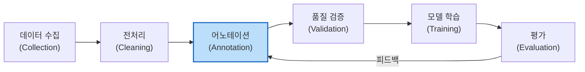

# 데이터 어노테이션 (Data Annotation)

## 정의

데이터 어노테이션(Data Annotation)은 **원시 데이터에 머신러닝 모델이 학습할 수 있는 레이블, 태그, 메타데이터를 부여하는 작업**이다. 지도학습(supervised learning)의 근간이며, 데이터 품질이 모델 성능의 상한선을 결정한다는 점에서 "garbage in, garbage out"의 원칙이 가장 직접적으로 적용되는 단계다.

LLM 시대에는 전통적인 분류/태깅을 넘어 [[rlhf-pipeline|RLHF(인간 피드백 기반 강화학습)]]를 위한 선호도 데이터 수집까지 어노테이션의 범위가 확장되었다.

## ML 파이프라인에서의 위치

어노테이션은 데이터 수집과 모델 학습 사이를 잇는 핵심 단계다.

어노테이션은 전처리 후 모델 학습 전의 핵심 단계이며, 모델 평가 결과가 어노테이션 가이드라인에 피드백되는 반복 구조를 형성한다.

## 어노테이션 유형

### 전통적 ML 어노테이션

| 유형 | 설명 | 적용 사례 |
|------|------|----------|
| 분류(Classification) | 데이터에 미리 정의된 카테고리 부여 | 감성 분석(긍정/부정), 스팸 탐지 |
| 개체명 인식(NER) | 텍스트에서 인명, 지명, 조직명 등 범위 표시 | 정보 추출, 검색 |
| 바운딩 박스(Bounding Box) | 이미지에서 객체 위치를 사각형으로 표시 | 자율주행, 의료 영상 |
| 시맨틱 세그멘테이션 | 이미지의 모든 픽셀에 클래스 부여 | 지도 제작, 장면 이해 |
| 관계 추출(Relation Extraction) | 개체 간 관계 유형 정의 | 지식 그래프 구축 |

### LLM 시대의 어노테이션

LLM의 등장으로 새로운 유형의 어노테이션이 필수가 되었다.

#### 선호도 순위(Preference Ranking)

[[rlhf-pipeline|RLHF]]의 핵심 데이터. 동일 프롬프트에 대한 두 가지 이상의 모델 응답을 비교하여 어느 것이 더 나은지 순위를 매긴다.

- **쌍대 비교(Pairwise)**: A vs B 중 선택 -- 가장 일반적
- **리커트 척도(Likert Scale)**: 도움됨, 정확성, 안전성 등 다차원 평가
- **최선/최악 선택(Best-of-N)**: N개 응답 중 최선과 최악을 선택

#### 안전성 레이블(Safety Labels)

모델 응답의 유해성, 편향, 부적절성을 평가한다.

- 콘텐츠 카테고리: 폭력, 성적 콘텐츠, 혐오 발언, 자해/자살 등
- 심각도(Severity) 등급: 경미, 중간, 심각
- 거부 적절성: 모델이 거부해야 할 요청에 적절히 거부했는지

#### 지시 따르기(Instruction Following)

모델이 사용자의 지시를 얼마나 정확하게 따르는지 평가한다.

- 형식 준수: JSON 출력, 특정 길이 제한 등
- 내용 완전성: 요청한 모든 항목이 포함되었는지
- 창의성/유용성: 기술적으로 정확하면서도 도움이 되는지

## 품질 관리

어노테이션 품질은 모델 성능의 상한선을 결정하므로, 체계적인 품질 관리가 필수다.

### 어노테이터 간 일치도(Inter-Annotator Agreement, IAA)

여러 어노테이터가 동일 데이터에 대해 얼마나 일관된 레이블을 부여하는지 측정한다.

- **Cohen's Kappa($\kappa$)**: 2인 어노테이터 간 일치도. 우연 일치를 보정
  - $\kappa > 0.8$: 거의 완벽한 일치
  - $\kappa = 0.6 \sim 0.8$: 상당한 일치
  - $\kappa < 0.4$: 가이드라인 재정비 필요
- **Fleiss' Kappa**: 3인 이상 어노테이터의 다자간 일치도
- **Krippendorff's Alpha**: 결측값이 있거나 다양한 척도에 적용 가능한 범용 지표

### 가이드라인 설계

좋은 어노테이션 가이드라인의 요건:

1. **명확한 정의**: 각 레이블의 의미를 모호하지 않게 정의
2. **경계 사례(Edge Cases)**: 판단이 어려운 사례에 대한 구체적 지침
3. **예시 포함**: 올바른 예시와 잘못된 예시를 모두 제공
4. **반복 갱신**: 어노테이션 과정에서 발견되는 새로운 패턴을 반영하여 지속 업데이트
5. **계층적 의사결정**: 복수 기준이 충돌할 때의 우선순위 규칙

### 품질 관리 기법

- **골드 스탠더드(Gold Standard)**: 전문가가 미리 레이블링한 데이터를 혼입하여 어노테이터 정확도 모니터링
- **다중 어노테이션(Multi-annotation)**: 동일 데이터에 3-5명이 독립적으로 레이블링, 다수결 또는 가중 투표
- **어노테이터 자격 관리**: 정기적 평가, 피드백, 교육
- **이상치 탐지**: 특정 어노테이터의 레이블이 다른 어노테이터와 크게 괴리되면 경고

## 비용과 규모

어노테이션은 ML 파이프라인에서 가장 비용이 많이 드는 단계 중 하나다.

### 비용 요소

| 요소 | 설명 |
|------|------|
| 어노테이터 인건비 | 작업 복잡도에 따라 시간당 비용 차이 크다 |
| 전문성 요구 | 의료, 법률 등 도메인 전문가는 비용이 10-50배 |
| 반복 작업 | 다중 어노테이션, 품질 검토, 가이드라인 갱신 |
| 도구/인프라 | 어노테이션 플랫폼 라이선스, 데이터 저장 |

### 크라우드소싱(Crowdsourcing)

대규모 어노테이션을 위해 다수의 비전문가를 활용하는 방식이다.

- **Amazon Mechanical Turk, Appen, Scale AI**: 대표적 플랫폼
- 장점: 빠른 확장, 낮은 단가
- 단점: 품질 편차가 크고, 스팸 작업 필터링 필요
- OpenAI, Anthropic 등은 자체 어노테이션 팀 운영 + 외부 크라우드소싱 병행

## AI 보조 어노테이션(AI-Assisted Annotation)

LLM을 어노테이션 작업에 활용하여 비용과 시간을 절감하는 패턴이다.

### 주요 방식

1. **사전 레이블링(Pre-labeling)**: LLM이 초안 레이블을 생성하고, 인간 어노테이터가 검토/수정
2. **능동 학습(Active Learning)**: 모델이 가장 불확실한 데이터를 선별하여 인간에게 우선 배정
3. **합성 데이터 생성**: LLM이 다양한 예시를 생성하고 인간이 필터링
4. **자동 품질 검사**: 어노테이션 결과를 LLM이 자동 검토하여 이상치 탐지

### 한계와 주의점

- **LLM 편향 전파**: AI가 생성한 초안에 인간 어노테이터가 과도하게 의존(anchoring bias)
- **분포 편향(Distribution Bias)**: LLM이 생성한 합성 데이터가 특정 패턴으로 편향
- **자기참조 문제**: LLM으로 레이블링한 데이터로 같은 LLM을 학습하면 편향이 증폭

## RLHF 선호도 데이터 수집

[[rlhf-pipeline|RLHF]]를 위한 선호도 데이터 수집은 일반 어노테이션보다 높은 수준의 설계가 필요하다.

### 수집 프로세스

1. 다양한 프롬프트로 모델 응답 쌍을 생성
2. 어노테이터가 응답 쌍을 비교하여 선호도 판정
3. 불일치 사례는 추가 어노테이터를 배정하거나 전문가가 최종 판정
4. 수집된 선호도 데이터로 보상 모델(Reward Model) 학습

### [[supervised-fine-tuning|SFT]] 데이터와의 관계

- SFT 데이터: "정답" 응답을 직접 제공 (입력-출력 쌍)
- RLHF 선호도 데이터: "어느 쪽이 더 나은가"를 상대적으로 판정 (비교 데이터)
- SFT가 모델의 기초 능력을 형성하고, RLHF 선호도 데이터가 인간의 가치와 정렬

## 관련 문서

- [[rlhf-pipeline]] -- RLHF 전체 파이프라인과 보상 모델 학습
- [[pretraining-data-curation]] -- 사전학습 데이터 수집과 큐레이션
- [[supervised-fine-tuning]] -- 지도 파인튜닝 데이터 구성
- [[ai-labeling-industry]] -- AI 레이블링 산업 동향
- [[active-learning]] -- 능동 학습 전략과 샘플 선택
